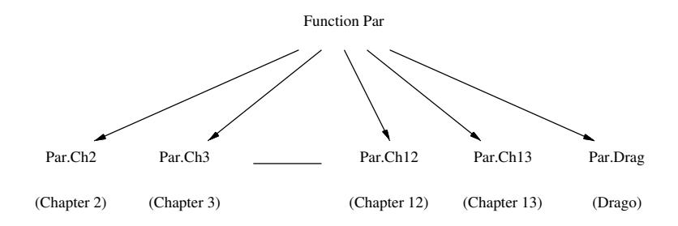
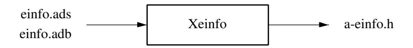

# **Appendix A.** **How to add new Keywords, Pragmas and Attributes**

This appendix describes how to modify the GNAT front-end to experiment with Ada extensions. As an example we use **Drago**, an experimental extension of Ada 83 designed to support the implementation of fault-tolerant distributed applications. It was the result of an effort to impose discipline and give linguistic support to the group communication paradigm. In the following sections we briefly introduce Drago (Section A.1), and describe the modifications made to the GNAT scanner, parser, and semantic analyzer. A previous version of this work was publised in [MGMG99].

## **A.1 Drago**

Drago [MAAG96, MAGA00] is an experimental language developed as an extension of Ada for the construction of fault-tolerant distributed applications. The hardware assumptions are: a distributed system with no memory shared among the different nodes, a reliable communication network with no partitions, and *failsilent* nodes (that is, nodes which once failed are never heard from again by the rest of the system.) The language is the result of an effort to impose discipline and give linguistic support to the main concepts of Isis [BCJ 90], as well as to experiment with the group communication paradigm. To help build fault-tolerant distributed applications, Drago explicitly supports two process group paradigms, *replicated process groups* and *cooperative process groups*. Replicated process groups allow the programming of fault-tolerant applications according to the active replication model, while cooperative process groups permit programmers to express parallelism and therefore increase throughput.

A process group in Drago is actually a collection of *agents*, which is the way processes are identified in the language. Agents are rather similar in appearance to Ada tasks (they have an internal state not directly accessible from outside the agent, an independent ow of control, and public operations called *entries*). Furthermore, they are the unit of distribution in Drago and in this sense they perform a role similar to Ada 95 active partitions and Ada 83 programs. Each agent resides in a single node of the network, although several agents can reside in the same node. A Drago program is composed of a number of agents residing at a number of nodes.

## **A.2 First Step: Addition of new Keywords**

Drago adds four reserved keywords (**agent**, **group**, **intragroup**, and **replicated**). In the following sections we describe the main steps required to introduce them into the GNAT environment. GNAT list of predefined identifiers contains all the supported pragmas, attributes and keywords. This list is declared in the specification of package *Snames*. For each predefined identifier there is a constant declaration which records its position in the *Names Table*. This hash table stores all the names, predefined or not. Keywords are classified in two main groups: keywords shared by Ada 83 and Ada 95, and exclusive Ada 95 keywords. Each group is delimited by means of a subtype declaration. Depending on the GNAT compilation mode, Ada 83 or Ada 95, this subtype allows the scanner to properly distinguish user identifiers from Ada keywords.

In order to introduce Drago keywords we added a third GNAT mode, Drago mode, and one new group with Drago exclusive keywords. The result was as follows:

```ada
First_Drago_Reserved_Word : constant Name_Id := N + 475;
Name_Agent                : constant Name_Id := N + 475;
Name_Group                : constant Name_Id := N + 476;
Name_Intragroup           : constant Name_Id := N + 477;
Name_Replicated           : constant Name_Id := N + 478;
Last_Drago_Reserved_Word  : constant Name_Id := N + 478;
subtype Drago_Reserved_Words is
   Name_Id range First_Drago_Reserved_Word
                 .. Last_Drago_Reserved_Word;
```

We also updated the value of the constant *Preset Names*, declared in the body of *Snames*, keeping the order specified in the previous declarations. This constant contains the literals of all the predefined identifiers.

## **A.3 Second step: Addition of new tokens**

The list of tokens is declared in the package *Scans*. It is an enumerated type whose elements are grouped into classes used for source tests by the parser. For example, *Eterm* class contains all the expression terminators; *Sterm* class contains the simple expressions terminators<sup>1</sup>; *After_SM* is the class of tokens that can appear after a semicolon; *Declk* is the class of keywords which start a declaration; *Deckn* is the class of keywords which start a declaration but can not start a compilation unit; and *Cunit* is the class of tokens which can begin a compilation unit. Members of each class are alphabetically ordered. We have introduced the new tokens in the following way:

```ada
type Token_Type is (
   --  Token name_Class (es)
   ...
   Tok_Intragroup,  --  Eterm, Sterm, After_SM
   ...
   Tok_Agent,       --  Eterm, Sterm, Cunit, Declk, After_SM
   ...
   Tok_Group,       --  Eterm, Sterm, Cunit, Declk, After_SM
   ...
   Tok_Replicated,  --  Eterm, Sterm, Cunit, After_SM
   ...
   No Token);
```

Classes associated with tokens are specified in the third column. Our choices were based on the following guidelines:

- **Intragroup** must always appear after a semicolon (see the specification of a Drago group on section A.6).
- **Agent** and **Group** start a compilation unit and a new declaration.

<sup>1</sup>All the reserved keywords, except *mod, rem, new, abs, others, null, delta, digits, range, and, or xor, in* and *not*, are always members of these two classes (*Eterm, Sterm*).

**Replicated** qualifies a group (similar to Ada 95 private packages, where the word *private* preceding a package declaration qualifies the package; they are otherwise public). Therefore they were placed in the same section.

According to the alphabetic ordering, *Tok Agent* is new first token of *Cunit* class. Therefore we updated the declaration of the corresponding subtype *Tok - Class Unit* to start the class with *Tok Agent*. Finally we modified the declaration of the table *Is Reserved Keyword*, which records which tokens are reserved keywords of the language.

## **A.4 Third Step: Update the Scanner Initialization**

The scanner initialization (subprogram *Scn.Initialization*) is responsible for stamping all the keywords stored in the *Names Table* with the byte code of their corresponding token (0 otherwise). This allows the scanner to determine if a word is an identifier of a reserved keyword. This work is done by means of repeated calls to the procedure *Set Name Table Byte* passing the keyword and its corresponding token byte as parameters. Therefore we added the following sentences to the scanner initialization:

```ada
...
Set_Name_Table_Byte (Name_Agent,
                     Token_Type'Pos (Tok_Agent));
Set_Name_Table_Byte (Name_Group,
                     Token_Type'Pos (Tok_Group));
Set_Name_Table_Byte (Name_Intragroup,
                     Token_Type'Pos (Tok_Intragroup));
Set_Name_Table_Byte (Name_Replicated,
                     Token_Type'Pos (Tok_Replicated));
```

We also modified the scanner (subprogram *Scn.Scan*) in order to recognize the new keywords only when compiling a Drago program. This allows us to preserve its original behaviour when analyzing Ada source code. This was the last modification required to integrate the new keywords into GNAT. In the following section we describe the modifications made to add one new pragma and one attribute into the GNAT scanner.

## **A.5 Addition of Pragmas an Attributes**

Drago provides one new attribute *Member Identifier* and one new pragma (*Drago*). When *Member Identifier* is applied to a group identifier it returns the identifier of the current agent in the specified group. When pragma *Drago* is applied the compiler is notified about the existence of Drago code (similar to GNAT pragmas *Ada83* and *Ada95*). For integrating them into GNAT we had to modify the package *Snames* in the following way:

1. Add their declaration to the list of predefined identifiers keeping the alphabetic order. GNAT classifies all pragmas in two groups: configuration pragmas, those used to select a partition-wide or system-wide option, and non-configuration pragmas. The pragma Drago was placed in the group of non-configuration pragmas.
   - GNAT classifies all attributes in four groups: attributes that designate procedures (*output, read* and *write*), attributes that return entities (*elab body* and *elab spec*), attributes that return types (*base* and *class*), and the rest of the attributes. *Member Identifier* was placed in this fourth group.
2. Insert their declarations in the enumerated *Pragma Id* and *Attribute Id* keeping the order specified in the previous step. Similar to tokens associated with keywords, these types facilitate the handling of pragmas and attributes in later stages of the frontend.
3. Add their literals in *Preset Names*. Similar to the introduction of the keywords, we must keep the order specified in the list of predefined identifiers.
4. Update the C file *a-snames.h*. This file associates a C macro to each element of the types *Attribute Id* and *Pragma Id*. This work can be automatically done by means of the GNAT utility *xsnames*.

## **A.6 Addition of New Syntax Rules**

In this section we describe, by means of an example, the modifications made in the parser in order to support Drago syntax. The example is the specification of a Drago group, whose syntax is similar to the one of an Ada package specification:

```ada
GROUP DECLARATION ::= GROUP SPECIFICATION

GROUP SPECIFICATION ::=
   [ replicated ] group defining_identifier is
      { basic_declarative_item }
   [ intragroup
      { basic_declarative_item } ]
   [ private
      { basic_declarative_item } ]
   end [ group identifier ];
```

Replicated groups are denoted by the reserved keyword **replicated** at the heading of the group specification. Cooperative groups do not require any reserved word because they are considered the default group specification. The first list of declarative items of a group specification (the *intergroup section*) contains all the information that clients are able to know about this group. The optional list of declarative items after the keyword **intragroup** is called the *intragroup section*. It contains information that only members of the group are able to know, and it can be declared only in a cooperative group specification<sup>2</sup>. The optional list of declarative items after the reserved word **private** is called the *private section* and provides groups with the same functionality as the private part of Ada packages. The following sections describe the steps made in order to add this syntax to the GNAT parser.

### **A.6.1 First step: Addition of New Node Kinds**

GNAT node kinds are declared in the enumerated *Sinfo.Node_Kind*. Similar to *Token_Type* elements, all its elements are grouped into classes (i.e. nodes that correspond to sentences, nodes which correspond to operators, ...), and elements of each class are alphabetically ordered.

The addition of the rules of a Drago group required two additional kinds of nodes: *N_Group_Declaration* and *N_Group_Specification*. Due to the similarity of a Drago group specification and an Ada package specification we placed the *N_Group_Declaration* node in the class associated with *N Package Declaration* node, and *N_Group_Specification* in the class associated with *N Package Specification*.

<sup>2</sup>Replicated groups do not have this facility because their members are assumed to be replicas of a deterministic automaton and thus they do not need to exchange their state —all the replicas have the same state.

### **A.6.2 Second Step: High-level specification of the new nodes**

The specification of package *Sinfo* contains the high level specification of the AST nodes (cf. Section 2.2.1). When we define a new node we have two possibilities: to reuse the AST field-names used in the current high-level specification of Ada, or to define new names. In the first case we must keep all its features: field-number and associated data. In the second case we must carefully analyze the field to which we associate the new names because once it is stated it must be kept fixed for all nodes; in addition, for each new name we must declare two subprograms in *Sinfo*: one procedure (used to set the value of the field), and one function (to get the stored value). Following with out example, the templates associated with *N_Group_Declaration* and *N_Group_Specification* are:

```ada
-- N_Group_Declaration
-- Sloc points to GROUP
-- Specification (Node1)
-- N_Group_Specification
-- Sloc points to GROUP
-- Defining_Identifier (Node1)
-- Visible_Declarations (List2)
-- Intra roup Declarations (List3) (set to No_Lis tif
--   no intragroup part present)
-- Private_Declarations (List4) (set to No_List if
--   no private part present)
```

This means that the value of *Sloc* in a *N_Group_Declaration* node points to the source code word **group**, and the first field of the node (*Field1*) points to a speci cation node. On the other hand, the value of *Sloc* in a *N_Group_Specification* node also points to the same word **group** (because the reason for the creation of both nodes was the same word), its first field (*Field1*) points to a defining identifier node, and its second, third and fourth fields (*Field2..Field4*) point to lists which contain respectively its visible, intragroup and private declarations.

Similar to GNAT handling of private packages, the handling of replicated groups only requires the addition of one new flag in the AST root node (*Flag15* for a private package, and we chose *Flag16* for a replicated group).

### **A.6.3 Third Step: Automatic modification of the frontend**

The templates specified in the previous step are used by three GNAT utility programs (*xsinfo, xtreeprs* and *xnmake*) to automatically generate four frontend source files involved in the handling of nodes: *a-sinfo.h, treeprs.ads, nmake.ads* and *nmake.adb* (cf. Figure A.1).


Figure A.1: GNAT utility programs.

### **A.6.4 Fourth Step: Update of the Parser**

The GNAT parser is implemented by means of the well known recursive descent technique. All its code is inside the function *Par* which is composed of several subunits (one subunit for each Ada Reference Manual Chapter [AAR95]). According to this philosophy we decided to add the subunit *Par.Drag* to group all the parser code that syntactically analyzes Drago rules (figure A.2). We gave the name *P Group* to the function associated with the parsing of a group specification. We used the fragment of the parser that analyzes a package specification as a reference for its development. Finally we modified the parsing of a compilation unit to include a call to this function when analyzing Drago source code and it detects a group token.



Figure A.2: New parser structure.

## **A.7 Verification of the Semantics**

When the parser finishes its work, the semantic analyzer makes a top-down traversal of the AST and, according to the kind of each visited node, it calls one subprogram that semantically verifies it. These subprograms are structured as a set of packages. Each package contains all the subprograms required to verify the semantic rules of each ARM chapter (packages *Sem Ch2..Sem Ch13*). There is one subprogram for each node type created by the parser and the main package that derivates the calls is called *Sem*.

For the semantic verification of a Drago group specification we made the following modifications to the GNAT sources:

1. Add one new package: *Sem Drag*. This package contains all the Drago subprograms that make the semantic verications.

2. Add one new semantic entity. A GNAT entity is an internal representation of the identifiers, operators and character literals found in the source program declarations. Therefore, the identifier of a group specification must have its corresponding entity. We added the element *E Group* to the enumerated *Entity Info* (inside the *Einfo* package) to represent the new group name entity.
3. Update the C file *a-einfo.h*. This work is automatically done by means of the GNAT utility program names *xeinfo* (figure A.3).



Figure A.3: GNAT semantic utility program

4. Write one subprogram for each new kind of node declared in the parser. We wrote the subprogram associated with the group specification node, and the subprogram for the group declaration node, and placed them inside the new package *Sem Drag*. We used the subprograms performing semantic analysis of a package specification as a model for our new subprograms.

Finally we modified the *Sem* package to include calls to these subprograms when analyzing a group specification (or declaration) node.

## **A.8 Tree expansion**

In the general case, to generate code there is no need to access the GIGI level, and our work finishes at the expansion phase. Following with our example, we expanded the Drago nodes into Ada 95 nodes which called several added Run-Time subprograms. Again, we recommend to use the expansion subprograms available in the GNAT sources as a reference.

## **A.9 Summary**

This appendix has described the integration of Drago into the GNAT frontend. Drago is a language designed as an Ada extension to experiment with the active replication model of fault-tolerant distributed programming. We have focused our attention on the lexical, syntactic and semantic aspects of the integration. The abstract syntax tree expansion and code generation have not been discussed here.
