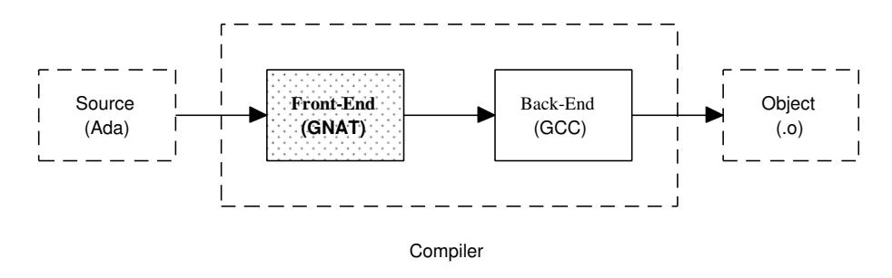
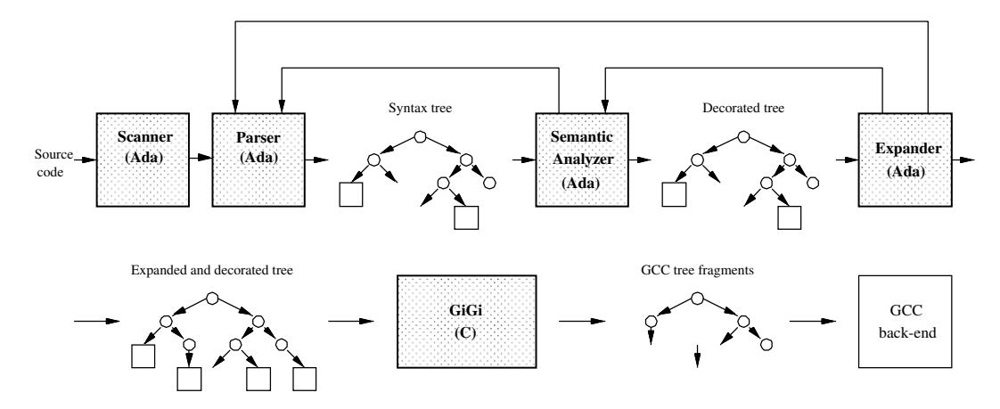
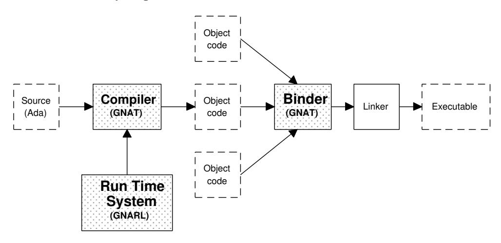

# **Chapter 1.** **The GNAT Project**

GNAT is an acronym for GNU Ada Translator; a Front-End and Run-Time system for *Ada 95* that uses the GCC back-end as a retargettable code generator, and is distributed according to the guidelines of the *Free Software Foundation*. GNAT was initially developed by two cooperating teams:

- *New York University Team*. This group, led by Prof. Robert B.K. Dewar, and Edmond Schonberg was responsible for the development of the frontend of the compiler.
- *Florida State University Team*. This group, also known as the POSIX Ada Real-Time Team, was led by Prof. Theodore P. Baker, and was responsible for the first design of the concurrency components of the run-time library.

The NYU project was sponsored by the U.S. government from 1991 to 1994. In August, 1994 the members of the NYU team created the company *Ada Core Technologies, Inc.*, which provides technical support to industrial users of GNAT and has transformed GNAT into an industrial-strength, full-featured compiler: GNAT Pro). This compiler includes a modern tool suite and environment for the development of Ada-based software (i.e. GPS). Nowadays Ada Core continues investing resources to port GNAT to new architectures and operating systems, and has an active participation in the new revision of Ada (Ada 2005). Ada Core periodically makes available public versions of the compiler to the Ada community at large.

This chapter introduces the main components of GNAT. It is structured as follows: Section 1.1 briefly introduces GCC; Section 1.2 presents the main components of the GNAT compiler. Finally, Section 1.3 gives an overview of the GNAT compilation model.

## **1.1 GCC**

GCC [Sta04] is the compiler system of the GNU environment. GNU (a selfreferential acronym for 'GNU is Not Unix') is a Unix-compatible operating system, being developed by the Free Software Foundation, and distributed under the GNU Public License (GPL). GNU software is always distributed with its sources, and the GPL enjoins anyone who modifies GNU software and redistributes the modified product to supply the sources for the modifications as well. Thus, enhancements to the original software benefit the software community at large.

GCC is the centerpiece of the GNU software. It is a compiler system with multiple front-ends and a large number of hardware targets. Originally designed as a compiler for C, it now includes front-ends for C++, Objective-C, Ada, Fortran, Java, and treelang. Technically, the crucial asset of the GCC is its mostly language-independent and target-independent code generator, which produces excellent quality-code both for CISC and RISC machines. Remarkably, the machine dependences of the code generator represent less than 10% of the total code. To add a new target to GCC, an algebraic description of each machine instruction must be given using a Register-Transfer Language (RTL). Most of the code generation and optimization then uses the RTL, which GCC maps when necessary into the target machine language. Furthermore, GCC produces high-quality code, comparable to that of the best commercial compilers.

## **1.2 The GNAT Compiler**

The first decision involved choosing the language in which GNAT compiler should be written. GCC is fully written in C, but for technical reasons, as well as nontechnical ones, it was inconceivable to use anything but Ada for GNAT itself. In fact, the definition of the Ada language depends heavily on hierarchical libraries, and cannot be given except in Ada 95, so that it is natural for the compiler and the environment to use child units throughout.

The GNAT team started using a relatively small subset of Ada83, and in typical fashion, extended the subset whenever new features became implemented. Six months after the coding started in earnest, they were able to bootstrap the compiler, and abandon the commercial compiler they had been using up to that point. As soon as more Ada95 features were implemented, they were able to write GNAT in Ada95.

The GNAT compiler is composed of two main parts: the `Front-End` and the `Back-End` (cf. Figure 1.1). The front-end of is written in Ada 95, and the back-end is the GCC back-end extended to meet the needs of Ada semantics (i.e. exceptions support).

Figure 1.1: GNAT Compiler.

The front-end comprises five phases (cf. Figure 1.2): Lexical Analysis (Scanning), Syntax Analysis (parsing), Semantic Analysis, Expansion, and GIGI phases. The scanner analyzes the input characters and generates the associated `Tokens`. The parser verifies the syntax of the tokens and creates the Abstract Syntax Tree (AST). The semantic analyzer performs all static legality checks on the program and decorates the AST with semantic attributes. The expander transforms highlevel AST nodes (nodes representing tasks, protected objects, etc.) into equivalent AST fragments built with lower-level abstraction nodes and, if required, calls to Ada Run-Time library routines. Given that code generation requires that such fragments carry all semantic attributes, every expansion activity must be followed by additional semantic processing on the generated tree (see the backward arrow from the expander to the semantic analyzer). At the end of this process the `GIGI` phase transforms the AST into a tree which is read by the GCC back-end (GNAT to GNU transformation phase). This phase is really an interface between the GNAT front-end and the GCC back-end. In order to bridge the semantic gap between Ada and C, several GCC code generation routines have been extended, and others added, so that the burden of translation is also assumed by GIGI and GCC whenever it is awkward or inefficient to perform the expansion in the frontend. For example, there are code generation actions for exceptions, variant parts and accesses to unconstrained types. As a matter of GCC policy, the code generator is extended only when the extension is likely to be of benefit to more than one language.

Figure 1.2: GNAT Front-End Phases.

All these phases communicate by means of a compact Abstract Syntax Tree (AST). The implementation details of the AST are hidden by several procedural interfaces that provide access to syntactic and semantic attributes. It is worth mentioning that strictly speaking GNAT does not use a symbol table. Rather, all semantic information concerning program entities is stored in defining occurrences of these entities directly in the AST.

There is a further unusual recursive aspect to the structure of GNAT. The program library (described in the next section) does not hold any intermediate representation of compiled units. As a result, if the expander generates a call to a Run-Time Library routine, the compiler requires the specification of the corresponding Run-Time package to be analyzed as well (see the backward arrow from the expander to the parser).

## **1.3 Compilation Model**

The notion of program library is one of the fundamental contributions of Ada to software engineering. The library guarantees that type safety is maintained across compilations, and prevents the construction of inconsistent systems by excluding obsolete units. In most Ada compilers, the library is a complex structure that holds intermediate representations of compiled units, information about dependences between compiled units, symbol tables, etc. GNAT has chosen a different approach: the separate files that constitute the program are separately compiled, and each compilation produces a corresponding object file. These object files are then linked together by specifying a list of object files in a program. Thus, the

Ada library consists of a set of such object files (there is no library file as such). In the following sections we briefly present both alternatives.

### **1.3.1 Traditional Compilation Model**

In the traditional model, an Ada library is a data structure that gathers the results of a set of compilations of Ada source files. A compilation is performed in the context of such a library, and the information in the library is used to enforce type consistency between separately compiled modules. Unlike some other language environments, all such type checking is performed at compile time, and Ada guarantees at the language level that separately compiled modules of a complete Ada program are type consistent.

In this model, building an Ada program consists of selecting a main program (a parameterless procedure compiled into the Ada library), and all the modules on which this main program depends, and bound them into a single executable program. A definite order of compilation is enforced by the language semantics and implemented by means of the Ada library. Basically, before a compilation unit is compiled, the specification of all the units on which it depends must be compiled first. This gives the Ada compiler a fair amount of freedom in the compilation order. An important consequence of this model is the notion of *obsolete* unit. If a unit is recompiled, then units which depend on it become obsolete, and must be recompiled. Again, the Ada library is the data structure used to implement this requirement.

In the Ada Reference Manual [AAR95, Chapter 10], there are specific references to a `Library_File`, and this is often taken to mean that the Ada Library should be represented using a file in the normal sense. Most Ada systems do in fact implement the Ada library in this manner. However, it is generally recognized that the Ada Reference Manual does not require this implementation approach. In this view, an Ada library is a conceptual entity that can be implemented in any manner that supports the required semantics. In fact the monolithic library approach is ill-adapted to multi-language systems, and has been responsible for some of the awkwardness of interfacing Ada to other languages.

### **1.3.2 GNAT Compilation Model**

GNAT has chosen a completely different approach: sources are independently compiled to produce a set of objects, and the set of object files thus produced is submitted to the binder/linker to generate the resulting executable (cf. Figure 1.3). This approach removes all order of compilation considerations, and eliminates the traditional monolithic library structure. The library itself is implicit, and object files depend only on the sources used to compile them, and not on other objects. There are no intermediate representations of compiled units, so that unit declarations appearing in context clauses of a given compilation are always analyzed anew. Dependency information is kept directly in the object files (in fact, they are kept in a small separate file, conceptually linked to the object file), and amounts to a few hundred bytes per unit.

Figure 1.3: GNAT Overall Structure.

Given the speed of the GNAT front-end, this approach is no less efficient than the conventional library mechanism, and has the following advantages over it:

1. The compilation of an Ada unit is identical to the compilation of a module or file in another language: the result of the compilation of one source is one object file.
2. Given that inlining is always done from the source, there is no requirement that the entities to be inlined should be compiled first. It is even possible for two bodies to inline functions defined in each other, without fear of circularities. Thus inlining works in a much more flexible way than in normal Ada compilers.
3. The standard system utilities to copy, rename and remove files can be reused to copy, rename and remove object modules.
4. Since GNAT uses the same compilation model as other languages, it is also much easier to build programs where various parts of the program are built
in different languages. Furthermore, GCC is committed to common system standard conventions for calling sequences, object module formats, including debugging information, and data structure layouts, so it is also easy to integrate Ada with any language supported by GCC. GNAT even makes possible to write multi-language programs whose main program is not itself written in Ada.
5. It is more compatible with conventional configuration management tools than the conventional library structure (tools ranging from the simple UNIX *make* program to sophisticated compilation management environments).

In the GNAT model, a source file contains a single compilation unit, and a compilation is represented as a series of source files, each of which contains one compilation unit. Furthermore there is a direct mapping from unit names to file names, so that from a unit name one can always determine the name of the file that contains the source for that unit. The default file naming convention is as follows: (1) The file name is the expanded name of the unit, with dots replaced by minus sign, (2) The extension ".ads" is used for specifications, and the extension ".adb" for bodies. Only the body produces an object file, so the fact that the specification and body have the same file name does not cause difficulties. The object file conceptually contains the Ada Library Information for that source (extension ".ali") whose most important component is a recording of the time stamps of the compilation units on which a compiled unit depends.

In this model the compilation of a source file may require other source files. These include:

1. The corresponding specification for a body.
2. The parent specification of a child library spec.
3. Specifications of with'ed units.
4. Parent body for a subunit.
5. Bodies of inlined subprograms.
6. Bodies of instantiated generics.

The key understanding is that in GNAT, dependencies are not established from one compilation unit to another, but from object files to corresponding source files. In this context GNAT is re-interpreting the Ada "order of compilation" rules to be "dependency on source files" rules. The rules regarding compilations that obsolete other compilations are similarly reinterpreted. For example, a rule that says: *The body of package cannot be compiled until its specification has been compiled*, is re-interpreted to mean: *The body of package cannot be compiled unless the source of its specification is available*. One interesting consequence of this approach is that if all the sources of a program are available, there are in fact no restrictions on the order of compilation. This feature facilitates the parallel compilation of Ada programs.

The main argument against the GNAT model is that the compiler is constantly recompiling the specification of with'ed units. However, the alternative is not better. In traditional Ada library-based systems, the result of a compilation is to place information, typically some kind of intermediate tree, in the library. A subsequent with clause then fetches this tree from the library. In practice, this tree information can be huge, often much bigger than the source. Furthermore, it is generally a complex interlinked data structure. Thus it is not clear that re-reading and recompiling the source is less efficient than writing and reading back in these trees. It's true that recompiling means redoing syntax and semantic checking, but this causes less Input/Output than reading and writing linked structures. On the contrary, the GNAT model gives all the previously discussed advantages.

### **The Binder**

Ada establishes the rules which determine valid orders of elaboration [AAR95, Section 10.2]. It is also possible to construct programs for which no possible order of elaboration exists. Such programs are illegal, and must be diagnosed prior to execution. Because this work can not be established until all the object files are available, GNAT needs an special pre-linker (the *binder*) which establishes a valid sequence of calls to the initialization procedures for specifications and bodies (cf. Figure 1.3).

Part of the processing in the GNAT binder ascertains that the program is consistent by looking at time stamps in the ALI files associated with the compilation units required for the program. The binder consistency checks can be done in one of three modes:

- 1. From ALI files only.
- 2. From ALI files and any corresponding sources that can be located.
- 3. From ALI files and all corresponding sources, which must be available.

Despite the clear advantages of operating in "source file" mode (second and third alternative), it is more useful for the GNAT binder to operate in "ali files only" mode. Not only is this mode faster, since no source files need to be accessed, but more importantly, it means that GNAT programs can be linked from objects even if the sources are not available. This is indispensable when linking libraries that for proprietary reasons may be distributed without the sources for their bodies. Therefore it is the mode implemented in the GNAT Binder.

## **1.4 Summary**

This introductory chapter has presented the overall structure of the GNAT project. The compiler has two main parts: the *front-end* and the *back-end*. The *front-end* comprises five phases which communicate by means of an `Abstract_Syntax_Tree`. The *back-end* is the GCC target independent code generator, what gives two main advantages: portability and excellent-quality code generation.

The most novel aspect of the GNAT architecture is the source-based organization of the library. In most Ada compilers the library is a monolithic complex structure that holds intermediate representations of compiled units. GNAT library model follows the traditional model used by nearly all languages throughout the entire history of programming languages: there is no centralized library, a source file contains a single compilation unit, and a compilation species a source file and generates a single object file. This model is fully conformant with the prescribed semantics given in the Ada Reference Manual and, at the same time, enables the use of many well-known configuration management tools (i.e. UNIX make), simplifies the construction of multi-language programs, and allows the parallel compilation of the Ada programs. Because the Ada language gives the rules which govern the order of elaboration of the compilation units the GNAT model needs a special pre-linker (the binder) which verifies the object files and generates a valid order of elaboration.
