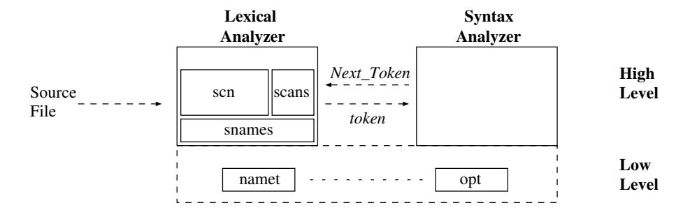
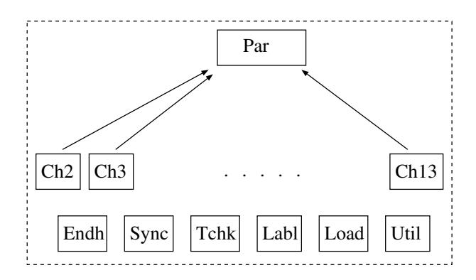
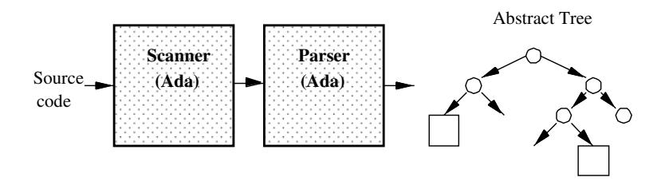
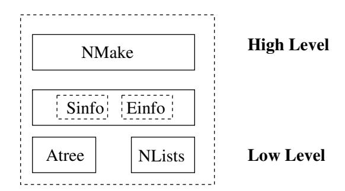
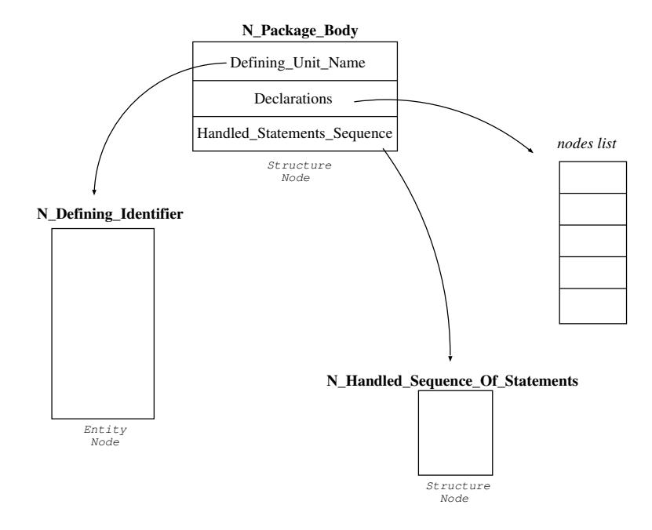
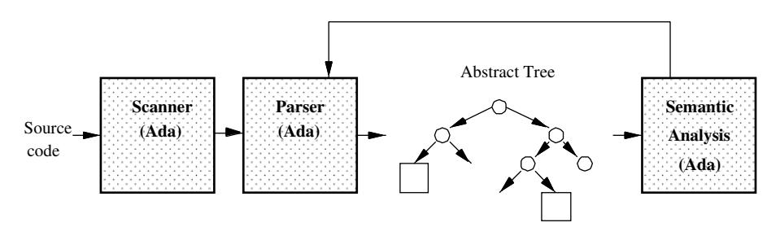
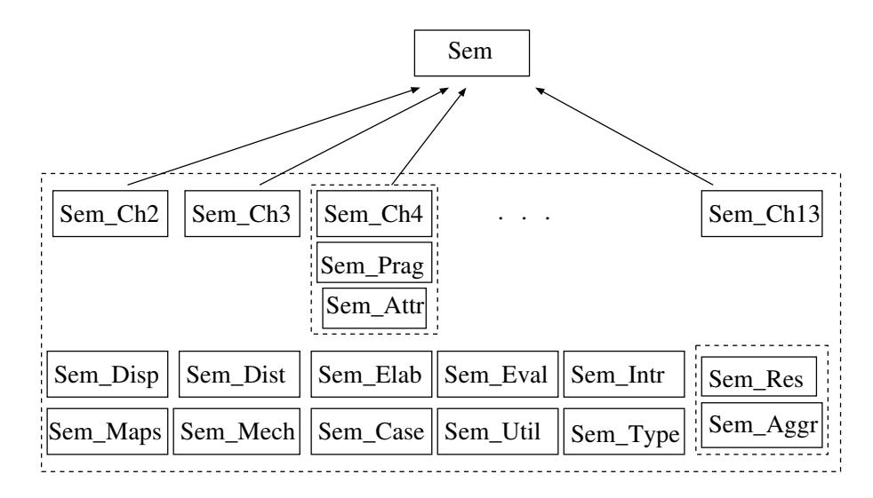
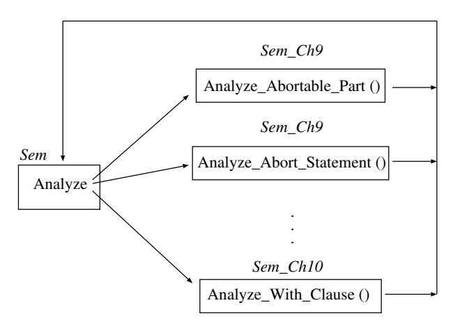
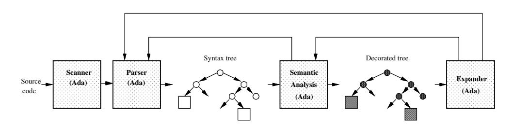
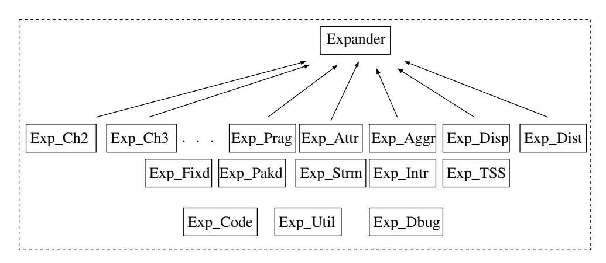

# Chapter 2. Overview of the Front-end Architecture

The GNAT front-end comprises four phases that communicate by means of a compact `Abstract_Syntax_Tree` (AST): lexical analysis, syntax analysis, semantic analysis, and expansion. This chapter provides an overview of the architecture of these phases. It is structured as follows: Section 2.1 presents the scanner architecture; Section 2.2 gives an overview of the parser, describes the high-level specification of the AST nodes and presents the mechanisms used to resynchronize it in case of syntax errors; Section 2.3 describes the architecture of the semantic analyzer, and finally Section 2.4 discusses the architecture of the expander.

## 2.1 The Scanner

For efficiency reasons no automatic tool was used to generate the GNAT scanner. It is a subprogram of the parser that reads input characters, identifies the next token, and returns it to the parser. To give support to various operating systems and to multiple languages, it is engineered to handle multiple character encodings (cf. Package `Csets`). Figure 2.1 presents its architecture: package `Scn` has most of the implementation of the scanner; package `Scans` contains the `Tokens` definition and the state of the automaton. Finally, package `Snames` has the standard names (Ada keywords, pragmas and attributes). Low level package `Namet` handles name storage and look up, and package `Opt` has the global flags set by command-line switches and referenced throughout the compiler.



Figure 2.1: Architecture of the GNAT Scanner

## 2.2 The Parser

The GNAT parser is a hand-coded recursive descent parser. The main reasons which justify this choice (rather than the traditional academic choice of a tabledriven parser generated by a tool) were [CGS94, Section 3.2]:

- **Better error messages**. GNAT generates clear and precise error messages. Even in case of serious structural errors, including the interchange of ";" and "is" between specification and body of a subprogram, the parser posts a precise and intelligible message. Bottom-up parsers have serious difficulties with such errors.
- `Clarity`. The GNAT parser follows faithfully the grammar given in the Ada Reference Manual [AAR95]. This has clear pedagogical advantages because the parser can be easily read in conjunction with the ARM, and makes it easier to maintain, for example to add new error recovery techniques. The Ada grammar given the ARM is ambiguous, and a table-driven parser would be forced to modify the grammar to make it acceptable to LL (1) or LALR (1) techniques. No such problem arises for a recursive descent parser, because when necessary the parser can perform arbitrary look-ahead.
- `Performance`. The GNAT parser is as fast as any Ada table driven parser, and arguably faster than a LALR parser.

In most of the cases the parser is guided by the next token provided by the scanner. However, when dealing with ambiguous syntax rules the parser saves the state of the scanner, and issues repeated calls to look-ahead the following tokens and thus resolve the ambiguity (cf. `Save_Scan_State` and `Restore_Scan_State` in package `Scans`).

In addition to syntax verification, the GNAT parser builds the `Abstract_Syntax_Tree` (AST), that is to say the structured representation of the source program. This tree is subsequently used by the semantic analyzer to perform all the static checks on the program, that is to say all the context-sensitive legality rules of the language.

At the architectural level the main subprogram of the GNAT parser is an Ada function (`Par`) that is called to analyze each compilation unit. The parser code is organized as a set of packages (subunits of the top-level function) each of which contains the parsing routines associated with one chapter of the Ada Reference Manual [AAR95]. For example, package `Par.Ch2` contains all the parsing subprograms associated with the second chapter of the Ada Reference Manual (cf. Figure 2.2). In addition, the name of the parsing subprograms follow a fixed rule: Prefix "`P` " followed by the name of the corresponding Ada syntax rule (for example, `P_Compilation_Unit`).



Figure 2.2: Structure of the GNAT Parser

The GNAT Parser also has several additional sub-units: Package `Endh`, contains subprograms to analyze the finalization of the syntax scopes; package `Sync`, contains subprograms to resynchronize the parser after syntax errors (cf. Chapter 3); package `Tchk`, contains subprograms that simplify the verification of tokens; procedure `Labl` handles implicit label declarations; procedure `Load` controls the loading into main memory of successive compilation units; function `Prag` analyzes *pragmas* that affect with the behaviour of the parser (such as lexical style checks), and finally package `Util` has general purpose subprograms used by all the parsing routines.

Each parsing routine carries out two main tasks: (1) Verify that a portion of the source obeys the syntax of one particular rule of the language, and (2) Build the corresponding Abstract Syntax Subtree (cf. Figure 2.3).



Figure 2.3: Abstract Syntax Tree Construction.

### 2.2.1 The Abstract Syntax Tree

The GNAT Abstract Syntax Tree (AST) has two kind of nodes: internal (structural) nodes that represent the syntactic structure of the program, and extended nodes that store information about Ada entities (identifiers, operator symbols and character literal declarations). Internal nodes have 5 general purpose fields which can be used to reference other nodes, lists of nodes (i.e. the list of statements in an Ada block), names, literals, universal integers, oats, or character codes. Entity nodes have 23 general purpose fields, and a large number of boolean flags, that are used to store in the tree all relevant semantic attributes of each entity. In other compilers this information is commonly stored in a separate symbol table.

Figure 2.4 describes the GNAT packages involved in the AST handling. Low level package `Atree` implements and abstract data type that contains the definitions related with structure nodes and entities, as well as subprograms to create, copy, and delete nodes, and subprograms to read and modify the general purpose fields. Low level package `Nlists` provides the support for handling lists of nodes. Packages `Sinfo` and `Einfo` contain the high-level specification of the nodes, that is, the high-level names associated with the low-level general purpose node fields, and subprograms to read and modify these fields with their high-level names. Package `Nmake` has subprograms to create high level nodes with syntax and semantic information.

Let us examine the format of the high-level specification of the nodes by means of an example. The Ada syntax rule for a package body is:

```ada
PACKAGE BODY : : =
  package body DEFINING PROGRAM UNIT NAME i s
     DECLARATIVE PART
  [ be gin
     HANDLED SEQUENCE OF STATEMENTS]
  end [ [ PARENT UNIT NAME . ] IDENTIFIER ] ;
```



Figure 2.4: Abstract Syntax Tree Packages.

The corresponding high-level node is specified in the package `Sinfo` as follows:

```
--  N_Package_Body
--  Sloc points to PACKAGE
--  Defining_Unit_Name (Nodel)
--  Declarations (List2)
--  Handled_Statement_Sequence (Node4) (set to Empty
--  if not present)
--  Corresponding-Spec (Node5—Sem)
--  Was_Originally_Stub (Flag13—Sem)
```

The first line species the node kind (`N_Package_Body`), which is an enumerated literal of type `Sinfo.Node_Kind`; the second line indicates that the source coordinate (Sloc) for the node is the source coordinate of the keyword that is the first token in the production. This source coordinate is used whenever errors or warnings are posted on a given construct. The following lines specify the high-level names given to the general purpose fields. Their format is: (1) High-level Name of the field (chosen for its syntactic significance) and, (2) Data type, and placement of the corresponding low-level general-purpose field (this information is enclosed in parenthesis). In addition some fields may specify a default initialization value For example, the field named `Handled_Statement_Sequence` references the node that represents the statements-sequence and the exception handlers found in the optional package initialization. This field is placed in the fourth general-purpose low-level field of a node, and is set to the value `Empty` if the package body has no initialization code. To handle uniformly the AST, identical node fields associated with different nodes are always assigned to the same low-level general purpose fields. The last two lines specify two semantic attributes (indicated by the suffix *"-Sem"*). Semantic attributes are computed and annotated into the tree by the Semantic Analyzer in the next phase of the compiler (cf. Section 2.3). Figure 2.5 represents the subtree associated with this high-level node specification.



Figure 2.5: Abstract Syntax Subtree associated with the package body rule.

The high-level specification of the AST nodes is read by the GNAT tools *xs-info*, *xtreeprs* and *xnmake*, which generate some complementary Ada packages of the front-end that use the low-level package `Atree` to provide the specified functionality.

## 2.3 The Semantic Analyzer

The GNAT Semantics Analyzer traverses the Abstract Syntax Tree built by the parser, verifies the static semantics of the program, and decorates the AST, that is to say adds the semantic information to the AST nodes (cf. Figure 2.6).



Figure 2.6: Abstract Syntax Tree Decoration.

In general the static analysis carried out by the compiler implies the following tasks: (1) Group entities in scopes and resolve referenced names, 2) Handle private types, 3) Handle discriminants, 4) Analyze and instantiate generic units, and 5) Handle freezing of entities. These topics will be discussed in detail in the following chapters.

Figure 2.7 presents the architecture of the GNAT Semantic Analyzer. The overall structure is similar to that of the parser, that is to say it parallels the organization of the ARM. For example, Sem Ch3 deals handling of types and declarations, Sem Ch9 with concurrency, and Sem Ch12 with generics and instantiations. The name of individual semantic analysis subprogram follow a fixed rule: they have the prefix "Analyze " and a suffix that names the analyzed language construct. ie. Analyze Compilation Unit. Exceptions to this general rule are packages `Sem_Prag` and `Sem_Attr` which correspond to language elements that are described throughout the ARM, and which also constitute a basic extension mechanism for the compiler.



Figure 2.7: Structure of the Semantic Analyzer.

In addition, the GNAT Semantic Analyzer has some utility packages for specialized purposes. `Sem_Disp` has routines involved in the analysis of tagged types and dynamic dispatching; `Sem_Dist` contains subprograms which analyze the Ada Distributed Systems Annex [AAR95, Annex E]; `Sem_Elab` contains the routines that deal the order of elaboration of a set of compilation units; `Sem_Eval` contains subprograms involved in compile-time evaluation of static expressions and legality checks for staticness of expressions and types. `Sem_Intr` analyzes the declaration of intrinsic operations; `Sem_Mech` has a single routine that analyzes the declaration of calling mechanisms for subprograms (needed for the VMS version of GNAT). `Sem_Case` has routines to process lists of discrete choices (such lists can occur in 3 different constructs: case statements, array aggregates and record variants); package `Sem_Util` has general purpose routines used by all the semantics packages. Finally package `Sem_Type` has subprograms to handle sets of overloaded entities, and package `Sem_Res` has the implementation of the wellknown two-pass algorithm that resolve overloaded entities (described in Chapter 5). Package `Sem_Aggr` is conceptually an extension of `Sem_Res`; it has been placed in a separate package because of the complexity of the code that handles aggregates.

The main package (`Sem`) implements a dispatcher which receives one AST Node and calls the corresponding analysis subprogram (cf. Figure 2.8). Called routines recursively call `Analyze` to do a top-down traversal of the tree.



Figure 2.8: Abstract Syntax Tree Nodes Dispatching.

The resolution routines are called by the analysis routines to resolve ambiguous nodes or overloaded entities. For example, the Ada syntax of a procedure-call statement is exactly the same as that of an entry-call statement. Given this ambiguous syntactic specification, the GNAT parser generates the same `N_Procedure_Call` node for both cases, and the Semantic Analyzer must analyze the context, determine the nature of the entity being called, and, when needed replace the original node by an entry-call statement node (which will be subject to completely different expansion that a procedure call). To resolve overloaded entities GNAT implements a well-known two-pass algorithm. During the first (bottom-up) pass, it collects the set of possible meanings of a name. In the second pass, the type imposed by the context is used to resolve ambiguities and chose a unique meaning for each overloaded identifier in the expression. This is described in detail in Chapter 5.

## 2.4 The Expander

The GNAT expander performs AST transformations for those constructs that do not have a close equivalent in the C-level semantics of the back-end. (cf. Figure 2.9). Its main expansions are [CGS94, Section 3.3]:

- Replace nodes which represent high-level Ada constructs by nodes with represent lower-level abstractions. For example, the node which represents an Ada task body is replaced by one node that represents a procedure, plus one call to the Run-Time Library subprogram which creates the corresponding thread of control (cf. Chapters 9 to 13).
- Replace nodes that represent a generic instantiation by a copy of the corresponding AST, with appropriate substitutions (cf. Chapter 7).
- Build `Type_Support_Subprograms` (TSS), which are internally generated subprograms associated with particular types. For example, implicit initialization subprograms, and subprograms to implement Ada `Input/Output` attributes (cf. Package `Exp\_TSS`).



Figure 2.9: Abstract Syntax Tree Expansion.

Given that code generation requires every AST node carry all needed semantic attributes, every expansion activity must be followed by additional semantic processing on the generated fragments (see backward arrows in Figure 2.9). As a result the two phases (analysis and expansion) are recursively integrated into a single AST traversal. After the whole AST is analyzed and expanded, the resulting AST is passed to Gigi in order to generate the GCC tree-fragments that are the inputs to the back-end code generator.

The architecture of the GNAT Expander follows the same scheme of the previous phases: the expansion subprograms are grouped into packages following the Ada Reference Manual chapters (cf. Figure 2.10), and the name of the subprograms follow a fixed rule: Prefix "Expand\_" followed by the corresponding

rule of the language (ie. Expand Compilation Unit). Similar to the Semantic Analyzer, the package `Expander` implements a dispatcher which receives one node and calls the corresponding expander subprogram.



Figure 2.10: Architecture of the GNAT Expander

The GNAT expander has the following packages: `Exp_Prag`, that groups routines to expand pragmas; `Exp_Attr` has subprograms to expand Ada attributes; `Exp_Aggr` contains subprograms to expand Ada aggregates; `Exp_Disp`, with routines involved in tagged types and dynamic dispatching expansion; `Exp_Dist` has routines used to generate the stubs of the Ada Distribution Annex [AAR95]; `Exp_Fixd`, subprograms to expand fixed-point data-type operations; `Exp_Pakd`, routines to expand packed arrays; `Exp_Strm`, routines to build stream subprograms for composite types (arrays and records); `Exp_TSS`, routines for Type Support Subprogram (TSS) handling; `Exp_Code`, subprograms to expand the Ada *code* statement [AAR95, Section 13.8], used to add machine code instructions to Ada source programs; `Exp_Util`, utility subprograms shared by expansion subprograms; and finally `Exp_Dbug` is a package with routines that generate special declarations used by the debugger.

## 2.5 Summary

The GNAT scanner implements a deterministic automaton which is called by the parser to get the next *token*. The GNAT Parser is a recursive-descent parser which not only verifies the syntax of the sources but also generates the corresponding Abstract Syntax Tree (AST). The AST has two kinds of nodes: *structure nodes* which represent the program structure, and *entity nodes* which store the information of Ada entities. Therefore GNAT has no separate symbol table; all the
information traditionally stored in this table is kept in the AST entities.

The Semantic Analysis phase carries out a top-down traversal of the AST to do the static analysis of the program and decorate the AST. This phase implements a well-known two pass algorithm to resolve overloaded entities. The Expansion phase replaces high-level nodes by sub-trees with low-level nodes which provide the equivalent semantics and can be handled by the GCC code generator.

To help reading the sources the architecture of the parser, semantics and expander follow a fixed scheme: the subprograms are grouped into packages following as reference the Ada Reference Manual, and their names follow a fixed rule: one fixed prefix plus the corresponding rule of the Ada Reference Manual. The main package of the semantics and the expander implement a dispatcher which receives as input an AST node and calls the corresponding processing routine.
