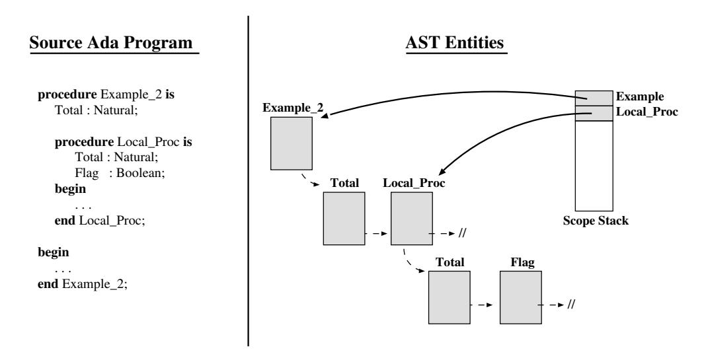
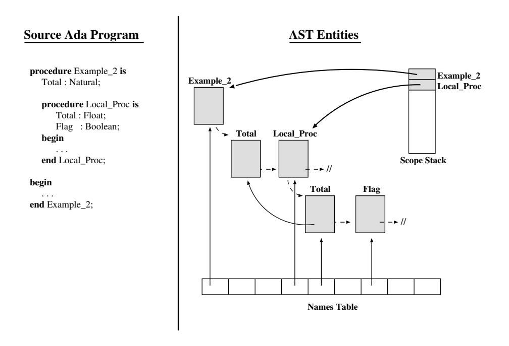
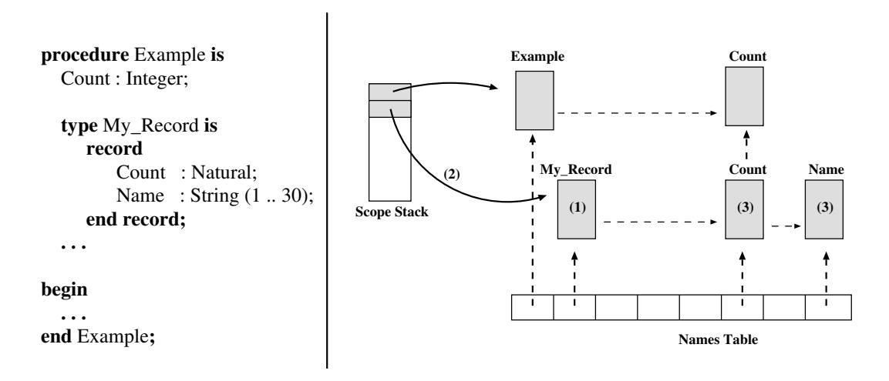
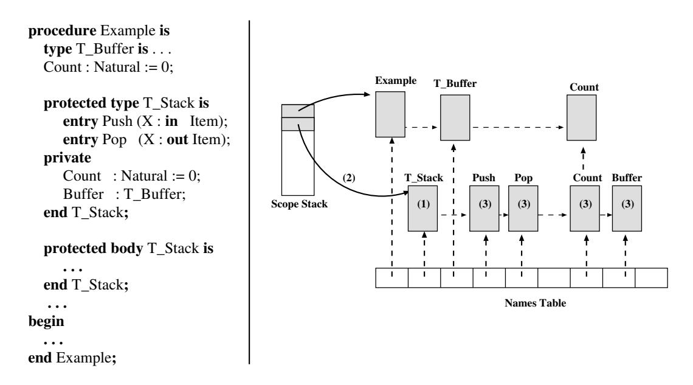
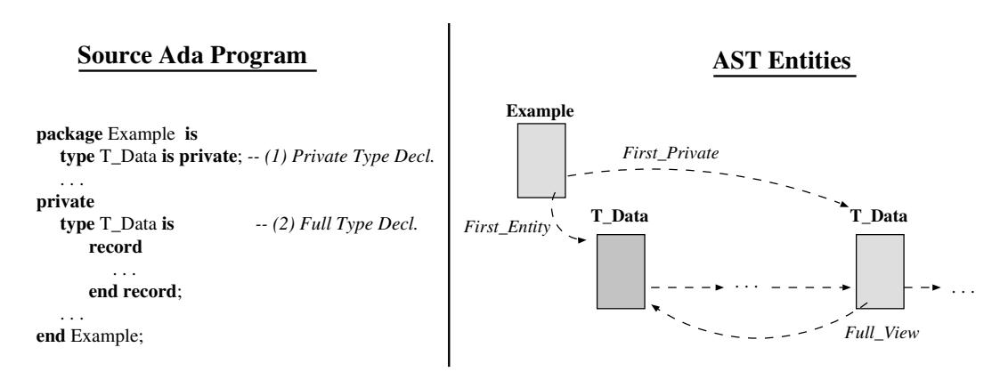

# **Chapter 4.** **Scopes and Visibility**

Modern high-level programming languages allow us to define names with a limited scope of visibility, to reuse them in different contexts and also to overload them; It is responsibility of the compiler to keep track of scope and binding information about names. For this purpose the compilers generally use a separate `Symbol_Table` structure. In the case of GNAT, there is no separate symbol table. Rather, semantic information concerning program entities is stored directly in the Abstract Syntax Tree (AST). The GNAT AST is thus close in spirit to DIANA [GWEB83], albeit more compact.

This chapter is structured as follows: Section 4.1 presents the entity flags and data structures used by the front-end to handle scopes and visibility; Section 4.2 describes the sequence of steps followed to analyze records, tasks, protected objects, context clauses, child units and subunits, and finally Section 4.5 describes the sequence of steps followed to resolve names of records, tasks, protected objects, simple names and expanded names.

## **4.1 Flags and Data Structures**

Entity nodes corresponding to defining entities have a set of flags and attributes (entity-node fields) which are used by the semantic analyzer to handle scopes and visibility. The basic flags used to verify the Ada rules of visibility are:

`Is_Immediately_Visible`: The entity is defined in some currently open scope [AAR95, Section 8.3(4)].

`Is_Potentially_Use_Visible`: The entity is defined in a package named in a currently active use clause [AAR95, Section 8.4(8)]. Note that potentially use visible entities are not necessarily use visible [AAR95, Section 8.4(9- 11)].

To keep track of the scopes currently been compiled the semantic analyzer uses one stack (`Scope_Stack`). Defining entities corresponding to declaration scopes (defining entities of packages, tasks, etc.) are placed in the scope stack while being processed, and removed at the end. The first element in the Scope Stack references the defining entity of package Standard. Figure 4.1 presents one example. On the left side we have a procedure (`Example`) which has a local procedure (`My_Proc`) with a local record type declaration (`My_Record`). The right side of this figure represents the contents of the Scope Stack at the point of analysis of the record type declaration. For simplicity, figures in the rest of this chapter do not have the reference to the standard package.

Figure 4.1: The Scope Stack

The semantic analyzer links all defining entities declared in the same scope through the `Next_Entity` attribute. The entity which defines the scope has two attributes which reference the first and last entity in the scope. In addition, all entities have an attribute which references the defining entity of their scope. These attributes help the semantic analyzer to traverse entity scopes up and down. Figure 4.2 presents an example. On the left side we have an Ada program and, on the right side the corresponding data structure at the point of analysis of the sequenceof-statements of the local procedure (`Local_Proc`). For simplicity, only some semantic attributes are represented in the figures presented in this chapter.

Figure 4.2: List of entities in the same scope.

Two entity definitions are *homonyms* if they have the same defining name and, if both are over-loadable, their proles are type conformant. For example, an inner declaration hides any outer homonym declaration from direct visibility. The Ada Reference Manual uses the term *homograph* to refer to this concept [AAR95, Section 8.3(8)]; we have preferred to use the term homonym because it is the term used in the GNAT implementation. For example, the GNAT semantic analyzer keeps track of homonym entities by means of the `Homonym` linked lists. The head of each homonym list is saved in a general-purpose field of the `Names_Table`. To provide fast access to names, the Names Table is a hash table with no duplicated names. In case of overloaded entities, the homonym list holds all the possible meanings of a given identifier. The process of overload resolution uses type information to select from this chain the unique meaning of a given identifier.

In the general case, the sequence of actions carried out by the Semantic Analyzer to handle scopes and visibility are: (1) Make immediately visible the defining entity of the new scope, (2) Open the scope, (3) Make immediately visible all the local entities defined inside the new scope, and (4) Insert all the local entities in the entity and homonym lists. Figure 4.3 presents one example. On the left side there is an Ada program with one global entity (`Total`) which has one homonym inside the local procedure `Local_Proc`. On the right side the reader can see the corresponding data structure after the local declarations have been analyzed and the entities have been inserted into the corresponding chains. In the case of `Total` we see the direct visibility of the local entity from the Names Table, and the link to its hidden homonym entity in the scope of *Example 2*).

Figure 4.3: Lists of homonym entities.

When the analysis of the innermost scope is finished, the entities defined therein are no longer visible. If the scope is not a package declaration, these entities are never visible subsequently, and can be removed from visibility chains. If the scope is a package declaration, its visible declarations may still be accessible. Therefore the semantic analyzer leaves entities defined in such a scope in the visibility chains, and only modifies their visibility (immediate or potential-use visibility). This will be described in detail in Section 4.3.

In summary, all defining entities are chained twice: (1) In their scope, and (2) In their homonym list. As a consequence, the entities name space can be view as a sparse matrix where each row corresponds to a scope, and each column to a name. Open scopes, that is to say scopes currently being compiled, have their corresponding rows of entities in order, innermost scope first (cf. Figure 4.4).

In the rest of this chapter we will use the following expressions to refer to handling these flags and data structures: *"To make Immediately/Potentially-Use Visible"* an entity means to mark the entity as Immediately-Visible or Potentially-Use-Visible; the expression *"To open the scope"* of an entity will mean to push the reference of an entity in the Scope Stack, and finally the expression "*To insert
an entity in the matrix of entities*" means to chain the entity in the corresponding scope and homonym lists.

Figure 4.4: The matrix of entities.

## **4.2 Analysis of Records, Tasks and Protected Types.**

During the analysis of records, tasks, and protected types all their local entities must be immediately visible. Thus the semantic analyzer (1) makes immediately visible the defining entity of the record, task or protected type definition (2) opens the corresponding scope, (3) makes immediately visible all the entities defined inside the scope, and (4) insert them in the matrix of entities. The discriminants (if any) are handled as additional components of the type, and thus they are unchained on exit from their homonym lists. Figures 4.5 and 4.6 represent these steps during the analysis of a record type declaration and a protected type declaration. According to Ada, from the outside these local entities are always accessed as selected components (notation `Prefix.X`). Therefore, on exit from the scope the semantic analyzer (1) makes the defining entity not immediately visible, (2) closes the scope, and (3) removes the local entities from their homonym lists. As a consequence, further analysis of selected components requires to sequentially traverse the scope list named by `Prefix`. The analysis of the task-type and protected-type bodies will temporarily re-chain their local entities in the homonym lists.

Figure 4.5: Analysis of a record.

## **4.3 Analysis of Packages**

To analyze a package specification the semantic analyzer performs the following actions: (1) make immediately visible the defining entity of the package speci cation, (2) open the scope, (3) make immediately visible all the entities defined in the package specification, and (4) insert them in the matrix of entities. On exit the scope must be closed but, instead of removing all these entities from their homonym lists, the GNAT semantic analyzer just un-marks them as immediately visible. As a consequence, the analysis of the package body as well as subsequent with and use clauses do not need to re-chain the visible entities but only to re-open the scope and re-establish their direct visibility. Entities defined in the scope of the package body are just made immediately visible and added to the matrix of entities. Because the body is semantically an extension of the specification, these entities are added at the end of the list of entities of the package specification. To avoid visibility from the outside, on exit from the package body the entities defined in the package body are completely removed from the matrix of entities. Although these entities are not further required for analysis, they are saved in the in the defining entity of the package body because they are needed to generate the object code.

At a first sight, the analysis of *use clauses* only needs to make Potentially-Use-Visible all the entities defined in the visible part of the named package speci cations and, on exit from the scope of the use clause, to reset the flag. However, this simple approach is not enough because it is legal to name the same package in nested contexts. To properly handle the general case, the defining entity of the
package specification has a flag (`In_Use` which indicates it is currently in the scope of an use clause. In case of redundant use, a second flag (`Redundant_Use`) is set. On exit from a scope `S`, the semantic analyzer scans in reverse order the list of use clauses in the declarative part of `S`. The visibility flag is clear as long as the package is not flagged as being in a redundant use clause, in which case the outer use clause is still in effect, and the direct visibility of its entities must be retained.

Figure 4.6: Analysis of a protected type.

In the case of *use type* clauses the Semantic Analyzer collects the primitive operators associated with the named types and makes them Potentially Use Visible.

## **4.4 Analysis of Private Types**

Private types were Ada83's fundamental contribution to Software Engineering. Private types are the basic mechanism for encapsulation and information hiding: they separate the visible interface of a type (those properties that a client can use) from the implementation details of the type, which only the implementor of the type need to have access to. In one way or another, similar privacy mechanisms have found their way into other modern programming languages, in particular C++ and Java.

Ada95 has extended the privacy mechanisms to tasks and protected types. For protected types, information hiding means a complete separation between the operations that apply to the protected data, and the structure of this data. This is the modern realization of the notion of Monitor: the object provides some operations on completely private data. All the client needs to know is that there is a locking mechanism that ensures that the data is accessed in mutual exclusion.

Ada95 has also extended the syntax of private type declarations to include private extensions and unknown discriminants. Finally, the management of privacy is central to the semantics of child units.

The salient characteristic of private types is that their description is given in two parts: a private type declaration introduces a partial view, which in general provides no details as to the structure of the type, except for a few characteristics that a client needs to know about (for example, whether the type has discriminants, or whether it is tagged). The full declaration provides all the structural information that the implementation of the type and its operations requires. In the compiler, the treatment of private types needs to cope with these two views. It is central to the organization of the compiler that a given entity is uniquely identified by a index into the nodes table. In other words, **the information concerning a given entity is always as the same location during a compilation**. To cope with the twoviews description of private types, the compiler includes various mechanisms that exchange the partial and full views of these types depending on the context of the compilation. For example, when compiling a package body, the full view of all its types must be accessible, but when compiling a package specification that appears in a with clause of some compilation unit, only the partial view of its private types must be visible to this unit. The view-exchange mechanism described below is conceptually straightforward, but its interaction with generics and inlining is the source of much complexity in the front-end.

The view-exchange mechanism applies to other entities that have two views, either because they have two declarations (such a deferred constants) or because their properties change with context (for example, a subtype of a private type becomes a subtype of the full view of the parent is visible, and a type with a private component may become non-private when the full view of the component type is visible).

### **4.4.1 Private Entities Visibility**

To distinguish between visible and private package declarations, the defining entity of a package has an attribute that references the entity of the first private declaration of the package specification (cf. `First_Private_Entity` in Figure 4.7). This attribute is central to the implementation of the view-swapping mechanism, which is invoked at the end of a package body and at various points in the compilation of child units.

Figure 4.7: Visible and Private Entities

Similar to the package specification, the defining entity of the task type and the protected-object type also have the `First_Private_Entity` attribute to reference the first private entry (if any).

### **4.4.2 Private Type Declarations**

As mentioned above, the principle that each entity must have a single defining occurrence clashes with the presence of two separate declarations for private types, and thus (syntactically) two defining occurrences: (1) the private type declaration, which introduces the partial view, and (2) the full type declaration. The GNAT implementation treats the defining entity of the partial view as **the** entity for the type. This entity as an attribute `Full_View`, which denotes the entity of the full view. (cf. Figure 4.8). There is no link in the opposite direction, and all view-swapping activity starts from a partial view. Flag `Has_Private_View` is used to indicate that a given full type declaration is the completion of a private type declaration, and if need be corresponding partial declaration can be retrieved by a traversal of the public declarations of the package.

During semantic processing the defining occurrence also points to a list of private dependents, that is to say access types or composite types whose designated types or component types are subtypes or derived types of the private type in question. After the full declaration has been seen, the private dependents are updated to indicate that they have full definitions.

Figure 4.8: Reference to the Full-View Entity

Figure 4.9: Swapping of the Private Declaration and the Full View

Ada95 allows task specifications to include a private part. Given that a task item can only be an entry declaration or a representation clause, this adds very little to semantic processing of tasks. When analyzing the task body, these declaration must be made visible. However, in this case there is no partial view, and therefore no view-swapping is needed.

The private part of a protected-type declaration is more significant from a semantic point of view: it encapsulates the state of an object of the type. When analyzing the protected body, the operations of the type are rewritten to include an implicit parameter, which is a record whose structure reflects the private part of the protected type. Thus, to each protected type we associate a record structure which is its `Corresponding_Record`. In turn, this record type has an attribute `Corresponding_Concurrent_Type`, that denotes the protected type from which it is defined. The Corresponding Record eventually includes a run-time lock component that insures mutual exclusion. The processing of protected bodies is for the
most part an expansion activity and is described in a separate chapter.

### **4.4.3 Deferred Constants and Incomplete Types**

The mechanism described in the previous section is also used to handle deferred constant declarations and incomplete type declarations. Thus, the defining entity of a deferred constant declaration has a link to the corresponding full-type declaration entity (cf. Figure 4.10).

Figure 4.10: Deferred Constants Handling

### **4.4.4 Limited Types**

Limited types add no special complexity to the Semantic Analyzer; languagedened copying operations are just restricted for them.

### **4.4.5 Analysis of Child Units**

The analysis of a child units requires to have special care with visibility of private entities. To analyze a public child package specification the Semantic Analyzer carries out the following actions: 1) make immediately visible all the entities the visible-part of the parent, 2) open the scope of the child package, 3) analyze the visible-part of the child package specification, 4) verify that incomplete types defined in the visible part have received their corresponding full declarations, 5) make immediately visible the parent private entities, and finally 6) analyze the private-part of the child package specification. In case of a private child package, the analysis is simpler because they have full visibility of the entities defined in the parent. Therefore, step 1 makes immediately visible all the entities declared in the visible and private parts of the parent, and follows steps 2, 3 and 5. The GNAT Semantic Analyzer has separate routines to make the visible and private declarations visible at different times (see `Install_Visible_Declarations` and `Install_Private_Declarations`).

### **4.4.6 Analysis of Subunits**

Subunits must be compiled in the environment of the corresponding stub. That is to say with the same visibility and context available at the point of the stub declaration, but with the additional visibility provided by the context clauses of the subunit itself (if any). As a result, compilation of a subunit forces compilation of the parent. At the point of the stub declaration, the Semantic Analyzer is called recursively to analyze the proper body of the subunit, but without reinitializing the Names Table nor the Scope Stack (i.e. standard is not pushed on the stack). Thus, the context of the subunit is added to the context of the parent, and the subunit is compiled in the correct environment.

## **4.5 Name Resolution**

Name resolution is the process that establishes a mapping between names and the defining entity referred to by the names at each point in the program. In the context of the GNAT semantic analyzer name resolution involves to link each node that denotes an entity with its corresponding defining-entity node. In case of simple names the semantic analyzer only uses the homonym list. If the entity is immediately visible, it is the one designated by the simple name. If only potentially-use-visible entities are found in the list, the semantic analyzer verifies they do not hide each other. In case of expanded names the semantic analyzer looks for the entity at the intersection of the entity list for the scope (the prefix) and the homonym list for the selector.

## **4.6 Summary**

The GNAT front-end stores all the semantic information concerning program entities directly in defining entity nodes in the AST. Thus the AST contains not only the full syntactic representation of the program, but also the results of the semantic analysis. To handle the analysis of scope and visibility rules, all the entities have two flags which indicate if the entity is immediately or potentially-use visible. In addition, all the entities in the same scope are inserted in two lists: the list of entities in the scope, and the list of homonym entities. As a consequence, the entities name space can be view as a sparse matrix where each row corresponds to a scope, and each column to a name.

The semantic analyzer keeps all the entities defined in the package declaration in a list; visible entities are in the front of this list and private entities are in the rear. The semantic analyzer uses the reference to the first private entity as the limit of visible entities. This scheme is also used to implement the private entities in tasks and protected types. All the incomplete entities defined in the visible-part of the package specification (deferred constants, incomplete types and private types) have a reference to the corresponding full view in the private part. When the fullview is made visible, this link is used to swap the two declarations and thus make the full-definition available to the Ada programs.
