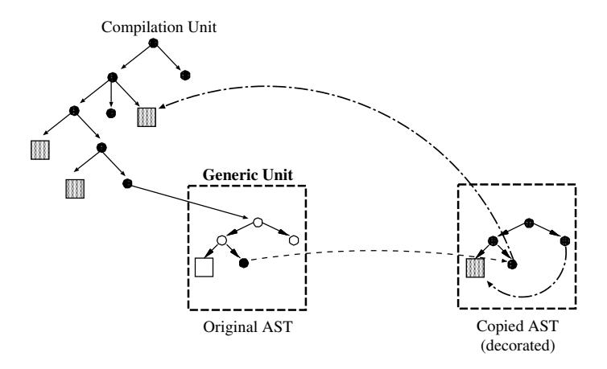
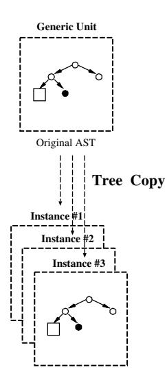
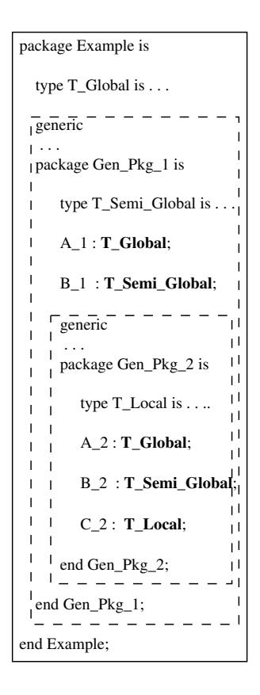
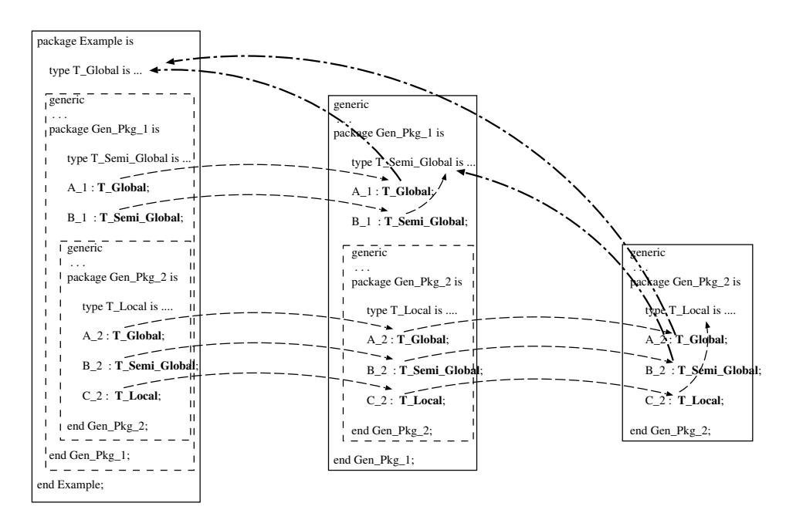
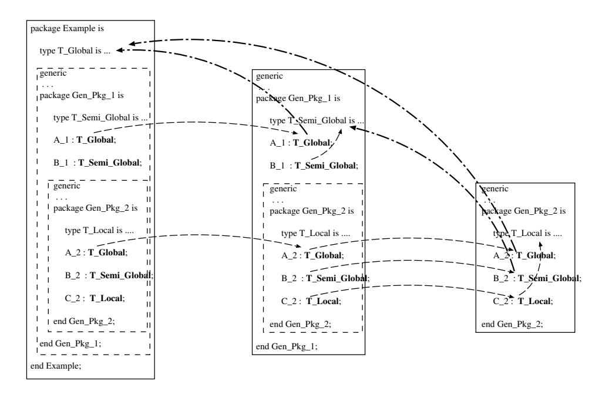
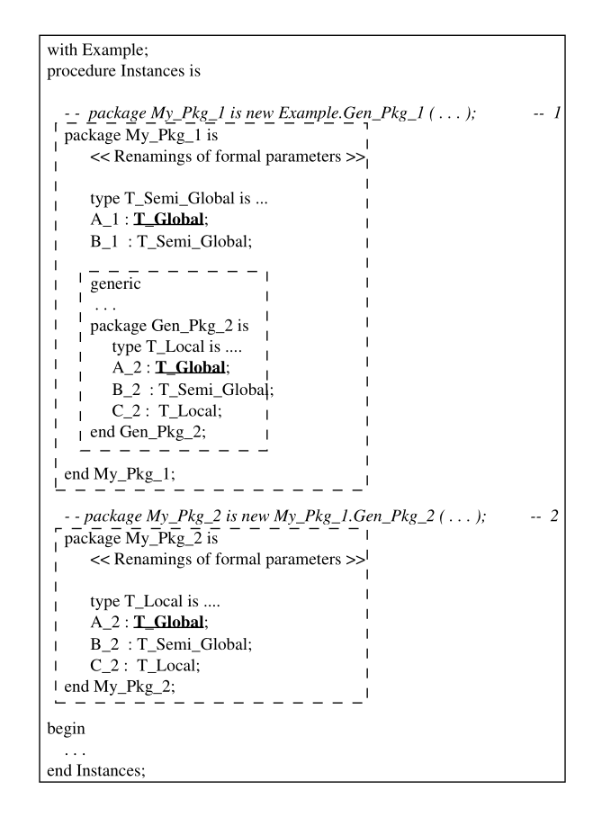
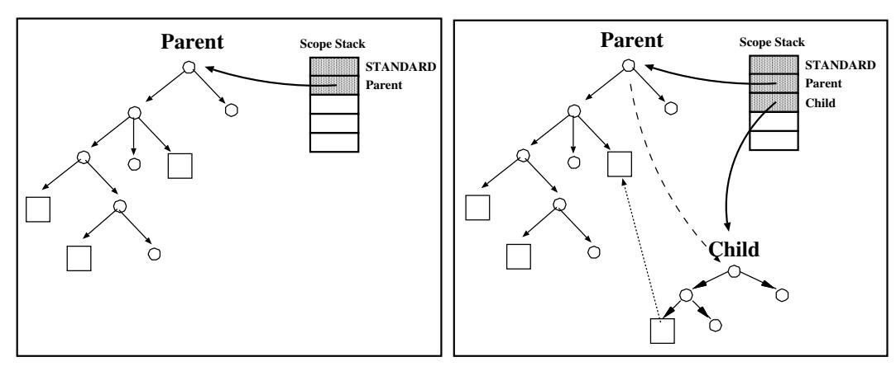
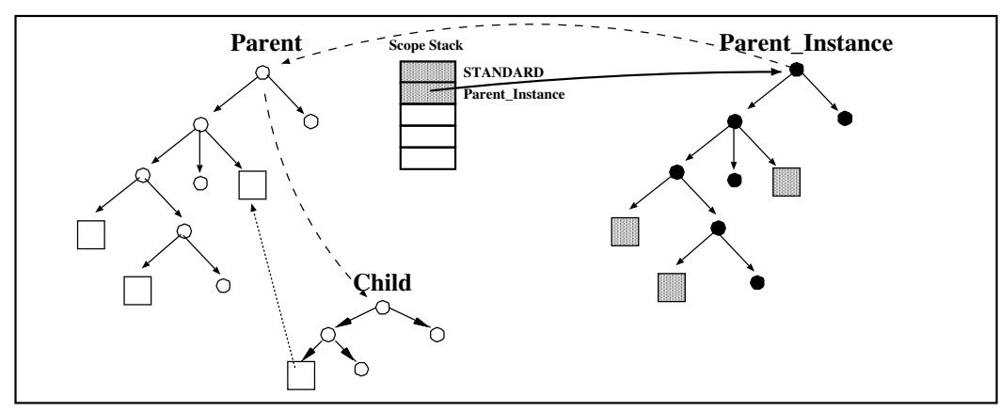

# Chapter 7. Generic Units

A generic unit is a parameterized template for a subprogram or package whose parameters can be types, variables, subprograms and packages. Generic units must be instantiated, by suppling specific actuals for the parameters. Each instantiation conceptually creates a copy of the specification and body of the generic unit, which are appropriately customized by the actual parameters.

The semantics of Ada specify that the legality of generic templates is established at the point of declaration of the generic, and not at the point of instantiation. Therefore, a generic unit must be fully analyzed at the place it appears. For an instantiation, the main legality checks involve verifying that the actuals provided in the instance match the generic formal parameters. The so-called "contract model" [AAR95, Section 12.3.1(a)] states that if the generic declaration is legal, and the actuals match the formals, then the instantiation is known to be legal, and semantic checks need not be performed on it.

The legality checks on a generic unit are similar to those of a regular, nongeneric unit. They mainly involve name resolution and type checking. Given that the semantics of the generic are established at the point of definition, name resolution involves global name capture: a reference to an entity that is external to the generic is established when the generic is analyzed, and must be retained for each instantiation. On the other hand, entities local to the generic will have a different meaning in each instance.

Traditionally, there are two implementation techniques for generic instantiation [SB94]: in-line expansion (often called `Macro_Expansion`) and direct compilation of generic units (also known as `Shared_Generics`). The latter model is known to be fraught with difficulties and GNAT, like most other compilers, implements generics by expansion. Therefore, each instantiation of a given generic produces a copy of the generic code, suitably decorated with semantic information from captured global entities and actual parameters. Note that this is quite distinct from the macro-expansion of older programming languages, which is typically a pure textual substitution with no semantic legality checks on the macro itself.

After analysis, a generic unit contains partial semantic information. At the point of instantiation, the semantic information must be completed. This does require a full pass of semantic analysis over the instance. In addition, code expansion must be performed. Note that expansion cannot be performed on the generic itself, because expansion typically depends on type information that is not available until the actual types are known. Given that semantic analysis and expansion are inextricably linked in GNAT, we must perform full semantic analysis of the instance, even though the contract model would indicate that some of it is super uous.

The requirements of global name capture determine the architecture described in this chapter. This architecture is complicated by two related aspects of Ada: nested generic units (and instantiations within generic units) and generic child units. In addition, private types complicate visibility analysis and require some special machinery to insure that name resolution is consistent between the point of generic definition and the points of instantiation.

This chapter is structured as follows: Section 7.1 presents the main details of the GNAT approach to the analysis and instantiation of simple generic units. This section also describes parameter matching and private types handling. Section 7.2 discusses the analysis and instantiation of nested generic units; Section 7.3 presents the analysis and instantiation of generic child units; Section 7.4 describes the instantiation of bodies in a separate phase, and Section 7.5 briefly discusses the mechanisms used to detect instantiation circularities. We close with a brief summary of the contents of this chapter.

## 7.1 Generic Units

### 7.1.1 Analysis of Generic Units

Generic specifications are analyzed wherever they appear. If a generic unit is mentioned in a context clause of some unit U, it is analyzed before the unit U itself. The result of this analysis is an Abstract Syntax Tree (AST) annotated with partial semantic information. The analysis of a generic package or subprogram

specification involves the following sequence of actions:

1. **Copy the AST of the generic unit**. The first step is to create a copy of the unanalyzed AST of the generic. The generic copy is a tree that is isomorphic to the original. Semantic analysis will be performed on the copy, and only the relevant information concerning references to global entities will be propagated back to the original tree. In order to perform this propagation, each AST node in the original that may eventually contain an entity reference (typically identifiers and expanded names) holds a pointer to the corresponding node in the copy. The left side of Figure 7.1 represents the AST associated with an Ada program: an Ada compilation unit that has an inner generic unit (indicated by the dotted rectangle). Circles represent nonentity AST nodes (expressions, control structures, etc); rectangles represent AST entities. Dark circles or rectangles represent nodes with semantic information (decorated nodes). The left side of the figure represents the AST of the current compilation unit.


Figure 7.1: Step 1: Copy the original generic AST.

2. **Analyze the copy**. The copy is semantically analyzed to perform name resolution and all the required legality checks. Thus the copied AST is annotated with full semantic information. Figure 7.2 shows the decorated copy. The two arrows in the decorated AST (right side of the figure) represent a reference to a global entity, declared outside the generic unit, and a reference to one local entity, declared in the scope of the generic unit itself.
3. **Save non-local references**. After semantic analysis, the front-end traverses the original AST to identify all references to non-local entities (entities declared outside the generic itself). This is done by examining the scope of


Figure 7.2: Step 2: Analyze and decorate the copy.

definition of all entity references, and determining whether they occur outside of the current generic unit. References to local entities are simply removed from the original AST. In this fashion, only global entity references will be propagated from the original AST to the instances. In the left side of Figure 7.3 the original node corresponding to a global entity reference is now represented in black; this means it is semantically decorated and thus its reference to the global entity will be preserved in all instances of this generic unit.



Figure 7.3: Step 3: Remove local references in the original AST.

### 7.1.2 Instantiation of Generic Units

At the point of generic instantiation, the original generic tree for the generic unit is copied, and the relevant semantic information from the copy is retrieved and added to it (cf. Figure 7.4). The new tree is treated as a regular (non-generic) unit which is analyzed and for which code is now generated. Non-local references are not analyzed anew (name resolution does not modify an entity reference that already denotes an entity, see `Find_Direct_Name`). To each local entity in the generic there corresponds a local entity in each instance, and name resolution for these is performed as for non-generic units.



Figure 7.4: Instantiation of generic units.

### 7.1.3 Parameter Matching

The conventional model of instantiation is to replace each reference to a formal parameter by a reference to the matching actual. This is usually carried out by establishing a mapping from one set to the other, and applying this mapping to a copy of the generic template. This mapping approach is complex and expensive when nested generics are present, and GNAT follows a different approach, which closely reflects the semantics of instantiation. To indicate that a reference to a formal type is really a reference to the actual, the front-end inserts renaming declarations within the instance so that any use of the name of a formal resolves to the corresponding actual. The nature of the renaming declaration depends on the generic parameter: object, type, formal subprogram or formal package. Thanks to this mechanism, the analysis of the instance can proceed as if the copy had been inserted literally at the point of instantiation, even though the visibility environment at this point bears no relation to the visibility at the point of generic declaration.

1. `Objects`. For each generic **`in`** parameter the GNAT front-end generates a constant declaration; for each generic *in out* parameter generates an object renaming declaration whose renamed object is the corresponding actual (**`out`** mode formal objects are not allowed in Ada 95 [AAR95, Section 12.4-1a].
2. `Types`. Generic types are renamed by means of subtype declarations.
3. **Formal subprograms and packages**. For each formal subprogram or formal package the front-end generates the corresponding renaming declaration.

To give the right visibility to the entities introduced by these renamings, GNAT uses a different scheme for package and subprogram instantiations:

`Packages`. In the case of packages, the list of renamings is inserted into the package specification, ahead of the visible declarations of the package. The renamings are thus analyzed before any of the text of the instance, and are visible at the right place. Furthermore, outside of the instance, the generic parameters are visible and denote their corresponding actuals. For example:

```ada
generic
    In_Var : in Integer;
    InOut_Var: in out Integer;
    type T_Data is private;
package Example is
    type T_Local is ...
    procedure Dummy;
end Example;
```

```ada
package body Example is
   procedure Dummy is
       Aux : Example.T_Local;
   begin
      null;
   end Dummy;
end Example;
```

```ada
with Example;
procedure Use_Example is
   My_Var_1 : Integer := 1;
   My_Var_2 : Integer := 2;

   package My_Instance is new Example
        (In_Var    => My_Var_1,
         InOut_Var => My_Var_2,
         TData     => Integer);
begin
   null;
end Use_Example;
```

The GNAT front-end generates the AST equivalent of the following code for the instantiation:

```ada
procedure use_example is --  Frontend Translation

  my_var_1 : integer := ... ;
  my_var_2 : integer := ... ;

  package my_instance is
     in_var    : constant integer := my_var 1;  --  (1)
     inout_var : integer renames my_var2;       --  (2)
     subtype t_data is integer;                 --  (3)
     type T_Local is ...

     package example renames my_instance;       --  (4)
     procedure dummy;
  end my_instance;

  package body my_instance is
     procedure dummy is
       Aux : Example.T_Local;                   -- (5)
     begin
       null;
     end dummy;
  end my_instance;

begin
   null;
end use_example;
```

Line (1) is the constant declaration corresponding to the **`in`** parameter; line (2) is the renaming of the **in out** parameter; line (3) is the subtype declaration used to rename the generic formal type `T_Data`. Finally, line (4) introduces a renaming for the generic unit itself. This corresponds to the fact that within the generic, the name of the generic denotes the name of the current instance. The need for this last renaming is made evident by the declaration in line (5), which references a type that is originally local to the generic, and now designates a type local to the current instance.

`Subprograms`. In this case there is no obvious scope in which the required renaming declarations can be inserted. Instead, the front-end creates a wrapper package that holds the renamings followed by the subprogram instance itself. The analysis of this package makes the renaming declarations visible to the subprogram. After analyzing the package, the front-end inserts a subprogram renaming outside the wrapper package to give it the proper visibility (thus the callable subprogram instance appears declared outside the wrapper package). For example:

```ada
generic
   In_Var    : in Integer;
   InOut_Var : in out Integer;
   type T_Data is private;
function Example (A : T_Data) return Integer;
```

```ada
function Example (A : T_Data) return Integer is
begin
   return 1;
end Example;
```

```ada
with Example;
procedure Use_Example is
  My_Var_1 : Integer := ...;
  My_Var_2 : Integer := ...;
  function My_Instance is
     new Example (In_Var    => My_Var_1,
                  InOut_Var => My_Var_2,
                  T_Data    => Integer);
begin
  null;
end Use_Example;
```

In this case the GNAT front-end carries out the following transformation:

```ada
procedure use_example is --  Frontend Translation
  my_var_1 : integer := ...;
  my_var_2 : integer := ...;

  package my_instanceGP110 is
     in_var    : constant integer := my_var_1;  --  (1)
     inout_var : integer renames my_var_2;      --  (2)
     subtype t_data is integer;                 --  (3)

     function my_instance (a : t_data) return integer;
  end my_instanceGP110;

  package body my_instanceGP110 is
     function example (a : t_data)
         return integer renames my_instance;    --  (4)

     function my_instance (a : t_data) return integer is
     begin
        return 1;
     end my_instance;
  end my_instanceGP110;

  function my_instance                          --  (5)
     (a : my exampleGP110.t_data)
     renames my_instanceGP110.my_instance;
begin
  null;
end use_example;
```

Line (5) is the subprogram renaming which makes the subprogram visible in the current scope. The reader should note that this renaming declaration can not be replaced by an Ada *use clause* on the wrapper package, because this would render visible all the renamings associated with formal parameters (not only the instantiated subprogram), which would be illegal.

If the subprogram instantiation is a compilation unit, the front-end gives the wrapper package the name of the subprogram instance. This ensures that the elaboration procedure called by the GNAT `Binder`, using the compilation unit name, calls in fact the elaboration procedure for the package.

### 7.1.4 Private Types

The analysis of a generic unit leaves all non-local references decorated to ensure that the proper entity is referenced to in the instantiations (cf. Section 7.1.1). However, for private types this by itself does not insure that the proper `View` of the entity is used (the full type may be visible at the point of generic definition, but not at instantiation time, or vice-versa). To solve this problem the semantic analyzer saves both views. At time of instantiation, the front-end checks which view is required, and exchanges declarations, if necessary, to restore the correct visibility. (cf. Chapter 4). After completing the instantiation, the front-end restores the current visibility.

## 7.2 Nested Generic Units

### 7.2.1 Analysis of Nested Generic Units

The model presented in the previous section extends naturally to nested generics. If a generic unit `G2` is nested within `G1`, the analysis of `G1` generates a copy `CG1` of the tree for `G1`. Later, when `G2` is analyzed, the front-end makes a copy `CG2` of the tree for `G2`, and establishes links between this copy and the original tree for `G2` within `CG1`. An instantiation of `G2` within `G1` will use the information collected in `CG2`. To see this in detail, consider the scheme in Figure 7.5 (Ada elements which reference entities in the AST have been emphasized in Figure 7.5 with **bold** letters).

This example shows a non-generic package (`Example`) with two nested generic packages (`Gen_Pkg_1` and `Gen_Pkg_2`). Data type `T_Global` is external (global) to the generic packages; data type `T_Semi_Global` is local to `Gen_Pkg_1` but external to `Gen_Pkg_2`. In addition, some objects of these data types are created in each generic package (*A 1, B 1, A 2, B 2* and *C 2*).

To do the semantic analysis of `Gen_Pkg_1` the GNAT front-end makes a copy of its AST and links the nodes which reference entities with their copy (cf. Figure 7.6). The semantic analysis of `Gen_Pkg_1` captures all occurrences of local and non-local entities (see the arrows from *A 1* to `T_Global`, and from *B 1* to `T_Semi_Global`).

To analyze `Gen_Pkg_2` the front-end repeats the process: makes a new copy of *Gent Pkg 2* AST and links the nodes which reference entities with their new copy
(cf. Figure 7.7). Again, its semantic analysis captures all occurrences of local and non-local entities.



Figure 7.5: Nested generic packages.

After the analysis of the nested generic units the front-end removes all the local references in the original copy of the nested generic units (cf. Left side in Figure 7.8). References to `T_Semi_Global` are not preserved because, in the general case, they may depend on generic formal parameters of `G1`.

### 7.2.2 Instantiation of Nested Generic Units

If a generic unit `G2` is nested within `G1`, the Ada programmer must first instantiate `G1` (say `IG1`) and then instantiate the nested generic unit `G2` which is inside `IG1`.The instantiation of `G1` produces a full copy of its AST, including the inner generic `G2`.


Figure 7.6: Analysis of generic package `Gen_Pkg_1`.

Continuing with our previous example, let us consider the following instances
of our generic packages `Gen_Pkg_1` and `Gen_Pkg_2`:

```ada
with Example;
procedure Instances is
  package My Pkg 1 is
     new Example.Gen_Pkg_1 (...);   -- 1
  package My Pkg 2 is
     new My Pkg 1.Gen_Pkg_2 (...);  -- 2
begin
  ...
end Instances;
```

At point 1 (instantiation of `Gen_Pkg_1`), the analysis of this instantiation includes the analysis of the nested generic, which produces a generic copy of *Gen-Pkg 2*, which will include global references to entities declared in the instance. The instantiation at point 2 requires no special treatment (the front-end produces a copy of the generic unit `Gen_Pkg_2` in the instance *My Pkg 1* and instantiates it as usual).

Figure 7.9 presents the resulting code for this example. The Ada source lines which instantiate the generic units have been kept in the figure as Ada comments to help the reader see the corresponding instantiation (inside dotted rectangles).



Figure 7.7: Analysis of nested generic package `Gen_Pkg_2`.



Figure 7.8: Saving global references.

The first dotted rectangle is the instantiation of *My Pkg 1*; the second dotted rectangle is the instantiation of the generic unit in the instance *My Pkg 1*.



Figure 7.9: Instantiation of nested generic units.

## 7.3 Generic Child Units

### 7.3.1 Analysis of Generic Child Units

The analysis of generic child units adds no additional complexity to the mechanisms described in the previous sections. Conceptually the child unit has an implicit *with clause* to its parents. Therefore the analysis of a generic child unit recursively loads and analyzes its parents. For example, to analyze `R` (child of `P.Q`) the front-end loads and analyzes `P`, then `Q` and finally `R`. This is identical to what is done for non-generic units. Of course, the analysis of the generics ends

with the recovery of global names. References to entities declared in a generic ancestor are not preserved, because at instantiation time they will resolve to the corresponding entities declared in the instance of the ancestor.

### 7.3.2 Instantiation of Child Generic Units

Let us assume `P` is a generic library package, and `P.C` is a generic child package of `P`. Conceptually, an instance `I` of `P` is a package that contains a nested generic unit called `I.C`[AAR95, Section 10.1.1(19)]. A generic child unit can only be instantiated in the context of an instantiation of its parent, because of course it will in general depend on the actuals and the local entities of the parent. This clause of the RM simply indicates that a partially parameterized child generic unit is implicitly declared within the instantiation of the parent. Nevertheless, given that library packages are in general written in separate source files (this is mandatory in the GNAT compilation model [Dew94]), the compilation of `P` does not really contain information concerning `I.C`, and the front-end must handle generic child units with care to find the proper sources. Let us examine this mechanism in detail, and indicate how the proper visibility is established at the point of instantiation.

The RM paragraph just quoted allows generic child units to be instantiated both as local packages and as independent compilation units. A common idiom is to have an instantiation hierarchy that duplicates the generic hierarchy, but it is also possible to instantiate several members of a generic hierarchy within a common scope. Let us consider the following generic units in each case:

```ada
generic
...
package Parent is
    ...
end Parent;

generic
...
package Parent.Child is
     ...
end Parent.Child;
```

1. `Local_Instantiation`. In the first case the instantiation of the generic hierarchy is done within the same declarative part. For example:

```ada
with Parent.Child;
procedure Example is
   package Parent_Instance is
      new Parent (...);
   package Child_Instance is
      new Parent_Instance.Child (...);
   ...
end Example;
```

First note that the name of the generic unit in the second instance (line 5) is that of the implicit child in the instance of the parent, and not that of generic child unit that was actually analyzed. The first step in processing the instantiation is to retrieve the name of the generic parent, and from there to recognize that the child unit that we are about to instantiate is `Parent.Child`.

To analyze the instantiation of `Parent.Child`, we must place the tree for this unit in the context of the instantiation of the `Parent`. This is so that a name in the child that resolved to an entity in the parent will now resolve to an entity in the instance of the parent. As a result, after producing the required copy of the analyzed generic unit for `Parent.Child`, the front-end places `Parent_Instance` on the scope stack. The analysis of the child instance will now resolve correctly. After analysis, the front-end removes `Parent_Instance` from the scope stack, to restore the proper environment for the rest of the declarative part.

2. `Library_Level_Instantiation`. This case is more complex than that of a local instantiation. Let us assume the following instantiation of the parent:

```ada
with Parent;
package Parent_Instance is new Parent (...);
```

The RM rule requires that the parent instance be visible at the point of instantiation of the child, so it must appear in a *with clause* of the current unit, together with a *with clause* for the generic child unit itself.

```ada
with Parent.Child;
with Parent_Instance;
package Child_Instance is new Parent_Instance.Child (...);
```

The *with clause* for the child (line 1) makes the implicit child visible within the instantiation of the parent [Bar95, Section 10.1.3]. The instantiation at line 3 names this implicit child.

Using a similar approach to the previous case, the front-end retrieves the generic parent, verifies that a child unit of the given name is present in the context, and retrieves the analyzed generic unit. Its analysis must again be performed in the scope of the parent instance. Even though the parent instance was separately compiled, all semantic information is available because it appears in the context. Therefore the front-end places it on the scope stack (as before), and performs the analysis the child instance, after which the parent instance is unstacked.

Clearly, more that one ancestor may be involved, and all of them have to be placed on the scope stack in the proper order before analyzing the child instance.

Figure 7.10 represents the sequence followed by the GNAT front-end to instantiate `Child_Instance` (according to our previous example):

1. The upper two figures correspond to the analysis of line 1 (*with Parent.Child*). First, the GNAT front-end loads and analyzes `Parent` (Step 1.1). During this analysis the `Scope_Stack` of the front-end provides visibility to all the entities in package Standard, plus the entities declared in `Parent` (see the `Scope_Stack` in the left side of the figure). After the `Parent` unit has been analyzed, the front-end loads and analyzes its generic `Child` (Step 1.2). Here the `Scope_Stack` of the front-end provides visibility to all the entities visible to its parent plus the entities declared in the child. When the generic child unit is analyzed the visibility to this hierarchy is removed from the `Scope_Stack` and the front-end is ready to analyze the next context clause.

2. The figure in the middle (Step 2) corresponds to line 2. Because the instantiation of child generics requires the context of its parents, the analysis of the second *with clause* forces a new instantiation of `Parent_Instance`; the AST of the generic parent is thus copied and analyzed in the global scope. In analogy to the previous case, after the instance is analyzed its visibility is removed from the Scope Stack.

3. The figure in the bottom (Step 3) corresponds to the instantiation of the generic child (line 3). To provide the right visibility through the Scope Stack, the front-end (1) retrieves the generic parent of `Parent_Instance` (arrow from `Parent_Instance` to its generic `Parent`), (2) verifies that a child unit of `Parent` is present in the context (arrow from the generic `Parent` to its generic `Child`), (3) installs `Parent_Instance` in the Scope Stack. (4) makes a copy of the tree corresponding to the generic Child, (5) installs the child instance on the Scope Stack, and finally analyzes it.



**Step 1.1: Analyze Parent** (on the left),  **Step 1.2: Analyze Parent.Child** (on the right)



**Step 2: Analyze and Instantiate Parent**


**Step 3: Analyze and Instantiate Child**

Figure 7.10: Sequence of steps to instantiate `Child_Instance`.

## 7.4 Delayed Instantiation of Bodies

The front-end instantiates generic bodies in a separate pass, after it completes all semantic analysis of the main unit. By delaying the instantiation of bodies, GNAT is able to compile legal programs that include cross-dependences among several package declarations and bodies. Such dependences present difficult problems in the order of elaboration to other compilers. For example, consider the following Ada code:

```ada
--  ---------------------------------  Specifications
package A is
  generic ...
  package G A is ...
end A;

package B is
  generic ...
  package G B is ...
end B;

--  ---------------------------------  Bodies
with B;
package body A is
  package N B is new B . GB (...);
end A;

with A;
package body B is
  package N A is new A. G A (...);
end B;
```

Conventional compilation schemes either reject these instantiations as circular (even though they are not) or are forced to use an indirect linking approach to the instances, which is inefficient. In GNAT, the instantiated bodies are placed in-line in the tree. This can only be done after regular semantic analysis of the main unit is completed. Up to that point, only the declarations of instances have been created and analyzed. It is worth noting that instantiations can appear before the corresponding generic body, which indicates that the body of the corresponding instance cannot be place at the same place as its specification, because it may depend on entities defined after the point of instantiation. In that case, a delicate analysis is required to locate the correct point at which an instance body must be inserted.

**NOTE.** The table `Pending_Instantiations` (cf. Package `Inline`) keeps track of delayed body instantiations. Inline handles the actual calls to do the body instantiations. This activity is part of `Inline`, since the processing occurs at the same point, and for essentially the same reason, as the handling of calls to inlined routines. Note that an instance body may contain other instances, and that the list of pending instantiations must be treated as a queue to which new elements are added on the y.

## 7.5 Detection of Instantiation Circularities

A circular chain of instantiations is a static error which must be detected at compile time. The detection of these circularities is carried out at the point that the front-end creates a generic instance specification or body. The circularity is detected using one of several strategies. If there is a circularity between two compilation units, where each contains an instance of the other, then the analysis of the offending unit will eventually result in trying to load the same unit again, and the parser detects this problem as it analyzes the package instantiation for the second time. If a unit contains an instantiation of itself, the front-end detects the circularity by noticing that the scope stack currently holds another instance of the generic. If the circularity involves subunits, it is detected using a local data structure that lists, for each generic unit, the instances that it declares.

## 7.6 Summary

A generic unit is essentially a macro for a subprogram or package, whose parameters can be types, variables, subprograms and packages. Generic units must be instantiated, by suppling specific actuals for the parameters. This conceptually creates a copy of the specification and body which are appropriately customized.

There are two main implementation techniques for generic instantiation known as `Macro_Expansion` and `Shared_Generics`. GNAT implements generics by expansion. Because the GNAT compilation model generates neither code nor intermediate representation in case of generic specifications, they are analyzed each time they are found in an Ada context clause. This analysis involves the creation of a copy of the fragment of the AST corresponding to the generic specification. The front-end analyzes this copy and updates in the original fragment of the AST all the non-local references to entities (the modified original tree). For each instance

7.6. SUMMARY 91

of the generic unit the front-end generates a new copy of this modified fragment of the AST, adds some renaming declarations to handle actual parameters, and analyzes and expands this copy. The GNAT front-end incorporates extensions to this mechanism to analyze and instantiate nested generic units and generic child units.
