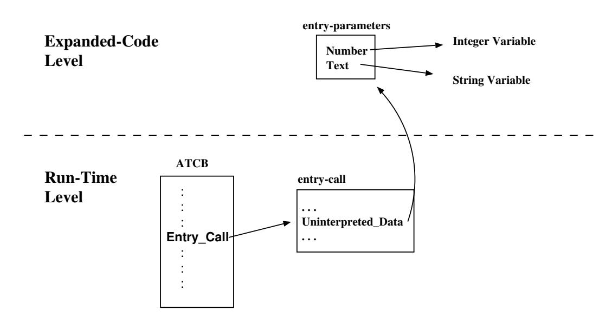

## Chapter 10. Expansion of Rendezvous and related Constructs

The `Rendezvous` is the basic mechanism for synchronization and communication of Ada tasks. Task communication is based on a client/server model of interaction. One task, the server, declares a set of services that it is prepared to offer to other tasks (the clients). It does this by declaring one or more public *entries* in its task specification. A rendezvous is requested by one task by means an entry call on an entry of another task. For the rendezvous to take place the called task must accept this entry call. During the rendezvous the calling task waits while the accepting task executes. When the accepting task completes the request, the rendezvous ends and both tasks are freed to continue their execution asynchronously.

The parameter prole of entries is the same as that of Ada procedures (**`in`**, **`out`** and **in out**, with default parameters allowed for **`in`** parameters). Access parameters are not permitted, though parameters of any access type are, of course, allowed. Entries are overloadable entities. In addition, a task can have entry families (basically an array of entries). At run-time, each entry is associated with a queue of entry calls. Each entry queue has an attribute associated with it, the 'Count attribute. The task that declares an entry can use this attribute to determine the number of callers awaiting service on this entry.

Ada defines four entry-call modes: *simple, conditional, timed*, and *asynchronous* [AAR95, Section 9.5.3]. A simple mode entry-call is much like a procedure call; it may have parameters, which permit values to be passed in both directions between the calling and accepting tasks. Semantically the calling task is blocked until completion of the requested rendezvous. If the call is completed normally, the caller resumes execution with the statement following the call, just as it would after return from a procedure call. Recovery from any exception raised by the call is also treated as it would be for a procedure call. One minor difference detectable by the calling task is that an entry call may result in `Tasking_Error` being raised in the calling task, whereas an ordinary procedure call would not. The conditional and timed entry-calls allow the client task to withdraw the offer to communicate if the server task is not prepared to accept the call immediately or if does not accept the call within the stated delay, respectively. The asynchronous entry-call provides asynchronous transfer of control upon completion of an entry call. Similarly, on the acceptor task side there are also simple, conditional and timed modes.

## 10.1 Entry Identification

The run-time needs to uniquely identify each entry. For this purpose, the front-end associates each entry an numeric id, which a positive number which corresponds with the position of the entry in the task type specification. The following example shows this mapping.

```ada
task T is
    --  a simple entry
    entry Init (x : integer);
    --  An entry family with 3 entries has three different queues.
    entry Lock (1 . . 3) (Reason : in ...);
    --  Do_Work (1) : Id = 2
    --  Do_Work (2) : Id = 3
    --  Do_Work (3) : Id = 4

    --  A simple entry declaration
    entry Unlock;  --  Id = 5
end T;
```

## 10.2 Entry-Call Expansion

The entry call must communicate parameters between the caller and the server. Given that each task has its own stack, and in general the client cannot write on the stack of the server, this communication involves copying steps and indirection. The caller creates a parameter block that holds the actuals, and passes to the server a pointer to this block. An entry call also generates pre and post-actions, similar to those that are generated for procedure calls, to handle initialization of in-parameters, and creation of temporaries and copy-back for out and in-out parameters. The run-time structure associated with the call is the entry-call record (cf. described in Section 15.1). On the server side, the run-time places the pointer to the parameters block into the Uninterpreted\_Data component of the entry-call record (See Expand\_Identifier in Sem\_Ch2). Figure 10.1 displays the data structures involved in a call to the following entry:

```ada
task T is
   entry E (Number: in Integer; Text: in String);
end T;
```



Figure 10.1: Data structures associated to an entry-call.

The following sections describe the expansion of each kind of entry-call: *simple, conditional, timed,* and *asynchronous*.

### 10.2.1 Expansion of Simple Entry-Calls

The front-end expands a simple mode entry call as follows:

```ada
declare
    type Params_Block is
       record
          Parm1 : Access_Param1_Type;
          ...
          ParmN : Access_ParamN_Type;
       end record;
    P : Params_Block := (Parm1'Access , ... , ParmN'Access);
begin
    GNARL.Call_Simple (Task_ID , Entry_ID, P'Address);
    [ Parm1 := P.Parm1; ]
    [ Parm2 := P.Parm2; ]
    [ ... ]
end;
```

The address of the parameters record `P` is passed to the GNAT run-time along with the identifiers of the called task and entry. The assignments after the run-time call are present only in the case of **in-out** or **`out`** parameters for scalar types, and are used to copy back the resulting values of such parameters.

### 10.2.2 Expansion of Conditional and Timed Entry-Calls

A conditional entry call differs from a simple entry call in that the calling task will not wait unless the call can be accepted immediately. If the called task is ready to accept, execution proceeds as for a simple mode call. Otherwise, the calling task resumes execution without completion of a rendezvous. Recall the syntax for a conditional entry-call:

```ada
select
   entry-call
   <statements-1>
else
   <statements-2>
end select;
```

As the reader can see, other statements can appear after the entry-call, which are only executed if the call was accepted. The alternative branch can also include statements that are executed only if the caller is not ready to accept. The conditional entry-call is expanded as follows:

```ada
declare
   type Params_Block is record
      Parm1 : Access_Param1_Type;
      ...
      ParmN : Access_ParamN_Type;
   end record;
   P : Parms_Block := (Parm1'Access , ... , ParmN'Access);
   Successful : Boolean;
begin
    GNARL.Task_Entry_Call (Task_ID,
                           Entry_ID,
                           P'Address,
                           Successful);
    if Successful then
       [ Parm1 := P.Parm1; ]
       [ Parm2 := P.Parm2; ]
       [ ... ]
       <statements-1>;  --  Statements after the entry call
    else
       <statements-2>;  --  Statements in the "else" part
    end if;
end;
```

In this case, the call to the run-time has an additional parameter (`Successful`) which indicates to the caller whether the entry-call was immediately accepted or not. If yes, the caller behaves as in the simple-mode case and assigns back the resulting values of the out-mode parameters (if present). Otherwise the caller executes the statements in the **`else`** part of the conditional entry-call.

The timed task_entry_call is handled by the GNAT compiler in a similar way. The main difference is the called run-time subprogram, because in this case if the entry-call can not be immediately accepted, the run-time must arm a timer and block the caller until the entry-call is accepted or else the timeout expires.

## 10.3 Asynchronous Transfer of Control

The Asynchronous Transfer of Control (ATC) allows the caller to continue executing some code while the entry call is waiting to be attended. Its Ada syntax is [AAR95, Section 9.7.4]:

```ada
select
   triggering_alternative
then abort
   abortable_part
end select;
```

The triggering statement can be an entry-call or a delay-statement. If the triggering statement is queued the abortable part starts its concurrent execution. When one of the parts finishes its execution it aborts the execution of the other part. Thus the ATC provides local abortion which is potentially cheaper than the abortion of the entire task.

### 10.3.1 ATC Implementation Models

There are two implementation models for the ATC: the one-thread model, and the two-threads model. In the following description we will assume that the triggering statement is an entry-call statement (the case of the delay statement is similar).

- *One-Thread model*. In this model, the first action of the caller is to try to execute the entry-call. If the called task was ready to accept the entrycall then the abortable part is not executed; otherwise the run-time leaves the entry-call queued and leaves the caller to execute the abortable part. If the entry-call is accepted before the caller completes the abortable part, the caller is forced to transfer control to the triggered statements. On the contrary, the caller cancels the queued entry call.
- *Two-Threads model*. In the two-thread model, the task executing the ATC creates an agent-thread to execute the abortable part. Each thread just tries to execute its part and abort the other thread. The thread which completes its part wins!.

Proponents of the two-thread model argue that simplifies the implementation of several run-time aspects. One is that it preservers two useful invariants of the original Ada tasking model namely: (1) a thread that is waiting for an event is not executing, and (2) a thread never waits for more than a timeout and one other event. Another simplification is that the two thread model eliminates the need for one thread to asynchronously modify another thread's ow of control, which is

not possible in some execution environments [GB94, Section 3.1]. However, the two-thread model seems to complicate the implementation at least as much as it simplifies it, and also violates a key invariant of Ada tasking: there is no longer a one-to-one correspondence between tasks and threads of control. This assumption pervades the semantics, and is the foundation of existing Ada tasking implementations. Loss of this invariant has many ramifications. Among these, data that previously could only be accessed by one thread of control becomes susceptible to race conditions. Thus, there are new requirements for synchronization, and new potential for deadlock within a single task. Also, just killing the agent thread is not as simple a solution as it might seem. There remains the problem of how to execute the agent's finalization code (if required due to the use of controlled types). If the operation that kills a thread does not support finalization, some other thread must perform the finalization. To do so, it must wait for the killed thread to be terminated to be able to obtain access to the run-time stack of the terminated thread. The latter may not be possible in systems where killing a thread also releases its stack space [GB94, Section 3.1].

By contrast, proponents of the one-thread model argue that it can be implemented with a signal and *longjmp()*. The triggering entry-call is just left queued while the abortable part is executed. If the abortable part completes first, the entrycall is removed. If the entry-call completes, the run-time sends an abortion signal to the caller. The signal handler for the abortion signal then transfers control out of the abortable part into the point of the entry-call [GMB93, Section 4.3].

Due to the disadvantages of the two-threads model, as well as the simplicity of the one-thread model, the GNAT compiler implements the one-thread model.

### 10.3.2 Expansion of ATC

The Following describes the expansion of an ATC statement:

```ada
declare
   P : aliased Parms := (Parm1'Access , ... , ParmN'Access);
   Successful : Boolean;
begin
   GNARL.Defer_Abortion;
   GNARL.Task_Entry_Call (Task_ID, Entry_ID,
                          P'Access, Successful);
   begin   --  Abortable Part Scope
      begin
         GNARL.Undefer_Abortion;
         <Abortable Part>
      at end
         GNARL.Entry_Call_Cancellation (Successful);
      end;
   exception
      when Abort_Signal =>
         GNARL.Undefer_Abortion;
   end;
   if not Successful then
      [ Parm1 := P.Parm1; ]
      [ Parm2 := P.Parm2; ]
      [ ... ]
      <Triggered Statements>
   end if;
end;
```

The first action issued in the scope associated with the ATC is to protect the entry call from abortion (line 5). From here two scenarios must be analyzed:

1. If the entry call is immediately accepted, the run-time subprogram called at line 6 completes the rendezvous, sets the Successful variable, and sends the abort signal to the caller. Because the abortion is deferred from line 5 onwards, this has no immediate effect. After the entry-call is completed, the caller now undefers the abortion (line 9), which raises the deferred abort signal and forces the caller to skip the abortable part and try to cancel the entry call (line 12). However, because the entry-call was completed this call does nothing. Finally, the caller assigns back the resulting values of the out-mode parameters, and executes the triggered statements (lines 18 to 24).
2. If the entry call is not immediately accepted, the caller undefers the abortion

(line 9) and executes the abortable part (line 10). Again here we have two possible scenarios:

1. If the execution of the abortable part completes, the entry call is cancelled (line 12). The run-time sets Successful to false, to force the caller to skip lines 18 to 24.

2. If the entry-call is completed before the abortable part completes, then the run-time sends the abort signal to the caller (which was executing the abortable part, line 10). This signal cancels the execution of the abortable part. The caller now tries to cancel the entry call (line 12), but because the entry-call was completed the only effect of this call is to set Successful to true, which forces the caller to execute the statements that assign back the resulting values of the out-mode parameters, and then execute the triggered statements (lines 18 to 24).

## 10.4 Expansion of Accept Statements

This section describes the expansion of the the simple and selective accept statements.

### 10.4.1 Simple Accept Expansion

Recall the syntax of simple accept statements:

```ada
accept E (...) do
   <Entry_Body_Statements>
end E;
```

A simple accept is expanded as follows:

```ada
declare
    Params_Block_Address : Address;
begin
   GNARL.Accept_Call (Entry_ID, Params_Block_Address);
   <Entry Body Statements>
   GNARL.Complete_Rendezvous;
exception
   when others =>
      GNAR.Exceptional_Complete_Rendezvous;
end;
```

The acceptor task calls the run-time, specifying the identifier of the accepted entry, and receives the address of the parameters block to be used in the entry body statements. There are two different run-time subprograms which are called depending on whether the entry completes successfully or not: `Complete_Rendezvous` and `Exceptional_Complete_Rendezvous` respectively.

### 10.4.2 Timed and Selective Accept

The scheme used for expansion of the Ada timed calls and selective accept statements is similar. The only difference is the run-time subprogram that is invoked. In both cases the run-time receives from the caller a vector that indicates which entries are currently open: the *open-accept vector*. Each element of this vector has two fields: the entry identifier, and a boolean which indicates if the accept statement has a null body. Each element of the open-accept vector corresponds to the accept alternatives of the select statement; If the entry guard of a given alternative is closed, the corresponding entry identifier is set to 0. Consider the following example:

```ada
task T is
   entry P;           --  Entry_Id = 1
   entry Q;           --  Entry_Id = 2
end T;
task body T is
begin
   select
      accept Q do     --  OAV (1).Entry_Id := 2
        <User Code>   --  OAV (1).Null_Body := False;
      end Q;
   or
      when <User-Guard> =>
                --  If the guard is open OAV (2).Entry_Id := 1
      accept P; --                  else OAV (2).Entry_Id := 0;
                --  OAV (2).Null_Body := True;
   else
      <else statements>
   end select;
end T;
```

The GNAT front-end expands the selective accept into a block containing three declarations: the open-accept vector (OAV), the index of the selected alternative, and the address of the parameters block. A value of 0 in the index parameter is used by the run-time to indicate that the **`else`** alternative has been selected. Let us see a simplified version of the expansion of the previous example:

```ada
declare
   function P_Guard return Natural is
   begin
      if <User-Guard> then
         return 1;  --  returns the Entry_Id
      else
         return 0;  --  return 0 (it is closed)
      end if;
   end P_Guard;

    procedure Q_Body is
    begin
       GNARL.Undefer_Abortion;
       ... <User Code>
       GNARL.Complete_Rendezvous;
    exception
       when others =>
          GNAR.Exceptional_Complete_Rendezvous;
    end Q_Body;

    OAV : GNARL.Open_Accepts_Table
      := ((2 , True), (P Guard , False), (0, False));
    Index : Natural;
    Params_Block_Address : System.Address;

 begin
    GNARL.Selective_Wait
      (OAV, Params_Block_Address, Index);
    case Index is
       when 0 =>
          <else statements>
       when 1 =>
          Q_Body;
       when 2 =>
          null;
    end case;
 end;
```

For each user-defined guard, the expander generates a function which evaluates the guard (lines 2 to 9): if the guard is open, this function returns the identifier of the entry; if the guard is close it returns 0. The entry-body statements are expanded inside local procedures following a scheme similar to the scheme described in Section 10.4.1 (lines 11 to 19). In addition, the front-end generates the open-accept vector with the corresponding initialization (lines 21-22), an `Index` variable used by the run-time to notify the selected alternative (line 23), and another variable used by the run-time to notify the address of the parameters block (line 24). After the call to the run-time (line 27), the expander generates a casestatement (lines 29 to 36) which uses the index returned by the run-time to execute the code associated to the alternative selected by the run-time.

### 10.4.3 Count Attribute Expansion

The 'Count attribute is expanded into a call to a run-time function (`Task_Count`) which receives as input parameter the identifier of the entry.

## 10.5 Summary

The rendezvous is the basic mechanism for synchronization and communication of Ada tasks. At the point of an entry-call, the front-end expands the actual parameters into a block with collects their addresses. After the call, the expander generates statements to copy the value of the out-mode parameters into the corresponding variables. In case of conditional and timed entry calls, the run-time returns one value which indicates the alternative to be executed; therefore it is also responsibility of the front-end to generate an if-statement to execute the right code. The expansion scheme followed in the implementation of ATC is similar to the conditional entry-call, although additional scopes must be generated to handle the abortion of the call.

For the implementation of the timed and selective accept statements the compiler expands: 1) each entry-guard into a function which evaluates the guard, and 2) each entry-body into a procedure which notifies the run-time if it was executed successfully or not. The expander generates code which collects all this information into an open-accept vector which passes to the run-time at the point of the call. In addition, after the call the run-time returns a value which indicates the identifier of the selected alternative, and the expander generates a case alternative which uses this value to execute the corresponding statements.
