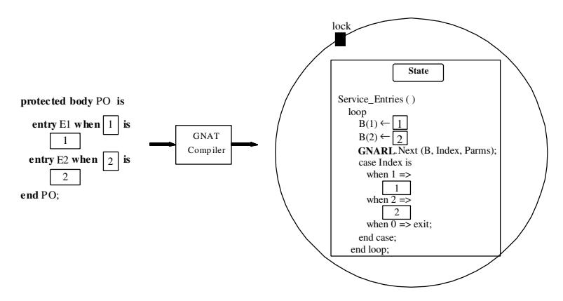

# **Chapter 11.** **Expansion of Protected Objects**

Protected objects are an embodiment of the venerable notion of Monitor: a construct that allows shared data to be accessed by different threads under mutual exclusion. Protected objects provide data-driven synchronization between cooperating tasks: tasks communicate not only through rendez-vous or generally unsafe shared memory, but by disciplined access to shared objects with locks.

A protected object (PO) encapsulates data items, and allows their exclusive access and update by means of protected subprograms or protected entries. A protected function accesses the data in read-only mode, while a protected procedure has access in read-write mode. A protected entry is akin to a protected procedure, but it has a `Barrier` , that is to say a boolean expression that serves as a guard to the entry. The barrier provides a conditional version of the entry call: a calling thread has access to the data only if the barrier is True, otherwise the caller queues on the object until the barrier value becomes true, and no other task is currently active inside the protected object.

The declaration of a protected type comprises a visible interface and a private part, The visible interface includes only its operations (subprograms and entries). The private part describes the structure of the protected data.

The body of a protected type contains the bodies of the all the visible operations. It may also contain private operations. It does not contain any other declarations, to insure that the state of the object is fully described by the private part of the type declaration itself.

At run-time, the protected object is represented by a record that holds the protected data, a lock that insures mutual exclusion, and queues that hold blocked tasks. Each entry has its own queue, to hold tasks that await an opening of the corresponding barrier. The object itself has one queue that holds tasks competing for access to the object.

A call to a protected operation is similar to a call to a task entry. As with task entry-calls, the caller uses a selected component notation to specify the target of the call (task or protected object) and the operation to invoke. The call can be *simple*, *conditional*, or *timed*. Note however the critical distinction between task entry calls and protected entry calls: in the first case, the callee will execute the desired operation; in the second case, the caller task executes the operation, because the protected object is a passive structure with no thread of control.

After a protected operation is executed, the state of the object may have been affected, and the values of the barriers may have changed. It is therefore necessary to re-evaluate the barriers to determine whether some queued task can now have access to the object. This re-evaluation must be performed by the task that currently holds the lock on the object, that is to say the task that just completed executing a protected call. This means that if there are tasks queued on entries and tasks queued "outside" of the object (on the outer queue for protected subprograms), those queued on entries will have priority. This is often explained in terms of the *eggshell model*. The object has an external shell that allows only one task at a time to proceed. The entry queues are all inside the shell, and they can hold any number of blocked tasks. The clean-up that follows the completion of an operation only concerns the tasks inside the shell.

As with tasks, protected objects may have private entries and families of entries. Private entries are not directly visible to users of the protected object; however they have their own queues, and are typically used in requeue operations. Entry families are arrays of entries, that is to say at run-time they correspond to arrays of independent queues. In a task body, An accept statement for a member of an entry family task species by means of an expression the member of the family being accepted. This means that different accept statements can be provided for different members of the family. By contrast, in a protected body there is a single entry body for the family. The index plays the role of an additional parameter of the entry body. The barrier of the entry body can use the index of the family (see examples of usage in [BW98, Chapter 7.5] and [Bar99, Chapter 18.9]). The attribute `Count` can be applied to protected entries, to provide the current number of tasks queued on the specified entry.

Given that the lifetime of a protected object and that of the tasks that use is, are not necessarily the same, it is possible for a protected object to disappear while some tasks are still queued on it (for example, the object may have been created dynamically, and explicitly deallocated). In that case the language semantics prescribes that the exception Program Error must be raised on all queued tasks. This clean-up operation is most simply realized by implementing protected objects as controlled types. The Finalize procedure for protected types traverses all queues of the corresponding object and raises Program Error on all tasks therein.

In order to understand the expansion activities associated with protected types, we will examine in some details the implementation model. After a discussion of run-time issues, we present the expansion of protected-type specifications, protected subprograms, barriers, and entry bodies. The expansion of protected entry calls is not discussed here because it is similar to that for task entry-calls (cf. Chapter 10).

## **11.1 The Proxy Model**

As mentioned above, conceptually each protected operation is executed by a calling task. However, the functioning of a protected object includes house-keeping activities that also require execution, in particular the evaluation of barriers, and the language does not specify what thread is to compute them. The semantics specify that upon completion of a protected operation that may affect the state of the object, the barriers are evaluated at once to determine whether some queued task can gain access to the object, so that in principle a context-switch might take place at that point. However, if several tasks are now eligible to enter the object, each one of them will have to wait its turn to obtain the object, and a number of context-switches will be necessary to empty the queues. This suggests a different implementation, in which the task that completes its operation retains the lock on the object, and executes the entry bodies of the waiting tasks, *on their behalf*. In this fashion no additional context switches are needed. As far as the eligible tasks are concerned, their calls were executed and they can proceed. The first implementation model, in which each task executes the operation it invokes, is called the `Self-Service` model. The second one is called and the `Proxy` model.

The main advantages of the self-service model are that it permits more parallelism (on multiprocessor systems) and simplifies schedulability analysis. Parallelism is increased because on a multiprocessor system the exiting task can proceed with its own execution, in parallel with the execution of the next queued call. Schedulability analysis is simplified because a thread is allowed to continue with its own execution immediately after the (presumably bounded) time it takes to complete the body of the called protected operation and transfer the lock ownership to the next queued caller.

By contrast, the principal advantage of the proxy model is simplicity. If an entry body cannot be executed immediately, the calling task just suspends its execution; some other task will execute its entry-call. Complex features of protected objects, including timed and asynchronous entry-calls, are simplified even more by this model. As indicated above, on a uniprocessor the proxy model is more efficient because the number of context-switches is smaller. However, the proxy model compromises schedulability analysis, since the time to complete an operation is not bounded by the operation itself: it depends on the number of other tasks that may be queued on the object, and there is no upper-bound on the number of such calls that may be pending.

GNAT implements the proxy model because the implementation of the selfservice model with Pthreads currently introduces crippling inefficiencies. The self-service model works best if the task attempting to leave the protected object can transfer directly the lock to a specific task that is waiting on an `Open` entry. However, there is no efficient way to achieve this under Pthreads. The existing mechanism requires raising the priority of the chosen task above that of all other contenders, and then rescanning the set of ready tasks to determine the one that is to be given access. This turns out to be unacceptably cosly.

### **11.1.1 Implementation**

There are two possible implementations of the proxy model itself: *call-back* and *in-line*. In the call-back implementation the compiler transforms barriers and entry-bodies into stand-alone subprograms, and generates code to pass their addresses to the run-time; a single routine in the run-time implements the algorithm that calls these subprograms (cf. Figure 11.1). By constrast, in the in-line implementation the compiler not only expands the barriers and entry-bodies (and not necessarily inside subprograms), but also generates in-line the statements that implement the egg-shell model; after the execution of a protected-procedure or protected-entry, these statements reevaluate the barriers and execute the entrybody of the open entries until no candidate is selectable (cf. Figure 11.2).

The GNAT compiler uses the call-back implementation. The reasons are: 1) The call-back interface allows for much simpler translations, and eliminates some of the overhead inherent in the in-line interface's frequent alternation between the GNU Ada Run-Time and the application code. 2) The call-back interface has a big advantage in the simplicity and understandability of both the generated code and the internal logic of the compiler [GB95].


Figure 11.1: Proxy Model: Call-Back Implementation.



Figure 11.2: Proxy Model: In-Line Implementation.

## **11.2 Expansion of Protected Types**

### **11.2.1 Expansion of Protected-Type Specification**

The expansion of a protected type must create the following structures:

1. A record type that holds the protected data and the entry queues.

2. subprograms that implements each protected operation. The parameter list of each such subprogram includes a parameter that designates the object on which the operation is performed at run-time.

Consider the following protected type declaration:

```ada
protected type PO (Disc : Integer) is
    procedure P (C : Character);
     function F (X : Integer) return Integer;
     entry E1;
     entry E2 (1 .. 10) (X : Integer);
private
    Value : Integer;
end PO;
```

The front-end expands it as follows:

```ada
type poV (Disc : Integer) is new Limited_Controlled with
   record
      Value : Integer;
      _object : aliased GNARL.Protection_Entries
                                (Num_Entries);
   end record;

procedure Finalize (object : poV) is
begin
   --  Raise Program_Error to the queued tasks.
   ...
end Finalize;
```

The protected type specification is expanded into a record type declaration (lines 1 to 6). If the protected type has discriminants, the record type has the same discriminants. The record type is defined as limited-controlled. Limited because, in analogy to task types, protected types are limited types [AAR95, Section 9.4(23)], and hence have neither an assignment operation nor predefined equality operators. It is also controlled to implement the clean-up action described above: when the object is finalized, each call remaining on any entry queue of the object must be removed from its queue and Program Error must be raised at the place of the corresponding entry-call statement [AAR95, Section 9.4(20)]. PO's private data is expanded into the components of the record-type declaration (line 3). The field *object* (line 4) contains additional run-time data: the lock, entry queues, the priority of the object, etc.

### **11.2.2 Expansion of Protected Subprograms**

For each protected operation Op, the GNAT compiler generates two subprograms: OpP (the protected version) and OpN (the non-protected one). OpP simply takes the object lock, and then invokes OpN. OpN contains the (suitably expanded) user code. If a call is an internal call, i.e. a call from within an operation of the same object, the call invokes OpN directly. If the call is external, it is implemented as a call to OpP. In addition, one additional parameter is added by the compiler to the parameters prole of the protected subprograms: the object. Because protected procedures can modify the object's state, they receive the object as **in out** mode parameter. Protected functions receive the object as an **`in`** mode parameter. For example:

```ada
procedure procP (_object : in out poV; ...);
procedure procN (_object : in out poV; ...);
```

A reference to a component of the object in the body of an operation, must be transformed into a reference to the component of the run-time object on which the operation is applied. This is implemented by introducing renaming declarations in the expanded subprograms. For example, the component Value in the definition above, leads to the following local declaration in all expanded subprograms:

```ada
Value : Integer renames _object.Value;
```

The local variables introduced in this fashion are called Privals in the GNAT sources. References to private components are replaced by references to Privals thoughtout the bodies of protected operations. Let us see the expansion of subprogram *procP* in detail.

```ada
procedure procP (_object : in out poV; ...) is
   procedure Clean is
   begin
      GNARL.Service_Entries (_object._object'access);
      GNARL.Unlock (_object._object'access);
      GNARL.Abort_Undefer;
   end Clean;
begin
   GNARL.Abort_Defer;
   GNARL.Lock Write (_object._object'access);
   begin
      procN (_object; ...);
   exception
      when others =>
         declare
            E : Exception_Occurrence;
         begin
            GNARL.Save_Occurrence
              (E, GNARL.Get_Current_Exception);
            Clean;
            GNARL.Reraise (E);
         end;
   at end
      Clean;
   end;
end procP;
```

Protected operations are abort-deferred operations [AAR95, Section 9.8(5-6)]. Therefore, the `P` subprogram calls the run-time to defer the abortion (line 9) and to obtain the read/write access of the PO (line 10), and finally calls the `N` subprogram (line 12). On return from `N` we have two possible scenarios: No exception was raised by the user code. In this case the at-end statement (line 24), an internal statement of the GNAT compiler which is executed whether the code was executed successfully or not, calls the local subprogram `Clean` to reevaluate the barriers and service queued entry-calls (line 4), unlock the protected object (line 5), and undefer the abortion (line 6). Otherwise, if the execution of the `N` subprogram propagates an exception, the barrier must be reevaluated and the queued entrycalls must be serviced before propagating back the exception to the calling-task. Therefore, the exception handler saves the exception occurrence (line 18), calls the local subprogram Clean, and finally re-raises the exception (line 21).

### **11.2.3 Expansion of Entry Barriers**

Entry barriers are expanded into functions that return a boolean type. As for other operations, the expansion adds one parameter to designate the object itself. Barriers can access all components of the object, and therefore the expansion includes the same object renamings as other protected operations. The front-end builds an array of pointers to the barrier functions, and the run-time invokes them indirectly. The expansion of the barriers is as follows:

```ada
function Entry_Barrier
   (Object : Address;
    Entry_Index : Protected_Entry_Index)
   return Boolean
is
   <Discriminant_Renamings>
   <Private_Object_Renamings>
begin
   return Barrier_Expression;
end Entry Barrier;
```

### **11.2.4 Expansion of Entry bodies**

Similar to the barriers, the entry bodies are expanded into procedures with the same prole. They are expanded as follows:

```ada
procedure EntryName
   (Object      : Address;
    Parameters  : Address;
    Entry Index : Protected_Entry_Index)
   is
      <Discriminant Renamings and Private Object Renamings>
      type poVP is access poV;
      function To_PoVP is new Unchecked_Conversion (Address, PoVP);
      _object : PoVP : = To_PoVP (Object);
begin
   <Entry body statements>
   GNARL.Complete_Entry_Body (_object._object);
exception
   when others =>
      GNARL.Exceptional_Complete_Entry_Body
      (_object._object, GNARL.Get_GNAT_Exception);
end EntryName;
```

Similar to the `N` subprograms (cf. Section 11.2.2), the compiler adds some renamings to facilitate the access to the discriminants and private state (line 6). Because the procedure receives as parameter the address of the object (not the object itself), the front-end also generates the unchecked conversion of this address to the corresponding access to the object (lines 7 to 9). In addition, the front-end also generates calls to notify the run-time the successful execution of the entrybody statements (line 12) or unsuccessful execution (line 15).

### **11.2.5 Table to Barriers and Entry-Bodies**

In addition to the barrier and entry-body expansion described above, the front-end also generates a table initialized with the access to the expanded subprograms. Each element has the access to an entry-barrier expanded function and the access to an entry-body expanded procedure. The front-end also generates a call to the run-time to pass this table, which is used by the run-time to evaluate the entrybarriers and to call the selected entry-body.

### **11.2.6 Expansion of Entry Families**

For each entry-family the front-end adds one field to the PO type-declaration. This field saves the bounds of the entry-family specification. The element-type of these arrays is set to void because the contents of the array are not used. The protected type is then expanded as follows:

```ada
type poV (Discriminants) is new Limited_Controlled with
record
   <Private Data>
   _object : aliased GNARL.Protection_Entries(Num_Entries);
   Entry_Family_Name : array (Bounds) of Void;
end record;
```

## **11.3 Optimizations**

To realize simple and efficient synchronization regimes, a protected object without entries is sometimes sufficient. Such an object can be implemented more efficiently, and is recognized by the GNAT front-end. The resulting expansion is simpler, as indicated in the following example:

```ada
type poV (Discriminants) is limited record
   <private-data-fields>
   _object : aliased Protection;
end record;
```

Because now the protected object has no queues, the expanded type is simplified as follows 1) It is not a controlled type, because there is no need to raise Program Error on queued entries, and 2) The object component is smaller (`Protection` type only has the object lock and the PO ceiling).

In the absence of entries the run-time is also able to provide a faster implementation for protected objects. For this purpose, the GNAT run-time provides a second set of subprograms which are called by the expanded code in case of protected objects without entries (see package System.Tasking.Protected Objects). In addition, the expander does not generate the call to re-evaluate the barriers after the execution of the body of a protected procedure.

## **11.4 Summary**

There are two models to implement the protected objects: the self-service and the proxy model. GNAT follows the proxy model because the implementation of the self-service model with Pthreads is not feasible at a low cost. There are also two main implementations of the proxy model: the in-line and the call-back implementation. The main difference between both implementation resides on the service-entries routine. In the in-line model it is generated by the expander; in the call-back model, it is inside the run-time. GNAT follows the call-back implementation because the call-back interface allows for much simpler translations, and the expanded code is more understandable.

Protected subprograms are translated to two subprograms: P and N. P obtains the object lock calls N, which has the user code. The barriers are expanded into functions that return a boolean data-type, and the entry-bodies are expanded into procedures. The front-end also generates a table with access to these subprograms. This table is used by the run-time to evaluate the barriers and call the selected entry-body.
