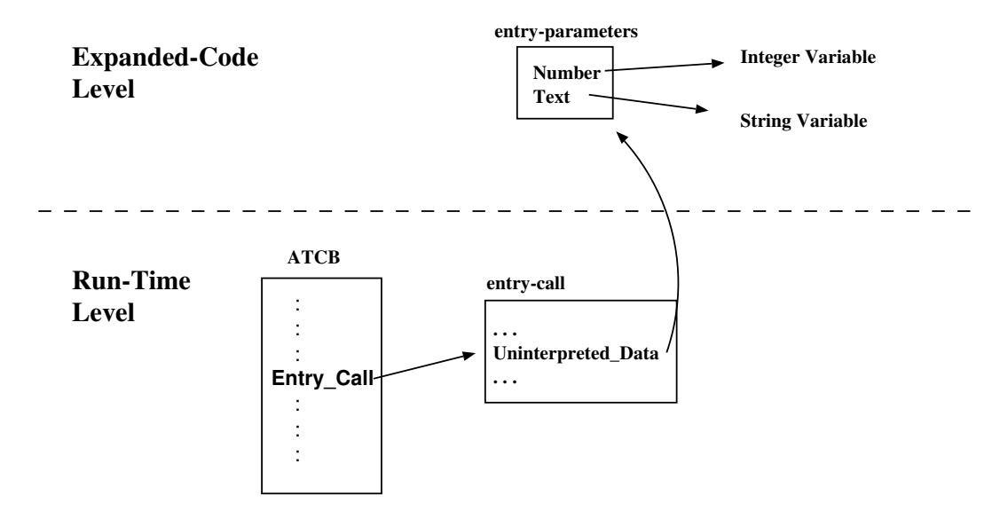
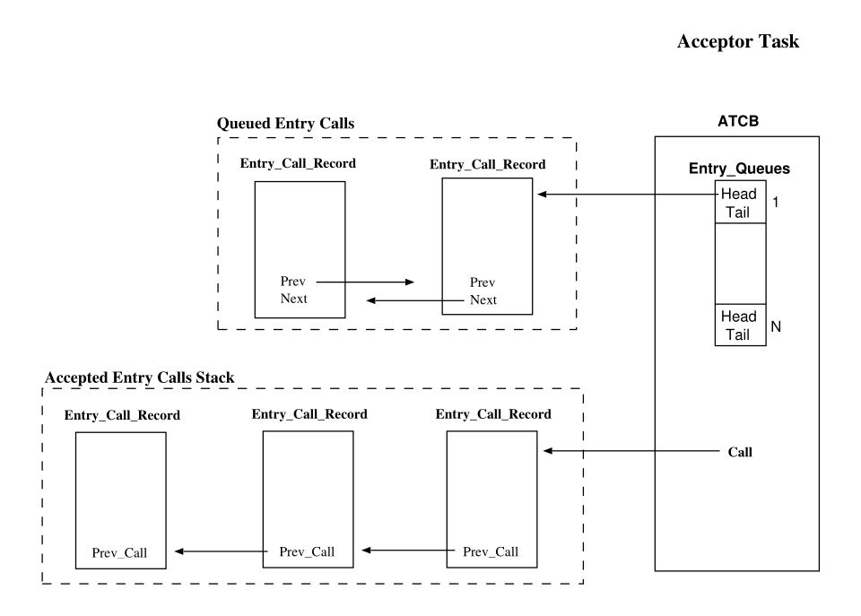

# Chapter 15. The Rendezvous

The `Rendezvous` is the basic mechanism for synchronization and communication of Ada tasks. The model of Ada is based on a client/server model of interaction. One task, the server, declares a set of services that it is prepared to offer to other tasks (the clients). It does this by declaring one or more public *entries* in its task specification. A rendezvous is requested by one task making an entry call on an entry of another task. For the rendezvous to take place the called task must accept this entry call. During the rendezvous the calling task waits while the accepting task executes. When the accepting task ends the rendezvous both tasks are freed to continue their execution. In the case that more than one task is waiting on the same entry of a task, Ada requires the calls be accepted in first-in-first-out order. The run-time must maintain data structures to keep track of which tasks are waiting on entry calls, which entries they are calling, and in what order the calls on each entry of a task arrived.

A conditional entry call differs from an unconditional entry call in that the calling task need not wait unless the call can be accepted immediately. If the called task is ready to accept, execution proceeds as for an unconditional call. Otherwise, the calling task resumes execution without completion of a rendezvous. The syntax provides for execution to resume at different places, depending on whether any rendezvous took place. The efficient implementation of the conditional entrycall requires a simple test for whether the called task is ready to accept. This can be done in constant time if the run-time maintains an accept vector for each task, telling on which entries, if any, the task is ready to accept a call (See the expansion of this vector in Section 10.4.2). If the test fails, the run-time may return control immediately to the calling task. Otherwise, the actions are similar to those for the unconditional call.

The contents of this chapter are structured as follows: Section 15.1 presents the entry call record; Section 15.2 presents the implementation of the entry queues; Section 15.3 presents the stack required to give support to nested accept statements; Section 15.4 presents the run-time support for the selective accept statement. Finally, Section 15.5 describes the sequence of actions carried out by the GNARL subprograms that give support for entry-calls and for the acceptstatements.

## 15.1 The Entry-Call Record

The GNAT run-time associates a record to each entry call: the `Entry_Call_Record`. It is used to group all the run-time information associated with the entry call. It includes the identifier of the called entry, the current state of the entry call, the links to the previous and next queued entry calls, etc. If the entry has parameters, the front-end groups all the parameters in a contiguous block (cf. Section 10.2.1, and the run-time saves the base address of this block in the `Uninterpreted_Data` field of the `Entry_Call_Record`. Figure 15.1 presents the GNAT run-time data structures used to handle an entry call to the entry E of the following task specification:

```ada
task T is
   entry E (Number : in Integer; Text : in String);
end T;
```

An entry-call can be in one of the following states:

- `Never_Abortable`. The call is not abortable, and never can be. It is used for calls that are made in a abort deferred region [AAR95, Section 9.8(5- 11,20)]).
- `Not_Yet_Abortable`. The call is not abortable, but may become abortable in the future.
- `Was_Abortable`. The call is not abortable, but once was. The `Was` versus `Not_Yet` distinction is needed to decide whether it is OK to advance into the abortable part of an async. select stmt. That is allowed iff the mode is Now or Was .
- `Now_Abortable`. The call is abortable.
- `Done`. The call has been completed without cancellation, or no call has been made yet at this ATC nesting level (cf. Chapter 20, and so aborting the call is no longer an issue. Completion of the call does not necessarily indicate "success"; the call may be returning an exception if Exception\_To\_Raise is non-null.
- Cancelled. The call was asynchronous, and was cancelled.



Figure 15.1: Data structures associated to an entry-call.

## 15.2 Entries and Queues

Each entry has one queue which stores all the pending entry calls [AAR95, Section 9.1(16)]. If the queue is nonempty, the next caller to be served is at the head of the queue. The cost of checking whether there are any calls queued for a given entry depends on the data structure chosen for the entry queues. The GNARL run-time uses circular doubly linked lists so that checking, insertion and deletion are all constant-time operations.

The ATCB field `Entry_Queues` is an array indexed by the entry identifier (the front-end associates an unique identifier to each entry queue, cf. Section 10.1). Each element of this array has two fields: the `Head` and the `Tail` of the queue (cf. Figure 15.2).


Figure 15.2: Entry Queues.

## 15.3 Accepted-Calls Stack

Because Ada allows the use of nested accept-statements, when an entry-call is accepted the GNAT run-time extracts the entry-call record from the corresponding entry-queue and pushes its address in an stack. The top of this stack is referenced by the `Call` field of the acceptor's ATCB (cf. Figure 15.3). The `Acceptor_Prev_Call` field links all the stack elements.

## 15.4 Selective Accept

The special implementation problem introduced by the selective wait is that a task may at one instant be ready to accept a call on a set of several entries. From the viewpoint of the Ada run-time, this is really two problems, since it comes up in the processing of entry calls, as well as selective waits:

1. Since a task may be waiting on more than one open accept alternative, processing an entry-call requires checking whether the called entry corresponds to one of the open alternatives.
2. Since there may be several open accept alternatives, processing the selective wait requires checking the set of pending entry calls against the set of open accept alternatives.



Figure 15.3: Simple Accept.

The need to be able to perform both of these operations efficiently strongly influences an implementation's choice of data structures. There are two obvious ways to perform the first operation, checking whether a called entry has a currently open accept alternative:

1. If the set of open accept alternatives is represented as a list, checking requires comparing the called entry against each of the entries in this list. We call this approach the use of an *open entry list*. It may be time consuming if there are many open entries.
2. An alternative is to use a vector representation for the set of open entries: the *open accepts vector*. This vector would have one component for each entry of the task. Each component would minimally indicate whether the corresponding entry is open.

Note that the accept vector or open entry list must be created at the time the selective wait statement is executed, once it is known which alternatives are open. The time needed to do this only depends on the number of alternatives in the selective wait statement. With separate queues for each entry, it is necessary to check the queue corresponding to each open entry. This requires sequencing through the open entries. Alternatively, if the open entries are represented by an open entry list, this check can be performed more quickly, without looking at the non-open entries. This may be a good reason to keep both an open entry list and an accept vector, though this redundancy may cost more in overhead than it saves through faster execution of the check for pending calls.

GNAT uses the `Open_Accepts_Vector`. Each element of this vector has two fields: the entry identifier and a boolean which indicates if the accept statement has a null body (cf. Section 10.4.2). Each element of the accept vector corresponds to the accept alternatives of the select statement (in the same order; first element of the accept vector corresponds to the first alternative, second element corresponds to the second alternative, etc.). The run-time returns 0 when the entry guard is closed.

## 15.5 Run-Time Rendezvous Subprograms

Chapter 10 presents the expansion of the entry-call and accept statements. The following sections describe the actions carried out by the GNAT run-time subprograms called by the expanded code.

### 15.5.1 GNARL.Call_Simple

The run-time subprogram `Call_Simple` simply delegates the work to other run-time subprogram called `Call_Synchronous`.

### 15.5.2 GNARL.Call_Synchronous

The run-time subprogram `Call_Synchronous` carries out the following actions:

1. Defer the abortion.
2. Create and elaborate a new entry-call record, and save on it the address of the parameters block.
3. Call the GNARL subprogram `Task_Do_Or_Queue`.
4. Wait for the completion of the rendezvous (`Wait_For_Completion`).
5. Undefer the abortion.
6. Raise any pending exception from the entry call (`Check_Exception`).

### 15.5.3 GNARL.Task_Do_Or_Queue

The subprogram `Task_Do_Or_Queue` carries out the following actions:

1. Try to serve the call immediately. If the acceptor is accepting some entry call and the current call can be accepted the following actions are carried out:
  - Commit the acceptor to rendezvous with the caller.
  - If the acceptor is in a **`terminate`** alternative then cancel the terminate alternative. If the acceptor has no dependent tasks notify its parent that the acceptor is again awake.
  - If the **`accept`** statement has a null body (an accept used for tasks synchronization) then wake up the acceptor, wake up the caller and RE-TURN.
  - If the **`accept`** statement has some body then call a run-time procedure (`Setup_For_Rendezvous_With_Body`) to insert the `Entry_Call_Record` in the accepted entry-calls stack of the acceptor task (cf. Section 15.3), and to raise the priority of the acceptor (if the caller priority is higher than the priority of the acceptor). Then wake up the acceptor and RETURN.

### 15.5.4 GNARL.Task_Entry_Call

If the entry-call can be immediately accepted `Task_Entry_Call` carries out the same actions of the simple-mode entry-call and sets one out-mode parameter to True (Successful) to indicate this to the expanded code (cf. Section 10.2.2). Otherwise it sets this parameter to False. The expanded code uses this parameter to select the part of the user-code which must be executed after the call. Note that in the call is never enqueued; a conditional entry-call is only enqueued if the acceptor requeues it not-abortably (by means of a requeue-statement).

### 15.5.5 GNARL.Accept_Trivial

`GNARL.Accept_Trivial` performs the following actions:

1. Defer the abortion.
2. If no entry call is still queued then block the acceptor task to wait for the next entry call (`Wait_For_Call`).
3. Extract the entry-call record from the head of the queue (`Dequeue_Head`) and wake-up the entry caller (`Wakeup_Entry_Caller`).
4. Undefer the abortion.

### 15.5.6 GNARL.Accept_Call

The GNARL procedure `Accept_Call` carries out the following actions.

1. Defer the abortion.
2. If the entry has no queued entry calls then block the acceptor tasks to wait for the next entry call (`Wait_For_Call`).
3. Extract the entry-call record from the head of the queue (`Dequeue_Head`) and push it in the accepted entry-calls stack.
4. Update the out-mode parameter `Param_Access` with the reference to the `Entry_Parameters_Record` so that the compiler generated code can access the entry parameters.
5. Undefer the abortion.

### 15.5.7 GNARL.Complete_Rendezvous

If no exception is raised during the execution of an accept body the subprogram `Complete_Rendezvous` is called is called by the expanded code. This subprogram just calls the subprogram `Exceptional_Complete_Rendezvous` notifying it that no exception was raised.

### 15.5.8 GNARL.Exceptional_Complete_Rendezvous

If an exception was raised during the execution of the code associated with the entry call, the exception must be also propagated on the caller and on the acceptor task [AAR95, Section 9.5.2]. For this purpose the subprogram `Exceptional_Complete_Rendezvous` carries out the following actions:

1. Defer the abortion.
2. Pop the reference to the entry-call record from the accepted entry-calls stack.
3. If an exception was raised, get its identifier from the entry call field `Exception_To_Raise` and save its occurrence in the ATCB field `Compiler_Data`. This exception will be propagated back to the caller when the rendezvous is completed [AAR95, Section 9.5.3].
4. Wake up the caller (`Wakeup_Entry_Caller`).
5. Undefer the abortion.

### 15.5.9 GNARL.Selective_Wait

The GNARL subprogram `Selective_Wait` performs the following actions:

1. Defer the abortion.
2. Try to serve the entry call immediately. GNARL subprogram `Select_Task_Entry_Call` selects one entry call following the queuing policy being used.
  - If there is some candidate and the accept has a null body then complete the rendezvous, wake up the caller, undefer the abortion and RETURN.
  - If there is some candidate and the accept has some associated code then insert the entry-call record in the accepted entry-calls stack (`Setup_For_Rendezvous_With_Body`), update the reference to the parametersblock, undefer the abortion and RETURN.
  - If there is no candidate but there are alternatives opened, wait for a caller. In the future some caller will put an entry call record in the accepted entry-calls stack and it will wake up this acceptor. Then this acceptor will update the reference to the entry parameters, it will undefer the abortion, and it will RETURN.
  - If there is a terminate alternative, notify its ancestors that this task is on a terminate alternative (`Make_Passive`, and wait for normal entry call or termination.
  - If no alternative is open and no delay (or terminate) has been specified then raise the predefined exception `Program_Error`.

### 15.5.10 GNARL.Task_Count

The function `Task_Count` gives support to the 'Count attribute. It returns the number of queued entry calls in the specified entry queue.

## 15.6 Summary

The `Rendezvous` is the basic mechanism for synchronization and communication of Ada tasks. In this chapter, the main aspects of the GNAT implementation have been described. In summary:

- The run-time information associated with the entry call is grouped into an `Entry_Call_Record`.
- The compiler generates one `Entry_Parameters_Record` with the address of the real-parameters. GNARL registers the address of this record in a field of the Entry Call Record.
- The entry queues are implemented by means of double linked lists of Entry Call Records.
- Nested accepts are handled by means of one accepted entry-calls Stack; a linked list of accepted Entry Call Records.
- An `Accept_Vector` is used to evaluate the open guards of the selective accept.
