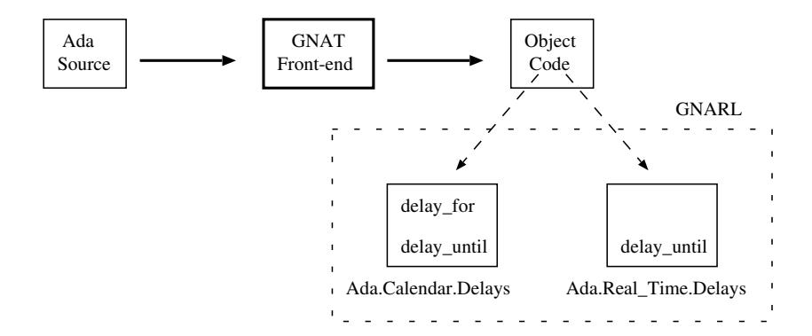
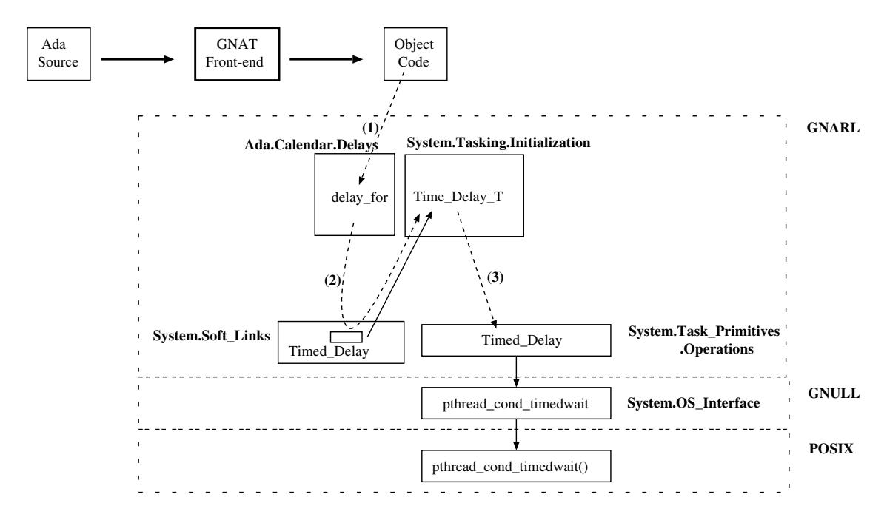
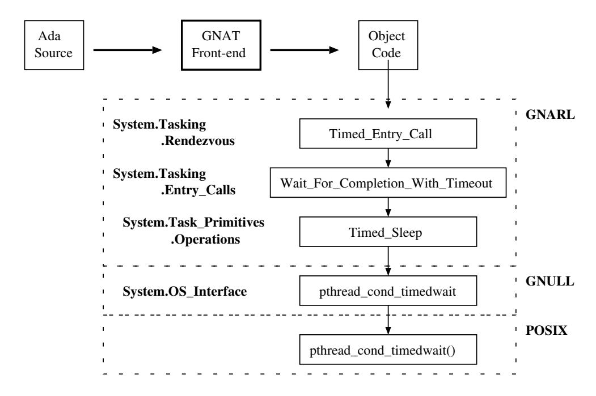
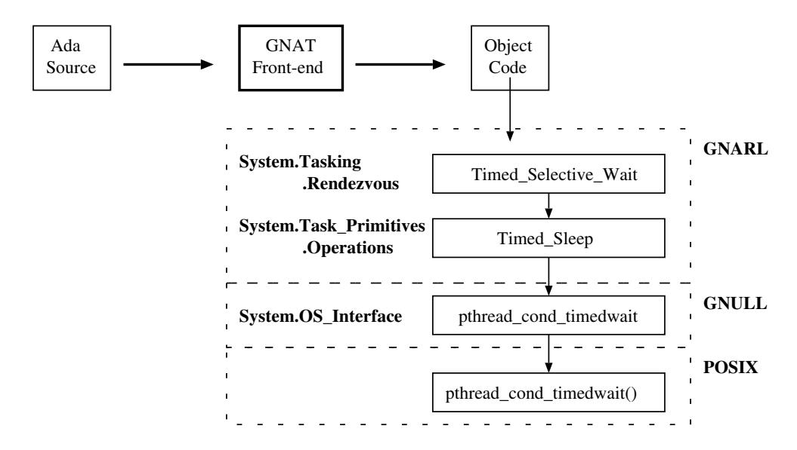

# **Chapter 17.** **Time and Clocks**

Tasks can delay their execution for a period of time, or until an absolute time is reached. In both cases this enables the task to be queued on some future event rather than busy-wait o calls to the clock function. Tasks can also issue timed entry-calls. If the call is not accepted before the expiration of the specified delay, the run-time must cancel the entry-call wake-up the calling task. In addition, the timed selective accept allows a server task to time-out if an entry call is not received within a certain period of time.

Ada gives access to the clock by providing two packages: `Calendar` and `Real_Time`. Calendar provides an abstraction for "wall clock" time that recognizes leap years, leap seconds and other adjustments; Real Time gives a second representation that defines a monotonic (that is, non-decreasing) regular clock. Although these representations map down to the same hardware clock, they cater for different application needs.

## **17.1** *Delay* **and** *Delay Until* **Statements**

The GNARL subprograms which implement these Ada statements are placed in child packages of the corresponding standard Ada packages: `Ada.Calendar.Delays` and `Ada.Real_Time.Delays`. The GNAT front-end expands a delay-statement into a call to the corresponding GNARL subprogram.

GNARL provides two implementations of the delay statements: one for the case of an Ada program without tasks and the other for an Ada program with tasks. A link is used to access the proper subprogram (`Timed_Delay`).

Figure 17.1: GNARL Subprograms for the Delay Statement.

In case of no tasking this link points to the GNARL procedure `Time_Delay_NT`, which calls the GNULL procedure `Timed_Delay` (cf. Figure 17.2).

Figure 17.2: GNARL Subprograms for the Delay Statement in an Ada Program without Tasks.

In case of a program with tasks this link points to the GNARL procedure `Timed_Delay_T`, which calls another version of the GNULL procedure `Timed_Delay` (cf Figure 17.3).

Figure 17.3: GNARL Subprograms for the Delay Statement in an Ada Program with Tasks.

## **17.2 Timed Entry Call**

The timed task entry call is handled by the GNAT compiler in a similar way to the simple mode entry call (described in section 10.2.1). The compiler generates a call to the GNARL subprogram `Timed_Task_Entry_Call`. Basically this procedure carries out the same actions described in the simple mode entry call (section 15.5.1). However, if the entry can not be immediately accepted, it does not simply block the caller; it calls another GNARL subprogram to arm a timer and block the caller until the timeout expires. Figure 17.4 shows the GNARL and GNULL subprograms involved in this action. If the entry call is accepted before this timer expires, the timer is un-armed; otherwise the entry call is removed from the queue.

The GNAT implementation of the timed protected entry call follows the same scheme described above. However, the only difference is that the compiler generates a call to the GNARL procedure `Timed_Protected_Entry_Call`.

Figure 17.4: GNARL Subprograms for Timed Entry Call.

## **17.3 Timed Selective Accept**

The timed task entry call is handled by the GNAT compiler in a similar way to the selective accept (described in section 15.4). The compiler generates a call to the GNARL subprogram `Timed_Selective_Wait`. Basically this procedure carries out the same actions described in case of the selective wait (section 15.5.9). However, if there is no entry call that can be immediately accepted, it does not simply block the caller; it calls another GNARL subprogram to program a timer and block the caller until this timeout expires. Figure 17.5 shows the GNARL and GNULL subprograms involved in this action. If some entry call is received before this timer expires, the timer is un-armed; otherwise the statements after the **`delay`** sentence are executed.

Figure 17.5: GNARL Subprograms for Timed Selective Accept.

## **17.4 Run-Time Subprograms**

### **17.4.1 GNARL.Timed Delay**

When the program has tasks, the GNARL procedure `Timed_Delay` performs the following actions.

1. Defer the abortion.
2. Lock the ATCB of the calling task.
3. If the specified delay is a relative time span (that is, a **`delay`** statement), this delay it is converted to absolute time span by adding the current value of the clock.
4. If the specified time is a future time then
   - Set the state of the calling task to `Delay_Sleep`.
   - Call the POSIX function *pthread cond timedwait* to suspend the calling tasks until the specified time.
   - Set the state of the calling task to `Runnable`.
5. Unlock the ATCB of the calling task.
6. Yield the processor (this ensures that *"a delay statement always corresponds to at least one task dispatching point"* [AAR95, Section D.2.2(18)].
7. Undefer the abortion.

## **17.5 Summary**

GNAT provides two implementations for the simple **`delay`** and **delay until** Ada sentences: one for the Ada programs without tasks, and another for the Ada programs with tasks. An access to a procedure is used to avoid multiple checks in the run-time to call the appropriate subprogram.

A timed entry call allows the task that executes it to make an entry call with the provision that it be awakened and the call canceled, if the call is not accepted before the expiration of a specified delay. As with the conditional entry call, provision is made for execution to resume in different places, depending on whether a rendezvous takes place. In addition to the processing required for a normal entry call, the timed entry call requires scheduling of a wake-up event if the call cannot be accepted immediately. If the call is accepted before this delay expires, the calling task must be removed from the delay queue. If the delay expires first, the task must be removed from the entry queue.

The GNAT implementation of the timed entry call sentences (to a protected entry or to a task entry) and the timed selective accept follow the same steps of the non-timed cases, though a timer is activated when the caller becomes blocked.
