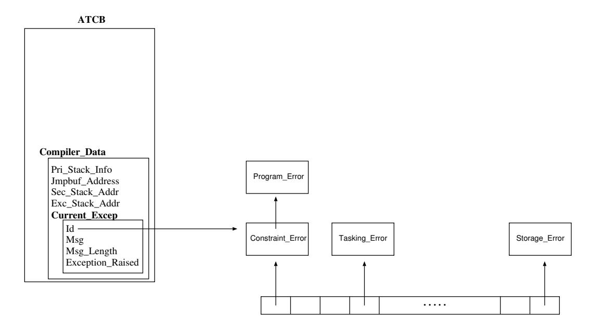

# Chapter 18. Exceptions

An exception represents a kind of exceptional situation; an occurrence of such a situation (at run-time) is called an `Exception_Occurrence`. When an exception occurrence is raised by the execution of a given construct, the rest of the execution of that construct is *abandoned* and the corresponding exception-handler is executed. If the construct had no exception-handler, then the exception occurrence is propagated. To *propagate* an exception occurrence is to raise it again in the innermost dynamically enclosing execution context [AAR95, Section 11-4]. If an exception occurrence is unhanded in a task body, the exception does not propagate further (because there is no dynamically enclosing execution). If the exception occurred during the activation of the task, then the activator would raise `Tasking_Error` [AAR95, Section 11-4]. There is a predefined library which provides additional facilities for exceptions (Ada.Exceptions).

## 18.1 Data Structures

### 18.1.1 Exception_Id

Each distinct exception is represented by a distinct value of type `Exception_Id`. The special value `Null_Id` does not represent any exception, and is the default initial value of the type `Exception_Id`. Each occurrence of an exception is represented by a value of the type `Exception_Occurrence`. Similarly, `Null_Occurrence` does not represent any exception_occurrence; it is the default initial value of type `Exception_Occurrence`.

The GNAT run-time implements the exception identifier as an access to a record (`Exception_Data_Ptr`). Figure 18.1 presents the fields of this record. The field `Not_Handled_By_Others` is used to differentiate the user-defined exception from the run-time internal exceptions (i.e. task abortion) which can not be handled by the user-defined exception handlers. The field `Lang` defines the language where the exception is declared (by default "Ada"). The next two fields are used to store the full name of the exception. This name is composed of a prefix (the full path of the scope where the exception is declared) and the exception name. The last field is used to create linked lists of exception identifiers (described in section 18.1.2).

| `Exception_Data`    | |
|-----------------------|--------------------|
| Not_Handled_By_Others | Boolean            |
| Lang                  | String (1 3)       |
| Name_Length           | Natural            |
| Full_Name             | String_Ptr         |
| HTable_Ptr            | Exception_Data_Ptr |

Figure 18.1: Exception Identifier Record

When an exception is raised, the corresponding exception occurrence is stored by the GNAT run-time in the `Compiler_Data` field of the ATCB. The data type of this field is a record; the `Current_Excep` field of this record saves the exception occurrence.

The `Exception_Raised` field is set to `True` to indicate that this exception occurrence has actually been raised. When an exception occurrence is first created, it is set to false; then, when it is later processed by the GNARL subprogram `Raise_Current_Exception`, it is set to `True`. This allows the run-time to distinguish if it is dealing with an exception re-raise.

### 18.1.2 The Exceptions Table

Because the visibility rules of Ada exceptions (an exception may not be visible, though handled by the **`others`** handler, re-raised and then again visible to some other calling scope) a global table must be used (`Exceptions_Table`). In order to handle the exceptions in an efficient way, the Ada run-time uses a hash table (cf. Figure 18.3).

Figure 18.2: Occurrence Identifier.

As the reader can see, an accesses table to the exception identifiers is used. A simple linked list of exception identifiers is used to handle collisions. The field `HTable_Ptr` is used to link the exception identifiers.

When an exception is raised in a task, the corresponding exception identifier must be found. Therefore the hash function is evaluated, and the resulting linked list is traversed to look for the exception identifier. Then its reference is stored in the ATCB of the task. This reference is kept in the ATCB until the exception is handled (though the exception may not be visible in some exception handlers).

## 18.2 Run-Time Subprograms

### 18.2.1 GNARL.Raise

Ada allows an exception to be raised in two different ways: (1) by means of the **`raise`** statement and (2) by means of the procedure `Ada.Exceptions.Raise_Exception` which allows the programmer to associate a message to the exception. In both cases, the compiler generates a call to a GNARL function which carries out the following actions:

1. To ll the ATCB exception occurrence.

Figure 18.3: Hash Table.

- 2. To defer the abortion.
- 3. If there is one exception handler installed, then jump to it.
- 4. Otherwise (no exception handler can be called) terminate the execution of the program.

## 18.3 Summary

In this chapter the basic concepts of the GNAT exception handling implementation has been presented. The exception ID is an access to a record where the full name of the exception is stored. The exception occurrence is stored in the ATCB. All the exceptions are stored in a hash table.
