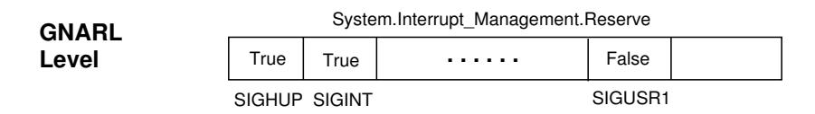
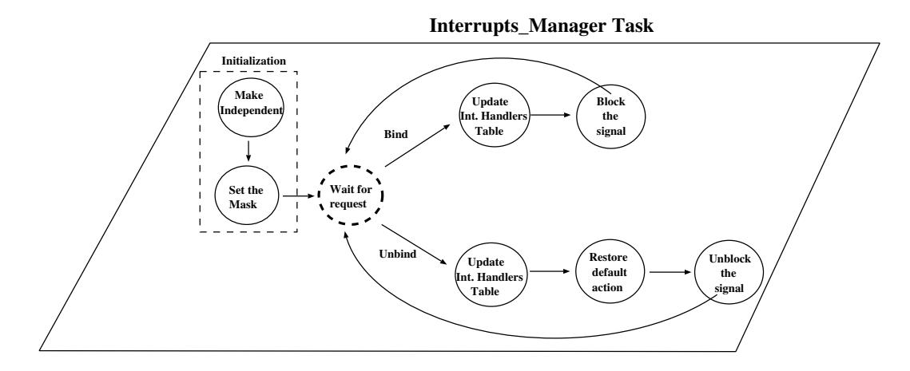
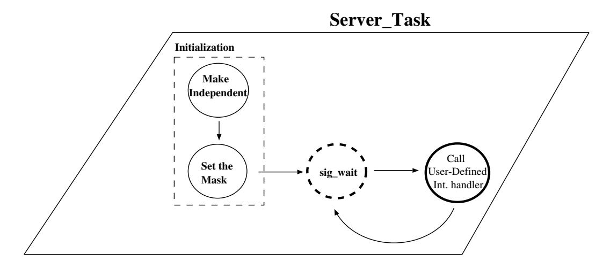

# **Chapter 19.** **Interrupts**

An interrupt represents a class of events that are detected by the hardware or system software. The occurrence of an interrupt consists of its generation and its delivery: the generation of an interrupt is the event in the underlying hardware or system which makes the interrupt available to the program; delivery is the action which invokes a part of the program (called the interrupt handler) in response to the interrupt occurrence. In between the generation of the interrupt and its delivery, the interrupt is said to be pending. The handler is invoked once for each delivery of the interrupt. While an interrupt is being handled, further interrupts from the same source are blocked; all future occurrences of the interrupt are prevented from being generated. It is usually device dependent as to whether a blocked interrupt remains pending or is lost.

Ada allows to associate an interrupt to a protected procedure or a task entry declared at library level. However, the association of a task entry is considered an obsolescent feature of the language [AAR95, Section J.7]. For this reason, in this chapter we will focus our attention on user-defined protected-procedure interrupt-handlers.

Certain interrupts are reserved. The programmer is not allowed to provide a handler for a reserved interrupt. Usually, a reserved interrupt is handled directly by the Ada run-time (for example, a clock interrupt used to implement the delay statement). Each non-reserved interrupt has a default handler that is assigned by the run-time system.

There are two two styles of interrupt-handler installation and removal: nested and non-nested. In the nested style, an interrupt handler in a given protected object is implicitly installed when the protected object comes into existence, and the treatment that had been in effect beforehand is implicitly restored when the protected object ceases to exist. In the non-nested style, interrupt handlers are installed explicitly by procedure calls, and handlers that are replaced are not restored except by explicit request [Coh96, Section 19.6.1].

The front-end identifies a handler to be installed in the nested style because it must have the pragma *Attach Handler* specifying the corresponding interrupt id. Dynamic allocation of protected objects gives greater flexibility. Allocating a protected object with an interrupt handler installs the handler associated with that object, and deallocating the protected object restores the handler previously in effect. Similarly, a handler to be installed in the non-nested style is identified by pragma *Interrupt Handler*. This pragma imposes a restriction on the object: it must be dynamically created [Coh96, Section 19.6.1]. Non-nested installation and removal of interrupt handlers relies on additional facilities of package *Ada.Interrupts* [AAR95, Section C.3(2)].

To foster a simple, efficient and multi-platform implementation, GNAT reuses the POSIX support for signals and adds the minimum set of run-time subprograms required to achieve the Ada semantics. This work is simplified because POSIX signals are delivered to individual threads in a multi-threaded process using much of the same semantics as for delivery to a single-threaded process [GB92, Section 5.1].

## **19.1 POSIX Signals**

A POSIX signal is a form of software interrupt which can be generated in several ways. A signal may be generated [DIBM96, Section 2]:

- By a hardware trap including division by zero, a floating-point overflow, a memory protection violation, a reference to a non-existent memory location or an attempt to execute an illegal instruction.
- Because a clock reaches a specified time, or a specified span of time has elapsed.
- By an asynchronous operation. Asynchronous input and output operations generate a signal when an operation completes, or if an operation fails.
- Because the user hits certain keys on the terminal that is controlling the process. Certain keys sequences allow the user to suspend, resume and terminate the execution of a process via signals.

By a POSIX thread. POSIX threads may send a signal to another POSIX thread in the same process to notify it of an event, by calling *pthread kill*.

Each POSIX thread has a signal mask: when a signal is generated for a thread and the thread has the signal masked, the signal remains pending until the thread unmasks it; the interface for manipulating the thread signal mask is *pthread sigmask*. Only one pending instance of a masked signal is required to be retained; that is, if a signal is generated *N* times while it is masked the number of signal instances that are delivered to the thread when it finally unmasks the signal may be any number between 1 and N.

Each POSIX signal is associated with some *action*. The action may be to ignore the signal, terminate the process, continue the process, or execute a call to user-defined handler function (asynchronously and preemptively with respect to normal execution of the process). POSIX.1 species a default action for each signal. For most signals the application may override the default action by calling the function *sigaction*. The use of asynchronous handler procedures for signals is not recommended for POSIX threads, because the POSIX thread synchronization operations are not safe to be called within an asynchronous signal handler; instead, POSIX.1c recommends use of the *pthread sigwait* function, which "accepts" one of a specified set of masked signals.

### **19.1.1 Reserved Signals**

The definitions of "reserved" differs slightly between the ARM and POSIX. ARM species [AAR95, Section C.3(1)]:

*The set of reserved interrupts is implementation defined. A reserved interrupt is either an interrupt for which user-defined handlers are not supported, or one which already has an attached handler by some other implementationdefined means. Program unit can be connected to non-reserved interrupts.*

POSIX.5b/.5c species further [s-intman.adb]:

*Signals which the application cannot accept, and for which the application cannot modify the signal action or masking, because the signals are reserved for use by the Ada language implementation. The reserved signals defined by this standard are:*

- *Signal_Abort*
- *Signal_Alarm*
- *Signal_Floating_Point_Error*
- *Signal_Illegal_Instruction*
- *Signal_Segmentation_Violation*
- *Signal_Bus_Error*

*If the implementation supports any signals besides those defined by this standard, the implementation may also reserve some of those.*

The signals defined by POSIX.5b/5c that are not specified as being reserved are SIGHUP, SIGINT, SIGPIPE, SIGQUIT, SIGTERM, SIGUSR1, SIGUSR2, SIGCHLD, SIGCONT, SIGSTOP, SIGTSTP, SIGTTIN, SIGTTOU, SIGIO, SIG-URG and all the real-time signals.

The GNAT FSU Linux implementation handles 32 signals. In this case the reserved signals are:

| Number | Name      | REASON     | Description                         |
|--------|-----------|------------|-------------------------------------|
| 2      | * SIGINT  | GNAT       | Abort (used for CTRL-C)             |
| 4      | * SIGILL  | POSIX (HW) | Illegal Instruction      |
| 5      | * SIGTRAP | GNAT       | Trace trap                          |
| 6      | * SIGABRT | GNAT       | Tasks abortion                      |
| 7      | * SIGBUS  | POSIX (HW) | Bus error                |
| 8      | * SIGFPE  | POSIX (HW) | Floating Point Exception |
| 9      | SIGKILL   | POSIX      | Abort (kill)                        |
| 11     | * SIGSEGV | POSIX (HW) | Segmentation Violation   |
| 14     | SIGALRM   | POSIX      | Alarm Clock                         |
| 19     | SIGSTOP   |            | Stop                                |
| 20     | * SIGTSTP | GNAT       | User stop requested from tty        |
| 21     | * SIGTTIN | GNAT       | Background tty read attempted       |
| 22     | * SIGTTOU | GNAT       | Background tty write attempted      |
| 26     | SIGVTALRM |            | Virtual timer expired               |
| 27     | * SIGPROF | GNAT       | Profiling timer expired             |
| 31     | SIGUNUSED |            | Unused signal                       |

Signals marked with \* are not allowed to be masked by the GNAT Run-Time. SIGINT can not be masked because it is used to terminate the Ada program when the CTRL-C sequence is pressed in the terminal that is controlling the process. By keeping SIGINT reserved, the programmer allows the user to do Ctrl-C but, in the same way, disable the ability of handling this signal in the Ada program.

GNAT Pragma *Unreserve\_All\_Interrupts* [Cor04] gives the programmer the ability to change this behavior. SIGILL, SIGFPE and SIGSEV can not be masked because they are used by the CPU to notify errors to the run-time. SIGTRAP is used by GNAT to enable debugging on multi-threaded applications. SIGABRT can not be masked because it is used by GNAT to implement the tasks abortion (described in chapter 20). SIGTTIN, SIGTTOU and SIGTSTP are not allowed to be masked so that background processes and IO behaves as normal C applications. Finally, SIGPROF can not be masked to avoid confusing the profiler.

## 19.2 Data Structures

No matter the association style used, GNARL always uses the following tables indexed by the *Interrupt JD* to handle interrupts.

Figure 19.1: Reserved Interrupts Table.

- *Table of Reserved Signals*: Booleans constant table1 used to register reserved interrupts.

- *User-defined Interrupt Handlers Table*: Table used to register and unregister the reference to *User-Defined Interrupt-Procedures* (UDIP) during the life of the program. Each element of this table is a record with two fields: the access to the UDIP and a flag which remembers the association style (nested or non-nested).

Figure 19.2: Table of User-Defined Interrupt-Handlers.

Figure 19.2 represents one protected procedure attached to signal SIGUSR1 in nested style (static style). The GNAT compiler associates two subprograms P and N to each protected subprogram (described in section 11.2.2). As the reader can see, the run-time links the signal with the P subprogram: the reference to the P subprogram is stored in the corresponding field of the table, and the *Static* field is set to *True* to remember that it is a nested style association.

1In the GNARL sources it is declared as variable just to be able to initialize it in the package body to aid portability.

### **19.2.1 Interrupts Manager: Basic Approach**

The GNAT run-time uses one *Interrupts Manager* task to serialize the execution of subprograms involved in the management of signals: attachment, detachment, replacement, etc. Figure 19.3 presents a simplified version of the automaton implemented by the Interrupt Manager. For simplicity we have considered only two basic operations: *Binding* and *Unbinding* User-Defined Interrrupt Procedures (UDIP) to interrupts.

First the automaton calls GNARL subprogram *Make Independent* to do the *Interrupt Manager Task* independent of its masters. GNARL Independent tasks are associated with master 0, and their ATCBs are not registered in *All Tasks List* (described in section 14.1); thus they last until the end of the program. After the signal mask is set, the automaton goes to one state in which it waits for the next signal management operation.

- In case of signal *Binding*, GNARL saves the reference to the UDIP in its table, and blocks the POSIX signal (this allows GNARL to catch the signal with the *sigwait* POSIX service).
- In case of signal *Unbinding*, the reference to the UDIP is removed from the
table, the POSIX default action is set, and the signal is unblocked.

Figure 19.3: Basic Automaton Implemented by the *Interrupts Manager*.

### **19.2.2 Server Tasks: Basic Approach**

The Ada run-time must provide a thread to execute the UDIP. There is a choice between dedicating one server task for all signals and providing a server task for each signal. The former approach looks attractive, since it saves run-time space, but it blocks other signals during the protected procedure call. This may result in delayed or lost signals. For this reason, GNARL provides a separate *Server Task* for each signal [DIBM96].

Instead of create/abort *Server Tasks* when the user-defined interrupt handlers are attached/detached, GNARL keeps them alive until the program terminates. Thus they are reused by all UDIPs associated with the same interrupt during the life of the program. The run-time has a *Server ID Table* which saves *Server Tasks* references (cf. Figure 19.4).

Figure 19.5 presents a simplified version of the Server Tasks Automaton.

### **19.2.3 Interrupt-Manager and Server-Tasks Integration**

Figure 19.4: Server Tasks Signal Handling.

Previous sections have been concerned with the basic functionality of the *Interrupt Manager Task* and the *Server Tasks*. However, the GNARL implementation is a little more complex because:

1. Ada nested style of interrupts implies that UDIPs are dynamically attached and detached to signals in the elaboration and finalization of protected objects. Therefore:
   - If no UDIP is registered GNARL must take the default POSIX action, and the simplified implementation of the *Interrupt Manager* did not consider POSIX default actions (cf. Figure 19.5).
   - When one UDIP is registered the signal is programmed to be handled by the UDIP. Following UDIPs registered to the same signal replace previous UDIPs.
   - If all UDIPs are detached, GNARL must again take the default POSIX action. The previous implementation can not achieve this effect so long as the *Server Task* is sitting on the *sigwait*. Even if the POSIX
   *sigaction* command is used to set the asynchronous signal action to the default, that action will not be taken unless the signal is unmasked, and GNARL can not unmask the signal while the *Server Task* is blocked on *sigwait* because in POSIX.1c the effect is undefined. Therefore, GNARL must wake up the *Server Task* and cause it to wait on some operation instead for which it is safe to leave the signal unmasked, so that the default action can be taken [DIBM96].

2. GNARL must protect data structures shared by the *Interrupts Manager Task* and the *Server Tasks*. Therefore, some locks must be added.

Figure 19.5: Basic Automaton Implemented by the Server Tasks.

The second requirement (*locks*) is easy to solve by means of POSIX mutexes. However, the first requirement is more complex. So let's focus our attention on the GNARL solution of the first requirement.

In order to better understand the GNARL implementation, we need to simplify the *Server Tasks Automaton* to its main states:

- *State 1*: The *Server Task* provides the POSIX default behavior of the signal.
- *State 2*: The *Server Task* has been programmed to call one UDIP.

In order to notify the automaton that it must jump from *State 1* to *State 2* GNARL uses one POSIX *Condition Variable*; in order to force the automaton to jump from *State 2* (waiting in the POSIX *sigwait* operation) to *State 1* the POSIX

signal SIGABORT is used (this signal is used to kill the POSIX thread, and thus forces the *Server Task* to return from the POSIX *sigwait* operation). Figure 19.7 presents this automaton.

Figure 19.6: Simplified Server Tasks Automaton.

If we add these new transitions to our basic *Task Server Automaton* (cf. Figure 19.5) we have the real automaton implemented in GNARL (cf. Figure 19.7). In order to help the reading of the automaton all the states have been numbered. Inside dotted rectangles we find the states associated with the simplified states of the previous example (*State\_I* and *State\_2*).

Figure 19.7: Server Tasks Automaton.

After the initializations (states numbered 1 to 3), the automaton verifies if any UDIP has been registered by the *Interrupt Manager* (state 4). Initially, because no

UDIP has been registered, it takes the POSIX default action (state 9) and waits in the *Condition Variable* (*cond wait*, state 10) until some UDIP is registered by the *Interrupt Manager*.

When any UDIP is registered, the *Interrupt Manager* signals the *Condition Variable* and the *Server Task Automaton* jumps to state 4, checks if some UDIP has been registered (now this evaluates to *True*) and jumps to state 5 to wait for the next signal occurrence. When the signal is received, it again checks if the UDIP is still registered (state 6), because it may have been removed by the *Interrupt Manager* while the automaton was waiting for the signal. Then it calls the UDIP (state 7) and again jumps to state 4.

While the *Server Task* is in state 5 waiting for the signal occurrence, it may happen that all UDIPs have been removed the *Interrupt Manager*. In this case the *Interrupt Manager* sends the SIGABRT signal to the *Server Task* to force it to jump to state 9. This signal wakes up the *Server Task Automaton*, which jumps to state 8 to reply to the *Interrupt Manager* with the same signal to inform it is not in state 5 (waiting for the signal). After this notification the automaton jumps to state 4 and, because no UDIP is found, it jumps to state 9.

## **19.3 Run-Time Subprograms**

### **19.3.1 GNARL.Install_Handlers**

In the nested style the expander generates a call to *Install_Handlers* in the initialization procedure of the protected object. This subprogram saves the previous handlers in one additional field of the object (*Previous Handlers*) and installs the new handlers.

### **19.3.2 GNARL.Attach_Handlers**

In the non-nested style, nothing special needs to be done since the default handlers will be restored as part of task completion which is done just before global finalization.

In order to verify at run-time that all the non-nested style interrupt procedures have been annotated with pragma *Interrupt Handler* ([AAR95, Section C.3.2] requirement) the compiler adds calls to the GNARL subprogram *Register Interrupt Handler* to register these interrupt procedures in a GNARL single-linked list. The *Head* and *Tail* of this list are stored in two GNARL variables (*Registered\_Handler\_Head* and *System.Interrupts.Registered\_Handler\_Tail*, cf. Figure 19.8). Every node keeps the address of one protected procedure associated with an interrupt in nonnested style. For simplicity, a single access to a protected procedure has been represented; however, each node has the access to its corresponding *P* subprogram. Before the attachment of one non-nested style interrupt handler to one signal, GNARL traverses this list to verify that the protected procedure is registered in the list; otherwise it raises the exception *Program\_Error*.

Figure 19.8: List of Interrupt Handlers in Non-Nested Style.

## 19.4 Summary

In this chapter we have dealt with the main aspects related to Interrupts Management. Although Ada allows us to attach a task entry to an interrupt, nowadays this is considered an obsolescent feature of the language. Thus, we have only discussed the attachment of User-Defined Protected-Procedures to interrupts. The main features of the GNAT implementation are:

- GNARL associates Ada interrupts to POSIX signals.

- Each signal has a *Task Wrapper* responsible for the execution of the User-Defined Protected-Procedures.

- The protected subprogram *P* associated with the protected subprogram is attached by GNARL to the corresponding *Task Wrapper*.

- Ada provides two ways to attach a protected procedure to an Ada interruption: nested style (by means of the pragma *Attach Handler*) and non-nested style (by means of the pragma *Interrupt Handler*).
  - **–** When the nested style is used, GNARL adds one field to the run-time information of the protected object to save and restore the previous handler.
  - **–** When the non-nested style is used, a dynamic link list is used to register non-nested style UDIPs. This list allows GNARL to verify that only non-nested UDIPs have been marked with the right pragma.
- An *Interrupt Manager Task* is used to serialize all the signal-management operations.
