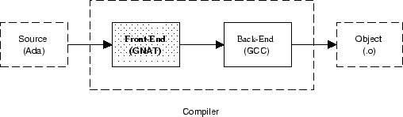

# Частина перша: Вступ

## Розділ 1. Проект GNAT

GNAT - це абревіатура від GNU Ada Translator; це система інтерфейсу і
часу виконання для Ada 95, яка використовує внутрішню частину GCC як
генератор коду з можливістю перенастроювання, і розповсюджується згідно
з настановами Фонду вільного програмного забезпечення. GNAT спочатку
розроблявся двома командами, які співпрацювали між собою:

- Команда Нью-Йоркського університету. Ця група під керівництвом
  професора Роберта Б.К. Дьюара та Едмонда Шонберга відповідала за
  розробку інтерфейсу компілятора.

- Команда Університету штату Флорида. Цю групу, також відому як POSIX
  Ada Real-Time Team, очолював професор Теодор П. Бейкер (Theodore P.
  Baker), і вона відповідала за першу розробку паралельних компонентів
  бібліотеки часу виконання.

З 1991 по 1994 рік проект NYU спонсорувався урядом США. У серпні 1994
року члени команди NYU створили компанію Ada Core Technologies, Inc.,
яка надає технічну підтримку промисловим користувачам GNAT і перетворила
GNAT на повнофункціональний компілятор промислового рівня: GNAT Pro.
Цей компілятор включає в себе сучасний інструментарій та середовище для
розробки програмного забезпечення на основі Ada (наприклад, GPS).
Сьогодні Ada Core продовжує інвестувати ресурси для перенесення GNAT на
нові архітектури та операційні системи, а також бере активну участь у
розробці нової версії Ada (Ada 2005). Ada Core періодично випускає
загальнодоступні версії компілятора для широкої спільноти користувачів
Ada.

У цьому розділі представлено основні компоненти GNAT. Він має наступну
структуру: У підрозділі 1.1 коротко описано GCC; у підрозділі 1.2
представлено основні компоненти компілятора GNAT. Нарешті, у підрозділі 1.3
наведено огляд моделі компіляції GNAT.

### 1.1 GCC

GCC \[Sta04\] - система компіляції середовища GNU. GNU (самодостатня
абревіатура \"GNU не є Unix\") - це Unix-сумісна операційна система, яку
розробляє Фонд вільного програмного забезпечення і поширює на умовах
Публічної ліцензії GNU (GPL). Програмне забезпечення GNU завжди
поширюється разом з його вихідним кодом, і GPL вимагає від кожного, хто
модифікує програмне забезпечення GNU і поширює модифікований продукт,
також надавати вихідний код цих модифікацій. Таким чином, вдосконалення
оригінального програмного забезпечення приносять користь спільноті
розробників програмного забезпечення в цілому.

GCC є центральним елементом програмного забезпечення GNU. Це система
компіляторів з багатьма фронтендами і великою кількістю апаратних цілей.
Спочатку розроблена як компілятор для мови C, зараз вона включає
фронтенди для C++, Objective-C, Ada, Fortran, Java і treelang. З
технічної точки зору, найважливішою перевагою GCC є його здебільшого
незалежний від мови та цілі генератор коду, який створює код чудової
якості як для CISC, так і для RISC комп\'ютерів. Прикметно, що машинні
залежності генератора коду становлять менше 10% від загального обсягу
коду. Щоб додати нову ціль до GCC, необхідно алгебраїчно описати кожну
машинну інструкцію за допомогою мови переведення регістрів (RTL). Більша
частина генерації та оптимізації коду потім використовує RTL, яку GCC
при необхідності перетворює на цільову машинну мову. Крім того, GCC
створює високоякісний код, який можна порівняти з кодом найкращих
комерційних компіляторів.

### 1.2 Компілятор GNAT

Перше рішення стосувалося вибору мови, якою має бути написаний
компілятор GNAT. GCC повністю написаний на C, але з технічних причин, а
також нетехнічних, було немислимо використовувати для самого GNAT щось
інше, окрім Ada. Насправді, визначення мови Ada сильно залежить від
ієрархічних бібліотек і не може бути надане інакше, ніж в Ada 95, так що
для компілятора і оточення є природним використовувати дочірні одиниці
всюди.

Команда GNAT почала використовувати відносно невелику підмножину Ada83
і, як завжди, розширювала цю підмножину, коли з\'являлися нові
можливості. Через шість місяців після початку серйозного кодування вони
змогли перейти на GNAT і відмовитися від комерційного
компілятора, яким користувалися до цього моменту.

Як тільки було реалізовано більше можливостей Ada95, вони змогли
написати GNAT на Ada95.

Компілятор GNAT складається з двох основних частин: фронтенду та
бекенду (див. Рисунок 1.1). Фронтенд написан на мові Ada
95, а бекенд є бекендом GCC, розширеним для задоволення
потреб семантики Ada (наприклад, підтримка винятків).

Рисунок 1.1: Компілятор GNAT.

Інтерфейс складається з п\'яти етапів (див. Рисунок 1.2): Лексичний
аналіз (сканування), синтаксичний аналіз (синтаксичний розбір),
семантичний аналіз, розширення та фаза GIGI.

Сканер аналізує введені символи і генерує відповідні токени.

Синтаксичний аналізатор перевіряє синтаксис токенів і створює абстрактне
синтаксичне дерево (АСТ). Семантичний аналізатор виконує всі статичні
перевірки легальності програми та прикрашає АСТ семантичними атрибутами.
Експандер перетворює високорівневі вузли АСТ (вузли, що представляють
завдання, захищені об\'єкти тощо) в еквівалентні фрагменти АСТ,
побудовані з більш низькорівневих вузлів абстракції і, якщо потрібно,
викликів процедур бібліотеки Ada Run-Time. Оскільки генерація коду
вимагає, щоб такі фрагменти містили всі семантичні атрибути, кожна
операція розширення повинна супроводжуватися додатковою семантичною
обробкою згенерованого дерева (див. стрілку у зворотному напрямку від
розширювача до семантичного аналізатора). Наприкінці цього процесу фаза
GIGI перетворює AST на дерево, яке зчитується внутрішньою частиною GCC
(фаза перетворення GNAT на GNU). Ця фаза насправді є інтерфейсом між
інтерфейсом GNAT і внутрішнім інтерфейсом GCC. Для подолання
семантичного розриву між мовами Ada і Сі було розширено декілька
процедур генерації коду GCC, а також додано інші, так що тягар перекладу
також бере на себе GIGI і GCC, коли незручно або неефективно виконувати
розширення у зовнішньому інтерфейсі. Наприклад, є дії з генерації коду
для винятків, варіаційних частин і доступу до необмежених типів. Згідно
з політикою GCC, генератор коду розширюється лише тоді, коли розширення
може бути корисним для більш ніж однієї мови.

Рисунок 1.2: Фази початкового етапу GNAT.

Всі ці фази взаємодіють за допомогою компактного абстрактного
синтаксичного дерева (АСТ). Деталі реалізації АСТ приховані кількома
процедурними інтерфейсами, які надають доступ до синтаксичних та
семантичних атрибутів. Варто зазначити, що строго кажучи, GNAT не
використовує таблицю символів. Вся семантична інформація, що стосується
програмних об\'єктів, зберігається у визначенні входжень цих об\'єктів
безпосередньо в AST.

Існує ще один незвичний рекурсивний аспект у структурі GNAT. Бібліотека
програм (описана у наступному розділі) не містить жодного проміжного
представлення скомпільованих модулів. В результаті, якщо розширювач
генерує виклик процедури бібліотеки часу виконання, компілятор вимагає,
щоб специфікація відповідного пакета часу виконання також була
проаналізована (див. стрілку назад від розширювача до синтаксичного
аналізатора).

### 1.3 Модель компіляції

Поняття програмної бібліотеки є одним з фундаментальних внесків Ada в
інженерію програмного забезпечення. Бібліотека гарантує збереження типів
при компіляції та запобігає створенню непослідовних систем, виключаючи
застарілі модулі. У більшості компіляторів Ada бібліотека є складною
структурою, яка містить проміжні представлення скомпільованих одиниць,
інформацію про залежності між скомпільованими одиницями, таблиці
символів тощо. У GNAT обрано інший підхід: окремі файли, з яких
складається програма, компілюються окремо, і кожна компіляція створює
відповідний об\'єктний файл. Ці об\'єктні файли потім зв\'язуються між
собою, визначаючи список об\'єктних файлів у програмі. Таким чином,
бібліотека Ada складається з набору таких об\'єктних файлів
(бібліотечного файлу як такого не існує). У наступних розділах ми
коротко представимо обидві альтернативи.

#### 1.3.1 Традиційна модель компіляції

У традиційній моделі бібліотека Ada - це структура даних, яка збирає
результати набору компіляцій вихідних файлів Ada. Компіляція виконується
в контексті такої бібліотеки, а інформація в бібліотеці використовується
для забезпечення узгодженості типів між окремо скомпільованими модулями.
На відміну від деяких інших мовних середовищ, вся така перевірка типів
виконується під час компіляції, і Ada гарантує на мовному рівні, що
окремо скомпільовані модулі повної програми на Ada є узгодженими за
типами.

У цій моделі створення програми на Ada складається з вибору головної
програми (процедури без параметрів, скомпільованої в бібліотеці Ada) та
всіх модулів, від яких залежить ця головна програма, і зв\'язування їх в
єдину виконувану програму. Певний порядок компіляції задається
семантикою мови і реалізується засобами бібліотеки Ada. По суті, перед
тим, як компілювати блок компіляції, спочатку має бути скомпільовано
специфікацію всіх блоків, від яких він залежить. Це дає компілятору Ada
достатню свободу у виборі порядку компіляції. Важливим наслідком цієї
моделі є поняття застарілого модуля. Якщо модуль перекомпілюється, то
модулі, які від нього залежать, стають застарілими, і їх потрібно
перекомпілювати. Знову ж таки, бібліотека Ada є структурою даних, що
використовується для реалізації цієї вимоги.

У довідковому посібнику з Ada \[AAR95, глава 10\] є спеціальні посилання
на файл бібліотеки, і це часто сприймається як те, що бібліотеку Ada
слід представляти за допомогою файлу у звичайному розумінні. Більшість
систем Ada дійсно реалізують бібліотеку Ada у такий спосіб. Однак,
загальновизнано, що Довідник з Ada не вимагає такого підходу до
реалізації. З цієї точки зору, бібліотека Ada є концептуальною сутністю,
яка може бути реалізована у будь-який спосіб, що підтримує необхідну
семантику. Насправді монолітний бібліотечний підхід погано пристосований
до багатомовних систем і є причиною деяких незручностей при
інтерфейсуванні Ada з іншими мовами.

#### 1.3.2 Модель компіляції GNAT

У GNAT обрано зовсім інший підхід: вихідні коди компілюються незалежно
для створення набору об\'єктів, а створений таким чином набір об\'єктних
файлів подається до біндера/лінкера для генерації результуючого
виконуваного файлу (див. Рисунок 1.3).

Такий підхід усуває всі міркування щодо порядку компіляції та виключає
традиційну монолітну структуру бібліотеки. Сама бібліотека є неявною, а
об\'єктні файли залежать лише від джерел, з яких їх скомпільовано, а не
від інших об\'єктів.

Немає проміжних представлень скомпільованих модулів, тому оголошення
модулів, що з\'являються у контекстних операторах даної компіляції,
завжди аналізуються заново. Інформація про залежності зберігається
безпосередньо у об\'єктних файлах (фактично, вона зберігається у
невеликому окремому файлі, концептуально пов\'язаному з об\'єктним
файлом), і становить кілька сотень байт на модуль.

Рисунок 1.3: Загальна структура GNAT.

Враховуючи швидкість роботи інтерфейсу GNAT, цей підхід є не менш
ефективним, ніж звичайний бібліотечний механізм, і має наступні переваги
перед ним:

1\. Компіляція модуля Ada ідентична компіляції модуля або файлу іншою
мовою: результатом компіляції одного вихідного коду є один об\'єктний
файл.

2\. те, що вбудовування завжди виконується з джерела, немає вимоги, щоб
об\'єкти, які вбудовуються, були попередньо скомпільовані. Можна навіть
вбудовувати функції, визначені у двох тілах, не боячись зациклення.
Таким чином, інлайнінг працює набагато гнучкіше, ніж у звичайних
компіляторах Ada.

3\. Стандартні системні утиліти для копіювання, перейменування та
видалення файлів можна повторно використовувати для копіювання,
перейменування та видалення об\'єктних модулів.

4\. Оскільки GNAT використовує ту саму модель компіляції, що й інші
мови, набагато легше створювати програми, в яких різні частини програми
написані різними мовами. Крім того, GCC дотримується загальносистемних
стандартних домовленостей щодо послідовностей виклику, форматів
об\'єктних модулів, включаючи налагоджувальну інформацію, і макетів
структур даних, тому також легко інтегрувати Аду з будь-якою мовою, що
підтримується GCC. GNAT навіть дозволяє писати багатомовні програми,
основна програма яких не написана на Аді.

5\. Вона більш сумісна зі звичайними інструментами керування
конфігурацією, ніж звичайна бібліотечна структура (інструменти
варіюються від простої програми UNIX make до складних середовищ
керування компіляцією).

У моделі GNAT вихідний файл містить одну одиницю компіляції, а
компіляція представляється у вигляді серії вихідних файлів, кожен з яких
містить одну одиницю компіляції. Крім того, існує пряме відображення
назв блоків у назви файлів, так що за назвою блоку завжди можна
визначити назву файлу, який містить вихідні дані для цього блоку. За
замовчуванням прийнято наступну угоду щодо іменування файлів: (1) Ім\'я
файлу - це розширене ім\'я модуля, з крапками, заміненими на знак мінус,
(2) Розширення \".ads\" використовується для специфікацій, а розширення
\".adb\" - для тіл. Тільки тіло створює об\'єктний файл, тому той факт,
що специфікація і тіло мають однакове ім\'я файлу, не викликає
труднощів. Об\'єктний файл концептуально містить інформацію про
бібліотеку Ada для даного джерела (розширення \".ali\"), найважливішим
компонентом якої є запис міток часу блоків компіляції, від яких залежить
скомпільований блок.

У цій моделі для компіляції вихідного файлу можуть знадобитися інші
вихідні файли. До них відносяться

1\. Відповідна специфікація для кузова.

2\. Батьківська специфікація специфікації дочірньої бібліотеки.

3\. Технічні характеристики встановлених блоків.

4\. Батьківський орган для підрозділу.

5\. інфільтрованих підпрограм.

6\. інстанційованих генериків.

Ключове розуміння полягає у тому, що у GNAT залежності встановлюються не
від однієї одиниці компіляції до іншої, а від об\'єктних файлів до
відповідних вихідних файлів. У цьому контексті GNAT переосмислює правила
\"порядку компіляції\" Ada як правила \"залежності від вихідних
файлів\". Правила щодо компіляцій, які є застарілими для інших
компіляцій, також переінтерпретовано. Наприклад, правило, яке говорить:
Тіло пакунка не може бути скомпільовано, доки не буде скомпільовано його
специфікацію, переінтерпретовано на таке: \"Тіло пакунка не може бути
скомпільовано: Тіло пакунка не може бути скомпільовано, доки не буде
доступне джерело його специфікації. Цікавим наслідком такого підходу є
те, що якщо всі вихідні тексти програми доступні, то фактично немає
жодних обмежень на порядок компіляції. Ця особливість полегшує
паралельну компіляцію програм на Ada.

Основним аргументом проти моделі GNAT є те, що компілятор постійно
перекомпілює специфікацію з\'єднаних модулів. Однак альтернатива не є
кращою. У традиційних системах, заснованих на бібліотеках Ada,
результатом компіляції є розміщення інформації, як правило, деякого
проміжного дерева, у бібліотеці. Наступний оператор with потім отримує
це дерево з бібліотеки. На практиці, інформація цього дерева може бути
величезною, часто набагато більшою, ніж джерело. Крім того, це, як
правило, складна взаємопов\'язана структура даних. Таким чином, не
зрозуміло, чому перечитування і перекомпіляція вихідного коду є менш
ефективним, ніж запис і читання назад у ці дерева. Це правда, що
перекомпіляція означає повторну перевірку синтаксису та семантики, але
це призводить до меншого введення/виведення, ніж читання та запис
зв\'язаних структур. Навпаки, модель GNAT дає всі переваги, про які
йшлося вище.

#### Зв\'язка

Ada встановлює правила, які визначають допустимі порядки розробки
\[AAR95, розділ 10.2\]. Також можливо побудувати програми, для яких не
існує жодного допустимого порядку розробки. Такі програми є незаконними
і повинні бути діагностовані перед виконанням. Оскільки ця робота не
може бути налагоджена, поки не будуть доступні всі об\'єктні файли, GNAT
потребує спеціального попереднього зв\'язувача (біндера), який
встановлює правильну послідовність викликів процедур ініціалізації для
специфікацій та тіл (див. рисунок 1.3).

Частина обробки у зв\'язувачі GNAT перевіряє узгодженість програми,
переглядаючи мітки часу у файлах ALI, пов\'язаних з одиницями
компіляції, необхідними для програми. Перевірка узгодженості може
виконуватися у одному з трьох режимів:

1\. Тільки з файлів ALI.

2\. З файлів ALI та будь-яких відповідних джерел, які можна знайти.

3\. З файлів ALI та всіх відповідних джерел, які повинні бути доступні.

Незважаючи на очевидні переваги роботи у режимі \"вихідних файлів\"
(друга і третя альтернативи), для GNAT-зв\'язувача корисніше працювати у
режимі \"лише файли ali\". Цей режим не лише швидший, оскільки не
потрібно звертатися до вихідних файлів, але, що важливіше, це означає,
що GNAT-програми можна компонувати з об\'єктів, навіть якщо їхні вихідні
тексти недоступні. Це незамінне при компонуванні бібліотек, які з
міркувань пропрієтарності можуть розповсюджуватися без вихідних текстів
їхніх об\'єктів.

Тому саме цей режим реалізовано у GNAT Binder.

### 1.4 Підсумок

У цьому вступному розділі представлено загальну структуру проекту GNAT.

Компілятор складається з двох основних частин: інтерфейсу та серверної
частини. Інтерфейсна частина складається з п\'яти фаз, які взаємодіють
за допомогою абстрактного синтаксичного дерева. Внутрішня частина - це
незалежний від цілей GCC генератор коду, що дає дві основні переваги:
портативність і відмінну якість генерації коду.

Найбільш новим аспектом архітектури GNAT є організація бібліотеки на
основі вихідних текстів. У більшості компіляторів Ada бібліотека є
монолітною складною структурою, яка містить проміжні представлення
скомпільованих модулів. Модель бібліотеки GNAT відповідає традиційній
моделі, яку використовували майже всі мови протягом всієї історії мов
програмування: немає централізованої бібліотеки, вихідний файл містить
єдину одиницю компіляції, а компіляція специфікує вихідний файл і
генерує єдиний об\'єктний файл. Ця модель повністю відповідає прописаній
семантиці, наведеній у довіднику з Ada, і в той же час дозволяє
використовувати багато відомих засобів керування конфігурацією
(наприклад, UNIX make), спрощує побудову багатомовних програм, а також
дозволяє паралельну компіляцію програм на мові Ada. Оскільки мова Ada
задає правила, які регулюють порядок розробки одиниць компіляції, модель
GNAT потребує спеціального попереднього зв\'язувача (біндера), який
перевіряє об\'єктні файли і генерує правильний порядок розробки.

## Розділ 2. Огляд архітектури інтерфейсу

Інтерфейс GNAT складається з чотирьох фаз, які взаємодіють за допомогою
компактного дерева абстрактного синтаксису (AST): лексичний аналіз,
синтаксичний аналіз, семантичний аналіз і розширення. У цій главі
наведено огляд архітектури цих фаз. Він побудований наступним чином: У
підрозділі 2.1 представлено архітектуру сканера; у підрозділі 2.2 подано
огляд синтаксичного аналізатора, описано високорівневу специфікацію
вузлів АСТ та механізми, що використовуються для його ресинхронізації у
випадку синтаксичних помилок; у підрозділі 2.3 описано архітектуру
семантичного аналізатора, і, нарешті, у підрозділі 2.4 обговорено
архітектуру розширювача.

### 2.1 Сканер

З міркувань ефективності для створення GNAT-сканера не було використано
жодного автоматичного інструменту.

Це підпрограма синтаксичного аналізатора, яка зчитує вхідні символи,
визначає наступну лексему і повертає її синтаксичному аналізатору. Щоб
забезпечити підтримку різних операційних систем і різних мов, його
розроблено для роботи з різними кодуваннями символів (порівняйте з
пакунком Csets). На рисунку 2.1 показано його архітектуру: пакунок Scn
містить більшу частину реалізації сканера; пакунок Scans містить
визначення токенів і стан автомата. Нарешті, пакет Snames містить
стандартні імена (ключові слова, прагматики та атрибути Ada).
Низькорівневий пакет Namet займається зберіганням та пошуком імен, а
пакет Opt містить глобальні прапори, які встановлюються перемикачами
командного рядка і на які посилається весь компілятор.

Рисунок 2.1: Архітектура сканера GNAT

### 2.2 Парсер

Синтаксичний аналізатор GNAT - це синтаксичний аналізатор рекурсивного
спуску з ручним кодуванням. Основними причинами, які виправдовують цей
вибір (а не традиційний академічний вибір табличного синтаксичного
аналізатора, згенерованого інструментом), є \[CGS94, розділ 3.2\]:

-   Кращі повідомлення про помилки. GNAT генерує чіткі та зрозумілі
    повідомлення про помилки. Навіть у випадку серйозних структурних
    помилок, зокрема, заміни \";\" та \"is\" між специфікацією та тілом
    підпрограми, синтаксичний аналізатор надсилає точне та зрозуміле
    повідомлення. Висхідні синтаксичні аналізатори мають серйозні
    труднощі з такими помилками.

-   Ясність. Синтаксичний аналізатор GNAT точно дотримується граматики,
    наведеної у довіднику з мови Ada \[AAR95\]. Це має очевидні
    педагогічні переваги, оскільки синтаксичний аналізатор можна легко
    читати разом з ARM, а також полегшує його підтримку, наприклад, для
    додавання нових методів відновлення помилок. Граматика мови Ada,
    надана ARM, є неоднозначною, і синтаксичний аналізатор, керований
    таблицями, був би змушений модифікувати граматику, щоб зробити її
    прийнятною для методів LL (1) або LALR (1). Для синтаксичного
    аналізатора рекурсивного спуску таких проблем не виникає, оскільки
    за необхідності він може виконати довільний перегляд.

-   Продуктивність. Синтаксичний аналізатор GNAT працює так само швидко,
    як і будь-який синтаксичний аналізатор на основі таблиць Ada, і,
    можливо, швидше, ніж синтаксичний аналізатор LALR.

У більшості випадків синтаксичний аналізатор орієнтується на наступну
лексему, надану сканером. Однак у випадку неоднозначних синтаксичних
правил синтаксичний аналізатор зберігає стан сканера і повторно
звертається до нього, щоб переглянути наступні лексеми і таким чином
вирішити неоднозначність (див. Зберегти стан сканування і Відновити стан
сканування у пакунку Сканування).

На додаток до перевірки синтаксису, синтаксичний аналізатор GNAT будує
дерево абстрактного синтаксису (АСТ), тобто структуроване представлення
вихідної програми. Це дерево згодом використовується семантичним
аналізатором для виконання всіх статичних перевірок програми, тобто всіх
контекстно-залежних правил легальності мови.

На архітектурному рівні основною підпрограмою синтаксичного аналізатора
GNAT є функція Ada (Par), яка викликається для аналізу кожної одиниці
компіляції. Код синтаксичного аналізатора організовано у вигляді набору
пакетів (підрозділів функції верхнього рівня), кожен з яких містить
підпрограми синтаксичного аналізу, пов\'язані з однією главою довідника
з мови Ada \[AAR95\]. Наприклад, пакет Par.Ch2 містить усі підпрограми
синтаксичного аналізу, пов\'язані з другою главою довідника Ada (див.

Рисунок 2.2). Крім того, назви підпрограм синтаксичного аналізу
відповідають фіксованому правилу: Префікс \"P\", за яким слідує назва
відповідного правила синтаксису Ada (наприклад, P Compilation Unit).

Рисунок 2.2: Структура синтаксичного аналізатора GNAT

Синтаксичний аналізатор GNAT також має декілька додаткових підрозділів:
Пакет Endh, містить підпрограми для аналізу завершення синтаксичних
областей; пакет Sync, містить підпрограми для пересинхронізації
синтаксичного аналізатора після синтаксичних помилок (див. розділ 3);
пакет Tchk, містить підпрограми для спрощення перевірки лексем. Розділ
3); пакет Tchk містить підпрограми, що спрощують перевірку лексем;
процедура Labl обробляє неявні оголошення міток; процедура Load керує
завантаженням до основної пам\'яті послідовних блоків компіляції;
функція Prag аналізує прагматику, що впливає на поведінку синтаксичного
аналізатора (наприклад, перевірку лексичного стилю), і, нарешті, пакет
Util містить підпрограми загального призначення, що використовуються
усіма процедурами синтаксичного аналізу.

Кожна процедура синтаксичного аналізу виконує два основні завдання: (1)
перевіряє, що частина вихідного тексту підпорядковується синтаксису
одного конкретного правила мови, і (2) будує відповідне піддерево
абстрактного синтаксису (див. Малюнок 2.3).

Рисунок 2.3: Побудова абстрактного дерева синтаксису.

#### 2.2.1 Дерево абстрактного синтаксису

Дерево абстрактного синтаксису GNAT має два типи вузлів: внутрішні
(структурні) вузли, які представляють синтаксичну структуру програми, і
розширені вузли, які зберігають інформацію про об\'єкти мови Ada
(ідентифікатори, символи операторів і оголошення символьних літералів).
Внутрішні вузли мають 5 полів загального призначення, які можна
використовувати для посилань на інші вузли, списки вузлів (тобто список
операторів у блоці Ada), імена, літерали, універсальні цілі числа, числа
з плаваючою комою або коди символів. Вузли сутностей мають 23 поля
загального призначення та велику кількість булевих прапорів, які
використовуються для зберігання у дереві всіх релевантних семантичних
атрибутів кожної сутності. В інших компіляторах ця інформація зазвичай
зберігається в окремій таблиці символів.

На рисунку 2.4 описано пакети GNAT, що беруть участь у роботі з AST.
Низькорівневий пакет Atree реалізує абстрактний тип даних, який містить
визначення, пов\'язані з вузлами та сутностями структури, а також
підпрограми для створення, копіювання та видалення вузлів і підпрограми
для читання та модифікації полів загального призначення.

Низькорівневий пакет Nlists забезпечує підтримку роботи зі списками
вузлів. Пакети Sinfo та Einfo містять високорівневу специфікацію вузлів,
тобто високорівневі імена, пов\'язані з низькорівневими полями вузлів
загального призначення, та підпрограми для читання і модифікації цих
полів з їхніми високорівневими іменами. У пакунку Nmake є підпрограми
для створення високорівневих вузлів із синтаксичною та семантичною
інформацією.

Розглянемо формат високорівневої специфікації вузлів на прикладі.
Правило синтаксису мови Ada для тіла пакунка наступне:

Рисунок 2.4: Пакунки з абстрактним деревом синтаксису.

Відповідний високорівневий вузол задається у пакунку Sinfo наступним
чином:

\...

У першому рядку вказується тип вузла (N Package Body), який є
перелічуваним літералом типу Sinfo.Node Kind; у другому рядку
вказується, що координата джерела (Sloc) для вузла є координатою джерела
ключового слова, яке є першою лексемою у постановці. Ця координата
джерела використовується щоразу, коли на даній конструкції з\'являються
помилки або попередження. Наступні рядки визначають високорівневі імена,
надані полям загального призначення. Їхній формат такий: (1)
високорівнева назва поля (вибрана за синтаксичним значенням) і, (2) тип
даних та розміщення відповідного низькорівневого поля загального
призначення (ця інформація міститься у круглих дужках). Крім того, деякі
поля можуть визначати значення ініціалізації за замовчуванням Наприклад,
поле з назвою Handled Statement Sequence посилається на вузол, який
представляє послідовність операторів та обробників виключень, знайдених
у необов\'язковій ініціалізації пакунка. Це поле розміщується у
четвертому низькорівневому полі загального призначення вузла і
встановлюється у значення Empty, якщо тіло пакунка не містить коду
ініціалізації. Для однакової обробки AST ідентичні поля вузла,
пов\'язані з різними вузлами, завжди призначаються до тих самих
низькорівневих полів загального призначення. Останні два рядки
визначають два семантичні атрибути (позначені суфіксом \"-Sem\").
Семантичні атрибути обчислюються і додаються до дерева семантичним
аналізатором на наступному етапі роботи компілятора (див. розділ 2.3).
На рисунку 2.5 показано піддерево, пов\'язане з цією високорівневою
специфікацією вузла.

Рисунок 2.5: Абстрактне синтаксичне піддерево, пов\'язане з правилом
тіла пакунка.

Високорівнева специфікація вузлів AST зчитується інструментами GNAT
xsinfo, xtreeprs та xnmake, які генерують деякі додаткові пакунки
інтерфейсу Ada, що використовують низькорівневий пакунок Atree для
забезпечення вказаної функціональності.

### 2.3 Семантичний аналізатор

Аналізатор семантики GNAT обходить дерево абстрактного синтаксису,
побудоване синтаксичним аналізатором, перевіряє статичну семантику
програми і декорує АСТ, тобто додає семантичну інформацію до вузлів АСТ
(див. Рисунок 2.6).

Рисунок 2.6: Оформлення дерева абстрактного синтаксису.

Загалом, статичний аналіз, який виконує компілятор, передбачає виконання
таких завдань: (1) групування об\'єктів у областях видимості та
визначення імен, на які посилаються, (2) обробка закритих типів, (3)
обробка дискримінантів, (4) аналіз та інстанціювання типових об\'єктів,
(5) обробка заморожування об\'єктів. Ці теми будуть детально розглянуті
у наступних розділах.

На рисунку 2.7 показано архітектуру семантичного аналізатора GNAT.
Загальна структура подібна до структури синтаксичного аналізатора, тобто
вона паралельна організації ARM. Наприклад, Sem Ch3 займається обробкою
типів та декларацій, Sem Ch9 - паралелізмом, а Sem Ch12 - узагальненнями
та екземплярами. Назви окремих підпрограм семантичного аналізу
підпорядковуються фіксованому правилу: вони мають префікс \"Analyze \"і
суфікс, що означає аналізовану мовну конструкцію, тобто. Analyze
Compilation Unit. Виняток з цього загального правила становлять пакети
Sem Prag і Sem Attr, які відповідають елементам мови, описаним в ARM, а
також є базовим механізмом розширення для компілятора.

Рисунок 2.7: Структура семантичного аналізатора.

Крім того, семантичний аналізатор GNAT має кілька утиліт для
спеціалізованих цілей. Sem Disp містить підпрограми, що займаються
аналізом тегованих типів та динамічною диспетчеризацією; Sem Dist
містить підпрограми, що аналізують Додаток розподілених систем Ada
\[AAR95, Додаток E\]; Sem Elab містить підпрограми, що займаються
порядком розробки набору одиниць компіляції; Sem Eval містить
підпрограми, що займаються оцінкою статичних виразів під час компіляції
та перевіркою легальності статичності виразів і типів. Sem Intr аналізує
оголошення внутрішніх операцій; Sem Mech має одну підпрограму, яка
аналізує оголошення механізмів виклику підпрограм (необхідна для VMS
версії GNAT). Пакет Sem Case містить підпрограми для обробки списків
дискретних варіантів (такі списки можуть мати 3 різні конструкції:
оператори case, агрегати масивів і варіанти записів); пакет Sem Util
містить підпрограми загального призначення, які використовуються всіма
пакетами семантики. Нарешті, пакет Sem Type містить підпрограми для
обробки наборів перевантажених сутностей, а пакет Sem Res - реалізацію
відомого двопрохідного алгоритму, який вирішує проблему перевантажених
сутностей (описано у Розділі 5). Пакет Sem Aggr концептуально є
розширенням Sem Res; його було винесено в окремий пакет через складність
коду, який обробляє агрегати.

Основний пакет (Sem) реалізує диспетчер, який отримує один вузол AST і
викликає відповідну підпрограму аналізу (див. Рисунок 2.8). Викликані
підпрограми рекурсивно викликають Analyze для обходу дерева зверху вниз.

Рисунок 2.8: Диспетчеризація вузлів абстрактного синтаксичного дерева.

Процедури розв\'язання викликаються процедурами аналізу для розв\'язання
неоднозначних вузлів або перевантажених об\'єктів. Наприклад, синтаксис
Ada для оператора виклику процедури точно такий самий, як і для
оператора виклику запису. Враховуючи цю неоднозначну синтаксичну
специфікацію, синтаксичний аналізатор GNAT генерує той самий вузол N
виклику процедури для обох випадків, а семантичний аналізатор повинен
проаналізувати контекст, визначити природу об\'єкта, що викликається, і,
за необхідності, замінити початковий вузол на вузол оператора виклику
запису (який буде піддано зовсім іншому розширенню, ніж виклик
процедури). Для розв\'язання перевантажених сутностей GNAT реалізує
добре відомий двопрохідний алгоритм. Під час першого (висхідного)
проходу збирається множина можливих значень імені. Під час другого
проходу використовується тип, заданий контекстом, для вирішення
неоднозначностей і вибору унікального значення для кожного
перевантаженого ідентифікатора у виразі. Це детально описано у Розділі
5.

### 2.4 Експандер

Розширювач GNAT виконує AST-перетворення для тих конструкцій, які не
мають близького еквівалента у семантиці C-рівня бекенда. (див. рисунок
2.9). Основними його розширеннями є \[CGS94, розділ 3.3\]:

-   Замінити вузли, які представляють високорівневі конструкції Ada, на
    вузли, які представляють абстракції нижчого рівня. Наприклад, вузол,
    який представляє тіло задачі на Ada, замінюється одним вузлом, який
    представляє процедуру, плюс один виклик підпрограми Бібліотеки часу
    виконання, яка створює відповідний потік керування (див. глави
    9-13).

-   Замініть вузли, які представляють узагальнену екземпляризацію,
    копією відповідного AST, з відповідними замінами (див. Розділ 7).

-   Підпрограми підтримки типів (Build Type Support Subprograms, TSS),
    які є внутрішньо згенерованими підпрограмами, пов\'язаними з певними
    типами. Наприклад, підпрограми неявної ініціалізації та підпрограми
    для реалізації атрибутів вводу/виводу Ada (див. Package Exp TSS).

Рисунок 2.9: Розширення дерева абстрактного синтаксису.

Оскільки генерація коду вимагає, щоб кожен вузол АСТ містив усі
необхідні семантичні атрибути, кожна операція розширення повинна
супроводжуватися додатковою семантичною обробкою згенерованих фрагментів
(див. стрілки у зворотному напрямку на рисунку 2.9). В результаті дві
фази (аналіз і розширення) рекурсивно інтегруються в один обхід АПД.
Після того, як весь АСТ проаналізовано та розширено, отриманий АСТ
передається до Gigi для генерації фрагментів дерева GCC, які є вхідними
даними для внутрішнього генератора коду.

Архітектура GNAT Expander відповідає тій самій схемі, що й на попередніх
етапах: підпрограми розширення згруповано у пакети відповідно до
розділів довідника Ada (див. рис. 2.10), а назви підпрограм відповідають
фіксованому правилу: Префікс \"Expand \", за яким слідує відповідне
правило мови (тобто. Expand Compilation Unit). Подібно до семантичного
аналізатора, пакет Expander реалізує диспетчер, який отримує один вузол
і викликає відповідну підпрограму розширювача.

Рисунок 2.10: Архітектура GNAT Expander

Розширювач GNAT має такі пакунки: Exp Prag, який групує підпрограми для
розширення прагм; Exp Attr містить підпрограми для розширення атрибутів
Ada; Exp Aggr містить підпрограми для розширення агрегатів Ada; Exp Disp
з підпрограмами для розширення тегованих типів та динамічної
диспетчеризації; Exp Dist містить підпрограми для генерації заглушок Ada
Distribution Annex \[AAR95\]; Exp Fixd - підпрограми для розширення
операцій над типами даних з фіксованою комою; Exp Pakd - підпрограми для
розширення упакованих масивів; Exp Strm - підпрограми для побудови
потокових підпрограм для складених типів (масивів і записів); Exp TSS -
підпрограми для роботи з підпрограмою підтримки типів (TSS); Exp Code -
підпрограми для розширення оператора коду Ada \[AAR95, розділ 13.8\], що
використовуються для додавання інструкцій машинного коду до вихідних
програм на Ada; Exp Util, підпрограми утиліт, що використовуються
спільно з підпрограмами розширення; і, нарешті, Exp Dbug - пакет з
підпрограмами, що генерують спеціальні декларації, які використовуються
налагоджувачем.

### 2.5 Підсумок

Сканер GNAT реалізує детермінований автомат, який викликається
синтаксичним аналізатором для отримання наступної лексеми. Синтаксичний
аналізатор GNAT - це синтаксичний аналізатор рекурсивного спуску, який
не лише перевіряє синтаксис вихідних текстів, але й генерує відповідне
дерево абстрактного синтаксису (АСТ). АСТ має два типи вузлів:
структурні вузли, які представляють структуру програми, і вузли
сутностей, які зберігають інформацію про сутності Ada. Тому GNAT не має
окремої таблиці символів; вся інформація, яка традиційно зберігається у
цій таблиці, зберігається у сутностях AST.

Фаза семантичного аналізу виконує низхідний обхід АСТ для статичного
аналізу програми та оформлення АСТ. Ця фаза реалізує добре відомий
алгоритм двох проходів для вирішення перевантажених сутностей. На етапі
розширення високорівневі вузли замінюються піддеревами з низькорівневими
вузлами, які забезпечують еквівалентну семантику і можуть бути оброблені
генератором коду GCC.

Для полегшення читання вихідних текстів архітектура синтаксичного
аналізатора, семантики та розширювача відповідає фіксованій схемі:
підпрограми згруповано у пакети відповідно до довідника Ada, а їхні
імена відповідають фіксованому правилу: один фіксований префікс плюс
відповідне правило довідника Ada. Основний пакет семантики та розширювач
реалізують диспетчер, який отримує на вхід вузол AST і викликає
відповідну процедуру обробки.

## Розділ 3 Відновлення після помилок

Сканер GNAT реалізує деякі базові методи відновлення помилок, які
спрощують реалізацію синтаксичного аналізатора. Синтаксичний аналізатор
GNAT має, як вважається, найкращий набір стратегій відновлення помилок
серед усіх використовуваних компіляторів Ada. У цій главі ми коротко
опишемо ці стратегії. Вона побудована наступним чином: Підрозділ 3.1
знайомить з методами відновлення помилок, реалізованими у сканері, а
підрозділ 3.2 описує механізми, що використовуються для ресинхронізації
синтаксичного аналізатора. Підрозділ 3.2.1 описує стек областей
видимості синтаксичного аналізатора, який використовується для обробки
вкладених областей видимості; підрозділ 3.1.1 обговорює використання
угоди про програмну оболонку для розрізнення ключових слів і визначених
користувачем ідентифікаторів, і, нарешті, підрозділи 3.2.3 і 3.2.4
обговорюють особливу обробку ключового слова \'is\', яке
використовується замість крапки з комою.

### 3.1 Відновлення помилок сканера

Сканер GNAT реалізує просту техніку відновлення помилок, яка спрощує
передачу помилок синтаксичному аналізатору. Після виявлення лексичної
помилки сканер видає відповідне повідомлення про помилку і повертає один
евристичний токен, який маскує помилку на наступних етапах компілятора.
Наприклад:

-   Якщо знайдено символ \"\[\", програма припускає, що програміст мав
    намір написати \"(\" (правильний символ, який використовується в
    мові Ada). Тому він видає відповідне повідомлення про помилку і
    повертає синтаксичному аналізатору токен \"ліва дужка\".

-   Якщо сканер виявляє невірну послідовність символів Ada, яка є
    дійсною в іншій стандартній мові, він припускає, що програміст мав
    намір використати відповідний еквівалент (якщо такий є) в Ada.
    Наприклад, перед послідовністю \"&&\" (яка є синтаксисом оператора і
    в мові C), програма припускає, що програміст мав намір використати
    оператор і в мові Ada. Тому він видає точне повідомлення про помилку
    \"&& should be \'and then\' \" і повертає токен \"and then\"
    синтаксичному аналізатору. Сканер має багато повідомлень про
    помилки, специфічних для програмістів на C.

У більшості випадків цей простий, але потужний механізм допомагає
маскувати лексичні помилки для синтаксичного аналізатора. Це спрощує
реалізацію синтаксичного аналізатора, якому не потрібно повторно
обробляти їх у багатьох контекстах. За додатковою інформацією зверніться
до підпрограм Scan, Nlit та Slit у пакунку Scn.

### 3.1.1 Використання оболонки ідентифікаторів

Сканер GNAT припускає, що користувач має певну узгоджену політику щодо
умовних позначень, які використовуються для розрізнення ключових слів і
визначених користувачем об\'єктів.

Сканер виводить цю угоду з першого ключового слова та ідентифікатора, з
яким він стикається (див. Обгортка пакунка). У наступному прикладі GNAT
використовує правило верхнього/нижнього регістру для ідентифікаторів,
щоб вважати слово exception ідентифікатором з відступом, а не початком
обробника винятків (див. Підпрограма сканування зарезервованого
ідентифікатора).

### 3.2 Відновлення помилок парсеру

Синтаксичний аналізатор GNAT містить складну систему виправлення
помилок, яка, серед іншого, враховує відступи при спробі виправити
помилки області видимості. Коли виникає помилка, виконується виклик
однієї процедури синтаксичного аналізатора для запису помилки (див.
пакет Errout). Якщо синтаксичний аналізатор може відновитися локально,
він маскує помилку для наступних етапів інтерфейсу, генеруючи вузли AST
так, ніби синтаксис є правильним, і синтаксичний аналіз продовжується
безперешкодно. З іншого боку, якщо помилка являє собою ситуацію, з якої
синтаксичний аналізатор не може відновитися локально, то

виключення Error Resync) генерується після виклику підпрограми, яка
фіксує помилку. Обробники винятків розташовані у стратегічних точках для
ресинхронізації синтаксичного аналізатора.

Наприклад, коли в операторі виникає помилка, обробник переходить до
наступної крапки з комою і продовжує сканування з неї.

У вихідних текстах GNAT кожна процедура синтаксичного аналізу має
примітку із заголовком \"Відновлення після помилки\", яка показує, чи
може вона поширювати виключення Error Resync (див. файли par-ch2.adb -
par-ch13.adb). Щоб уникнути поширення виключення, процедура повинна або
містити власний обробник для цього виключення, або не викликати інші
процедури, які поширюють виключення.

#### 3.2.1 Стек області видимості синтаксичного аналізатора

Багато правил мови визначають синтаксичну область застосування (правила,
що закінчуються символом \"end\"). Наприклад, правила синтаксису
пакунків, підпрограм і всіх операторів керування потоком. Синтаксичний
аналізатор GNAT використовує стек області видимості для запису контексту
області видимості. Запис робиться, коли синтаксичний аналізатор
зустрічає відкриття вкладеної конструкції, а потім пакет Endh
використовує цей стек для обробки рядків, що закінчуються символом
\'end\' (у тому числі для коректної обробки помилок вкладеності символу
\'end\').

У випадку ресинхронізації синтаксичного аналізу за допомогою механізму
винятків (див. розділ 3.2), розташування обробників винятків є таким, що
ніколи не повинно бути можливості передати керування через процедуру,
яка зробила запис у стеку області видимості, що робить вміст стеку
недійсним.

У деяких випадках в кінці синтаксичної області видимості програмісту
дозволяється вказати ім\'я (наприклад, в кінці тіла підпрограми); інші
правила області видимості мають жорсткий формат (наприклад, в кінці
визначення типу запису). У першому випадку семантичною помилкою є
відкриття синтаксичної області видимості з іменем, а закриття з іншим
іменем. Хоча багато компіляторів Ada виявляють цю помилку на етапі
семантичного аналізу, GNAT використовує стек області видимості
синтаксичного аналізатора, щоб виявити її якнайшвидше і таким чином
спростити семантику.

#### 3.2.2 Приклад 1: Використання відступу

Наступний приклад поєднує використання стека області видимості з
відступом до

збігаються з твердженням:

Зауважте, що більш традиційний підхід до виправлення помилок призвів би
до двох помилок: він би визначив кінець за допомогою оператора if,
поскаржився б на відсутність \"if\", а потім поскаржився б на
відсутність кінця для самої процедури.

#### 3.2.3 Приклад 2: Обробка крапки з комою, що використовується замість \"is

Два контексти, в яких крапка з комою могла бути помилково використана
замість \"is\", знаходяться на зовнішньому рівні та в межах
декларативної області. Перший випадок відповідає наступному прикладу:

У цьому випадку синтаксичний аналізатор GNAT знає, що щось не так, як
тільки зустрічає Q (або \'begin\', якщо немає декларацій), і відразу ж
може діагностувати, що крапка з комою мала б бути \'is\'. Ситуація в
області декларацій складніша і відповідає наступному прикладу:

У цьому випадку синтаксична помилка (рядок \<1\>) має синтаксис
оголошення підпрограми \[AAR95, розділ 6-1\]. Тому оголошення Q
читається як таке, що належить до зовнішньої області. Синтаксичний
аналізатор не знає, що це була помилка, доки не зустрінеться з \'begin\'
(рядок \<2\>). На цьому етапі з синтаксичної точки зору все ще не
зрозуміло, що щось не так, оскільки \'begin\' може належати до
охоплюючої синтаксичної області. Однак синтаксичний аналізатор GNAT
використовує трохи семантичних знань і помічає, що тіло X відсутнє, тому
діагностує помилку як крапку з комою на місці \'is\' у рядку
підпрограми. Для контролю цього аналізу використовуються деякі глобальні
змінні з префіксом \"SIS\", які вказують на те, що ми маємо оголошення
підпрограми, тіло якої є необхідним і ще не знайдене. Наприклад, змінна
SIS Entry Active вказує на те, що знайдено оголошення підпрограми, але
ще не знайдено тіло цієї підпрограми. Префікс означає обробку
\"Підпрограма IS\". З активним записом SIS може статися п\'ять речей:

1.  Якщо зустрічається \'begin\' при активному записі в SIS, то ми маємо
    саме ту ситуацію, в якій ми знаємо, що тіло підпрограми відсутнє.
    Після видачі повідомлення про помилку синтаксичний аналізатор
    перебудовує AST: він змінює специфікацію на тіло, повторно
    з\'єднуючи оголошення, знайдені між специфікацією і словом begin.

2.  Зустрічається інша декларація або тіло підпрограми. У цьому випадку
    запис перезаписується інформацією для нового оголошення підпрограми.
    Таким чином, синтаксичний аналізатор GNAT не розпізнає деякі
    вкладені випадки, але це і не варто зусиль.

3.  Зустрічається вкладена декларативна область (наприклад, декларація
    пакунка або тіло пакунка). На початку такої вкладеної області
    індикація активності SIS скидається. Знову ж таки, як і в
    попередньому випадку, синтаксичний аналізатор пропускає деякі
    вкладені регістри, але не варто витрачати зусилля на складання та
    розкладання інформації SIS.

4.  Правильна прагма \'interface\' або \'import\' надає тіло, якого
    бракує. У цьому випадку синтаксичний аналізатор скидає запис.

5.  Синтаксичний аналізатор натрапляє на кінець декларативної області,
    не зустрівши спочатку \"begin\". У такій ситуації синтаксичний
    аналізатор просто скидає запис: у ньому відсутня частина тіла, але
    розумніше дозволити подальшій семантичній перевірці виявити це.

#### 3.2.4 Приклад 3: Обробка \"is\" використовується замість крапки з комою

Це дещо складніша ситуація, і хоча синтаксичний аналізатор GNAT не може
виявити її у всіх випадках, він робить все можливе, щоб виявити типові
ситуації, які виникають у результаті операції \"вирізання та вставки\",
коли забувається змінити \"is\" на крапку з комою. Розглянемо наступний
приклад:

Проблема полягає у тому, що ділянка тексту від рядка \<1\> до рядка
\<2\> синтаксично є правильним тілом процедури, і небезпека полягає у
тому, що синтаксичний аналізатор занадто пізно виявить, що щось не так
(дійсно, більшість компіляторів поводитимуться незручно у наведеному
вище прикладі).

Щоб контролювати цю ситуацію, синтаксичний аналізатор GNAT уникає
ковтання останнього \'end\', якщо є впевненість, що це призведе до
помилки. Зокрема, синтаксичний аналізатор не прийме \"кінець\", якщо за
ним одразу слідує кінець файлу, \"з\" або \"окремий\" (усі лексеми, які
сигналізують про початок блоку компіляції, а отже, дозволяють залишити
\"кінець\" на зовнішньому рівні). За більш детальною інформацією про цей
аспект обробки зверніться до пакунка Endh. Аналогічно, якщо у пакунку,
що його містить, відсутній begin, то результатом буде повідомлення про
відсутність begin, яке відсилає до заголовка підпрограми. Таке
повідомлення про помилку не так вже й погано (це вже значне покращення
порівняно з тим, що роблять багато синтаксичних аналізаторів), але воно
не є ідеальним, оскільки оголошення, що слідують за \'is\', асоціюються
з неправильною областю видимості.

Щоб відловити принаймні деякі з цих випадків, синтаксичний аналізатор
GNAT виконує наступні додаткові кроки. По-перше, тіло підпрограми
позначається як таке, що містить підозрілий символ \'is\', якщо за
рядком оголошення слідує рядок, який починається з символу, що може
починати оголошення у тому самому стовпчику або ліворуч від стовпчика, у
якому починається \'функція\' або \'процедура\' (нормальним стилем є
відступ для оголошень, які насправді належать до підпрограми). Якщо у
такій підпрограмі зустрічається пропущений початок або кінець, то
синтаксичний аналізатор вирішує, що \"is\" має бути крапкою з комою, і
вузол тіла підпрограми позначається (встановлюючи прапорець Bad Is
Detected у true). Це не робиться для процедур бібліотечного рівня,
оскільки вони повинні мати тіло.

Обробка декларативної частини перевіряє, чи останню відскановану
декларацію було позначено таким чином, і якщо так, то дерево
модифікується, щоб відобразити \"is\", яке інтерпретується як крапка з
комою.

### 3.3 Підсумок

У GNAT реалізовано евристичний механізм відновлення помилок, який
спрощує реалізацію синтаксичного аналізатора: при виявленні помилки
сканер генерує відповідне повідомлення про помилку, обчислює
лексему-замінник і повертає її синтаксичному аналізатору. У більшості
випадків цей простий, але потужний механізм допомагає синтаксичному
аналізатору продовжувати роботу так, ніби у вихідній програмі немає
лексичних помилок.

У випадку простих помилок синтаксичний аналізатор маскує помилку і
генерує правильні вузли так, ніби вихідна програма є коректною. У
випадку складних помилок синтаксичний аналізатор реалізує механізм
ресинхронізації на основі обробників винятків.
