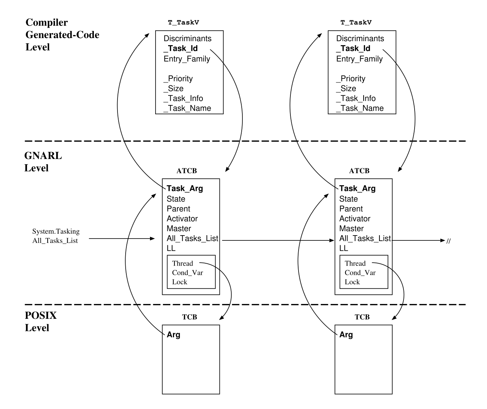

# 🤖 Розділ 14. Постановка завдань

```{note}
Цей ШІ-переклад ще не відредаговано.
```

Семантика задач на Ада вимагає підтримки під час виконання для
розподілу пам\'яті, планування задач та міжзадачної взаємодії. Ці
функції зазвичай виконує ядро операційної системи. Однак мова Ада
настільки специфічна у своїх семантичних вимогах, що малоймовірно, що
будь-яка існуюча операційна система надасть такі послуги у формі, яка
може бути безпосередньо використана згенерованим кодом. Як наслідок,
під час виконання компілятора необхідно додати процедури, які
підтримують семантику завдань Ada поверх примітивів ОС, або ж надати
ядро завдань для додатків, які працюють на голих платах.

Середовище виконання GNAT припускає, що у цільовій системі є
функціональність, еквівалентна функціональності бібліотеки потоків
POSIX (pthreads). Додаткова інформація про кожне завдання Ada (стан
завдання, батько, активатор тощо \[AAR95, Глава 9\]) зберігається у
записі для кожного завдання, який називається *Блок керування
завданням Ada (ATCB)*.

## Блок керування завданнями Ada

Блок управління завданнями Ada (Ada Task Control Block, ATCB) - це
дискримінований запис, дискримінантом якого є кількість записів
завдання (центральним компонентом ATCB є масив черг, розмір яких
фіксується дискримінантом). Для підтримки дискримінантів завдань Ada95
та деяких атрибутів завдань Ada, інтерфейс генерує додатковий запис
(детально описано в розділі 9.4). Коли задачу створено, середовище
виконання генерує новий ATCB і пов\'язує новий ATCB з відповідним
записом високого рівня та записом *Блоку керування потоками (TCB)* на
рівні POSIX (див. Рис. 14.1). Крім того, під час виконання GNAT
вставляє новий ATCB до пов\'язаного списку (*All Tasks List*). ATCB
завжди вставляються у порядку LIFO (у вигляді стека). Тому перший ATCB
у цьому списку відповідає останньому створеному завданню.



Рисунок 14.1: Інформація про час виконання, пов\'язана з кожним
завданням.

## Стани завдання

GNAT розглядає чотири основні стани протягом життя завдання. Поточний
стан позначається полем *State* ATCB):

*Неактивний*. ATCB було створено і додано до *списку всіх завдань*,
але для виконання його тіла не було призначено жодного потоку
контролю.

*Запускається*. Завдання виконується (хоча може чекати на м\'ютекс).

*Спати*. Завдання заблоковано. Виконання завдання може бути
заблоковано, коли воно змушене чекати на якусь зовнішню по відношенню
до нього подію. Приклади таких подій

Події - це самочинно встановлені часові затримки, завершення
підпорядкованої задачі та завершення операцій, пов\'язаних з
міжзадачною взаємодією. Завдання, яке не заблоковане, вважається
готовим.

*Завершено*: Задача завершена у розумінні ARM 9.3 (5). Будь-які
відкладені роботи, які очікували на альтернативи **завершення** Ади,
були пробуджені і завершили роботу самі.

Стан сну складається з наступних підстанів:

*Сплячий режим активатора*: Чекає на завершення активації створених
завдань. Режим очікування *акцептора*: Очікування прийняття або
вибіркового очікування. *Сон вхідного дзвінка*: Очікування вхідного
дзвінка.

*Сон асинхронного вибору*: Очікування на запуск переривчастої частини
асинхронного оператора вибору.

*Затримати сон*: Очікування на вибраний оператор з відкритою лише
альтернативою затримки.

*Сон завершення майстра*: Завершення майстра має дві фази. На першій
фазі завдання, завершивши в собі майстра, очікує, поки завдання,
залежні від цього майстра, не завершаться або не перейдуть у фазу
завершення.

*Сплячий режим фази 2 майстра*: У фазі 2 завдання перебуває у стані
сну в Complete Master, очікуючи на завершення завершення завдань на
альтернативах завершення.

## Створення та завершення завдань

Згідно з семантикою Ада, всі завдання, створені розробкою декларацій
об\'єктів однієї декларативної області (включаючи підкомпоненти
декларованих об\'єктів), активізуються разом. Аналогічно, всі
завдання, створені оцінюванням одного алокатора, активуються разом
\[AAR95, розділ 9.2(2)\]. Крім того, якщо при розробці декларативної
частини виникає виняток, то будь-яка задача T, створена під час цієї
розробки, стає завершеною і ніколи не активується. Оскільки T сама не
може обробити виняток, мова вимагає, щоб батьківська задача (творець)
впоралася з ситуацією: у контексті активації генерується визначений
виняток *Tasking Error (Помилка виконання завдання*).

Щоб досягти такої семантики, у середовищі виконання GNAT
використовується допоміжний список: *список активації*. Інтерфейс
розширює оголошення об\'єкта, вводячи локальну змінну у поточну
область видимості, яка містить список активації (див. розділи 9.1 і
9.6), і розділяє виклик ОС для створення нового потоку на два окремі
виклики у середовищі виконання GNAT: (1) Create Task, який створює та
ініціалізує новий ACTB і вставляє його до списку всіх завдань і списку
активації, і (2) Activate Task, який обходить список активації і
активує нові потоки.

Що стосується завершення завдання, то поняття *майстра* \[AAR95,
Розділ 9.3\] є фундаментальним для семантики мови. (Див. розділ 9.2).
По суті, майстер визначає область видимості, в кінці якої час
виконання повинен чекати на завершення залежних завдань, перш ніж
завершити інші об\'єкти, створені у цій області видимості. Щоб
реалізувати таку поведінку, інтерфейс генерує виклики підпрограм Enter
Master і Complete Master на початку і наприкінці головної області
видимості (або, у випадку завдань, через підпрограми Create Task і
Complete Task). Під час виконання GNAT пов\'язує один ідентифікатор з
кожним майстром і два ідентифікатори майстра з кожним завданням:
майстер його батька (*Master Of Task*) і внутрішній майстер рівня
вкладеності (*Master Within*). Метод ідентифікації майстрів забезпечує
їх впорядкування, так що майстер, який залежить від іншого, завжди
матиме ідентифікатор, вищий за ідентифікатор свого власного майстра.

Зазвичай завдання починається з внутрішнього рівня вкладеності, який
на одиницю більший за зовнішній рівень вкладеності. Це значення
інкрементується командою Enter Master, яка викликається, якщо завдання
має залежні завдання. Для завдання оточення воно дорівнює 1. Задача
оточення - це потік операційної системи, який ініціалізує час
виконання і виконує головну підпрограму Ada. Перед викликом головної
процедури програми на Ада, завдання оточення розробляє всі бібліотечні
модулі, необхідні головній програмі на Ада. Ця розробка призводить до
того, що завдання бібліотечного рівня створюються і активуються перед
початком виконання головної процедури. Рівень 2 зарезервовано для
серверних завдань системи виконання (так званих \"незалежних
завдань\"), а рівень 3 - для завдань бібліотечного рівня.

*Master Of Task* встановлюється на 1 для завдань середовища. Рівень 2
використовується для серверних завдань часу виконання (так званих
*незалежних завдань)*, а рівень 3 - для завдань рівня бібліотеки. Коли
завдання створюється, воно успадковує внутрішній рівень вкладеності
свого батька (початкове значення параметра *Mas- ter Of Task*
ініціалізується поточним значенням параметра Parent *Master Within*).
Це значення залишається незмінним протягом життя нового завдання і
використовується для забезпечення семантики Ada для завершення
завдань.

*Головний у межах* встановлюється на початкове значення *головного над
завданням* плюс одиниця. Коли завдання входить до області видимості з
залежними завданнями, його внутрішній рівень вкладеності збільшується
на одиницю.

Завдання, створені розподілювачем, не обов\'язково залежать від
їхнього активатора, а скоріше від майстра, який створив тип доступу; у
такому випадку завершення активатора може передувати завершенню
новоствореного завдання \[AAR95, Розділ 9.2(5a)\]. Отже, майстром
завдання, створеного оцінкою розподільника, є декларативна область,
яка містить визначення типу доступу. Задачі, оголошені у пакетах
бібліотечного рівня, мають головну програму як свого майстра. Тобто,
головна програма не може завершити роботу, доки не завершаться всі
завдання бібліотечного рівня \[BW98, Розділ 4.3.2\]. На рисунку 14.2
показано основні концепції, що використовуються у середовищі виконання
для обробки завершення завдань Ада.

| *Батько*        | Завдання, яке виконує майстер, від якого залежить T. |
|---------------------|--------------------------------------------------|
| *Активатор*         | Завдання, яке створило ATCB Т і активувало його. |
| *Майстер завдання*  | Обсяг батьків, від якого залежить T.             |
| *Майстер всередині* | Рівень вкладеності залежних завдань T.           |

Рисунок 14.2: Визначення Батька, Активатора, Майстра Завдання та
Майстра Всередині.

**Приклад**

Щоб краще зрозуміти ці концепції, давайте застосуємо їх до наступного
прикладу:

Батько і активатор не збігаються для T6, оскільки завдання створюється
за допомогою алокатора, і в цьому випадку батьком нового завдання є
завдання, в якому оголошено тип доступу, а активатором - завдання, яке
виконує алокатор. У всіх інших випадках, описаних вище, батько та
активатор збігаються.

Оператор переривання призначено для реагування на помилкові ситуації,
коли відновлення за допомогою завдання, що відхилилося, вважається
неможливим. У мові визначено деякі операції, для яких переривання
повинно бути відкладено \[BW98, розділ 10.2.1\]. Крім того, виконання
деяких критичних моментів часу виконання також має бути відкладено,
щоб підтримувати стабільний стан програми. Для цього у середовищі
виконання GNAT використовується пара підпрограм (Abort Defer, Abort
Undefer), які викликаються кодом, розширеним інтерфейсом для взяття у
дужки невідкладених операцій, пов\'язаних із завершенням завдань (див.
розділ 9.5), операторів рандеву (див. розділ 10) та захищених
об\'єктів (див. розділ 10).

Розділ 11). Реалізація цих примітивів буде детально розглянута у
Розділі 20.

## Підпрограми часу виконання для створення та завершення завдань

У розділі 9.6 було розглянуто послідовність викликів середовища
виконання, що видаються розширеним кодом на етапі створення та
завершення завдань. Цю послідовність зображено на рисунку 14.3. Кожен
прямокутник позначає підпрограму, а ромб - нову задачу.


Рисунок 14.3: Підпрограми GNARL, що викликаються протягом життєвого
циклу задачі Уся послідовність виглядає наступним чином:

1.  *Enter Master* викликається в області видимості Ada, де оголошено
    задачу або розподільник, що описує об\'єкти, які містять задачі.

2.  *Створити завдання* викликається для створення ATCB нових завдань і
    вставки їх до списку всіх завдань і в ланцюжок активації (див.
    розділ 14.4.3).

3.  *Команда Activate Tasks* викликається для створення нових потоків і
    зв\'язування їх з новими ATCB в ланцюжку активації. Коли всі потоки
    створено, активатор блокується, доки вони не завершать розробку
    своєї декларативної частини.

Потік, пов\'язаний з новим завданням, виконує процедуру-обгортку
*завдання*. Ця процедура має декілька локально оголошених об\'єктів,
які слугують локальними даними для кожної задачі під час її виконання.
Процедура-обгортка викликає *процедуру тіла задачі* (процедуру,
згенеровану компілятором, яка містить код користувача задачі), яка
деталізує оголошення у декларативній частині задачі, щоб встановити
локальне середовище, у якому вона

пізніше виконає свою послідовність операторів. Зауважте, що якщо ці
оголошення також мають об\'єкти завдань, то відбувається ланцюгова
активація: це завдання стає активатором залежних об\'єктів завдань і
не може почати виконання свого користувацького коду, доки всі залежні
завдання не завершать власну активацію.

4.  *Завершити активацію* викликається, коли новий потік завершує
розробку всіх декларацій завдання, але до виконання першого
оператора в тілі завдання. Цей виклик використовується для того,
щоб повідомити активатору, що йому більше не потрібно чекати на
завершення активації цього завдання. Якщо це останнє завдання у
списку активації, яке завершує свою активацію, активатор
розблоковується.

З цього моменту активатор і нові завдання виконуються паралельно, і їх
виконання контролюється POSIX-планувальником. Згодом будь-яке з них
може припинити своє виконання, а отже, наступні два кроки можуть
мінятися місцями.

5.  *Завершення* завдання викликається, коли завдання завершує своє
виконання. Це може статися внаслідок досягнення кінця
послідовності операторів або іншими способами, такими як виняток
або оператор переривання (див. Розділ 20). Навіть якщо завершене
завдання більше не може виконуватися, на цьому етапі ще не можна
звільняти його робочу пам\'ять, оскільки на нього все ще може бути
зроблено деяке посилання. Зокрема, інші завдання можуть намагатися
звертатися до завершеного завдання, переривати його і запитувати
про його стан за допомогою атрибутів *\"Завершено*\" і
*\"Викликуваний\"*. Тим не менш, завершення завдання вимагає дій з
боку часу виконання. Завдання має бути вилучено з усіх черг, у
яких воно може перебувати, і позначено як завершене. Має бути
зроблена перевірка на наявність незавершених викликів для
елементів завершеного завдання, і для всіх таких викликів має бути
згенероване виключення *Tasking Error* \[BR85, розділ 4\].

6.  *Майстер* завершення викликається активатором, коли він завершує
виконання своїх операторів. У цей момент активатор чекає, поки всі
залежні від нього завдання або завершать виконання (і викличуть
Завершити *завдання)*, або будуть заблоковані в альтернативі
*Завершити*. Після цього активні залежні завдання в альтернативі
завершення примусово завершуються.

Загалом, це найперший момент, коли можна цілком безпечно видалити всі
сховища, пов\'язані з залежними завданнями (оскільки саме в цей момент
виконання виходить за межі оголошення завдання, і жодне залежне
завдання більше не може бути знову викликане викликом).

У наступних розділах ми надамо більш детальний опис роботи, яку
виконують наступні підпрограми часу виконання: Enter Master, Create
Task, Acti- vate Tasks, Complete Activation, Complete Task і Complete
Master, які реалізують найважливіші аспекти постановки завдань.

### GNARL.Enter Master

Enter Master збільшує поточне значення параметра *Master Within* в
активаторі.

### GNARL.Створити завдання

Створити завдання виконує наступні дії:

1.  Якщо для нового завдання не було вказано пріоритету, призначте йому
    базовий пріоритет активатора. Якщо пріоритет не вказано, то
    пріоритетом завдання є пріоритет, з яким воно створюється, тобто
    пріоритет активатора в момент виклику ним *команди Створити
    завдання*.

2.  Перегляньте список батьків активатора, щоб знайти батька нового
    завдання через рівень майстра (рівень майстра батьків нижчий за
    рівень майстра нового завдання).

3.  Відкласти аборт.

4.  Запросити динамічну пам\'ять для нового ATCB (*Новий ATCB*).

5.  Блокувати *список усіх завдань*, оскільки це блокування
використовується командами \"Перервати залежні\" і \"Перервати
завдання\", і до цього моменту нова задача може бути частиною
сімейства завдань, яке переривається.

6.  Заблокуйте ATCB активатора.

7.  Якщо активатор було перервано, розблокуйте попередні блокування
(*всі списки завдань* і його ATCB), відкладіть переривання і
підніміть внутрішній виняток \"*Сигнал переривання*\".

8.  Ініціалізуйте всі поля нового ATCB: *Callable* встановіть у True;
*Wait Count*, *Alive Count* і *Awake Count* встановіть у 0 (див.
*Sys- tem.Tasking.Initialize ATCB*).

9.  Розблокуйте ATCB активатора.

10. Розблокувати *список усіх завдань*.

11. Додайте деякі дані до нового ATCB для керування винятками (див.
*Sys- tem.Soft Links.Create TSD*).

12. Вставте новий ATCB в ланцюжок активації.

13. Ініціалізуйте структури, пов\'язані з атрибутами завдання.

14. Відкладіть аборт.

З цього моменту нова задача стає [доступною для виклику]{.underline}.
Коли виклик цієї підпрограми часу виконання повертається, код,
згенерований компілятором, встановлює в *True* змінну, яка вказує на
те, що завдання було розроблено.

### GNARL.Активувати завдання

Що стосується активації завдань, то в довіднику Ada зазначено, що всі
завдання, створені при розробці декларацій об\'єктів однієї
деклараційної області (включно з підкомпонентами декларованих
об\'єктів), активуються разом. Аналогічно, всі завдання, створені в
результаті оцінки одного розподільника, активуються разом \[AAR95,
Розділ 9.2(2)\].

Для досягнення цієї семантики GNAT використовує допоміжний список
(*Список активації*). На першому етапі всі ATCB створюються і
вставляються у два списки (Список *всіх завдань* і Список
*активації*); на другому етапі здійснюється обхід Списку активації і
створюються нові потоки управління, які пов\'язуються з новими ATCB.
Хоча ATCB вставляються в обидва списки в порядку LIFO, всі активовані
завдання синхронізуються на замку активаторів перед початком їхньої
активації в пріоритетному порядку. Ланцюжок активації не зберігається
після того, як всі завдання будуть активовані.

Активувати завдання виконує наступні дії:

1.  Відкласти аборт.

2.  Блокування *списку всіх завдань*, щоб не дати активованим завданням
випередити нас

завершити активацію всіх завдань у *ланцюжку активації*.

3.  Перевірте, чи всі робочі органи були розроблені. В іншому випадку
підніміть повідомлення *про помилку програми*.

Для активації завдання активатор перевіряє, чи тіло завдання вже
розроблено. Якщо дві або більше задач активізуються разом (див. АРМ
9.2), то в результаті розробки декларативної частини або ініціалізації

об\'єкт, створений розподільником, ця перевірка виконується для всіх
об\'єктів перед активацією будь-якого з них.

[Причина]{.underline}: Як зазначено в AI-00149, перевірка виконується
активатором, а не самим завданням. Якби вона виконувалася самим
завданням, то в активаторі вона перетворилася б на помилку завдання, а
інші завдання продовжували б виконуватися \[AAR95, розділ 3.11(12)\].

4.  Змініть ланцюжок активації так, щоб завдання активувалися в тому
    порядку, в якому вони були заявлені. Це не потрібно, якщо
    підтримується планування на основі пріоритетів, оскільки активовані
    завдання синхронізуються на блокування активаторів перед початком
    активації, і тому вони повинні починати активуватися в порядку
    пріоритету.

5.  Для всіх завдань в ланцюжку активації виконайте наступні дії:

    a.  Заблокувати батька завдання.

    b.  Заблокувати завдання ATCB.

    c.  Якщо базовий пріоритет нового завдання нижчий за пріоритет
    активатора, підніміть його пріоритет до пріоритету активатора,
    оскільки завдання, яке активується, успадковує активний
    пріоритет свого активатора \[AAR95, розділ D.1(21)\].

    d.  Створіть новий потік за допомогою виклику GNARL (див. *Створити
    завдання)* і зв\'яжіть його з обгорткою завдання. Якщо
    створення нового потоку не вдалося, зніміть блокування і
    встановіть у полі ATCB виклику Activation Failed значення
    *True*.

    e.  Встановіть стан нового завдання *на Runnable*.

    f.  Ініціалізуйте лічильники нового завдання (*Await Count* і *Alive
    Count* встановлено в 1)

    g.  Збільшити батьківські лічильники (*лічильник очікування* та
    *лічильник живих*).

    h.  Якщо головний виконавець завершує роботу, пов\'язану з цим новим
    завданням, введіть кількість завдань, на які головний виконавець
    повинен чекати (*Wait Count*).

    i.  Розблокувати завдання ATCB.

    j.  Розблокуйте батька завдання.


6.  Блокування абонента ATCB.

7.  Встановіть стан активатора у *режим сну активатора*

8.  Закрийте записи завдань, які не змогли створити потік, і порахуйте
    ті, що не завершили активацію.

9.  Змініть пріоритет опитування і зачекайте, поки активовані завдання
завершать активацію. Поки абонент заблоковано, POSIX знімає
блокування абонента.

Після завершення всіх цих активацій, якщо активація якогось із завдань
не вдалася (зазвичай через поширення винятку), в активаторі, в тому
місці, де він ініціював дії, з\'являється повідомлення про помилку
виконання завдання. В іншому випадку, активатор продовжує виконання у
звичайному режимі. Будь-які завдання, перервані до завершення їхньої
активації, ігноруються при визначенні того, чи викликати помилку
завдання \[AAR95, розділ 9.2(5)\].

10. Встановіть стан активатора на *Runnable*.

11. Розблокуйте ATCB абонента.

12. Видаліть ланцюжок активації.

13. Відкладіть аборт.

14. Якщо активація деяких завдань не вдалася, то згенеруйте *помилку
програми*. Помилка завдання видається лише один раз, навіть якщо
два або більше завдань, що активуються, не змогли активуватися
\[AAR95, Розділ 9.2(5b)\].

### Обгортка GNARL.Tasks

Обгортка *завдання* - це процедура GNARL, яка має деякі локальні
об\'єкти, що слугують локальними даними для конкретного завдання.

### GNARL.Повна активація

Повна активація викликається кожною задачею, коли вона завершує
розробку своєї декларативної частини. Вона виконує наступні дії:

1.  Відкладіть аборт.

2.  Заблокуйте активатор ATCB.

3.  Заблокувати автоматичну коробку передач.

4.  Прибрати висяче посилання на активатор (оскільки завдання може
описувати свій активатор).

5.  Якщо *активатор* перебуває у стані сну, зменшіть *лічильник
    очікування* в активаторі. Якщо це останнє завдання для завершення
    активації в ланцюжку активації, розбудіть активатор, щоб він міг
    перевірити, чи всі завдання були активовані.

6.  Встановіть пріоритет на базове значення пріоритету.

7.  Відкладіть аборт.

### GNARL.Завершити завдання

Підпрограма Виконати завдання виконує наступну єдину дію:

1\. Скасувати виклики на вхід, що стоять у черзі.

З цього моменту завдання стає [невикликуваним]{.underline}.

### GNARL.Complete Master

Під час виконання підпрограма Complete Master виконує наступні дії:

1.  Пройдіть усі ATCB, підраховуючи, скільки активних залежних завдань
    наразі має цей майстер (і завершіть усі ще неактивні завдання).
    Збережіть це значення у параметрі *Wait Count*.

2.  Встановіть поточний стан активатора на \"*Основний сплячий* режим
    *завершення*\".

3.  Зачекайте, поки залежні завдання будуть завершені або готові до
    завершення.

4.  Встановіть поточний стан активатора на *Runnable*.

5.  Примусьте ці завдання на кінцевих альтернативах завершитися
    (скасувавши їх).

6.  Підрахуйте, скільки *активних* залежних завдань наразі має цей
    майстер. Збережіть це значення у полі *Wait Count*.

7.  Встановіть поточний стан активатора на *Головний стан сну фази 2*.

8.  Зачекайте, поки всі підраховані завдання завершаться самі собою.

9.  Встановіть поточний стан активатора на *Runnable*.

10. Видаліть завершені завдання зі списку залежних і звільніть їхні
ATCB.

11. *Майстер* розкладання *всередині*

## Підсумок

У цій главі ми розглянули основні структури даних, що використовуються
у середовищі виконання GNAT для підтримки задач на Ада, стани задач,
що використовуються у GNARL, деякий згенерований компілятором код, що
викликає дії під час виконання, та підпрограми, що викликаються цим
згенерованим кодом. Підсумуємо ще раз:

1.  Кожна задача має асоційований з нею блок управління завданнями Ada
(ATCB).

2.  THe (*Список всіх завдань*) містить ATCB всіх завдань у програмі

3.  Один допоміжний список використовується для одночасної активації
об\'єктів завдань, створених в одній області видимості Ada.

4.  Конструкція, яка оголошує завдання, є майстром для цих завдань.
Задача може сама бути Майстром. Наявність майстрів визначає всі
дії, пов\'язані з завершенням роботи над завданням.

5.  Декларація задачі транслюється компілятором в обмежений запис, який
є частиною ATCB; тіло задачі Ада транслюється в процедуру з
чергуванням викликів до RTS для керування створенням, активацією,
передачею та завершенням тіла задачі.

6.  Задача оточення відповідає за ініціалізацію RTS та виконання
основної підпрограми. Як наслідок, завдання оточення є також
активатором усіх завдань бібліотечного рівня.

