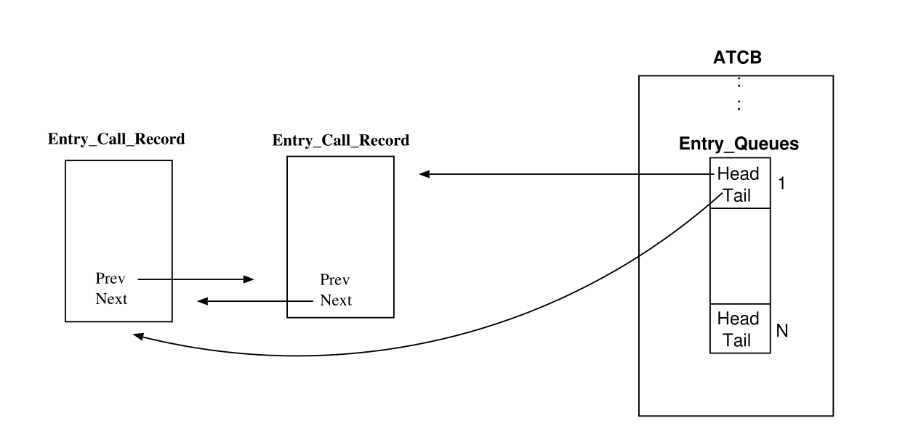
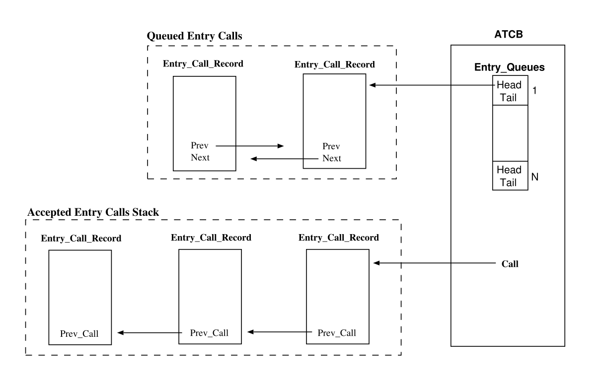

# 🤖 Розділ 15. Рандеву

```{note}
Цей ШІ-переклад ще не відредаговано.
```

*Rendezvous* - це основний механізм синхронізації та комунікації
завдань Ada. Модель Ada базується на клієнт-серверній моделі
взаємодії. Одна задача, сервер, оголошує набір послуг, які вона готова
запропонувати іншим задачам (клієнтам). Він робить це, оголошуючи один
або декілька публічних *записів* у специфікації своєї задачі. Рандеву
запитується однією задачею, яка робить виклик до запису іншої задачі.
Для того, щоб рандеву відбулося, викликана задача повинна прийняти цей
виклик. Під час рандеву завдання, що викликає, чекає, поки завдання,
що приймає, виконується. Коли завдання, що приймає виклик, завершує
рандеву, обидва завдання можуть продовжувати виконання. У випадку,
коли більше однієї задачі чекає на один і той самий запис задачі, Ада
вимагає, щоб виклики приймалися у порядку черги. Під час виконання
необхідно підтримувати структури даних для відстеження того, які
задачі чекають на виклики, які записи вони викликають, і в якому
порядку надходили виклики до кожного запису задачі.

Умовний виклик відрізняється від безумовного тим, що завдання, яке
його викликає, не повинно чекати, якщо тільки виклик не може бути
прийнятий негайно. Якщо викликане завдання готове прийняти виклик,
виконання продовжується, як у випадку безумовного виклику. В іншому
випадку задача, що викликає, відновлює виконання без завершення
рандеву. Синтаксис передбачає відновлення виконання в різних місцях,
залежно від того, чи відбулося рандеву. Ефективна реалізація умовного
входу-виклику вимагає простої перевірки того, чи готова викликана
задача прийняти виклик. Це можна зробити у постійному часі, якщо під
час виконання підтримувати вектор прийняття для кожної задачі, який
вказує, при яких входах, якщо такі є, задача готова прийняти виклик
(див. розширення цього вектора у Розділі 10.4.2). Якщо тест не
пройдено, час виконання може негайно повернути керування задачі, яка
його викликала. В іншому випадку, дії подібні до дій для безумовного
виклику.

Зміст цієї глави структуровано наступним чином: Підрозділ 15.1 описує
запис виклику входу; Підрозділ 15.2 описує реалізацію черг входу;
Підрозділ 15.3 описує стек, необхідний для підтримки вкладених станів
прийняття; Підрозділ 15.4 описує підтримку селективного стану
прийняття під час виконання. Нарешті, у Розділі 15.5 описано
послідовність дій, що виконуються підпрограмами GNARL, які
забезпечують підтримку викликів входу та операторів прийняття.

## Запис про вхідні дзвінки

Під час виконання GNAT з кожним викликом входу пов\'язано запис:
*запис виклику входу*. Він використовується для групування усієї
інформації про виконання, пов\'язаної з викликом входу. Він включає
ідентифікатор викликаного запису, поточний стан виклику запису,
посилання на попередній та наступний виклик запису у черзі тощо. Якщо
запис має параметри, інтерфейс групує всі параметри у суміжний блок
(див. розділ 10.2.1), а час виконання зберігає базову адресу цього
блоку у полі *Неінтерпретовані дані запису виклику входу*. На рисунку
15.1 показано структури даних під час виконання GNAT, що
використовуються для обробки виклику запису E у наступній специфікації
задачі:

Вхідний виклик може перебувати в одному з наступних станів:

*Ніколи не можна відмінити*. Виклик не можна перервати і ніколи не
можна перервати. Використовується для викликів, які здійснюються в
регіоні з відкладеною можливістю переривання \[AAR95, розділ
9.8(5-11,20)\]).

*Ще не можна скасувати*. Заклик не підлягає скасуванню, але може бути
скасований у майбутньому.

*можна було відмінити*. Виклик не можна перервати, але колись можна
було перервати. Різниця між *Was* та *Not Yet* необхідна для того, щоб
вирішити, чи можна переходити до переривчастої частини async. select
stmt. Це дозволено, якщо режим Now або Was .

*Тепер можна перервати*. Дзвінок можна перервати.


Рисунок 15.1: Структури даних, пов\'язані з викликом запису.

*Виклик завершено*. Виклик завершено без скасування, або на цьому
рівні вкладеності ATC ще не було здійснено жодного виклику (див. Главу
20), і тому переривання виклику більше не є проблемою. Завершення
виклику не обов\'язково означає \"успіх\"; виклик може повернути
виняток, якщо Exception To Raise не є нульовим.

*Скасовано*. Дзвінок був асинхронним і був скасований.

## Записи та черги

Кожен вхід має одну чергу, в якій зберігаються всі виклики, що
очікують на обслуговування \[AAR95, розділ 9.1(16)\]. Якщо черга
непорожня, то наступний абонент, який має бути обслужений, знаходиться
на початку черги. Вартість перевірки наявності викликів у черзі для
даного запису залежить від структури даних, обраної для черг викликів.
У середовищі виконання GNARL використовуються циклічні подвійно
зв\'язані списки, так що перевірка, вставка і видалення є операціями
постійного часу.

Поле ATCB \"*Черги входу*\" - це масив, індексований ідентифікатором
входу (інтерфейс пов\'язує унікальний ідентифікатор з кожною чергою
входу, див. розділ 10.1). Кожен елемент цього масиву має два поля:
*Голова* та *Хвіст* черги (див. Рисунок 15.2).



Рисунок 15.2: Черги на вхід.

## Стек прийнятих викликів

Оскільки мова Ada дозволяє використовувати вкладені оператори accept,
при прийнятті виклику запису виконання GNAT витягує запис виклику
запису з відповідної черги викликів і поміщає його адресу у стек.
Вершина цього стека позначена полем *Call* у ATCB приймача (див. Мал.
15.3). Поле *Попередній виклик акцептора* пов*\'*язує всі елементи
стека.

## Вибіркове прийняття

Особлива проблема реалізації, яку створює вибіркове очікування,
полягає в тому, що задача може в один момент часу бути готовою
прийняти виклик на множину з декількох входів. З точки зору часу
виконання Ada, це насправді дві проблеми, оскільки вони виникають як
при обробці викликів на вхід, так і при селективному очікуванні:

1.  Оскільки завдання може очікувати на більш ніж одну відкриту
альтернативу прийняття, обробка виклику запису вимагає перевірки,
чи відповідає викликаний запис одній з відкритих альтернатив.

2.  Оскільки може бути декілька відкритих альтернатив прийняття, обробка
вибіркового очікування вимагає перевірки множини очікуваних
викликів входу з множиною відкритих альтернатив прийняття.



Рисунок 15.3: Проста кнопка \"Прийняти\".

Необхідність мати можливість ефективно виконувати обидві ці операції
сильно впливає на вибір структур даних у реалізації. Існує два
очевидних способи виконання першої операції, яка перевіряє, чи є у
викликаному записі відкрита альтернатива accept:

1.  Якщо набір відкритих альтернативних варіантів представлено у вигляді
    списку, перевірка вимагає порівняння викликаного елемента з кожним
    елементом у цьому списку. Ми називаємо цей підхід використанням
    *відкритого списку*. Він може зайняти багато часу, якщо є багато
    відкритих записів.

2.  Альтернативою є використання векторного представлення для множини
    відкритих записів: *вектор відкритих відповідей*. Цей вектор матиме
    один компонент для кожного запису завдання. Кожна компонента
    мінімально вказує на те, чи є відповідний запис відкритим.

Зауважте, що вектор прийняття або список відкритих записів повинен
бути створений під час виконання оператора вибіркового очікування, як
тільки стане відомо, які альтернативи відкриті. Час, необхідний для
цього, залежить лише від кількості альтернатив в операторі вибіркового
очікування. З окремими чергами для кожного входу необхідно перевіряти
чергу, що відповідає кожному відкритому входу. Для цього потрібно
впорядкувати відкриті записи. Альтернативно, якщо відкриті записи
представлені відкритим записом

цю перевірку можна виконати швидше, не переглядаючи не відкриті
записи. Це може бути вагомою причиною зберігати як список відкритих
елементів, так і вектор прийняття, хоча така надмірність може
коштувати більше, ніж економія за рахунок швидшого виконання перевірки
відкладених викликів.

У GNAT використовується *відкритий вектор акцептів*. Кожен елемент
цього вектора має два поля: ідентифікатор запису та логічне значення,
яке вказує, чи має інструкція accept нульове тіло (див. розділ
10.4.2). Кожен елемент вектора accept відповідає допустимим
альтернативам інструкції select (у тому самому порядку; перший елемент
вектора accept відповідає першій альтернативі, другий елемент - другій
альтернативі і т.д.). Виконання повертає 0, коли вхід закрито.

## Підпрограми рандеву під час виконання

У главі 10 представлено розширення операторів виклику та прийняття
вхідних даних. Наступні розділи описують дії, що виконуються
підпрограмами часу виконання GNAT, які викликаються розширеним кодом.

### GNARL.Call Simple

Підпрограма виконання *Call Simple* просто делегує роботу іншій
підпрограмі виконання, яка називається *Call Synchronous*.

### GNARL.Call Синхронний виклик

Підпрограма часу виконання *Call Synchronous* виконує наступні дії:

1.  Відкладіть аборт.

2.  Створіть і опрацюйте новий запис-виклик і збережіть на ньому адресу
блоку параметрів.

3.  Викликати підпрограму GNARL *Task Do Or Queue*.

4.  Дочекайтеся завершення рандеву (*Wait For Completion*).

5.  Відкладіть аборт.

6.  Підніміть будь-який очікуваний виняток з виклику входу (*перевірте
    виняток*).

### GNARL.Task Do Or Queue

Підпрограма *Task Do Or Queue* виконує наступні дії:

7.  Спробуйте обслужити виклик негайно. Якщо приймач приймає якийсь
    вхідний виклик і поточний виклик може бути прийнятий, виконуються
    наступні дії:

    a.  Зобов\'яжіть абонента зустрітися з абонентом.

    b.  Якщо акцептор знаходиться в альтернативі завершення, скасуйте
альтернативу завершення. Якщо акцептор не має залежних
завдань, повідомте його батька, що акцептор знову не спить.

    c.  Якщо оператор акцепту має нульове тіло (акцепт, який
використовується для синхронізації завдань), то розбудіть
акцептора, розбудіть абонента, що викликає, і знову
поверніться до виконання.

    d.  Якщо оператор **accept** має деяке тіло, викличте процедуру часу
виконання (*Setup For Rendezvous With Body*), щоб вставити
*запис виклику* входу до стеку прийнятих викликів входу
задачі-акцептора (див. розділ 15.3) і підвищити пріоритет
акцептора (якщо пріоритет викликувача вищий за пріоритет
акцептора). Потім розбудити акцептор і ПОВЕРНУТИСЯ.

### GNARL.Виклик введення завдання

Якщо виклик входу може бути негайно прийнятий, то *виклик входу
завдання* виконує ті самі дії, що й простий виклик входу, і встановлює
один параметр виходу в значення True (Успішний), щоб вказати це у
розширеному коді (див. розділ 10.2.2). В іншому випадку він встановлює
цей параметр у значення False. Розширений код використовує цей
параметр для вибору частини користувацького коду, яка має бути
виконана після виклику. Зауважте, що виклик ніколи не виконується;
умовний запис-виклик виконується лише тоді, коли акцептор запитує його
без можливості переривання (за допомогою оператора запиту).

### GNARL.Accept Trivial

*GNARL.Accept* Trivial виконує наступні дії:

8.  Відкладіть аборт.

9.  Якщо жоден вхідний виклик все ще не стоїть у черзі, заблокуйте
завдання акцептора для очікування наступного вхідного виклику
(*Wait For Call*).

10. Витягніть запис виклику входу з голови черги (*Dequeue Head*) і
розбудіть абонента, що викликає вхід (*Wakeup Entry Caller*).

11. Відкладіть аборт.

### GNARL.Прийняти виклик

GNARL-процедура Accept *Call* виконує наступні дії.

12. Відкладіть аборт.

13. Якщо запис не має викликів у черзі, то заблокуйте
завдання-акцептори, щоб вони чекали на наступний виклик запису
(*Wait For Call*).

14. Витягніть запис виклику входу з голови черги (*Dequeue Head*) і
помістіть його у стек прийнятих викликів входу.

15. Оновіть параметр *доступу* до *параметрів* поза режимом посиланням
на *запис параметрів En- try*, щоб код, згенерований компілятором,
міг отримати доступ до вхідних параметрів.

16. Відкладіть аборт.

### GNARL.Повне рандеву

Якщо під час виконання тіла прийняття не згенеровано виключення,
викликається підпрограма *Complete Rendezvous*, яка викликається
розширеним кодом. Ця підпрограма просто викликає підпрограму
*Exceptional Complete Rendezvous*, повідомляючи її про те, що
виключення не було згенеровано.

### GNARL.Виняткове повне рандеву

Якщо під час виконання коду, пов\'язаного з викликом входу, було
згенеровано виключення, то воно також має бути поширене на викликувач
і на ак-

ного завдання \[AAR95, розділ 9.5.2\]. Для цього підпрограма
*Exceptional Complete Rendezvous* виконує наступні дії:

1.  Відкладіть аборт.

2.  Витягніть посилання на запис виклику входу зі стеку прийнятих
    викликів входу.

3.  Якщо було згенеровано виняток, отримайте його ідентифікатор з поля
    вхідного виклику *Exception To Raise (Виняток для згенерування*) і
    збережіть його в полі ATCB *Compiler Data (Дані компілятора*). Цей
    виняток буде передано назад викликаючому користувачеві, коли рандеву
    буде завершено \[AAR95, розділ 9.5.3\].

4.  Розбудити абонента (*Wakeup Entry Caller*).

5.  Відкладіть аборт.

### GNARL.Вибіркове очікування

Підпрограма GNARL *Selective* Wait виконує наступні дії:

1.  Відкладіть аборт.

2.  Намагайтеся виконати виклик входу негайно. Підпрограма GNARL *Вибір
    виклику введення завдання*

вибирає один вхідний виклик відповідно до політики черги, що
використовується.

a.  Якщо є якась кандидатура, а відповідь \"згоден\" має нульове тіло,
то завершіть зустріч, розбудіть абонента, відкладіть аборт і
ПОВЕРНІТЬСЯ.

b.  Якщо є деякий кандидат і акцепт має деякий пов\'язаний з ним код, то
вставити запис виклику в стек акцептованих викликів

(*Налаштування для зустрічі з тілом*), оновити посилання на блок
параметрів, відкласти аборт і ПОВЕРНУТИСЯ.

c.  Якщо немає кандидата, але є відкриті альтернативи, чекайте на
абонента. У майбутньому якийсь абонент покладе запис про виклик до
стеку прийнятих викликів і розбудить цей акцептор. Потім цей
акцептор оновить посилання на параметри запису, скасує відкладення
аборту і ПОВЕРНЕТЬСЯ.

d.  Якщо є альтернатива завершення, повідомте її предків, що це завдання
знаходиться на альтернативі завершення (*зробіть пасивним* і
дочекайтеся нормального виклику входу або завершення).

e.  Якщо не відкрито жодної альтернативи і не вказано затримку (або
завершення), то згенерується попередньо визначене виключення
*Program Error (Помилка програми)*.

### GNARL.Task Count

Функція *Task Count* надає підтримку атрибуту Count. Вона повертає
кількість викликів у черзі у вказаній черзі викликів.

## Підсумок

*Rendezvous* є основним механізмом для синхронізації та обміну даними
між завданнями Ada. У цій главі описано основні аспекти реалізації
GNAT. Підводячи підсумки:

Інформація про час виконання, пов\'язана з викликом входу, згрупована
у

*Запис вхідного дзвінка*.

Компілятор генерує один *запис вхідних параметрів* з адресою реальних
параметрів. GNARL реєструє адресу цього запису у полі запису виклику
входу.

Черги входів реалізовано за допомогою подвійно зв\'язаних списків
записів викликів входів.

Вкладені акцепти обробляються за допомогою одного стеку акцептованих
вхідних викликів - пов\'язаного списку акцептованих записів вхідних
викликів.

*Вектор* акцепту використовується для оцінки відкритих захисників
вибіркового акцепту.
