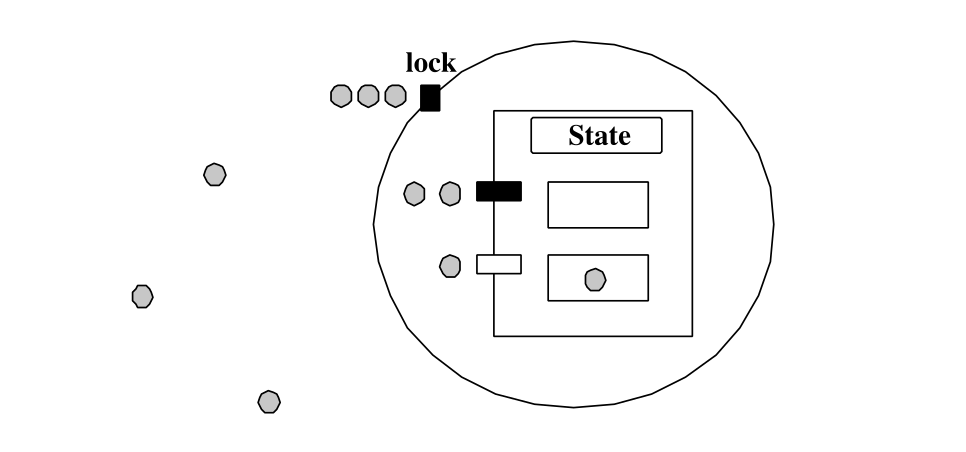

# 🤖 Розділ 16. Об\'єкти, що охороняються

```{note}
Цей ШІ-переклад ще не відредаговано.
```

Високе навантаження на синхронізацію потоків, що вимагалося в
Ада-рандеву, було неприйнятним для реалізації систем з високими
вимогами до часу відгуку. З цієї причини Ада 95 має більш ефективний
механізм синхронізації завдань, заснований на спільній пам\'яті:
захищені об\'єкти (Protected Objects). Захищені процедури та записи
повинні виконуватися з блокуванням на читання/запис; однак, оскільки
захищеним функціям не дозволяється впливати на стан захищеного
об\'єкта, вони можуть виконуватися з блокуванням тільки на читання, що
дозволяє програмі виконувати декілька викликів захищених функцій
паралельно.
>
Щоб викликати захищений об\'єкт, завдання просто називає об\'єкт і
потрібну підпрограму або запис. Як і у випадку з викликами записів
завдань, користувач може використовувати інструкцію select для виклику
запису *за часом* або *умовного* виклику. Зрозуміло, що на певному
захищеному записі може бути поставлено у чергу більше ніж одне
завдання. Як і у випадку з чергами завдань, захищений запис за
замовчуванням впорядковується за принципом \"перший прийшов - перший
вийшов\"; однак, якщо підтримується Додаток систем реального часу,
допускаються інші дисципліни впорядкування черги. Коли виконується
виклик захищеної процедури або захищеного запису, оцінюється бар\'єр;
якщо бар\'єр закрито (оцінюється як False), виклик ставиться у чергу.
Будь-яке виключення, згенероване під час обчислення бар\'єру,
призводить до виникнення *програмної помилки* у всіх задачах, що
очікують у чергах входів, пов\'язаних із захищеним об\'єктом, який
містить бар\'єр \[BW98, Глава 7.8\]).
>
Коли виконання захищеної процедури або запису завершується, всі
бар\'єри переоцінюються і, можливо, виконуються тіла записів. Після
виконання тіла однієї захищеної процедури або входу переоцінюються всі
бар\'єри PO, які стоять у черзі на виконання завдань. Якщо якийсь
запис тепер відкритий, виклик запису приймається і виконується
відповідне тіло запису. Цей процес повторюється до тих пір, поки не
залишиться жодного відкритого бар\'єру з завданнями, що стоять у
черзі. Якщо після виконання виклику входу відкрито декілька
шлагбаумів, то тіло виклику входу приймається і виконується.
>
Ада не вказує, який саме запис після цього обслуговується.
>
Розділ 11 не лише обговорює розширення захищеного типу, бар\'єрів та
захищених підпрограм, але й представляє дві основні моделі реалізації
захищених об\'єктів, самообслуговування та проксі, а також
запропоновані реалізації (див. Розділ 11.1). Як обговорюється там,
GNAT дотримується моделі реалізації проксі-сервісу за принципом
зворотного виклику (call-back). Однією з головних причин (з точки зору
часу виконання) є те, що використання Pthreads для реалізації моделі
самообслуговування створює одну важливу проблему: задача, яка
намагається вийти з яєчної шкаралупи, повинна мати можливість передати
право власності на неї задачі, яка очікує на вхід *Open*. Однак, не
існує хорошого способу вирішити цю проблему за допомогою Pthreads,
оскільки, хоча можна змусити потік отримати м\'ютекс, підвищивши його
пріоритет над пріоритетами інших претендентів, це може призвести до
непотрібних перемикань контексту і погіршить реалізацію пріоритету Ada
над Pthreads.

## Замок.

Згідно з семантикою Ada, виклик входу в чергу має пріоритет над іншими
операціями над захищеним об\'єктом. Це часто пояснюється в термінах
*моделі яєчної шкаралупи*. Замок на захищеному об\'єкті - це яєчна
шкаралупа. На рисунку 16.1 зображено графічне представлення захищених
об\'єктів. Нитки представлені затіненими колами; два рівні захищених
об\'єктів представлені за допомогою великого кола (пов\'язаного з
блокуванням об\'єкта) і великого прямокутника (пов\'язаного зі станом
об\'єкта і операціями); маленькі прямокутники представляють захищені
операції: чорні прямокутники представляють закриті записи, а білі
прямокутники - відкриті записи. Відповідно, у цьому прикладі
представлено один потік, що виконує захищену операцію (він знаходиться
всередині PO), два потоки, що стоять у черзі в закритому записі, один
потік, що стоїть у черзі в записі, який зараз виконується за принципом
взаємовиключення, і кілька додаткових потоків, які не стоять у черзі.

## Підпрограми часу виконання

### Виклик GNARL.Protected Entry

Простий виклик захищеного запису розширюється інтерфейсом у виклик
підпрограми GNARL *Protected Entry Call*. Виклик запису обробляється
командою run-



Рисунок 16.1: Графічне зображення об'єкта, що охороняється.

час, подібно до викликів введення завдань (див. розділ 15.5.4). Це
полегшує реалізацію оператора запиту в мові Ада. Вся послідовність дій
у ньому наступна:

1.  Відкладіть аборт.

2.  Напишіть заблокувати об\'єкт.

3.  Розробіть новий *запис вхідного дзвінка*.

4.  Викличте GNARL-процедуру *PO або Queue*, щоб здійснити виклик або
    поставити його у відповідну чергу записів.

5.  Виклик процедури GNARL *PO Service Entries* для обслуговування
    відкритих записів.

6.  Розблокувати об\'єкт.

7.  Відкладіть аборт.

8.  Перевірте, чи не потрібно повторно викликати якесь виключення.

У випадку умовного та синхронізованого виклику записів, дії, що
виконуються під час виконання GNAT, в основному є послідовністю,
представленою вище. Однак, якщо бар\'єр закрито, запис про виклик
елемента не виконується, і виконавча система встановлює індекс
обраного елемента у 0. Це значення використовується розширеним кодом
для виконання *else-частини* умовного виклику запису.

### GNARL.PO Робити або стояти в черзі

Послідовність дій, які виконує *PO Do Or Queue*, наступна:

1.  Викликати функцію бар\'єру.

2.  Якщо шлагбаум закрито, запитайте *запис виклику на в\'їзд* і
поверніться назад.

3.  Якщо шлагбаум відкритий, виконайте кроки з 2 по 9 процедури GNARL

*Службові записи*.

### Записи GNARL.Service

Програма виконання повинна обчислювати бар\'єри входу після виконання
захищеної процедури або входу, по суті, розглядаючи вираз бар\'єру
так, ніби він залежить тільки від стану захищеного об\'єкта. У моделі
самообслуговування потік може покинути шкаралупу лише тоді, коли
бар\'єри всіх входів, що стоять у черзі на виклик, дорівнюють *False*.
Це гарантує, що всі виклики входів, які стали допустимими в результаті
зміни стану, будуть виконані до того, як будуть ініційовані будь-які
подальші операції. Для цього інтерфейс розширює вхідні бар\'єри та
тіла у функції та процедури і генерує таблицю, ініціалізовану їхніми
адресами. Виконання отримує цю таблицю і використовує вказівники для
виклику функцій, які обчислюють вхідні бар\'єри, а також для виклику
відповідного тіла, коли бар\'єр відкрито.
>
Основний алгоритм процедури *внесення службових записів* до GNARL
полягає в наступному:
>
Рядок 1 оцінюється процедурою GNARL *Select Protected Entry Call*, яка
обходить усі черги входів і переоцінює бар\'єри тих входів, що стоять
у черзі на вхід. Як тільки якийсь бар\'єр відкрито (він набуває
значення true), GNARL обирає його для обслуговування. У рядку 2 поле
*Call In Progress об\'єкта* (див. визначення типу *об\'єктів захисту*)
встановлюється у відповідність до вибраного запису виклику входу, щоб
запам\'ятати, що це виклик входу, який обслуговується. Рядки з 3 по 7
відкривають нову область видимості для виклику тіла запису і обробки
винятків у коді користувача. У цьому випадку попередньо визначений
виняток *Program Error* буде транслюватися всім завданням, що стоять у
черзі у будь-якому записі захищеного об\'єкта. У рядку 8
використовується посилання
>
на вхідний виклик знімається (цей вхідний виклик було прийнято), а
виклик на вхід завдання пробуджується (рядок 9). Після цієї роботи
цикл знову виконується і бар\'єри входу переоцінюються. Цей процес
зупиняється, коли не знайдено жодного відкритого бар\'єру для входу із
завданнями, що стоять у черзі.

## Підсумок

У цій главі ми коротко описали послідовність дій, що виконуються
підпрограмами часу виконання, які надають підтримку захищеним
підпрограмам.

