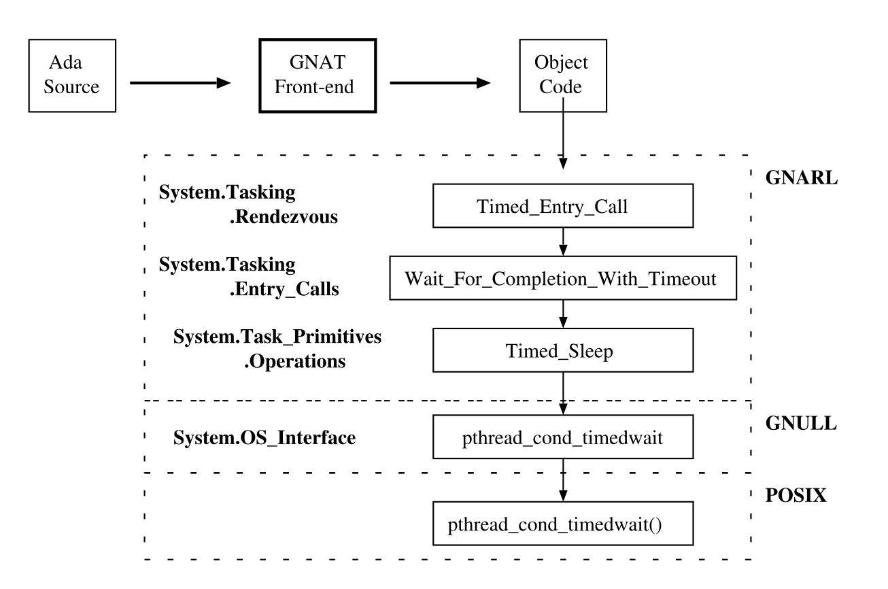
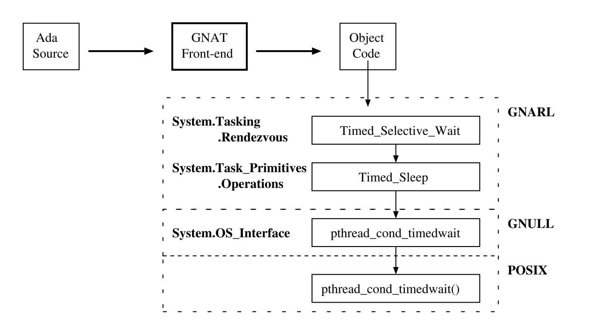

# Розділ 17. Час і годинник {#розділ-17-час-і-годинник .unnumbered}

```{note}
Цей ШІ-переклад ще не відредаговано.
```

Завдання можуть відкладати своє виконання на певний період часу або до
досягнення абсолютного часу. В обох випадках це дозволяє поставити
завдання у чергу на якусь майбутню подію замість того, щоб чекати на
виклик функції годинника. Завдання також можуть створювати виклики на
вхід за певним часом. Якщо виклик не буде прийнято до закінчення
заданої затримки, програма виконання повинна відмінити виклик, щоб
розбудити завдання, яке його викликало. Крім того, вибіркове прийняття
за часом дозволяє серверному завданню завершити роботу, якщо вхідний
виклик не буде отримано протягом певного періоду часу.

Ada надає доступ до годинника, надаючи два пакети: *Календар* та
*Реальний час*. Calendar надає абстракцію часу \"настінного
годинника\", яка враховує високосні роки, високосні секунди та інші
поправки; Real Time надає друге представлення, яке визначає монотонний
(тобто такий, що не зменшується) звичайний годинник. Хоча ці
представлення відображають один і той самий апаратний годинник, вони
задовольняють різні потреби додатків.

1.  ***Затримка* та *відстрочка до* виписки**

Підпрограми GNARL, які реалізують ці оператори Ада, розміщено у
дочірніх пакунках відповідних стандартних пакунків Ада:
*Ada.Calendar.Delays* та *Ada.Real Time.Delays*. Інтерфейс GNAT
розширює оператор затримки у виклик відповідної підпрограми GNARL.

GNARL надає дві реалізації операторів затримки: одну для випадку
програми на Ада без завдань, а іншу - для програми на Ада із
завданнями. Для доступу до відповідної підпрограми (*Timed Delay*)
використовується посилання.


Рисунок 17.1: Підпрограми GNARL для оператора затримки.

У разі відсутності завдання це посилання вказує на GNARL-процедуру
*Time Delay NT*, яка викликає GNULL-процедуру *Timed Delay* (див. рис.
17.2).


Рисунок 17.2: Підпрограми GNARL для оператора затримки в програмі
на Ада без завдань.

У випадку програми із завданнями це посилання вказує на
GNARL-процедуру *Timed Delay T*, яка викликає іншу версію
GNULL-процедури *Timed Delay* (див. Рисунок 17.3).


Рисунок 17.3: Підпрограми GNARL для оператора затримки у програмі Ada
із завданнями.

## Вхід за розкладом

Виклик синхронізованого вводу завдання обробляється компілятором GNAT
так само, як і виклик простого режиму вводу (описано у розділі
10.2.1). Компілятор генерує виклик підпрограми GNARL *Timed Task Entry
Call*. В основному ця процедура виконує ті самі дії, що і виклик
простого режиму (розділ 15.5.1). Однак, якщо запис не може бути
прийнято негайно, вона не просто блокує абонента, а викликає іншу
підпрограму GNARL, яка увімкне таймер і заблокує абонента до
закінчення тайм-ауту. На рисунку 17.4 показано підпрограми GNARL і
GNULL, які беруть участь у цій дії. Якщо вхідний виклик прийнято до
закінчення цього таймера, то таймер знімається з охорони; інакше
вхідний виклик видаляється з черги.

Реалізація виклику захищеного входу на час у GNAT відбувається за тією
ж схемою, що описана вище. Єдина відмінність полягає у тому, що
компілятор генерує виклик процедури GNARL *Timed Protected Entry
Call*.



Рисунок 17.4: Підпрограми GNARL для виклику синхронізованого входу.

## Вибірковий вибірковий за часом Прийняти

Виклик синхронізованого введення завдання обробляється компілятором
GNAT так само, як і вибіркове прийняття (описано у розділі 15.4).
Компілятор генерує виклик підпрограми GNARL *Timed Selective Wait,*
яка виконує ті самі дії, що й у випадку вибіркового очікування (розділ
15.5.9). Однак, якщо немає вхідного дзвінка, який може бути негайно
прийнято, вона не просто блокує абонента, а викликає іншу підпрограму
GNARL, яка програмує таймер і блокує абонента до закінчення цього
тайм-ауту. На рисунку 17.5 показано підпрограми GNARL і GNULL, які
беруть участь у цій дії. Якщо деякий вхідний виклик буде отримано до
закінчення цього таймера, таймер буде знято з-під охорони; інакше
будуть виконані оператори, що стоять після речення **затримки**.



Рисунок 17.5: Підпрограми GNARL для вибіркового прийняття за часом.

## Підпрограми часу виконання

### GNARL.Timed Delay Затримка

Коли програма має завдання, GNARL-процедура *Timed Delay* виконує
наступні дії.

1.  Відкладіть аборт.

2.  Заблокуйте ATCB завдання, що викликає.

3.  Якщо вказана затримка є відносним проміжком часу (тобто оператором
    **затримки**), то ця затримка перетворюється в абсолютний проміжок
    часу шляхом додавання поточного значення годинника.

4.  Якщо вказаний час є майбутнім, то

    a.  Встановіть стан завдання, що викликає, на *Затримати сон*.

    b.  Викличте POSIX-функцію *pthread cond timedwait* для призупинення
    виклику завдань до вказаного часу.

    c.  Встановіть стан завдання, що викликає, *на Runnable*.

5.  Розблокуйте ATCB завдання, що викликає.

6.  Надайте процесору (це гарантує, *що \"оператор затримки завжди
    відповідає принаймні одній точці диспетчеризації завдань\"*
    \[AAR95, Розділ D.2.2(18)\].

7.  Відкладіть аборт.

## Підсумок

GNAT надає дві реалізації простої **затримки** та **затримки до**
виконання речень на Ада: одну для програм на Ада без завдань, а іншу
для програм на Ада із завданнями. Доступ до процедури використовується
для уникнення багаторазових перевірок під час виконання для виклику
відповідної підпрограми.

Часовий вхідний виклик дозволяє задачі, яка його виконує, зробити
вхідний виклик з умовою, що вона буде пробуджена і виклик буде
скасовано, якщо виклик не буде прийнято до закінчення заданого часу
затримки. Як і у випадку з умовним вхідним викликом, передбачається
відновлення виконання в різних місцях, залежно від того, чи
відбудеться рандеву. На додаток до обробки, необхідної для звичайного
вхідного виклику, приурочений вхідний виклик вимагає планування події
пробудження, якщо виклик не може бути прийнятий негайно. Якщо виклик
прийнято до закінчення цієї затримки, завдання виклику має бути
видалено з черги затримки. Якщо затримка закінчується раніше, завдання
має бути видалене з черги входу.

Реалізація GNAT речень виклику захищеного входу (до захищеного входу
або до входу завдання) і вибіркового прийняття в часі виконує ті самі
кроки, що й у випадку без виклику в часі, хоча таймер активується,
коли абонент заблоковано.

