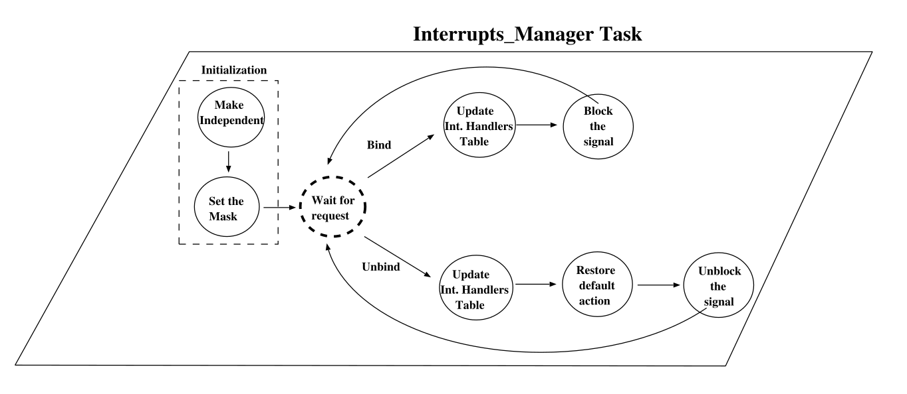

# Розділ 19. Переривання

```{note}
Цей ШІ-переклад ще не відредаговано.
```

Переривання являє собою клас подій, які виявляються апаратним або
системним програмним забезпеченням. Виникнення переривання складається
з його генерації та доставки: генерація переривання - це подія в
базовому обладнанні або системі, яка робить переривання доступним для
програми; доставка - це дія, яка викликає частину програми (яка
називається обробником переривання) у відповідь на виникнення
переривання. У проміжку часу між генерацією переривання та його
доставкою переривання вважається таким, що очікує на обробку. Обробник
викликається один раз для кожної доставки переривання. Поки
переривання обробляється, подальші переривання від того ж джерела
блокуються; всі майбутні випадки переривання не можуть бути
згенеровані. Зазвичай, блоковане переривання залежить від пристрою і
залежить від того, чи залишається воно в стані очікування, чи
втрачається.

Ада дозволяє асоціювати переривання із захищеною процедурою або
елементом задачі, оголошеним на рівні бібліотеки. Однак, зв\'язування
з елементом задачі вважається застарілою особливістю мови \[AAR95,
розділ J.7\]. З цієї причини у цій главі ми зосередимо нашу увагу на
користувацьких обробниках переривань захищених процедур.

Деякі переривання є зарезервованими. Програмісту не дозволяється
надавати обробник для зарезервованого переривання. Зазвичай,
зарезервоване переривання обробляється безпосередньо системою
виконання Ада (наприклад, переривання від годинника, яке
використовується для реалізації оператора затримки). Кожне
незарезервоване переривання має обробник за замовчуванням, який
призначається системою виконання.

Існує два стилі встановлення та видалення обробників переривань:
вкладений та невкладений. У вкладеному стилі обробник переривання у
даному захищеному об\'єкті неявно встановлюється при створенні
захищеного об\'єкту, а
обробка, яка діяла до цього, неявно відновлюється, коли захищений
об\'єкт перестає існувати. У невкладеному стилі обробники переривань
зупиняються явно за допомогою викликів процедур, а обробники, які
замінюються, не відновлюються, окрім як за явним запитом \[Coh96,
розділ 19.6.1\].

Фронтенд визначає обробник, який має бути встановлений у вкладеному
стилі, оскільки він повинен мати прагму *Attach Handler* із
зазначенням відповідного ідентифікатора переривання. Динамічне
виділення захищених об\'єктів дає більшу гнучкість. Виділення
захищеного об\'єкта з обробником переривання встановлює обробник,
пов\'язаний з цим об\'єктом, а вилучення захищеного об\'єкта відновлює
попередній обробник. Аналогічно, обробник, який має бути встановлений
у невкладеному стилі, визначається за допомогою прагматики *Обробник
переривань*. Ця прагма накладає обмеження на об\'єкт: він має бути
створений динамічно \[Coh96, розділ 19.6.1\]. Невкладене встановлення
та видалення обробників переривань покладається на додаткові
можливості пакета *Ada.Interrupts* \[AAR95, розділ C.3(2)\].

Для забезпечення простої, ефективної та багатоплатформної реалізації
GNAT повторно використовує підтримку сигналів POSIX і додає
мінімальний набір підпрограм часу виконання, необхідних для досягнення
семантики мови Ада. Ця робота спрощується, оскільки сигнали POSIX
доставляються окремим потокам у багатопотоковому процесі з
використанням майже тієї самої семантики, що і для доставки у
однопотоковому процесі \[GB92, розділ 5.1\].

## Сигнали POSIX

Сигнал POSIX - це форма програмного переривання, яка може бути
згенерована кількома способами. Сигнал може бути згенеровано \[DIBM96,
Розділ 2\]:

Апаратною пасткою, включаючи ділення на нуль, переповнення з плаваючою
комою, порушення захисту пам\'яті, посилання на неіснуючу комірку
пам\'яті або спробу виконати незаконну інструкцію.

Тому що годинник досягає певного часу, або минув певний проміжок часу.

Асинхронною операцією. Асинхронні операції вводу-виводу генерують
сигнал, коли операція завершується, або якщо операція не вдається.

Тому що користувач натискає певні клавіші на терміналі, який керує
процесом. Певні послідовності клавіш дозволяють користувачеві
призупиняти, відновлювати та завершувати виконання процесу за
допомогою сигналів.

Потоком POSIX. POSIX-потоки можуть надсилати сигнал іншому
POSIX-потоку у тому ж процесі, щоб сповістити його про подію,
викликавши *pthread kill*.

Кожен потік POSIX має маску сигналу: коли для потоку генерується
сигнал і потік маскує його, сигнал залишається у стані очікування,
доки потік не зніме маску; інтерфейс для маніпулювання маскою
*сигналу* потоку - *pthread sigmask*. Потрібно зберігати лише один
екземпляр замаскованого сигналу; тобто, якщо сигнал генерується *N*
разів, поки він замаскований, кількість екземплярів сигналу, які буде
передано потоку, коли він нарешті зніме маску, може бути будь-яким
числом від 1 до N.

Кожен сигнал POSIX асоціюється з певною *дією*. Дія може полягати в
ігноруванні сигналу, завершенні процесу, продовженні процесу або
виконанні виклику користувацької функції-обробника (асинхронно і з
витісненням по відношенню до нормального виконання процесу). POSIX.1
визначає дію за замовчуванням для кожного сигналу. Для більшості
сигналів програма може перевизначити дію за замовчуванням, викликавши
функцію *sigaction*. Використання асинхронних процедур обробки
сигналів не рекомендується для POSIX-потоків, оскільки операції
синхронізації POSIX-потоків небезпечно викликати в асинхронному
обробнику сигналу; натомість POSIX.1c рекомендує використовувати
функцію *pthread sigwait*, яка \"приймає\" один із визначеного набору
замаскованих сигналів.

### Зарезервовані сигнали

Визначення поняття \"reserved\" дещо відрізняються між ARM та POSIX.
ARM визначає \[AAR95, розділ C.3(1)\]:

*Набір зарезервованих переривань визначається реалізацією.
Зарезервоване переривання - це або переривання, для якого не
підтримуються користувацькі обробники, або переривання, яке вже має
приєднаний обробник іншими засобами, визначеними реалізацією.
Програмний блок може бути підключений до незарезервованих переривань.*

POSIX.5b/.5c додатково визначає \[s-intman.adb\]:

*Сигнали, які програма не може прийняти, і для яких програма не може
змінити дію або маскування сигналу, оскільки сигнали повторно
подаються для використання реалізацією мови Ада. До зарезервованих
сигналів, визначених цим стандартом, належать*

*Переривання сигналу Сигнал Тривога*

*Сигнал Помилка з плаваючою комою Сигнал Заборонена команда Сигнал
Порушення сегментації Сигнал Помилка шини*

*Якщо реалізація підтримує будь-які сигнали, окрім визначених цим
стандартом, реалізація може також зарезервувати деякі з них.*

Сигнали, визначені POSIX.5b/5c, які не вказані як зарезервовані:
SIGHUP, SIGINT, SIGPIPE, SIGQUIT, SIGTERM, SIGUSR1, SIGUSR2, SIGCHLD,
SIGCONT, SIGSTOP, SIGTSTP, SIGTTIN, SIGTTOU, SIGIO, SIG-

URG і всі сигнали в реальному часі.

Реалізація GNAT FSU Linux обробляє 32 сигнали. У цьому випадку
зарезервовано такі сигнали:

|Номер|     Ім'я   | Причина    | Опис |
|-----|------------|------------|------------------------------------|
| 2   | \* SIGINT  | GNAT       | Перервати (використовується для CTRL-C) |
| 4   | \* SIGILL  | POSIX (HW) | Незаконна вказівка               |
| 5   | \* SIGTRAP | GNAT       | Пастка для слідів                |
| 6   | \* SIGABRT | GNAT       | Завдання аборту                  |
| 7   | \* SIGBUS  | POSIX (HW) | Помилка шини                     |
| 8   | \* SIGFPE  | POSIX (HW) | Виняток з плаваючою комою        |
| 9   |    SIGKILL | POSIX      | Абортувати (вбити)               |
| 11  | \* SIGSEGV | POSIX (HW) | Порушення сегментації            |
| 14  |    SIGALRM | POSIX      | Будильник                        |
| 19  |    SIGSTOP |            | Стоп!                            |
| 20  | \* SIGTSTP | GNAT       | Запит на зупинку користувача від tty |
| 21  | \* SIGTTIN | GNAT       | Спроба фонового читання tty      |
| 22  | \* SIGTTOU | GNAT       | Спроба фонового запису tty       |
| 26  |  SIGVTALRM |            | Віртуальний таймер закінчився    |
| 27  | \* SIGPROF | GNAT       | Таймер профілювання закінчився   |
| 31  |  SIGUNUSED |            | Невикористаний сигнал            |

Сигнали, позначені \*, не можна маскувати за допомогою GNAT Run-Time.
SIGINT не може бути замасковано, оскільки він використовується для
завершення програми на мові Ада, коли у терміналі, який керує
процесом, натискається послідовність CTRL-C. Зберігаючи SIGINT
зарезервованим, програміст дозволяє користувачеві натискати Ctrl-C,
але в той же час відключає можливість обробки цього сигналу в програмі
Ada.

Прагма GNAT *Unreserve All Interrupts* \[Cor04\] надає програмісту
можливість змінити цю поведінку. SIGILL, SIGFPE та SIGSEV не можна
маскувати, оскільки вони використовуються процесором для повідомлення
про помилки під час виконання. SIGTRAP використовується GNAT для
налагодження багатопотокових програм. SIGABRT не можна маскувати,
оскільки він використовується GNAT для реалізації переривання завдань
(описано у розділі 20). SIGTTIN, SIGTTOU і SIGTSTP не можна маскувати,
щоб фонові процеси і ввід-вивід поводилися як звичайні програми на C.
Нарешті, SIGPROF не можна маскувати, щоб не заплутати профілювальник.

## Структури даних

Незалежно від використовуваного стилю асоціацій, GNARL завжди
використовує наступні таблиці, індексовані за *ідентифікатором
переривання*, для обробки переривань.

*Таблиця зарезервованих сигналів*: Таблиця констант Буля^1^
використовується для реєстрації повторно обслуговуваних переривань.


Рисунок 19.1: Таблиця зарезервованих переривань.

*Таблиця обробників користувацьких переривань*: Таблиця, яка
використовується для реєстрації та відміни посилання на *користувацькі
процедури обробки переривань* (UDIP) під час роботи програми. Кожен
елемент цієї таблиці є записом з двома полями: доступ до UDIP та
прапорець, який запам\'ятовує стиль асоціації (вкладений чи
невкладений).

На рисунку 19.2 показано одну захищену процедуру, приєднану до сигналу
SIGUSR1 у вкладеному стилі (статичний стиль). Компілятор GNAT
пов\'язує дві підпрограми *P* і *N* з кожною захищеною підпрограмою
(описано у розділі 11.2.2). Як читач може бачити, під час виконання
програма пов\'язує сигнал з підпрограмою *P*: посилання на підпрограму
*P* зберігається у відповідному полі таблиці, а для поля *Static*
встановлено значення *True*, щоб пам\'ятати, що це вкладений стиль
асоціації.

1У вихідних текстах GNARL вона оголошена як змінна, щоб можна було
ініціалізувати її у тілі пакунка для полегшення перенесення.


Рисунок 19.2: Таблиця користувацьких обробників переривань.

### Менеджер переривань: Базовий підхід

У середовищі виконання GNAT використовується одне завдання *диспетчера
переривань* для серіалізації виконання підпрограм, що беруть участь у
керуванні сигналами: приєднання, від\'єднання, заміна тощо. На рисунку
19.3 показано спрощену версію автомата, реалізованого диспетчером
переривань. Для простоти ми розглянули лише дві основні операції:
*Прив\'язування* та відв*\'язування* користувацьких процедур
переривань (UDIP) до переривань.

Спочатку автомат викликає підпрограму GNARL *Make Independent*, щоб
зробити *задачу диспетчера переривань* незалежною від її ведучих.
Незалежні завдання GNARL пов\'язані з ведучим 0, і їхні ATCB не
зареєстровані у *списку All Tasks List* (описано у розділі 14.1);
таким чином, вони тривають до кінця програми. Після встановлення маски
сигналу автомат переходить в один стан, в якому він очікує наступної
операції керування сигналом.

У випадку *прив\'язки* сигналу, GNARL зберігає посилання на UDIP у
своїй таблиці і блокує POSIX-сигнал (це дозволяє GNARL перехоплювати
сигнал за допомогою POSIX-сервісу *sigwait*).

У випадку сигналу *Unbinding*, посилання на UDIP видаляється з
таблиці, встановлюється дія за замовчуванням POSIX, і сигнал
розблоковується.



Рисунок 19.3: Базовий автомат, реалізований диспетчером *переривань*.

### Завдання сервера: Базовий підхід

У середовищі виконання Ada має бути передбачено потік для виконання
UDIP. Існує вибір між виділенням однієї серверної задачі для всіх
сигналів і наданням серверної задачі для кожного сигналу. Перший
підхід виглядає привабливо, оскільки економить місце під час
виконання, але він блокує інші сигнали під час виклику захищеної
процедури. Це може призвести до затримки або втрати сигналів. З цієї
причини GNARL надає окреме *серверне завдання* для кожного сигналу
\[DIBM96\].

Замість того, щоб створювати/переривати *серверні завдання*, коли
користувацькі обробники переривань приєднуються/від\'єднуються, GNARL
зберігає їх живими до завершення роботи програми. Таким чином, вони
повторно використовуються всіма UDIP, пов\'язаними з тим самим
перериванням протягом життя програми. Під час виконання є *таблиця
ідентифікаторів серверів*, у якій зберігаються посилання на *завдання
серверів* (див. Рис. 19.4).

На рисунку 19.5 показано спрощену версію Автомата завдань сервера.

### Інтеграція диспетчера переривань та серверних завдань

У попередніх розділах було розглянуто базову функціональність *завдань
диспетчера переривань* та *серверних завдань*. Однак, реалізація GNARL
є дещо складнішою, оскільки:


Рисунок 19.4: Обробка сигналів серверних завдань.

1.  Вкладений стиль переривань Ada передбачає, що UDIP динамічно
приєднуються та від\'єднуються від сигналів під час розробки та
завершення захищених об\'єктів. Таким чином:

    a.  Якщо не зареєстровано жодного UDIP, GNARL має виконати дію за
замовчуванням POSIX, а спрощена реалізація *диспетчера
переривань* не враховує дії за замовчуванням POSIX (див.
рисунок 19.5).

    b.  Коли зареєстровано один UDIP, сигнал запрограмовано на обробку
UDIP. Наступні UDIP, зареєстровані на той самий сигнал,
замінюють попередні UDIP.

    c.  Якщо всі UDIP від\'єднано, GNARL має знову виконати стандартні
POSIX-дії. Попередня реалізація не може досягти цього ефекту,
доки *серверне завдання* перебуває у стані *очікування*.
Навіть якщо POSIX


Рисунок 19.5: Базовий автомат, реалізований завданнями сервера.

Команда *sigaction* використовується для встановлення дії асинхронного
сигналу за замовчуванням, ця дія не буде виконана, якщо сигнал не буде
демасковано, і GNARL не може демаскувати сигнал, поки *серверне
завдання* заблоковано на *sigwait*, оскільки у POSIX.1c цей ефект не
визначено. Тому GNARL має розбудити *серверне завдання* і змусити його
чекати на якусь операцію, для якої безпечно залишити сигнал
незамаскованим, щоб можна було виконати дію за замовчуванням
\[DIBM96\].

2.  GNARL має захищати структури даних, до яких має спільний *доступ
    завдання диспетчера переривань* і *Завдання сервера*.
    Тому необхідно додати деякі блокування.

Другу вимогу (*блокування*) легко вирішити за допомогою
POSIX-м\'ютексів. Однак, перша вимога є більш складною. Тому
зосередимо нашу увагу на вирішенні першої вимоги засобами GNARL.

Для того, щоб краще зрозуміти реалізацію GNARL, нам потрібно спростити
*Автомат серверних завдань* до його основних станів:

*Стан 1*: *Серверне завдання* забезпечує поведінку сигналу за
замовчуванням POSIX.

*Стан 2*: Завдання *сервера* запрограмовано на виклик одного UDIP.

Для того, щоб сповістити автомат про те, що він повинен перейти зі
*стану 1* до *стану 2*, GNARL використовує одну *змінну стану* POSIX;
для того, щоб змусити автомат перейти зі *стану 2* (очікування в
операції POSIX *sigwait*) до *стану 1*, POSIX

використовується сигнал SIGABORT (цей сигнал використовується для
завершення POSIX-потоку, і таким чином змушує *серверну задачу*
повернутися з операції POSIX *sigwait*). На рисунку 19.7 показано цей
автомат.


Рисунок 19.6: Спрощений автомат завдань сервера.

Якщо ми додамо ці нові переходи до нашого базового *автомата сервера
завдань* (див. рис. 19.5), то отримаємо реальний автомат, реалізований
у GNARL (див. рис. 19.7). Для полегшення читання автомата всі стани
пронумеровано. Всередині пунктирних прямокутників знаходяться стани,
пов\'язані зі спрощеними станами попереднього прикладу (*стан 1* і
*стан 2*).


Рисунок 19.7: Автомат завдань сервера.

Після ініціалізації (стани з 1 по 3) автомат перевіряє, чи був
зареєстрований будь-який UDIP диспетчером *переривань* (стан 4).
Спочатку, оскільки жодного

UDIP зареєстровано, він виконує дію за замовчуванням POSIX (стан 9) і
чекає у *змінній стану* (*cond wait*, стан 10), поки якийсь UDIP не
буде зареєстровано диспетчером *переривань*.

Коли будь-який UDIP зареєстровано, *диспетчер переривань* сигналізує
про *це у змінну стану*, а *автомат серверних завдань* переходить до
стану 4, перевіряє, чи був зареєстрований якийсь UDIP (тепер це
значення дорівнює *True*), і переходить до стану 5, щоб чекати
наступного сигналу. Коли сигнал отримано, він знову перевіряє, чи UDIP
все ще зареєстровано (стан 6), оскільки він міг бути видалений
*диспетчером переривань*, поки автомат чекав на сигнал. Потім він
викликає UDIP (стан 7) і знову переходить до стану 4.

Поки *серверна задача* перебуває у стані 5, очікуючи на появу сигналу,
може статися так, що всі UDIP були вилучені *диспетчером переривань*.
У цьому випадку *диспетчер переривань* надсилає сигнал SIGABRT
*серверній задачі*, щоб змусити її перейти у стан 9. Цей сигнал
пробуджує *автомат серверної задачі*, який переходить у стан 8, щоб
відповісти *диспетчеру переривань* тим самим сигналом, щоб повідомити,
що він не перебуває у стані 5 (чекає на сигнал). Після цього
повідомлення автомат переходить у стан 4 і, оскільки UDIP не знайдено,
він переходить у стан 9.

## Підпрограми часу виконання

### Обробники GNARL.Install

У вкладеному стилі розширювач генерує виклик *Install Handlers* у
процедурі ініціалізації захищеного об\'єкта. Ця підпрограма зберігає
попередні обробники в одному додатковому полі об\'єкта (*Previous
Handlers*) і встановлює нові обробники.

### Обробники GNARL.Attach

У невкладеному стилі нічого особливого робити не потрібно, оскільки
стандартні рушії буде відновлено під час завершення завдання, яке
виконується безпосередньо перед глобальною фіналізацією.

Для того, щоб перевірити під час виконання, що всі процедури
переривання не вкладеного стилю було анотовано за допомогою
прагматичного *обробника переривань* (\[AAR95, розділ C.3.2\] повторно

quirement) компілятор додає виклики до підпрограми GNARL *Register
Interrupt Handler*

для реєстрації цих процедур переривань у однозв\'язному списку GNARL.
*Голова* і *хвіст* цього списку зберігаються у двох змінних GNARL
(*Registered Handler Head* і *System.Interrupts.Registered Handler
Tail*, див. рисунок 19.8). Кожен вузол зберігає адресу однієї
захищеної процедури, пов\'язаної з перериванням у невкладеному стилі.
Для простоти представлено єдиний доступ до захищеної процедури, але
кожен вузол має доступ до відповідної підпрограми *P.* Перед
приєднанням одного обробника переривання невкладеного стилю до одного
знаку, GNARL переглядає цей список, щоб переконатися, що захищена
процедура зареєстрована у списку; інакше він згенерує виняток *Program
Error* (*Програмна помилка*).


Рисунок 19.8: Список обробників переривань у невкладеному стилі.

## Підсумок

У цій главі ми розглянули основні аспекти, пов\'язані з керуванням
перериваннями. Хоча Ада дозволяє приєднувати до переривання запис
задачі, на сьогоднішній день це вважається застарілою особливістю
мови. Таким чином, ми обговорили лише приєднання до переривань
користувацьких захищених процедур (User-Defined Protected-Procedures).
Основними особливостями реалізації GNAT є

GNARL асоціює переривання Ada з сигналами POSIX.

Кожен сигнал має *обгортку завдань,* яка відповідає за виконання
визначених користувачем захищених процедур.

Захищена підпрограма *P*, пов\'язана із захищеною підпрограмою,
приєднується GNARL до відповідної *обгортки завдання*.

Ада надає два способи приєднання захищеної процедури до *переривання*
Ада: вкладений стиль (за допомогою прагматичного *обробника Attach*)
та невкладений стиль (за допомогою прагматичного *обробника
переривання Interrupt*).

-   Коли використовується вкладений стиль, GNARL додає одне поле до
інформації про виконання захищеного об\'єкта, щоб зберегти і
відновити попередній обробник.

-   Якщо використовується невкладений стиль, для реєстрації не-вкладених
UDIP використовується динамічний список посилань. Цей список
дозволяє GNARL перевіряти, що лише не вкладені UDIP-файли було
позначено правильною прагматикою.

*Завдання диспетчера переривань* використовується для серіалізації
всіх операцій керування сигналами.

