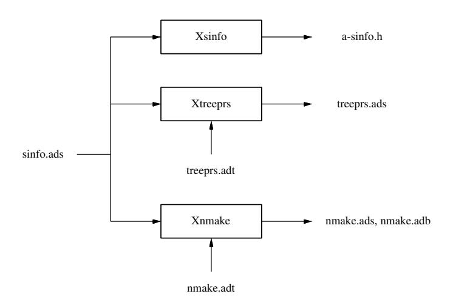

# Додаток А. Як додавати нові ключові слова, прагми та атрибути

У цьому додатку описано, як модифікувати фронтенд GNAT для експериментування з розширеннями мови Ada. Як приклад ми використовуємо `Drago` — експериментальне розширення мови Ada 83, призначене для підтримки реалізації відмовостійких розподілених застосунків. Воно є результатом зусиль щодо впровадження певної дисципліни та надання мовним засобам підтримки парадигми групової комунікації. У наступних розділах ми коротко ознайомимо з Drago (Розділ A.1) та опишемо зміни, внесені до сканера, парсера та семантичного аналізатора GNAT. Попередня версія цієї роботи була опублікована у [MGMG99].

## А.1 Драго

Drago [MAAG96, MAGA00] — це експериментальна мова програмування, розроблена як розширення Ada для створення відмовостійких розподілених додатків. Припущення щодо апаратного забезпечення такі: розподілена система без спільної пам’яті між вузлами, надійна комунікаційна мережа без розділень на частини, а також *мовчазно-відмовлючі* вузли (тобто вузли, про які система більше ніколи не отримує жодних повідомлень після виходу з ладу). Ця мова є результатом спроб впорядкувати підхід до розробки та надати мовні засоби для реалізації основних концепцій Isis [BCJ 90], а також для експериментування з парадигмою групової комунікації. Для сприяння створенню відмовостійких розподілених додатків Drago безпосередньо підтримує дві парадигми груп процесів: *репліковані групи процесів* та *кооперативні групи процесів*. Репліковані групи процесів дозволяють програмувати відмовостійкі додатки за моделлю активної реплікації, тоді як кооперативні групи дають можливість розробникам використовувати паралелізм та таким чином підвищувати продуктивність.

Група процесів у Drago насправді є сукупністю *агентів* – саме так у цій мові позначаються процеси. За своєю структурою агенти досить схожі на задачі в Ada: вони мають внутрішній стан, який неможливо безпосередньо отримати ззовні, незалежний потік керування та публічні операції, які називаються *entry’ами*. Крім того, агенти є одиницею розподілу у Drago; у цьому сенсі вони виконують роль, аналогічну до активних розділів у Ada 95 та програм у Ada 83. Кожен агент знаходиться на окремому вузлі мережі, хоча на одному вузлі може перебувати кілька агентів. Програма Drago складається з низки агентів, які розташовані на різних вузлах мережі.

## А.2 Перший крок: Додавання нових ключових слів

Drago додає чотири зарезервовані ключові слова (**agent**, **group**, **`intragroup`** та **`replicated`**). У наступних розділах описано основні кроки, необхідні для їх введення у середовище GNAT. Список заздалегідь визначених ідентифікаторів GNAT містить усі підтримувані прагми, атрибути та ключові слова. Цей список оголошується у специфікації пакету `Snames`. Для кожного заздалегідь визначеного ідентифікатора існує константа, яка зберігає його позицію у таблиці `Names_Table`. Ця хеш-таблиця містить усі імена – як заздалегідь визначені, так і інші. Ключові слова поділяються на дві основні групи: ключові слова, спільні для Ada 83 та Ada 95, та ключові слова, характерні лише для Ada 95. Кожну з цих груп визначає окреме оголошення підтипу. Залежно від режиму компіляції GNAT – Ada 83 чи Ada 95 – цей підтип дозволяє сканеру правильно розрізняти користувацькі ідентифікатори та ключові слова мови Ada.

Для впровадження ключових слів Drago ми додали третій режим роботи GNAT – режим Drago, а також один новий груповий набір із ключовими словами, специфічними для Drago. Результат виглядає наступним чином:

```ada
First_Drago_Reserved_Word : constant Name_Id := N + 475;
Name_Agent                : constant Name_Id := N + 475;
Name_Group                : constant Name_Id := N + 476;
Name_Intragroup           : constant Name_Id := N + 477;
Name_Replicated           : constant Name_Id := N + 478;
Last_Drago_Reserved_Word  : constant Name_Id := N + 478;
subtype Drago_Reserved_Words is
   Name_Id range First_Drago_Reserved_Word
                 .. Last_Drago_Reserved_Word;
```

Ми також оновили значення константи `Preset_Names`, оголошеної у тілі `Snames`, зберігши при цьому порядок, визначений у попередніх оголошеннях. Ця константа містить літерали всіх заздалегідь визначених ідентифікаторів.

## А.3 Другий крок: Додавання нових токенів

Список токенів оголошується у пакеті `Scans`. Це перелічуваний тип, елементи якого сгруповані у класи, що використовуються для тестування парсером. Наприклад, клас `Eterm` містить усі термінатори виразів; клас `Sterm` містить термінатори простих виразів[^app_a-fn1]; клас `After_SM` — це класи токенів, які можуть з’являтися після крапки з комою; клас `Declk` — це класи ключових слів, які ініціюють оголошення; клас `Deckn` — це класи ключових слів, які також ініціюють оголошення, але не можуть починати одиницю компіляції; а клас `Cunit` — це класи токенів, які можуть починати одиницю компіляції. Елементи кожного класу впорядковані за алфавітом. Ми ввели нові токени наступним чином:

```ada
type Token_Type is (
   --  Token name_Class (es)
   ...
   Tok_Intragroup,  --  Eterm, Sterm, After_SM
   ...
   Tok_Agent,       --  Eterm, Sterm, Cunit, Declk, After_SM
   ...
   Tok_Group,       --  Eterm, Sterm, Cunit, Declk, After_SM
   ...
   Tok_Replicated,  --  Eterm, Sterm, Cunit, After_SM
   ...
   No Token);
```

Класи, які пов’язані з токенами, вказані у третьому стовпці. Наш вибір ґрунтувався на наступних рекомендаціях:

– `Intragroup` завжди має йти після крапки з комою (див. специфікацію групи Drago у розділі А.6).
– `Agent` та `Group` ініціюють одиницю компіляції та нове оголошення.
[^app_a-fn1]: Усі зарезервовані ключові слова, за винятком *mod, rem, new, abs, others, null, delta, digits, range, and, or xor, in* та **`not`**, завжди належать до цих двох класів (`Eterm`, `Sterm`).

Ключове слово `Replicated` використовується для позначення групи елементів (аналогічно до приватних пакетів у Ada 95, де слово **`private`**, яке стоїть перед оголошенням пакета, робить його приватним; в інших випадках пакети є публічними). Саме тому ці елементи були розміщені в одному розділі.

Відповідно до алфавітного порядку, `Tok_Agent` є першим новим токеном класу `Cunit`. Тому ми оновили оголошення відповідного підтипу *Tok - Class Unit*, щоб клас починався з `Tok_Agent`. Нарешті, ми змінили оголошення таблиці `Is_Reserved_Keyword`, яка фіксує, які токени є зарезервованими ключовими словами мови.

## А.4 Третій крок: Оновлення ініціалізації сканера

Ініціалізація сканера (підпрограма `Scn.Initialization`) передбачає присвоєння всім ключовим словам, які зберігаються у таблиці `Names_Table`, байтового коду відповідного токена (у противному випадку використовується значення 0). Це дозволяє сканеру визначати, чи є певне слово ідентифікатором або зарезервованим ключовим словом. Ця процедура виконується шляхом багатократних викликів процедури `Set_Name_Table_Byte` з передачею як параметрів самого ключового слова та відповідного байтового коду токена. Саме тому ми додали наступні речення до процесу ініціалізації сканера:

```ada
...
Set_Name_Table_Byte (Name_Agent,
                     Token_Type'Pos (Tok_Agent));
Set_Name_Table_Byte (Name_Group,
                     Token_Type'Pos (Tok_Group));
Set_Name_Table_Byte (Name_Intragroup,
                     Token_Type'Pos (Tok_Intragroup));
Set_Name_Table_Byte (Name_Replicated,
                     Token_Type'Pos (Tok_Replicated));
```

Ми також змінили сканер (підпрограму `Scn.Scan`), щоб він розпізнавав нові ключові слова лише під час компіляції програм на мові Drago. Це дозволяє зберегти його початкову поведінку під час аналізу вихідного коду мовою Ada. Це була остання зміна, необхідна для інтеграції нових ключових слів у сканер GNAT. У наступному розділі ми описуємо зміни, зроблені для додавання одного нового прагми та одного атрибута до сканера GNAT.

## А.5 Додавання прагм та атрибутів

Drago надає один новий атрибут `Member_Identifier` та один новий прагма (`Drago`). Коли атрибут `Member_Identifier` застосовується до ідентифікатора групи, він повертає ідентифікатор поточного агента у вказаній групі. При застосуванні прагми `Drago` компілятор отримує інформацію про наявність коду Drago (аналогічно до прагм GNAT `Ada83` та `Ada95`). Для інтеграції цих елементів у GNAT нам довелося модифікувати пакет `Snames` наступним чином:

1. Додайте їхні оголошення до списку попередньо визначених ідентифікаторів, дотримуючись алфавітного порядку. GNAT класифікує всі прагми на дві групи: прагми конфігурації, які використовуються для встановлення параметрів на рівні розділу чи всієї системи, та прагми неконфігураційного типу. Прагма Drago була віднесена до групи неконфігураційних прагм.
   – GNAT класифікує всі атрибути на чотири групи: атрибути, які позначають процедури (*output*, *read* та *write*), атрибути, які повертають певні сутності (*elab body* та *elab spec*), атрибути, які повертають типи (*base* та *class*), а також решту атрибутів. Атрибут `Member_Identifier` було віднесено до цієї четвертої групи.

2. Вставте їхні оголошення у переліки `Pragma_Id` та `Attribute_Id`, дотримуючись порядку, вказаного на попередньому кроці. Подібно до токенів, пов’язаних із ключовими словами, ці типи сприяють подальшій обробці прагм та атрибутів на етапах роботи фронтенду.

3. Додайте їхні літерали у масив `Preset_Names`. Аналогічно до процесу введення ключових слів, необхідно зберегти порядок, зазначений у списку попередньо визначених ідентифікаторів.

4. Оновіть файл C *a-snames.h*. У цьому файлі кожному елементу типів `Attribute_Id` та `Pragma_Id` присвоюється відповідний C-макрос. Цю роботу можна автоматизувати за допомогою утиліти GNAT під назвою *xsnames*.
## А.6 Додавання нових синтаксичних правил

У цьому розділі ми на прикладі описуємо зміни, внесені до парсера для підтримки синтаксису Drago. Цим прикладом є специфікація групи Drago; її синтаксис подібний до синтаксису специфікації пакету в Ada:

```ada
GROUP DECLARATION ::= GROUP SPECIFICATION

GROUP SPECIFICATION ::=
   [ replicated ] group defining_identifier is
      { basic_declarative_item }
   [ intragroup
      { basic_declarative_item } ]
   [ private
      { basic_declarative_item } ]
   end [ group identifier ];
```

Групи з реплікацією позначаються за допомогою зарезервованого ключового слова **`replicated`** у заголовку специфікації групи. Для кооперативних груп не потрібне жодне зарезервоване слово, оскільки вони вважаються стандартною специфікацією групи. Перший список декларативних елементів у специфікації групи (так званий *міжгруповий розділ*) містить усю інформацію, яку клієнти можуть знати про цю групу. Необов’язковий список декларативних елементів після ключового слова **`intragroup`** називається *внутрішньогруповим розділом*; він містить інформацію, доступну лише для членів групи, і може бути визначений лише у специфікації кооперативної групи[^app_a-fn2]. Необов’язковий список декларативних елементів після зарезервованого слова **`private`** називається *приватним розділом*; він надає групам таку саму функціональність, як і приватна частина пакетів у мові Ada. У наступних розділах описано кроки, необхідні для додавання цієї синтаксичної конструкції до парсера GNAT.

### А.6.1 Перший крок: Додавання нових типів вузлів

Види вузлів GNAT оголошуються у переліку `Sinfo.Node_Kind`. Подібно до елементів `Token_Type`, всі його елементи групуються за класами (тобто вузли, які відповідають реченням; вузли, які відповідають операторам тощо), а елементи в кожному класі впорядковані за алфавітом.

Для реалізації правил груп Drago знадобилося додати два нових типи вузлів: `N_Group_Declaration` та `N_Group_Specification`. Оскільки специфікація групи Drago схожа на специфікацію пакета Ada, ми розмістили вузол `N_Group_Declaration` у класі, пов’язаному з вузлом `N_Package_Declaration`, а `N_Group_Specification` — у класі, пов’язаному з вузлом `N_Package_Specification`.

[^app_a-fn2]: У реплікованих групах ця функціональність відсутня, оскільки вважається, що їхні члени є репліками детермінованого автомата; тому їм не потрібно обмінюватися своїм станом — у всіх реплік однаковий стан.

### А.6.2 Другий крок: Опис нових вузлів на високому рівні

У специфікації пакету `Sinfo` міститься опис вузлів АТД на високому рівні (див. розділ 2.2.1). При визначенні нового вузла у нас є два варіанти: повторно використати імена полів АТД, які вже використовуються у поточній специфікації мови Ada, або визначити нові імена. У першому випадку необхідно зберегти всі характеристики поля: його номер та пов’язані з ним дані. У другому випадку потрібно ретельно проаналізувати поле, до якого прив’язуємо нове ім’я; адже після визначення воно має залишатися незмінним для всіх вузлів. Крім того, для кожного нового імені потрібно оголосити у пакеті `Sinfo` дві підпрограми: процедуру (для встановлення значення поля) та функцію (для отримання збереженого значення). Продовжуючи наш приклад, шаблони, пов’язані з `N_Group_Declaration` та `N_Group_Specification`, виглядають так:

```ada
-- N_Group_Declaration
-- Sloc points to GROUP
-- Specification (Node1)
-- N_Group_Specification
-- Sloc points to GROUP
-- Defining_Identifier (Node1)
-- Visible_Declarations (List2)
-- Intra roup Declarations (List3) (set to No_Lis tif
--   no intragroup part present)
-- Private_Declarations (List4) (set to No_List if
--   no private part present)
```

Це означає, що значення параметра `Sloc` у вузлі `N_Group_Declaration` вказує на слово **group** у вихідному коді; перше поле цього вузла (`Field1`) вказує на вузол специфікації. З іншого боку, значення параметра `Sloc` у вузлі `N_Group_Specification` також вказує на те саме слово **group** (оскільки причиною створення обох вузлів було саме це слово); його перше поле (`Field1`) вказує на вузол, який містить ідентифікатор визначення, а друге, третє та четверте поля (`Field2`–`Field4`) вказують на списки, які відповідно містять його видимі, внутрішньогрупові та приватні оголошення.

Подібно до того, як у GNAT реалізується обробка приватних пакетів, для обробки скопійованих груп достатньо лише додати один новий прапорець у кореневий вузол AST (для приватного пакета використовується `Flag15`, а для скопійованої групи ми обрали `Flag16`).

### А.6.3 Третій крок: Автоматичне модифікування фронтенду

Шаблони, вказані на попередньому кроці, використовуються трьома утилітами GNAT (*xsinfo, xtreeprs* та *xnmake*) для автоматичного генерування чотирьох вихідних файлів фронтенду, які беруть участь у обробці вузлів: *a-sinfo.h, treeprs.ads, nmake.ads* та *nmake.adb* (див. рисунок A.1).



Рисунок А.1: Утилітні програми GNAT.

### А.6.4 Четвертий крок: Оновлення парсера

Парсер GNAT реалізовано за допомогою добре відомої техніки рекурсивного спуску. Увесь його код знаходиться у функції `Par`, яка складається з кількох підодиниць (по одній підодиниці на кожен розділ посібника з Ada [AAR95]). Виходячи з цієї концепції, ми вирішили додати підодиницю `Par.Drag` для групування усього коду парсера, який синтаксично аналізує правила Drago (рисунок A.2). Функцію, відповідальну за аналіз специфікації групи, ми назвали `P_Group`. Для розробки цієї функції в якості зразка ми використали частину коду парсера, яка аналізує специфікацію пакетів. Зрештою, ми змінили процес парсингу компіляційної одиниці таким чином, щоб під час обробки вихідного коду Drago за наявності токена групи викликалася саме ця функція.


Рисунок А.2: Нова структура парсера.

## А.7 Перевірка семантики

Після завершення роботи парсера семантичний аналізатор здійснює зверху вниз обхід AST та, залежно від типу кожного зустрічного вузла, викликає відповідну підпрограму для перевірки його семантичної коректності. Ці підпрограми структуровані у набір пакетів. Кожен пакет містить усі необхідні підпрограми для перевірки семантичних правил кожного розділу специфікації ARM (пакети `Sem_Ch2`..`Sem_Ch13`). Для кожного типу вузла, створеного парсером, існує своя підпрограма; головним пакетом, який управляє цими викликами, є `Sem`.

Для семантичної перевірки специфікації групи Drago ми внесли наступні зміни до вихідного коду GNAT:

1. Додайте один новий пакет: `Sem_Drag`. Цей пакет містить усі підпрограми Drago, які здійснюють семантичну перевірку.

2. Додайте одну нову семантичну сутність. Сутність GNAT є внутрішнім представленням ідентифікаторів, операторів та літералів символів, які зустрічаються у оголошеннях програми. Отже, для кожного ідентифікатора специфікації групи має існувати відповідна сутність. Ми додали елемент `E_Group` до переліку `Entity_Info` (у пакеті `Einfo`) для представлення нової сутності, що відповідає назві групи.

3. Оновіть файл C *a-einfo.h*. Це оновлення виконується автоматично за допомогою утилітарної програми GNAT під назвою *xeinfo* (рисунок A.3).


Рисунок А.3: Утилітна програма для обробки семантики GNAT

Для кожного нового типу вузлів, що визначаються у парсері, потрібно написати відповідну підпрограму. Ми написали підпрограму для вузла, який описує специфікацію групи, а також підпрограму для вузла, що описує саму декларацію групи; обидві підпрограми були розміщені у новому пакеті `Sem_Drag`. За зразок для створення цих підпрограм ми взяли ті, які виконують семантичний аналіз специфікацій пакетів.
Зрештою ми модифікували пакет `Sem`, щоб під час аналізу вузла специфікації (або оголошення) групи включати виклики цих підпрограм.

## А.8 Розгортання дерева

У більшості випадків для генерації коду немає потреби звертатися до рівня GIGI; наша робота завершується на етапі розширення структури. У нашому прикладі ми перетворили вузли Drago у вузли формату Ada 95, що призвело до виклику кількох додаткових підпрограм виконання. Знову ж таки, рекомендуємо використовувати підпрограми розширення, які доступні у вихідному коді GNAT, як зразок для наслідування.

## А.9 Підсумок

У цьому додатку описано інтеграцію Drago у фронтенд GNAT. Drago – це мова програмування, розроблена як розширення Ada для експериментування з моделлю активної реплікації у відмовостійкому розподіленому програмуванні. Ми зосередилися на лексичних, синтаксичних та семантичних аспектах цієї інтеграції. Питання розширення абстрактного синтаксичного дерева та генерації коду тут не розглядалися.
