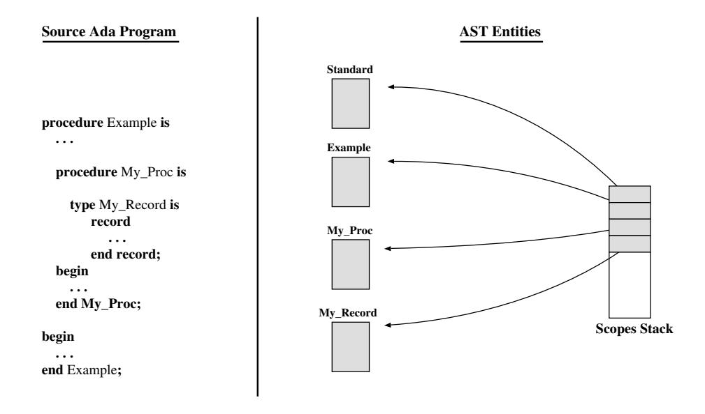
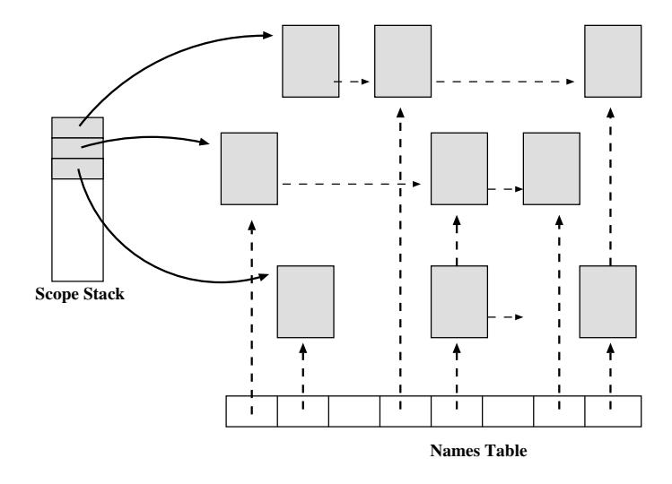
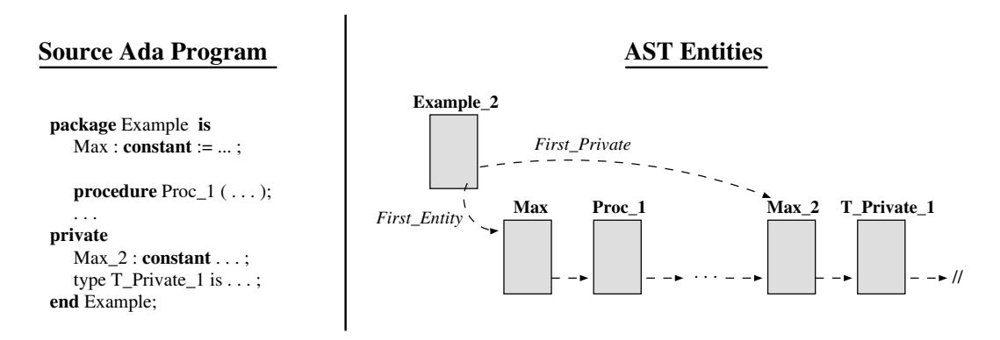
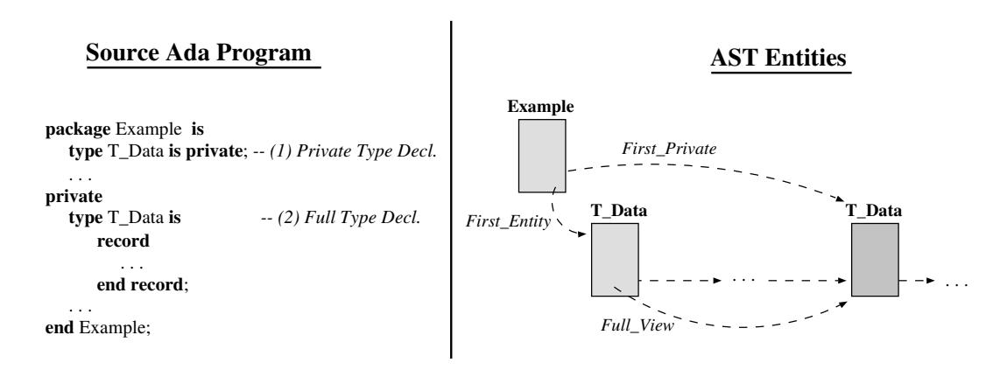
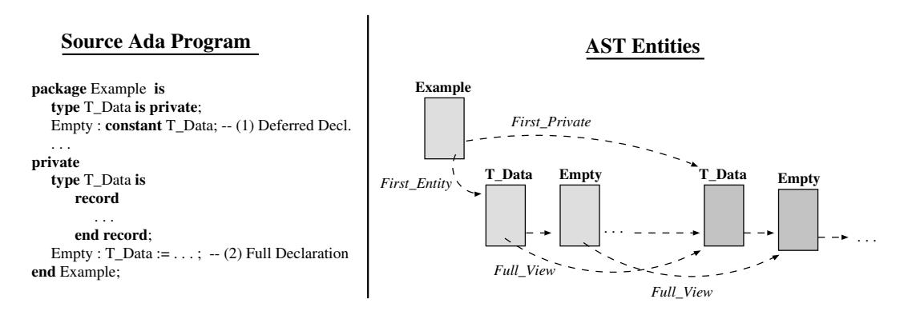

# Розділ 4. Області видимості та доступу

Сучасні мови програмування високого рівня дозволяють визначати імена з обмеженою областю видимості, повторно використовувати їх у різних контекстах, а також перевантажувати; саме на компіляторі лежить обов’язок відстеження інформації про область видимості та прив’язку імен до конкретних об’єктів. Для цієї мети компілятори зазвичай використовують окрему структуру `Symbol_Table`. У випадку GNAT окремої таблиці символів не існує; натомість семантична інформація про програмні елементи зберігається безпосередньо у Абстрактному Синтаксичному Дереві (AST). Таким чином, AST у GNAT за своєю суттю близьке до DIANA [GWEB83], але є більш компактним.

Цей розділ має таку структуру: у розділі 4.1 описано прапорці та структури даних, які використовуються на інтерфейсі для керування областями видимості; у розділі 4.2 описується послідовність кроків для аналізу записів, завдань, захищених об’єктів, умов контексту, дочірніх та піддочірніх одиниць; нарешті, у розділі 4.5 описується послідовність кроків для визначення імен записів, завдань, захищених об’єктів, простих імен та розширених імен.

## 4.1 Прапорці та структури даних

Вузли сутностей, які відповідають визначеним сутностям, мають набір прапорців та атрибутів (поля вузла сутності), які використовуються семантичним аналізатором для обробки областей видимості. Основні прапорці, що застосовуються для перевірки правил видимості в мові Ada, є наступними:

`Is_Immediately_Visible`: Цей елемент визначений у якійсь з відкритих наразі областей видимості [AAR95, Розділ 8.3(4)].

`Is_Potentially_Use_Visible`: Цей об’єкт визначений у пакеті, назву якого зазначено у поточній активній директиві використання [AAR95, Розділ 8.4(8)]. Зауважимо, що об’єкти, потенційно доступні для використання, не обов’язково є дійсно доступними для використання [AAR95, Розділ 8.4(9–11)].

Для відстеження сфер, які наразі обробляються, семантичний аналізатор використовує стек (`Scope_Stack`). Сутності, що визначають області видимості (тобто сутності, які описують пакети, завдання тощо), додаються до цього стека під час обробки та видаляються після її завершення. Перший елемент у стеку `Scope_Stack` посилається на сутність, яка визначає пакет Standard. На рисунку 4.1 показаний відповідний приклад: зліва розташована процедура (`Example`), у якій є локальна процедура (`My_Proc`) та оголошення локального типу запису (`My_Record`). Права частина цього рисунка ілюструє вміст стека `Scope_Stack` у момент аналізу оголошення типу запису. Для простоти на рисунках у решті цього розділу посилання на стандартний пакет не показуються.

Рисунок 4.1: Стек областей видимості

Семантичний аналізатор пов’язує всі сутності, оголошені в межах однієї області видимості, за допомогою атрибута `Next_Entity`. Сутність, яка визначає межі цієї області, має два атрибути: один посилається на першу сутність у області, а інший – на останню. Крім того, кожна сутність має атрибут, який вказує на сутність-визначник її області видимості. Ці атрибути допомагають семантичному аналізатору переміщатися по різних областях видимості. На рисунку 4.2 показаний приклад: зліва – програма мовою Ada, а справа – відповідна структура даних у момент аналізу послідовності операторів локальної процедури `Local_Proc`. Для простоти на ілюстраціях у цьому розділі показано лише деякі семантичні атрибути.

Рисунок 4.2: Список сутностей в межах однієї області видимості.

Дві сутності є *гомонімами*, якщо вони мають однакову назву, а також, у разі можливості перевантаження, їхні типи є сумісними. Наприклад, внутрішнє оголошення приховує будь-яке зовнішнє оголошення-гомонім від прямої видимості. У Довіднику з мови Ada для позначення цієї концепції використовується термін *гомограф* [AAR95, розділ 8.3(8)]; проте ми вирішили користуватися терміном «гомонім», оскільки саме він використовується у реалізації GNAT. Наприклад, семантичний аналізатор GNAT відстежує гомонімні сутності за допомогою зв’язаних списків `Homonym`. Початковий елемент кожного такого списку зберігається у спеціальному полі таблиці `Names_Table`. Для швидкого доступу до імен Таблиця імен є хеш-таблицею, в якій не допускаються дублікати. У випадку перевантажених сутностей список гомонімів містить усі можливі значення даного ідентифікатора; процес розв’язання проблеми перевантаження використовує інформацію про типи, щоб вибрати єдине коректне значення ідентифікатора.

Зазвичай послідовність дій, які виконує Семантичний аналізатор для обробки областей видимості, є такою: (1) негайно зробити видимим визначаючий елемент нової області видимості; (2) відкрити цю область; (3) негайно зробити видимими всі локальні елементи, визначені всередині нової області; (4) додати всі локальні елементи до списків сутностей та омонімів. На рисунку 4.3 наведено один із прикладів. Зліва показана програма мовою Ada, яка містить одну глобальну сутність (`Total`), що має омоніма всередині локальної процедури `Local_Proc`. Справа читач може побачити відповідну структуру даних після аналізу локальних оголошень та внесення елементів до відповідних списків. У випадку з `Total` видно пряму видимість локального елемента з Таблиці імен, а також посилання на його прихований омонім у межах області видимості *Приклад 2*.

Рисунок 4.3: Списки омонімічних сутностей.

Після завершення аналізу найвнутрішнішої області видимості сутності, визначені в ній, більше не є видимими. Якщо ця область не є оголошенням пакета, ці сутності надалі залишаються недоступними та можуть бути видалені з ланцюгів видимості. Якщо ж це оголошення пакета, його видимі елементи все ще можуть бути доступними. Тому семантичний аналізатор залишає сутності, визначені в такій області, у ланцюгах видимості, змінюючи лише їхній рівень видимості (безпосередню чи потенційну видимість для використання). Це детально описано у розділі 4.3.

Підсумовуючи, усі визначувані сутності з’єднуються у ланцюжок двічі: (1) у межах свого сфери видимості та (2) у списку однойменних елементів. Внаслідок цього простір імен сутностей можна розглядати як розріджену матрицю, де кожен рядок відповідає певній сфері видимості, а кожен стовпець – імені сутності. Для відкритих сфер видимості, тобто сфер, які зараз обробляються, відповідні рядки з сутностями розташовані у порядку вкладеності – спочатку найвнутрішніша сфера (див. рисунок 4.4).

У подальшій частині цього розділу ми будемо використовувати такі вирази для опису обробки цих прапорців та структур даних: під *«Зробити сутність негайно/потенційно видимою»* мається на увазі позначення сутності як негайно видимої або потенційно видимої для використання; вираз *«Відкрити область видимості»* означає додавання посилання на сутність у стек областей видимості; нарешті, вираз *«Вставити сутність у матрицю сутностей»* означає приєднання сутності до відповідних списків в рамках певної області видимості.

Рисунок 4.4: Матриця сутностей.

## 4.2 Аналіз записів, завдань та захищених типів.

Під час аналізу записів, задач та захищених типів усі їхні локальні сутності повинні ставати негайно доступними. Для цього семантичний аналізатор (1) робить визначальну сутність запису, задачі чи захищеного типу негайно видимою; (2) відкриває відповідну область видимості; (3) забезпечує доступність усіх сутностей, визначених у межах цієї області; та (4) додає їх до матриці сутностей. Дискримінанти (якщо такі є) розглядаються як додаткові компоненти типу, тому після виходу з області видимості вони від’єднуються від своїх списків. На рисунках 4.5 та 4.6 показано ці кроки під час аналізу оголошення типу запису та захищеного типу відповідно. Згідно з мовою Ada, ззовні до цих локальних сутностей завжди здійснюється доступ через вибрані компоненти (запис у форматі `Префікс.Сутність`). Тож після виходу з області видимості семантичний аналізатор (1) робить визначальну сутність недоступною для негайного доступу; (2) закриває область видимості; та (3) видаляє локальні сутності з відповідних списків. Внаслідок цього подальший доступ до вибраних компонентів вимагає послідовного перебору списку областей видимості під назвою `Префікс`. Під час аналізу тіл задач та захищених типів їхні локальні сутності тимчасово знову додаються до відповідних списків.

Рисунок 4.5: Аналіз запису.

## 4.3 Аналіз пакетів

Для аналізу специфікації пакета семантичний аналізатор виконує такі дії: (1) негайно робить видимим визначальний елемент специфікації пакета, (2) відкриває область видимості, (3) негайно робить видимими всі елементи, визначені у специфікації пакета, та (4) додає їх до матриці елементів. Після завершення обробки область видимості має бути закрита; проте замість видалення всіх цих елементів з відповідних списків GNAT-аналізатор просто знімає з них позначку про їх негайну видимість. Внаслідок цього для аналізу тіла пакета, а також наступних конструкцій `with` та `use` не потрібно знову формувати список видимих елементів – достатньо лише знову відкрити область видимості та відновити їх пряму видимість. Елементи, визначені у межах тіла пакета, також робляться негайно видимими та додаються до матриці елементів. Оскільки тіло пакета є семантичним продовженням його специфікації, ці елементи додаються наприкінці списку елементів специфікації. Щоб запобігти їх видимості ззовні, після завершення обробки тіла пакета всі елементи, визначені у ньому, повністю видаляються з матриці елементів. Хоча ці елементи більше не потрібні для аналізу, вони зберігаються у визначальному елементі тіла пакета, адже необхідні для генерації об’єктного коду.

На перший погляд здається, що для аналізу *використовувальних клаузул* достатньо лише позначити як видимі для використання всі сутності, визначені у видимій частині специфікації пакета; а після виходу зі сфери дії такої клаузули – скинути цей прапорець. Проте цього простого підходу недостатньо, адже допускається використання однакової назви пакета у вкладених контекстах. Для коректного оброблення загального випадку у сутності, що визначає специфікацію пакета, передбачений прапорець `In_Use`, який свідчить про те, що пакет наразі знаходиться у сфері дії використовувальної клаузули. У випадку надлишкового використання встановлюється другий прапорець – `Redundant_Use`. Після виходу зі сфери дії `S` семантичний аналізатор у зворотному порядку переглядає список використовувальних клаузул у декларативній частині `S`. Прапорець видимості залишається встановленим, доки пакет не позначений як використаний у надлишковій клаузулі; у такому разі зовнішня клаузула все ще діє, і пряма видимість її сутностей має зберігатися.

Рисунок 4.6: Аналіз захищеного типу.

У випадку наявності конструкцій типу *use type* Семантичний аналізатор збирає примітивні оператори, пов’язані з іменованими типами, та робить їх потенційно видимими для використання.

## 4.4 Аналіз приватних типів

Приватні типи стали фундаментальним внеском Ada83 у розвиток програмної інженерії. Приватні типи є основним механізмом інкапсуляції та приховування інформації: вони розділяють видимий інтерфейс типу (ті властивості, якими може користуватися клієнт) від деталей його реалізації, до яких має доступ лише той, хто цей тип створює. Тим чи іншим способом подібні механізми приховування даних згодом були впроваджені в інші сучасні мови програмування – зокрема C++ та Java.

Ada95 розширила механізми приховування інформації для задач та захищених типів. Для захищених типів приховування інформації означає повне розділення між операціями, які застосовуються до захищених даних, та структурою цих даних. Це є сучасною реалізацією концепції монітора: об’єкт надає можливість виконання певних операцій над абсолютно приватними даними. Все, що потрібно знати клієнту – це те, що існує механізм блокування, який гарантує взаємно-ексклюзивний доступ до цих даних.

Ada95 також розширила синтаксис оголошень приватних типів, додавши підтримку приватних розширень та невідомих дискримінантів. Крім того, механізми забезпечення конфіденційності відіграють ключову роль у семантиці дочірніх одиниць.

Особливістю приватних типів є те, що їх опис подається у двох частинах: оголошення приватного типу дає лише частковий опис, який, як правило, не містить інформації про структуру типу, окрім кількох характеристик, відомих клієнту (наприклад, чи має тип дискримінанти чи є він тегованим). Повне оголошення ж надає всю необхідну структурну інформацію для реалізації типу та його операцій. Компілятор повинен вміло працювати з цими двома формами опису приватних типів. Ключовим елементом організації компілятора є те, що кожна сутність унікально ідентифікується за індексом у таблиці вузлів; іншими словами, **інформація про певну сутність завжди знаходиться в одному й тому ж місці під час компіляції**. Для обробки двох форм опису приватних типів компілятор використовує різноманітні механізми, які залежно від контексту компіляції обмінюються частковим та повним описами цих типів. Наприклад, під час компіляції тіла пакету має бути доступний повний опис усіх його типів; натомість під час компіляції специфікації пакету, яка згадується в конструкції `with` якогось модуля, для цього модуля має бути видимим лише частковий опис його приватних типів. Описаний нижче механізм обміну описами є на перший погляд досить простим; проте його взаємодія з генератиками та інлайнінгом є джерелом значної складності у роботі front-end-частини компілятора.

Механізм обміну видами застосовується до інших сутностей, які мають два види представлення: або через наявність двох описів (як-от відкладені константи), або через те, що їхні властивості змінюються залежно від контексту. Наприклад, підтип приватного типу стає підтипом повного виду батьківського типу, коли цей повний вид стає видимим; також тип із приватним компонентом може перестати бути приватним, якщо стає видимим повний вид його компонента.

### 4.4.1 Видимість приватних сутностей

Для розрізнення видимих та приватних оголошень пакетів у визначальному елементі пакета існує атрибут, який посилається на елемент першого приватного оголошення у специфікації пакета (див. `First_Private_Entity` на рисунку 4.7). Цей атрибут відіграє ключову роль у реалізації механізму зміни видів, який викликається наприкінці тіла пакета та в різних точках компіляції дочірніх одиниць.

Рисунок 4.7: Видимі та приватні сутності

Подібно до специфікації пакетів, у визначальної сутності типу завдання та типу захищеного об’єкта також є атрибут `First_Private_Entity`, який посилається на перший приватний елемент (якщо такий існує).

### 4.4.2 Приватні оголошення типів

Як зазначалося вище, принцип, згідно з яким кожна сутність повинна мати лише один визначаючий елемент, суперечить наявності двох окремих оголошень для приватних типів; відповідно, існують два визначаючі елементи: (1) оголошення приватного типу, яке визначає частковий вигляд типу, та (2) повне оголошення типу. Реалізація GNAT вважає визначаючим елементом часткового вигляду саме той елемент, який представляє тип. Цей елемент має атрибут `Full_View`, що позначає елемент повного вигляду типу (див. рисунок 4.8). Зворотного зв’язку не існує; уся операція зі зміни вигляду починається саме з часткового вигляду. Прапорець `Has_Private_View` використовується для позначення того, що дане повне оголошення типу є завершенням оголошення приватного типу; за потреби відповідне часткове оголошення можна знайти шляхом перегляду публічних оголошень у пакеті.

Під час семантичної обробки визначна сутність також посилається на список приватних залежних елементів – а саме типів доступу чи складених типів, чиї базові чи компонентні типи є підтипами або похідними від даного приватного типу. Після того, як буде оброблено повну декларацію, ці приватні залежні елементи оновлюються для позначення того, що у них вже є повні визначення.

Рисунок 4.8: Посилання на сутність у повному вигляді

Рисунок 4.9: Заміна приватного оголошення на повний перегляд

Ada95 дозволяє в специфікаціях задач включати приватну частину. Оскільки елементом задачі може бути лише оголошення входу або клауза представлення, це майже не впливає на семантичну обробку задач. Під час аналізу тіла задачі ці оголошення необхідно зробити доступними. Проте в цьому випадку часткового перегляду не існує, а отже, й потреби у зміні видимості даних немає.

Приватна частина оголошення типу protected з семантичної точки зору є більш важливою: саме вона інкапсулює стан об’єкта цього типу. Під час аналізу тіла типу protected операції цього типу переписуються так, щоб включати неявний параметр – запис, структура якого відображає приватну частину типу protected. Таким чином, кожному типу protected ми приписуємо структуру запису, яка є його `Corresponding_Record`. Цей тип запису, у свою чергу, має атрибут `Corresponding_Concurrent_Type`, який вказує на тип protected, на основі якого він визначений. Структура Corresponding Record також включає компонент блокування під час виконання програми, який забезпечує взаємну виключність доступу до ресурсів. Обробка тіл типів protected переважно полягає у їх розширенні; цей процес описано в окремому розділі.

### 4.4.3 Відкладені константи та неповні типи

Механізм, описаний у попередньому розділі, також використовується для обробки відкладених оголошень констант та неповних оголошень типів. Отже, сутність, яка визначає відкладене оголошення константи, містить посилання на відповідну сутність повного оголошення типу (див. рисунок 4.10).

Рисунок 4.10: Обробка констант з відкладеною ініціалізацією

### 4.4.4 Обмежені типи

Обмежені типи не створюють жодної додаткової складності для Семантичного аналізатора; операції копіювання з обмеженнями щодо мови просто застосовуються до них.

### 4.4.5 Аналіз дочірніх одиниць

Аналіз дочірніх одиниць вимагає особливої уваги щодо видимості приватних сутностей. Для аналізу специфікації публічного дочірнього пакету Семантичний аналізатор виконує наступні дії: 1) негайно робить видимими усі сутності з видимої частини батьківського пакету, 2) відкриває область видимості дочірнього пакету, 3) аналізує видиму частину специфікації дочірнього пакету, 4) перевіряє, чи отримали неповні типи, визначені у видимій частині, свої повні оголошення, 5) негайно робить видимими приватні сутності батьківського пакету, та нарешті 6) аналізує приватну частину специфікації дочірнього пакету. У випадку приватного дочірнього пакету процес аналізу є простішим, адже він має повну видимість усіх сутностей, визначених у батьківському пакеті. Тож на першому кроці негайно робляться видимими усі сутності, оголошені у видимій та приватній частинах батьківського пакету; після цього виконуються кроки 2, 3 та 5. У GNAT Semantic Analyzer існують окремі процедури для поступового зроблення видимими оголошень з видимої та приватної частин (див. `Install_Visible_Declarations` та `Install_Private_Declarations`).

### 4.4.6 Аналіз підодиниць

Підодиниці мають компілюватися у середовищі відповідного стабу. Іншими словами – з тією самою видимістю та контекстом, які доступні у місці оголошення стабу, але з додатковою видимістю, яку надають власні контекстні клаузули підодиниці (якщо такі є). Внаслідок цього компіляція підодиниці зумовлює компіляцію батьківської одиниці. У момент оголошення стабу рекурсивно викликається семантичний аналізатор для аналізу тіла підодиниці, проте таблиця імен та стек областей видимості не перініціалізуються (тобто стандартний елемент не додається до стека). Таким чином контекст підодиниці поєднується з контекстом батьківської одиниці, і підодиниця компілюється у правильному середовищі.

## 4.5 Вирішення імен

Роздільнення імен — це процес встановлення відповідності між іменами та сутностями, які вони позначають, у кожній точці програми. У контексті семантичного аналізатора GNAT роздільнення імен полягає у зв’язуванні кожного вузла, що представляє певну сутність, з відповідним вузлом-визначенням цієї сутності. У випадку простих імен семантичний аналізатор використовує лише список омонімів. Якщо сутність є безпосередньо видимою, саме вона і позначається цим простим ім’ям. Якщо у списку знаходяться лише потенційно доступні для використання сутності, семантичний аналізатор перевіряє, чи вони не приховують одна одну. У випадку розширених імен аналізатор шукає потрібну сутність на перетині списку сутностей для даної області видимості (префіксу) та списку омонімів для селектора.

## 4.6 Підсумок

Фронтенд GNAT зберігає всю семантичну інформацію щодо програмних сутностей безпосередньо у вузлах AST, які їх визначають. Отже, AST містить не лише повний синтаксичний опис програми, а й результати семантичного аналізу. Для обробки правил області видимості та доступності кожна сутність має два прапорці, які вказують, чи є ця сутність негайно або потенційно видимою для використання. Крім того, усі сутності в межах однієї області видимості додаються до двох списків: списку сутностей у цій області та списку сутностей із однаковою назвою. В результаті простір імен сутностей можна розглядати як розріджену матрицю, де кожен рядок відповідає певній області видимості, а кожен стовпець – певній назві.

Семантичний аналізатор зберігає у списку всі сутності, визначені у оголошенні пакета; видимі сутності знаходяться на початку цього списку, а приватні – в кінці. Для визначення межі видимих сутностей семантичний аналізатор використовує посилання на першу приватну сутність. Ця схема також застосовується для реалізації приватних сутностей у завданнях та захищених типах. Усі неповні сутності, визначені у видимій частині специфікації пакета (відкладені константи, неповні типи та приватні типи), містять посилання на відповідне повне визначення сутності у приватній частині. Коли повне визначення стає видимим, це посилання використовується для заміни двох оголошень; внаслідок цього повне визначення стає доступним для програм на Ada.
