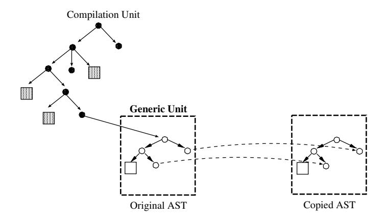
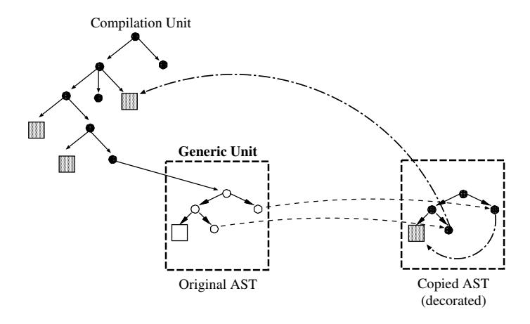
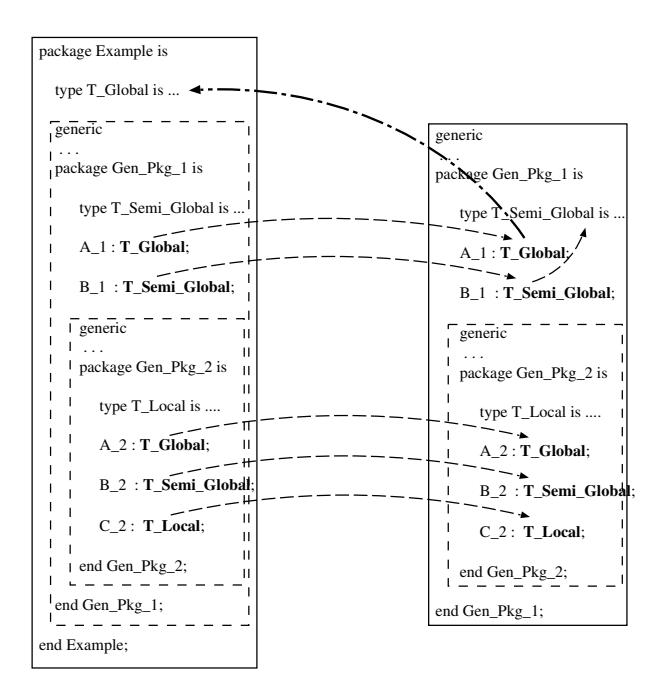
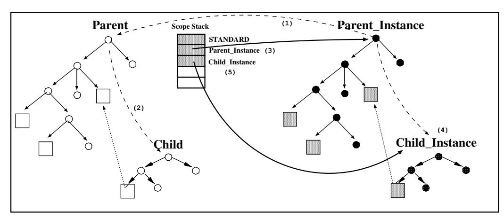

# Розділ 7. Універсальні одиниці

Узагальнений модуль є параметризованим шаблоном для підпрограми чи пакета; його параметрами можуть бути типи, змінні, підпрограми та пакети. Для використання узагальненого модуля необхідно задати конкретні значення для його параметрів. Кожна інстанціація, по суті, створює копію специфікації та тіла узагальненого модуля, які потім адаптуються відповідно до заданих параметрів.

Семантика мови Ada передбачає, що допустимість використання узагальнених шаблонів визначається на етапі їх оголошення, а не на етапі інстанціювання. Відтак узагальнений елемент має бути повністю проаналізований у місці свого появи. Під час інстанціювання основними перевірками є підтвердження того, що фактичні параметри, передані у випадку конкретної реалізації, відповідають формальним параметрам шаблону. Так звана «модель контрактів» [AAR95, розділ 12.3.1(а)] стверджує, що якщо оголошення узагальненого елемента є коректним, а фактичні параметри збігаються з формальними, то інстанціювання також вважається допустимим, і додаткових семантичних перевірок для нього не потрібно проводити.

Перевірки на коректність для узагальнених одиниць схожі на перевірки для звичайних, неузагальнених одиниць. Вони переважно стосуються вирішення проблеми імен та перевірки типів. Оскільки семантика узагальненої одиниці визначається на етапі її оголошення, процес вирішення проблеми імен передбачає глобальне захоплення імен: посилання на сутність, яка знаходиться поза межами узагальненої одиниці, встановлюється під час її аналізу та має зберігатися для кожного екземпляра. Натомість сутності, локальні для узагальненої одиниці, матимуть різне значення в кожному її екземплярі.

Традиційно існують два підходи до реалізації інстанціювання генеричних конструкцій [SB94]: розширення коду безпосередньо в місці використання (часто називається `Macro_Expansion`) та пряма компіляція генеричних одиниць (відома також як `Shared_Generics`). Останній підхід, однак, супроводжується численними труднощами; тому GNAT, як і більшість інших компіляторів, реалізує генеричні конструкції шляхом їх розширення. В результаті кожна інстанція певної генеричної конструкції створює власну копію коду, доповнену семантичною інформацією про глобальні елементи та фактичні параметри. Варто зазначити, що це суттєво відрізняється від механізму макророзширення у старіших мовах програмування – там зазвичай відбувається проста текстова підстановка без будь-якої перевірки семантичної коректності самого макроса.

Після аналізу виявляється, що у узагальненому елементі міститься лише часткова семантична інформація. На етапі ініціалізації цю інформацію необхідно доповнити. Для цього потрібно провести повний аналіз семантики для відповідного екземпляра. Крім того, необхідно виконати розширення коду. Варто зазначити, що розширення неможливо застосувати безпосередньо до самого узагальненого елемента – адже воно залежить від інформації про типи, яка стає доступною лише після визначення фактичних типів. Оскільки семантичний аналіз та розширення коду у GNAT тісно пов’язані між собою, ми змушені проводити повний аналіз семантики екземпляра, навіть якщо модель контрактів свідчить про те, що частина цього аналізу є зайвою.

Вимоги щодо глобального захоплення імен визначають архітектуру, описану в цьому розділі. Цю архітектуру ускладнюють два взаєпов’язані аспекти мови Ada: вкладені генеричні одиниці (а також їх інстанціації всередині генеричних одиниць) та генеричні дочірні одиниці. Крім того, приватні типи ускладнюють аналіз видимості та вимагають використання спеціальних механізмів для забезпечення послідовності роздмухування імен між точкою визначення генеричної одиниці та точками її інстанціації.

Цей розділ має таку структуру: у розділі 7.1 наведено основні відомості про підхід GNAT до аналізу та інстанціювання простих генеричних одиниць; також описано зіставлення параметрів та обробку приватних типів. У розділі 7.2 розглядається аналіз та інстанціювання вкладених генеричних одиниць; у розділі 7.3 – аналіз та інстанціювання генеричних дочірніх одиниць; у розділі 7.4 описується інстанціювання тіл програм у окремій фазі; а в розділі 7.5 коротко описано механізми виявлення циклічностей під час інстанціювання. На завершення наведено короткий підсумок змісту цього розділу.

## 7.1 Загальні одиниці вимірювання

### 7.1.1 Аналіз універсальних одиниць

Узагальнені специфікації аналізуються всюди, де вони зустрічаються. Якщо узагальнена одиниця згадується в контекстній частині якоїсь одиниці U, її аналіз проводиться перед самим аналізом одиниці U. Результатом цього аналізу є абстрактне дерево синтаксису (AST), позначене частковою семантичною інформацією. Аналіз узагальненого пакета чи підпрограми

Специфікація передбачає наступну послідовність дій:

1. **Скопіюйте AST узагальненого модуля**. Першим кроком є створення копії непроаналізованого AST узагальненого модуля. Ця копія є деревом, ізоморфним до вихідного дерева. На цій копії буде проводитися семантичний аналіз; лише необхідна інформація щодо посилань на глобальні сутності буде передана назад до вихідного дерева. Для такої передачі кожен вузол AST у вихідному дереві, який потенційно може містити посилання на сутність (зазвичай ідентифікатори чи розширені назви), має вказівник на відповідний вузол у копії. Ліва частина рисунка 7.1 ілюструє AST програми мовою Ada – компіляційний модуль, який містить всередині узагальнений модуль (позначений пунктирним прямокутником). Кружечки позначають вузли AST, які не є сутностями (вирази, конструкції керування тощо); прямокутники – самі сутності. Затемнені кружечки чи прямокутники позначають вузли, які містять семантичну інформацію (так звані «декоровані» вузли). Ліва частина рисунка відображає AST поточного компіляційного модуля.


Рисунок 7.1: Крок 1: Скопіюйте оригінальний узагальнений AST.

2. **Аналіз копії**. Копія коду піддається семантичному аналізу з метою визначення зв’язків між елементами та перевірки на відповідність усім вимогам законодавства. У результаті скопійований AST отримує повну семантичну інформацію. На рисунку 7.2 показана така “декорована” копія. Дві стрілки на цій структурованій схемі (справа на рисунку) позначають посилання на глобальний елемент, оголошений поза межами самого узагальненого блоку коду, та на локальний елемент, оголошений безпосередньо в межах цього блоку.

3. **Збереження посилань на нелокальні елементи**. Після проведення семантичного аналізу фронтенд обходить вихідну структуру AST з метою виявлення всіх посилань на нелокальні елементи (ті, які оголошені поза межами узагальненого блоку коду). Це здійснюється шляхом аналізу області видимості цих елементів.


Рисунок 7.2: Крок 2: Аналіз та оформлення тексту.

Визначення всіх посилань на сутності та встановлення того, чи зустрічаються вони поза межами поточної узагальненої одиниці. Посилання на локальні сутності просто видаляються з початкового AST. Таким чином, з початкового AST до всіх екземплярів будуть передаватися лише глобальні посилання на сутності. На лівій стороні рисунка 7.3 початковий вузол, що відповідає посиланню на глобальну сутність, тепер позначений чорним кольором; це означає, що він семантично оброблений, і тому його посилання на глобальну сутність буде збережено у всіх екземплярах цієї узагальненої одиниці.


Рисунок 7.3: Крок 3: Видалення локальних посилань у вихідній AST.

### 7.1.2 Ініціалізація універсальних одиниць

Під час створення екземпляра генератичного модуля копіюється вихідне дерево для цього модуля; з цієї копії витягується відповідна семантична інформація та додається до нового екземпляра (див. рисунок 7.4). Нове дерево розглядається як звичайний (негенератичний) модуль, який піддається аналізу та для якого генерується код. Нелокальні посилання не аналізуються повторно – процедура визначення імен ніяк не змінює посилання на сутність, якщо таке посилання вже існує (див. `Find_Direct_Name`). Кожній локальній сутності в генератичному модулі відповідає локальна сутність у кожному його екземплярі; визначення імен для цих сутностей здійснюється аналогічно до негенератичних модулів.


Рисунок 7.4: Ініціалізація універсальних одиниць.

### 7.1.3 Відповідність параметрів

Зазвичай процес інстанціювання полягає у заміні кожного звернення до формального параметра на звернення до відповідного фактичного параметра. Це зазвичай здійснюється шляхом створення відображення між множинами параметрів та його застосування до копії загального шаблону. Проте такий підхід є складним та витратним, якщо існують вкладені генератори; тому GNAT використовує інший підхід, який точніше відображає семантику інстанціювання. Щоб позначити, що звернення до формального типу насправді є зверненням до фактичного типу, фронтенд вставляє в екземпляр декларації переіменування; завдяки цьому будь-яке використання імені формального параметра перетворюється на звернення до відповідного фактичного параметра. Характер таких декларацій залежить від типу генераторного параметра – об’єкта, типу, формальної підпрограми чи формального пакета. Завдяки цьому механізму аналіз екземпляра може відбуватися так, ніби копія шаблону була безпосередньо вставлена у точку інстанціювання; при цьому середовище видимості у цій точці не має жодного зв’язку із середовищем видимості на момент оголошення генератора.

### Об’єкти. Для кожного узагальненого параметра типу **`in`** фронтенд GNAT генерує оголошення константи; для кожного параметра типу *`in out`* генерується оголошення переіменування об’єкта, причому переіменовуваним об’єктом є відповідний фактичний аргумент (**Параметри формального типу `out` не дозволені у Ada 95 [AAR95, Розділ 12.4-1a]**).

### Типи. Узагальнені типи переіменовуються за допомогою оголошень підтипів.

### Формальні підпрограми та пакети. Для кожної формальної підпрограми або формального пакета фронтенд генерує відповідне оголошення переіменування.
Щоб належним чином позначити сутності, які з’явилися внаслідок цих перейменувань, GNAT використовує іншу схему для ініціалізації пакетів та підпрограм:

**Пакети**. У випадку пакетів список переіменувань вставляється безпосередньо у специфікацію пакету, перед видимими оголошеннями в ньому. Таким чином ці переіменування аналізуються ще до обробки будь-якого текстового вмісту екземпляра, і вони відображаються у потрібному місці. Крім того, поза межами екземпляра генеричні параметри також є видимими та вказують на відповідні фактичні значення. Наприклад:

```ada
generic
    In_Var : in Integer;
    InOut_Var: in out Integer;
    type T_Data is private;
package Example is
    type T_Local is ...
    procedure Dummy;
end Example;
```

```ada
package body Example is
   procedure Dummy is
       Aux : Example.T_Local;
   begin
      null;
   end Dummy;
end Example;
```

```ada
with Example;
procedure Use_Example is
   My_Var_1 : Integer := 1;
   My_Var_2 : Integer := 2;

   package My_Instance is new Example
        (In_Var    => My_Var_1,
         InOut_Var => My_Var_2,
         TData     => Integer);
begin
   null;
end Use_Example;
```

Фронтенд GNAT генерує еквівалентне AST представлення наступного коду для його ініціалізації:

```ada
procedure use_example is --  Frontend Translation

  my_var_1 : integer := ... ;
  my_var_2 : integer := ... ;

  package my_instance is
     in_var    : constant integer := my_var 1;  --  (1)
     inout_var : integer renames my_var2;       --  (2)
     subtype t_data is integer;                 --  (3)
     type T_Local is ...

     package example renames my_instance;       --  (4)
     procedure dummy;
  end my_instance;

  package body my_instance is
     procedure dummy is
       Aux : Example.T_Local;                   -- (5)
     begin
       null;
     end dummy;
  end my_instance;

begin
   null;
end use_example;
```

Рядок (1) містить оголошення константи, яка відповідає параметру **`in`**; рядок (2) призначений для перейменування параметра типу **in out**; у рядку (3) відбувається оголошення підтипу, за допомогою якого перейменовується узагальнений формальний тип `T_Data`. Нарешті, рядок (4) забезпечує перейменування самої узагальненої одиниці. Це пов’язано з тим, що всередині узагальненої структури ім’я узагальнення визначає ім’я поточного екземпляра. Необхідність цього останнього перейменування стає очевидною з оголошення в рядку (5), яке посилається на тип, спочатку локальний для узагальненої структури, а тепер — локальний для поточного екземпляра.

**Підпрограми**. У цьому випадку не існує очевидної області, куди можна було б вставити необхідні декларації перейменування. Тож фронтенд створює обгортковий пакет, який містить ці декларації, а потім саму підпрограму. Аналіз цього пакета робить декларації перейменування видимими для підпрограми. Після аналізу пакета фронтенд вставляє декларацію перейменування підпрограми поза межами обгорткового пакета, щоб забезпечити їй належну видимість (внаслідок чого екземпляр підпрограми з’являється оголошеним поза цим пакетом). Наприклад:

```ada
generic
   In_Var    : in Integer;
   InOut_Var : in out Integer;
   type T_Data is private;
function Example (A : T_Data) return Integer;
```

```ada
function Example (A : T_Data) return Integer is
begin
   return 1;
end Example;
```

```ada
with Example;
procedure Use_Example is
  My_Var_1 : Integer := ...;
  My_Var_2 : Integer := ...;
  function My_Instance is
     new Example (In_Var    => My_Var_1,
                  InOut_Var => My_Var_2,
                  T_Data    => Integer);
begin
  null;
end Use_Example;
```

У цьому випадку фронтенд GNAT здійснює наступне перетворення:

```ada
procedure use_example is --  Frontend Translation
  my_var_1 : integer := ...;
  my_var_2 : integer := ...;

  package my_instanceGP110 is
     in_var    : constant integer := my_var_1;  --  (1)
     inout_var : integer renames my_var_2;      --  (2)
     subtype t_data is integer;                 --  (3)

     function my_instance (a : t_data) return integer;
  end my_instanceGP110;

  package body my_instanceGP110 is
     function example (a : t_data)
         return integer renames my_instance;    --  (4)

     function my_instance (a : t_data) return integer is
     begin
        return 1;
     end my_instance;
  end my_instanceGP110;

  function my_instance                          --  (5)
     (a : my exampleGP110.t_data)
     renames my_instanceGP110.my_instance;
begin
  null;
end use_example;
```

Рядок (5) містить переіменування підпрограми, завдяки якому вона стає видимою у поточній області видимості. Слід зазначити, що цю декларацію про переіменування неможливо замінити на конструкцію *use* мови Ada для обгортального пакета – це призведе до того, що стануть видимими всі переіменування, пов’язані з формальними параметрами (а не лише сама інстанційована підпрограма), а це є недопустимим.

Якщо інстанцію підпрограми можна вважати одиницею компіляції, фронтенд надає обгортковому пакету ім’я цієї інстанції. Це гарантує, що процедура ініціалізації, яку викликає GNAT `Binder` за допомогою назви одиниці компіляції, насправді буде виконувати саме процедуру ініціалізації для відповідного пакета.

### 7.1.4 Приватні типи

Аналіз узагальненого елемента призводить до того, що всі посилання, які не є локальними, залишаються декорованими, аби під час інстанціювання відбувалося посилання на правильну сутність (див. розділ 7.1.1). Проте для приватних типів це саме по собі не гарантує використання правильного `View` сутності – повна інформація про тип може бути доступною на етапі визначення узагальненого елемента, але недоступною під час його інстанціювання, і навпаки. Для вирішення цієї проблеми семантичний аналізатор зберігає обидва варіанти представлення типу. Під час інстанціювання фронтенд перевіряє, який саме варіант потрібен, і за потреби замінює відповідні оголошення для відновлення правильної видимості (див. розділ 4). Після завершення інстанціювання фронтенд повертає початковий рівень видимості.

## 7.2 Вкладені узагальнені одиниці вимірювання

### 7.2.1 Аналіз вкладених узагальнених одиниць

Модель, описана в попередньому розділі, природним чином поширюється на вкладені генеричні одиниці. Якщо генерична одиниця `G2` є вкладеною у `G1`, аналіз `G1` призводить до створення копії дерева для `G1` під назвою `CG1`. Пізніше, під час аналізу `G2`, фронтенд створює копію дерева для `G2` – `CG2` – та встановлює зв’язки між цією копією та початковим деревом для `G2` у рамках `CG1`. Інстанціація `G2` всередині `G1` буде використовувати інформацію, зібрану в `CG2`. Щоб детальніше розглянути цей процес, зверніть увагу на схему на рисунку 7.5 (елементи мови Ada, які посилаються на об’єкти в AST, у рисунку 7.5 виділені **жирним** шрифтом).

Цей приклад демонструє негенеричний пакет (`Example`), який містить два вкладених генеричних пакети (`Gen_Pkg_1` та `Gen_Pkg_2`). Тип даних `T_Global` є зовнішнім (глобальним) для обох генеричних пакетів; тип даних `T_Semi_Global` є локальним для `Gen_Pkg_1`, але зовнішнім для `Gen_Pkg_2`. Крім того, у кожному з генеричних пакетів створюються об’єкти цих типів даних (*A 1, B 1, A 2, B 2* та *C 2*).

Для проведення семантичного аналізу пакета `Gen_Pkg_1` фронтенд GNAT створює копію його дерева синтаксичного розбору та пов’язує вузли, які посилаються на відповідні сутності, з їхніми копіями (див. рисунок 7.6). Під час семантичного аналізу `Gen_Pkg_1` фіксуються всі згадки як локальних, так і нелокальних сутностей (див. стрілки від *A 1* до `T_Global` та від *B 1* до `T_Semi_Global`).

Для аналізу `Gen_Pkg_2` фронтенд повторює цей процес: створює нову копію AST-дерева *Gent Pkg 2* та пов’язує вузли, які посилаються на сутності, з цією новою копією (див. рисунок 7.7). Знову ж таки, під час семантичного аналізу фіксуються всі випадки згадування як локальних, так і нелокальних сутностей.


Рисунок 7.5: Вкладені узагальнені пакети.

Після аналізу вкладених універсальних одиниць фронтенд видаляє всі локальні посилання з початкової копії цих одиниць (див. ліву частину на рисунку 7.8). Посилання на `T_Semi_Global` не зберігаються, оскільки в загальному випадку вони можуть залежати від формальних параметрів універсальності об’єкта `G1`.

### 7.2.2 Ініціалізація вкладених універсальних одиниць

Якщо універсальний елемент `G2` вкладений у `G1`, програміст на Ada спочатку повинен ініціалізувати `G1` (наприклад, як `IG1`), а потім ініціалізувати вкладений універсальний елемент `G2`, який знаходиться всередині `IG1`. Ініціалізація `G1` створює повну копію його AST, включаючи внутрішній універсальний елемент `G2`.



Рисунок 7.6: Аналіз універсального пакету `Gen_Pkg_1`.

Продовжуючи наш попередній приклад, розглянемо наступні випадки використання наших універсальних пакетів `Gen_Pkg_1` та `Gen_Pkg_2`:

```ada
with Example;
procedure Instances is
  package My Pkg 1 is
     new Example.Gen_Pkg_1 (...);   -- 1
  package My Pkg 2 is
     new My Pkg 1.Gen_Pkg_2 (...);  -- 2
begin
  ...
end Instances;
```

На кроці 1 (при інстанціюванні `Gen_Pkg_1`) аналіз цього інстанціювання включає в себе аналіз вкладеного генератора; у результаті створюється копія генератора *Gen-Pkg 2*, яка міститиме глобальні посилання на сутності, оголошені в інстансі. Інстанціювання на кроці 2 не вимагає жодної спеціальної обробки (фронтенд просто створює копію генераторного модуля `Gen_Pkg_2` у інстансі *My Pkg 1* та інстанціює його, як зазвичай).

На рисунку 7.9 наведено отриманий код для цього прикладу. Рядки вихідного коду мовою Ada, які здійснюють інстанціювання узагальнених одиниць, залишені на рисунку у вигляді коментарів мовою Ada, щоб допомогти читачеві побачити відповідне інстанціювання (всередині прямокутників із пунктирною обводкою).


Рисунок 7.7: Аналіз вкладеного узагальненого пакету `Gen_Pkg_2`.


Рисунок 7.8: Збереження глобальних посилань.

Перший прямокутник з пунктирною обводкою є екземпляром класу *My Pkg 1*; другий прямокутник з пунктирною обводкою — це екземпляр узагальненого типу в межах інстансу *My Pkg 1*.


Рисунок 7.9: Ініціалізація вкладених узагальнених одиниць.

## 7.3 Загальні дочірні одиниці

### 7.3.1 Аналіз типових дочірніх одиниць

Аналіз узагальнених дочірніх одиниць не ускладнює механізми, описані в попередніх розділах. Концептуально дочірня одиниця має неявний *with-клаузул* щодо своїх батьківських одиниць. Тож під час аналізу узагальненої дочірньої одиниці рекурсивно завантажуються та аналізуються її батьківські одиниці. Наприклад, щоб проаналізувати `R` (дочірню одиницю для `P.Q`), фронтенд спочатку завантажує та аналізує `P`, потім `Q` і нарешті `R`. Це ідентично до процесу аналізу неузагальнених одиниць. Звісно, аналіз узагальнень завершується.

З відновленням глобальних імен. Посилання на сутності, оголошені в узагальненому предку, не зберігаються, адже під час інстанціювання вони будуть розпізнаватися як відповідні сутності, оголошені в екземплярі цього предка.

### 7.3.2 Ініціалізація дочірніх універсальних одиниць

Припустимо, що `P` — це загальний пакет бібліотеки, а `P.C` — це дочірній пакет від `P`. Концептуально екземпляр `I` пакета `P` є пакетом, який містить вкладений узагальнений елемент під назвою `I.C` [AAR95, розділ 10.1.1(19)]. Узагальнений дочірній елемент може бути інстанційований лише в контексті інстанціювання свого батьківського пакета, адже, звісно, він зазвичай залежить від фактичних параметрів та локальних елементів батька. Цей пункт специфікації RM просто вказує на те, що частково параметризований дочірній узагальнений елемент неявно оголошується під час інстанціювання батьківського пакета. Проте, оскільки пакети бібліотек зазвичай пишуться у окремих файлах-джерелах (що є обов’язковим у моделі компіляції GNAT [Dew94]), процес компіляції `P` насправді не містить інформації щодо `I.C`; тому компілятор повинен ретельно опрацьовувати узагальнені дочірні елементи, аби знайти відповідні файли-джерела. Розгляньмо цей механізм детальніше та покажемо, як забезпечується належна видимість у точці інстанціювання.

Абзац з RM, наведений вище, дозволяє створювати екземпляри узагальнених одиниць як локальні пакети, так і незалежні одиниці компіляції. Поширеним підходом є створення ієрархії екземплярів, яка дублює саму узагальнену ієрархію; проте також можливо створити кілька екземплярів з цієї ієрархії в межах однієї спільної області видимості. Розглянемо для кожного випадку наступні узагальнені одиниці:

```ada
generic
...
package Parent is
    ...
end Parent;

generic
...
package Parent.Child is
     ...
end Parent.Child;
```

1. `Local_Instantiation`. У першому випадку інстанціювання узагальненої ієрархії здійснюється в межах того ж декларативного блоку. Наприклад:
```ada
with Parent.Child;
procedure Example is
   package Parent_Instance is
      new Parent (...);
   package Child_Instance is
      new Parent_Instance.Child (...);
   ...
end Example;
```

По-перше, зверніть увагу: назва узагальненої одиниці в другому випадку (рядок 5) відповідає назві неявного дочірнього елемента у екземплярі батьківської одиниці, а не назві саме узагальненого дочірнього елемента, який насправді аналізувався. Першим кроком під час обробки цього екземпляра є отримання назви узагальненого батька; після цього можна зрозуміти, що дочірня одиниця, яку ми збираємося створити, має назву `Parent.Child`.

Для аналізу інстанціювання `Parent.Child` необхідно розмістити дерево цієї одиниці в контексті інстанціювання `Parent`. Це потрібно для того, щоб ім’я в дочірній одиниці, яке раніше посилалося на сутність з батьківської одиниці, тепер посилалося на сутність з екземпляра `Parent`. Внаслідок цього, після створення необхідної копії аналізованої генеративної одиниці для `Parent.Child`, фронтенд додає `Parent_Instance` у стек областей видимості. Тепер аналіз екземпляра дочірньої одиниці буде проводитися коректно. Після завершення аналізу фронтенд видаляє `Parent_Instance` зі стека областей видимості, відновлюючи таким чином належне середовище для решти декларативної частини.

2. `Library_Level_Instantiation`. Цей випадок є складнішим за випадок локальної інстанціації. Припустимо, що відбулася наступна інстанціація батьківського елемента:
```ada
with Parent;
package Parent_Instance is new Parent (...);
```

Правило RM вимагає, щоб батьківський екземпляр був доступний на момент створення екземпляра дочірнього елемента; тому він має бути вказаний у *with-рядку* поточної одиниці разом із *with-рядком* для самої узагальненої дочірньої одиниці.

```ada
with Parent.Child;
with Parent_Instance;
package Child_Instance is new Parent_Instance.Child (...);
```

Конструкція `with` для дочірнього елемента (рядок 1) робить цей неявний дочірній елемент видимим під час інстанціювання батьківського елемента [Bar95, Розділ 10.1.3]. В інстанціації на рядку 3 цей неявний дочірній елемент отримує свою назву.

Використовуючи схожий підхід до попереднього випадку, фронтенд отримує базовий екземпляр батьківського об’єкта, перевіряє, чи присутній у контексті дочірній екземпляр з заданою назвою, та отримує сам аналізований узагальнений екземпляр. Аналіз цього екземпляра також має виконуватися в межах батьківського екземпляра. Хоча батьківський екземпляр був скомпільований окремо, уся семантична інформація залишається доступною, оскільки вона присутня у контексті. Тож фронтенд розміщує його на стеку областей видимості (як і раніше) та виконує аналіз дочірнього екземпляра; після цього батьківський екземпляр зі стека видаляється.

Звісно, може бути залучено кілька предків; усіх їх необхідно додати до стеку областей видимості у правильному порядку перед аналізом екземпляра-нащадка.

На рисунку 7.10 показана послідовність дій, яку виконує передній кінець GNAT для інстанціювання `Child_Instance` (згідно з нашим попереднім прикладом):

1. Перші два малюнки відповідають аналізу рядка 1 (*з використанням Parent.Child*). Спочатку фронтенд GNAT завантажує та аналізує `Parent` (крок 1.1). Під час цього аналізу стек областей видимості (`Scope_Stack`) фронтенду надає доступ до всіх елементів пакету Standard, а також до елементів, оголошених у `Parent` (див. стек `Scope_Stack` з лівого боку малюнка). Після аналізу модуля `Parent` фронтенд завантажує та аналізує його генеричний модуль `Child` (крок 1.2). Тут стек областей видимості надає доступ до всіх елементів, доступних для батьківського модуля, а також до елементів, оголошених у дочірньому модулі. Після аналізу генеричного дочірнього модуля інформація про цю ієрархію видаляється зі стека `Scope_Stack`, і фронтенд готовий до аналізу наступного контексту.

2. Середній малюнок (крок 2) відповідає рядку 2. Оскільки для інстанціювання генеричних дочірніх модулів потрібен контекст батьківських модулів, аналіз другого *оператора зі специфікацією* призводить до нового інстанціювання `Parent_Instance`; таким чином AST батьківського генеричного модуля копіюється та аналізується у глобальному контексті. Подібно до попереднього випадку, після аналізу ця інстанція видаляється зі стека областей видимості.

3. Нижній малюнок (крок 3) відповідає процесу інстанціювання генеричного дочірнього модуля (рядок 3). Для забезпечення належної видимості елементів через стек областей видимості фронтенд: (1) отримує генеричний батьківський модуль для `Parent_Instance` (стрілка від `Parent_Instance` до його генеричного модуля `Parent`), (2) перевіряє наявність дочірнього модуля для `Parent` у поточному контексті (стрілка від генеричного модуля `Parent` до його генеричного модуля `Child`), (3) додає `Parent_Instance` до стека областей видимості; (4) створює копію дерева, що відповідає генеричному дочірньому модулю, (5) додає цю інстанцію до стека областей видимості та, нарешті, аналізує її.


**Крок 1.1: Аналіз батьківського елемента** (зліва), **Крок 1.2: Аналіз елемента Parent.Child** (справа)


**Крок 2: Аналіз та інстанціювання батьківського елемента**



**Крок 3: Аналіз та створення екземпляра дочірнього елемента**

Рисунок 7.10: Послідовність кроків для створення екземпляра `Child_Instance`.

## 7.4 Відкладена ініціалізація тіл

Фронтенд створює екземпляри тіл підпрограм окремим кроком, після завершення всіх семантичних аналізів основної одиниці програми. Відкладаючи процес інстанціювання тіл підпрограм, GNAT дає змогу компілювати коректні програми, які містять взаємозалежності між кількома оголошеннями пакетів та їхніми тілами. Для інших компіляторів такі залежності створюють значні складнощі щодо порядку обробки коду. Наприклад, розглянемо наступний код мовою Ada:

```ada
--  ---------------------------------  Specifications
package A is
  generic ...
  package G A is ...
end A;

package B is
  generic ...
  package G B is ...
end B;

--  ---------------------------------  Bodies
with B;
package body A is
  package N B is new B . GB (...);
end A;

with A;
package body B is
  package N A is new A. G A (...);
end B;
```

Звичайні схеми компіляції або відхиляють такі інстанціювання як циклічні (хоча насправді це не так), або змушені використовувати непрямий механізм посилань на ці інстанції, що є неефективним. У GNAT тіла інстанцій розміщуються безпосередньо в дереві компіляції. Це можливо лише після завершення звичайного семантичного аналізу основного модуля; до цього моменту створюються та аналізуються лише оголошення інстанцій. Варто зазначити, що інстанціювання може відбуватися перед відповідним генеричним тілом, а це означає, що тіло інстанції не може бути розміщене в тому ж місці, що й його специфікація – адже воно може залежати від об’єктів, визначених після точки інстанціювання. У таких випадках необхідний ретельний аналіз для визначення правильної позиції, куди слід вставити тіло інстанції.

**Примітка.** Таблиця `Pending_Instantiations` (див. пакет `Inline`) відстежує затримані процеси ініціалізації тіл екземплярів. Саме модуль `Inline` здійснює фактичні виклики для їх ініціалізації. Ця діяльність є частиною модуля `Inline`, оскільки обробка відбувається в тому ж місці та з тієї самої причини, що й обробка викликів до вбудованих процедур. Зауважимо, що тіло одного екземпляра може містити інші екземпляри; список затриманих ініціалізацій слід розглядати як чергу, до якої нові елементи додаються на кожному кроці.

## 7.5 Виявлення циклічних залежностей під час ініціалізації

Циклічна послідовність інстанціювань є статичною помилкою, яку необхідно виявити під час компіляції. Виявлення таких циклів відбувається на етапі, коли фронтенд створює специфікацію чи тіло генерації екземпляра. Для виявлення циклічності використовується один із кількох підходів. Якщо між двома одиницями компіляції існує циклічність, при якій кожна з них містить екземпляр іншої, аналіз проблемної одиниці зрештою призведе до спроби завантажити ту саму одиницю знову; парсер виявляє цю проблему під час другого аналізу інстанціювання пакета. Якщо якась одиниця містить інстанцію самої себе, фронтенд виявляє циклічність, помічаючи, що стек областей видимості вже містить інший екземпляр даного генератора. У разі, якщо циклічність стосується підодиниць, її виявлення здійснюється за допомогою локальної структури даних, яка для кожної генераторної одиниці перелічує екземпляри, які вона оголошує.

## 7.6 Підсумок

Узагальнений модуль по суті є макрою для підпрограми чи пакета; його параметрами можуть бути типи, змінні, підпрограми та пакети. Для використання узагальненого модуля необхідно вказати конкретні значення для його параметрів – цей процес називається інстанціюванням. Концептуально це створює копію специфікації та тіла модуля, належним чином адаптовану під задані параметри.

Існує два основні підходи до реалізації механізму генериків: `Macro_Expansion` та `Shared_Generics`. У GNAT генерики реалізуються шляхом розгортання коду. Оскільки модель компіляції GNAT не генерує ні коду, ні проміжного представлення для специфікацій генериків, їх аналізують щоразу, коли вони зустрічаються у контекстному блоці Ada. Цей аналіз передбачає створення копії фрагмента AST, який відповідає специфікації генерика. Потім фронтенд аналізує цю копію та оновлює у вихідному фрагменті AST всі посилання на нелокальні об’єкти (змінюючи таким чином початкове дерево). Для кожного екземпляра

7.6. ПІДСУМОК 91

Для узагальнених одиниць фронтенд створює нову копію модифікованого фрагмента AST, додає деякі оголошення для перейменування змінних, які використовуються як фактичні параметри, а потім аналізує та розширює цю копію. Фронтенд GNAT містить додаткові розширення цього механізму для аналізу та інстанціювання вкладених узагальнених одиниць, а також узагальнених дочірніх одиниць.
