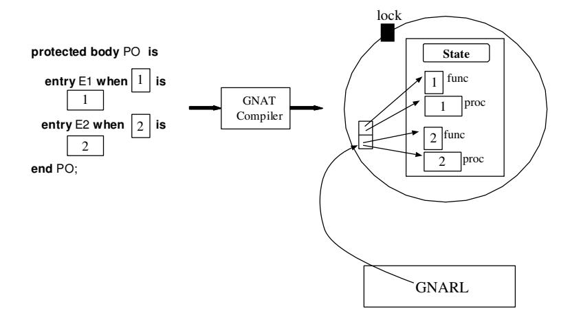

# Розділ 11. Розширення можливостей захищених об’єктів

Захищені об’єкти є втіленням давньої концепції „Монітора“ – механізму, який дозволяє різним потокам отримувати доступ до спільних даних у режимі взаємної виключності. Захищені об’єкти забезпечують синхронізацію між взаємодіючими задачами на основі даних: задачі обмінюються інформацією не лише через спеціальні точки зустрічі чи, що менш безпечно, через спільну пам’ять, а й шляхом дисциплінованого доступу до спільних об’єктів із використанням блокувань.

Захищений об’єкт (Protected Object) інкапсулює набір даних та дозволяє отримувати до них ексклюзивний доступ та здійснювати їх оновлення за допомогою захищених підпрограм чи процедур. Захищена функція надає лише можливість читання даних, тоді як захищена процедура дозволяє як читання, так і запис. Захищений елемент схожий на захищену процедуру, але має `Barrier` – це булева умова, яка слугує гарантом безпечного доступу до даних. Ця умова забезпечує умовний виклик елемента: потік, який звертається до об’єкта, отримує доступ до даних лише за умови, що значення `Barrier` є істинним; в іншому випадку викликаючий потік чекає в черзі, доки це значення не стане істинним та жодна інша задача не буде активною всередині захищеного об’єкта.

Оголошення захищеного типу складається з видимого інтерфейсу та приватної частини. Видимий інтерфейс містить лише операції цього типу (підпрограми та процедури). Приватна частина описує структуру захищених даних.

Тіло захищеного типу містить тіла всіх видимих операцій; воно також може містити приватні операції. У ньому не містяться жодні інші оголошення, що гарантує повний опис стану об’єкта за допомогою самої частини оголошення типу, призначеної для приватних елементів.

Під час виконання захищений об’єкт представляється у вигляді запису, який містить захищені дані, механізм блокування для забезпечення взаємно-ексклюзивного доступу та черги, які зберігають заблоковані завдання. Для кожного елемента існує власна черга, у якій знаходяться завдання, що очікують на можливість доступу до відповідного бар’єра. Сам об’єкт має одну чергу, у якій зберігаються завдання, що конкурують за право доступу до нього.

Виклик захищеної операції схожий на виклик входу у задачу. Як і у випадку з викликами входів у задачі, ініціатор виклику використовує відповідну нотацію компонентів для вказання цілі виклику (задача чи захищений об’єкт) та операції, яку потрібно виконати. Такий виклик може бути *простим*, *умовним* або *часовим*. Проте слід пам’ятати про важливу відмінність між викликами входів у задачі та захищених входів: у першому випадку бажану операцію виконує об’єкт, на який здійснюється виклик; у другому випадку операцію виконує сама задача-ініціатор, адже захищений об’єкт є пасивною структурою, позбавленою власного потоку виконання.

Після виконання захищеної операції стан об’єкта може змінитися, а значення обмежень – також. Тому необхідно повторно оцінити ці обмеження, щоб визначити, чи може якась з завдань, що очікують у черзі, тепер отримати доступ до об’єкта. Цю повторну оцінку має виконати саме те завдання, яке наразі утримує блокування об’єкта, тобто завдання, що щойно завершило виконання захищеного виклику. Це означає, що якщо існують завдання, записані у внутрішні черги об’єкта, а також завдання, що очікують “зовні” об’єкта (у зовнішній черзі для захищених підпрограм), то пріоритет матимуть саме ті завдання, які знаходяться у внутрішніх чергах. Це явище часто пояснюють за допомогою *моделі яєчної шкаралупи*: об’єкт має зовнішню “оболонку”, яка дозволяє пройти лише одному завданню за раз; всі внутрішні черги знаходяться всередині цієї оболонки, і вони можуть вміщувати будь-яку кількість заблокованих завдань. Очищення, яке відбувається після завершення операції, стосується лише завдань, що знаходяться всередині оболонки.

Подібно до завдань, захищені об’єкти можуть мати приватні записи та групи записів. Приватні записи безпосередньо не видимі для користувачів захищеного об’єкта; проте вони мають власні черги та зазвичай використовуються під час операцій повторної постановки завдань у чергу. Групи записів є масивами записів; під час виконання вони відповідають масивам незалежних черг. У тілі завдання оператор accept для елемента групи записів за допомогою відповідного виразу визначає, який саме елемент групи приймається. Це означає, що для різних елементів групи можуть бути передбачені різні оператори accept. Натомість у тілі захищеного об’єкта існує єдиний блок коду для всієї групи записів; індекс при цьому виступає додатковим параметром цього блоку. У умовах синхронізації цього блоку може використовуватися індекс групи (див. приклади використання у [BW98, розділ 7.5] та [Bar99, розділ 18.9]). Атрибут `Count` можна застосовувати до захищених записів для отримання поточної кількості завдань, які знаходяться у черзі на виконання.

Оскільки тривалість існування захищеного об’єкта та завдань, які ним користуються, не обов’язково збігається, можлива ситуація, коли захищений об’єкт зникає, а деякі завдання все ще перебувають у черзі на його обробку (наприклад, об’єкт міг бути створений динамічно та пізніше явно звільнений). У такому разі семантика мови вимагає генерування винятку Program Error для всіх завдань, які залишилися у черзі. Найпростішим способом реалізації цього механізму очищення є використання захищених об’єктів як типів типу Controlled. Процедура Finalize для таких типів перебирає всі черги відповідного об’єкта та генерує виняток Program Error для кожного завдання з них.

Щоб зрозуміти процес розширення структур, пов’язаних із захищеними типами, ми детально розглянемо відповідну модель реалізації. Після обговорення питань, які виникають під час виконання програми, ми описуємо процес розширення специфікацій захищених типів, захищених підпрограм, бар’єрів та тіл процедур. Процес розширення викликів захищених процедур тут не розглядається, оскільки він аналогічний до процесу розширення викликів задач (див. розділ 10).

## 11.1 Модель проксі

Як уже згадувалося вище, концептуально кожну захищену операцію виконує завдання, яке її ініціює. Проте функціонування захищеного об’єкта передбачає також виконання деяких допоміжних дій – зокрема перевірку бар’єрів; мова опису не визначає, який саме потік має виконувати ці дії. Семантика передбачає, що після завершення захищеної операції, яка може вплинути на стан об’єкта, бар’ери перевіряються одразу, щоб визначити, чи може яке-небудь з завдань отримати доступ до об’єкта; у цей момент теоретично може відбутися перемикання контексту. Однак якщо кілька завдань тепер мають право на вхід до об’єкта, кожне з них буде змушене чекати своєї черги; для спорожнення черг знадобиться низка перемикань контексту. Це підказує інший підхід до реалізації: завдання, яке завершило виконання власної операції, залишає блокування об’єкта та виконує код входу для очікуючих завдань *від їхнього імені*. Таким чином додаткові перемиканя контексту не потрібні. Для завдань, які мають право на вхід, це означає, що їхні виклики були оброблені та вони можуть продовжити виконання. Перший варіант реалізації, за якого кожне завдання виконує операцію, яку ініціює, називається моделлю `Self-Service`. Другий варіант називається моделлю `Proxy`.

Основними перевагами моделі самообслуговування є можливість більшого паралелізму (у багатопроцесорних системах) та спрощення аналізу можливості планування завдань. Паралелізм зростає тому, що у багатопроцесорній системі завершена задача може продовжувати свою виконання паралельно з виконанням наступного завдання з черги. Аналіз планування спрощується, оскільки потоку дозволяється негайно продовжити виконання після того, як (ймовірно, за обмежений проміжок часу) буде завершено виконання захищеної операції та передано право володіння блокування наступному виконавцю з черги.

Натомість головною перевагою моделі проксі є її простота. Якщо тіло процедури не може бути виконане негайно, завдання-викликач просто призупиняє свою роботу; інше завдання потім виконає цей виклик. Ця модель ще більше спрощує реалізацію складних функцій захищених об’єктів, зокрема таймерних та асинхронних викликів. Як зазначалося вище, на однопроцесорній системі модель проксі є більш ефективною, оскільки кількість перемикань контексту при цьому менша. Проте вона ускладнює аналіз можливості планування завдань: час завершення операції не залежить безпосередньо від самої операції, а залежить від кількості інших завдань, які можуть очікувати на обробку цим об’єктом; при цьому кількість таких очікуючих викликів не має верхньої межі.

GNAT використовує модель проксі, оскільки реалізація моделі самообслуговування з використанням Pthreads наразі призводить до значних неефективностей. Модель самообслуговування є найкращою тоді, коли задача, яка намагається звільнити захищений об’єкт, може безпосередньо передати блокування конкретній задачі, яка очікує на виконання операції `Open`. Проте під Pthreads не існує ефективного способу це зробити. Існуючий механізм вимагає підвищення пріоритету обраної задачі вище за пріоритет усіх інших задач, а потім повторного перегляду списку готових до виконання задач для визначення тієї, якій слід надати доступ. Це виявляється неприйнятно витратним з точки зору продуктивності.

### 11.1.1 Реалізація

Існує два можливі способи реалізації самої моделі-проксі: з використанням зворотних викликів та інлайновий спосіб. У першому випадку компілятор перетворює бар’єри та тіла входів на самостійні підпрограми, а потім генерує код для передачі їхніх адрес до середовища виконання; єдина процедура у середовищі виконання реалізує алгоритм, який викликає ці підпрограми (див. рисунок 11.1). Натомість при інлайновій реалізації компілятор не лише розширює бар’єри та тіла входів (причому не обов’язково всередині підпрограм), а й генерує безпосередньо в коді інструкції, які реалізують модель “яєчної шкаралупи”; після виконання захищеної процедури чи захищеного входу ці інструкції повторно перевіряють бар’єри та виконують тіла входів відкритих елементів, доки не залишиться жодного придатного кандидата (див. рисунок 11.2).

Компілятор GNAT використовує механізм зворотних викликів (callback). Причини цього такі: 1) Інтерфейс зворотних викликів дозволяє здійснювати трансляцію коду значно простіше, усуваючи частину накладних витрат, пов’язаних із частою зміною контексту між середовищем виконання GNU Ada та кодом програми при використанні інлайнового інтерфейсу. 2) Інтерфейс зворотних викликів має велику перевагу у простоті та зрозумілості як генерованого коду, так і внутрішньої логіки компілятора [GB95].



Рисунок 11.1: Модель проксі: реалізація механізму зворотного виклику.


Рисунок 11.2: Модель проксі: реалізація безпосередньо в коді.

## 11.2 Розширення списку захищених типів

### 11.2.1 Розширення специфікації захищених типів

Розширення захищеного типу має створювати наступні структури:

1. Тип запису, який зберігає захищені дані та черги виконання команд.

2. Підпрограми, які реалізують кожну із захищених операцій. Список параметрів кожної з таких підпрограм містить параметр, який вказує об’єкт, над яким виконується операція під час виконання програми.
Розглянемо наступну декларацію захищеного типу:

```ada
protected type PO (Disc : Integer) is
    procedure P (C : Character);
     function F (X : Integer) return Integer;
     entry E1;
     entry E2 (1 .. 10) (X : Integer);
private
    Value : Integer;
end PO;
```

Фронтенд розширює його наступним чином:

```ada
type poV (Disc : Integer) is new Limited_Controlled with
   record
      Value : Integer;
      _object : aliased GNARL.Protection_Entries
                                (Num_Entries);
   end record;

procedure Finalize (object : poV) is
begin
   --  Raise Program_Error to the queued tasks.
   ...
end Finalize;
```

Специфікація захищеного типу перетворюється на оголошення записового типу (рядки 1–6). Якщо у захищеному типі є дискримінанти, то записовий тип також має ті самі дискримінанти. Цей записовий тип визначається як обмежений та контрольований. Він є обмеженим, оскільки, за аналогією з типами завдань, захищені типи є обмеженими типами [AAR95, розділ 9.4(23)]; відтак вони не мають ні операції присвоєння, ні стандартних операторів порівняння. Крім того, він є контрольованим для реалізації описаної вище процедури очищення: під час завершення існування об’єкта кожен виклик, що залишився у будь-якій черзі вхідних запитів об’єкта, має бути видалений з цієї черги, а на місці відповідної операторної інструкції виклику має виникнути помилка програми [AAR95, розділ 9.4(20)]. Приватні дані PO перетворюються на компоненти оголошення записового типу (рядок 3). Поле *object* (рядок 4) містить додаткові дані під час виконання програми: блокувальний механізм, черги вхідних запитів, пріоритет об’єкта тощо.

### 11.2.2 Розширення захищених підпрограм

Для кожної захищеної операції Op компілятор GNAT генерує дві підпрограми: OpP (захищену версію) та OpN (незахищену версію). OpP просто блокує об’єкт, а потім викликає OpN. У OpN міститься (належним чином розширений) користувацький код. Якщо виклик є внутрішнім, тобто здійснюється з іншої операції того ж об’єкта, то відбувається прямий виклик OpN. Якщо ж виклик є зовнішнім, він реалізується як виклик OpP. Крім того, компілятор додає до параметрів захищених підпрограм ще один параметр – сам об’єкт. Оскільки захищені процедури можуть змінювати стан об’єкта, вони отримують його як параметр режиму **in out**. Захищені функції отримують об’єкт як параметр режиму **`in`**. Наприклад:

```ada
procedure procP (_object : in out poV; ...);
procedure procN (_object : in out poV; ...);
```

Посилання на компонент об’єкта в тілі операції має бути перетворене на посилання на компонент об’єкта під час виконання, до якого застосовується ця операція. Це досягається шляхом додавання оголошень про переімнування у розширені підпрограми. Наприклад, компонент Value з наведеного вище визначення призводить до наступного локального оголошення у всіх розширених підпрограмах:

```ada
Value : Integer renames _object.Value;
```

Локальні змінні, введені таким чином, у вихідному коді GNAT називаються Privals. Посилання на приватні компоненти замінюються на посилання на Privals у тілах захищених операцій. Розглянемо детально процес розширення підпрограми *procP*.

```ada
procedure procP (_object : in out poV; ...) is
   procedure Clean is
   begin
      GNARL.Service_Entries (_object._object'access);
      GNARL.Unlock (_object._object'access);
      GNARL.Abort_Undefer;
   end Clean;
begin
   GNARL.Abort_Defer;
   GNARL.Lock Write (_object._object'access);
   begin
      procN (_object; ...);
   exception
      when others =>
         declare
            E : Exception_Occurrence;
         begin
            GNARL.Save_Occurrence
              (E, GNARL.Get_Current_Exception);
            Clean;
            GNARL.Reraise (E);
         end;
   at end
      Clean;
   end;
end procP;
```

Захищені операції є операціями, у яких скасування виконання відкладається [AAR95, розділ 9.8(5-6)]. Тому підпрограма `P` звертається до середовища виконання з метою відкладення скасування (рядок 9) та отримання можливості читання/запису до захищеного об’єкта (рядок 10); після цього вона викликає підпрограму `N` (рядок 12). Після завершення виконання підпрограми `N` можливі два сценарії: по-перше, користувацький код не ініціював жодного винятку. У цьому випадку оператор `at-end` (рядок 24) – внутрішній елемент компілятора GNAT, який виконується незалежно від того, завершилось чи ні виконання коду успішно – викликає локальну підпрограму `Clean` для повторної перевірки бар’єрів та обробки черги вхідних викликів (рядок 4); після цього розблоковується захищений об’єкт (рядок 5) та скасування виконання відновлюється (рядок 6). По-друге, якщо під час виконання підпрограми `N` виник виняток, бар’єри необхідно перевірити ще раз, а чергу вхідних викликів обробити перед тим, як повернути цей виняток до задачі-викликача. Для цього обробник винятків зберігає інформацію про нього (рядок 18), викликає підпрограму `Clean`, а потім знову ініціює цей виняток (рядок 21).

### 11.2.3 Розширення бар’єрів для входу

Бар’єри входу реалізуються у вигляді функцій, які повертають значення типу boolean. Як і у випадку з іншими операціями, при цьому додається один параметр для визначення самого об’єкта. Бар’єри мають доступ до всіх компонентів об’єкта; тому під час їх реалізації застосовуються ті самі правила перейменування об’єктів, що й для інших захищених операцій. Фронтенд формує масив вказівників на функції бар’єрів, а під час виконання програми вони викликаються опосередковано. Процес розширення функціоналу бар’єрів виглядає так:

```ada
function Entry_Barrier
   (Object : Address;
    Entry_Index : Protected_Entry_Index)
   return Boolean
is
   <Discriminant_Renamings>
   <Private_Object_Renamings>
begin
   return Barrier_Expression;
end Entry Barrier;
```

### 11.2.4 Розширення тіл записів

Подібно до бар’єрів, тіла вхідних пунктів розгортаються у процедури з такою ж структурою. Вони розгортаються наступним чином:

```ada
procedure EntryName
   (Object      : Address;
    Parameters  : Address;
    Entry Index : Protected_Entry_Index)
   is
      <Discriminant Renamings and Private Object Renamings>
      type poVP is access poV;
      function To_PoVP is new Unchecked_Conversion (Address, PoVP);
      _object : PoVP : = To_PoVP (Object);
begin
   <Entry body statements>
   GNARL.Complete_Entry_Body (_object._object);
exception
   when others =>
      GNARL.Exceptional_Complete_Entry_Body
      (_object._object, GNARL.Get_GNAT_Exception);
end EntryName;
```

Подібно до підпрограм типу `N` (див. розділ 11.2.2), компілятор здійснює певні перейменування для полегшення доступу до дискримінантів та приватного стану об’єкта (рядок 6). Оскільки процедура отримує як параметр адресу об’єкта (а не сам об’єкт), фронтенд також генерує неперевірене перетворення цієї адреси на відповідний доступ до об’єкта (рядки 7–9). Крім того, фронтенд генерує виклики для повідомлення середовища виконання про успішне виконання операторів entrybody (рядок 12) або про невдале їх виконання (рядок 15).

### 11.2.5 Таблиця перешкод та елементів входу

Окрім створення бар’єрів та розширених тіл процедур, описаних вище, фронтенд також генерує таблицю, ініціалізовану даними про доступ до розширених підпрограм. Кожен елемент цієї таблиці містить інформацію про доступ до функції з розширеним бар’єром та до процедури з розширеним тілом. Крім того, фронтенд генерує виклик до середовища виконання для передачі цієї таблиці; її використовує середовище виконання для перевірки бар’єрів та виклику відповідної процедури.

### 11.2.6 Розширення сімейств записів

Для кожної родини записів фронтенд додає один поле до опису типу PO. Це поле зберігає межі специфікації родини записів. Тип елементів у цих масивах встановлений як void, оскільки їхній вміст не використовується. Після цього захищений тип розширюється наступним чином:

```ada
type poV (Discriminants) is new Limited_Controlled with
record
   <Private Data>
   _object : aliased GNARL.Protection_Entries(Num_Entries);
   Entry_Family_Name : array (Bounds) of Void;
end record;
```

## 11.3 Оптимізації

Для реалізації простих та ефективних режимів синхронізації іноді достатньо використовувати захищений об’єкт без жодних записів. Такий об’єкт можна реалізувати більш ефективно, і він розпізнається фронтендом GNAT. У результаті отримується спрощена структура, як показано у наступному прикладі:

```ada
type poV (Discriminants) is limited record
   <private-data-fields>
   _object : aliased Protection;
end record;
```

Оскільки зараз у захищеного об’єкта немає черг, його розширений тип спрощується наступним чином: 1) він не є контрольованим типом, адже немає потреби генерувати помилку програми для записів у черзі; 2) компонент об’єкта став меншим (тип `Protection` містить лише блокування об’єкта та обмеження на кількість об’єктів).

У разі відсутності записів у захищених об’єктах середовище виконання також може забезпечити швидшу реалізацію операцій з ними. Для цієї мети середовище виконання GNAT надає другий набір підпрограм, які викликаються розширеним кодом у випадку захищених об’єктів без записів (див. пакет System.Tasking.Protected_Objects). Крім того, розширювач не генерує виклик для повторної перевірки умов доступу після виконання тіла захищеної процедури.

## 11.4 Підсумок

Існує два підходи для реалізації захищених об’єктів: модель із самообслуговуванням та проксі-модель. GNAT використовує проксі-модель, оскільки реалізація моделі із самообслуговуванням з використанням Pthreads є економічно невигідною. Також існують два основних варіанти реалізації проксі-моделі: інлайнова та з використанням механізму зворотного виклику (callback). Головна відмінність між цими підходами полягає у процедурі обробки запитів на обслуговування: у інлайновій моделі вона генерується експандером; у моделі з використанням зворотного виклику – вбудована в середовище виконання. GNAT обрав саме другий підхід, адже він дозволяє значно простіше виконувати трансляції, а отриманий код стає більш зрозумілим.

Захищені підпрограми перетворюються на дві підпрограми: P та N. Підпрограма P отримує блокувальний захисний механізм, а потім викликає підпрограму N, в якій знаходиться користувацький код. Бар’єри розширюються у функції, що повертають значення булевого типу; тіла входів, у свою чергу, розширюються у процедури. Крім того, фронтенд генерує таблицю з посиланнями на ці підпрограми. Ця таблиця використовується середовищем виконання для перевірки бар’єрів та виклику відповідного тіла входу.
