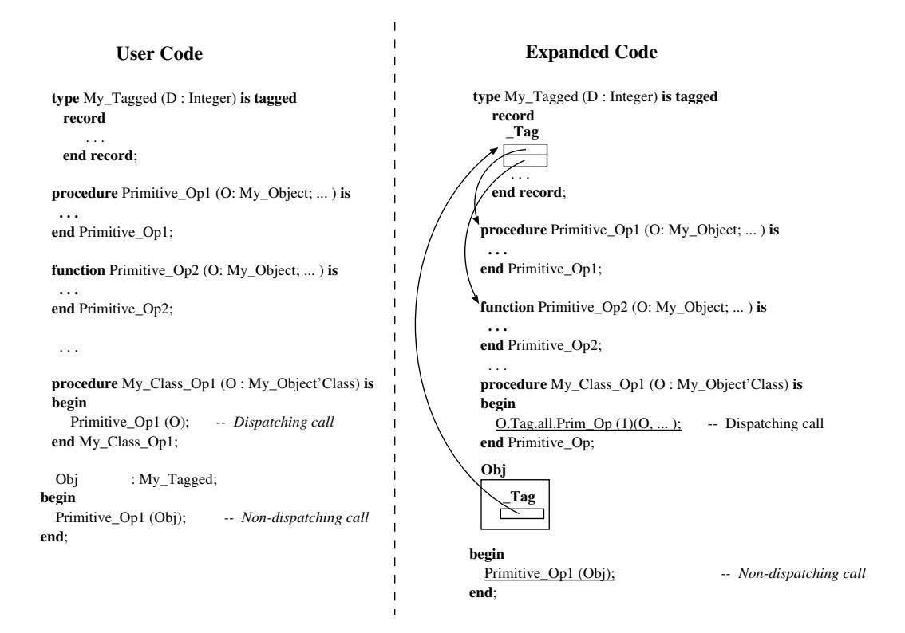

# Розділ 13. Розширення типів із мітками

Теговані типи забезпечують лінгвістичну підтримку двох основних концепцій об’єктно-орієнтованого програмування: розширення типів та успадкування. У Ada95 тегований тип визначає клас, який позначає множину типів, що походять від спільного кореня; таким чином вони мають спільні властивості та дають можливість для *програмування на рівні класу*. Зауважте, що слово **клас** має дещо інше значення у більшості інших об’єктно-орієнтованих мовах – там воно позначає окремий тип, а не ієрархію типів.

Важливо чітко розрізняти *примитивні операції* тегованого типу, які мають один або кілька параметрів відповідного типу (або анонімний доступ до нього), та підпрограми, що оперують з об’єктами загального класу (або з посиланнями на такі об’єкти). Перші успадковуються під час розширення типу та можуть перевизначатися в розширенні; кожна версія діє лише для свого конкретного типу. Натомість підпрограми, які приймають параметри загального класу, мають єдине визначення та застосовуються до всіх елементів класу. Динамічний диспетчинг відбувається щоразу, коли викликається примитивна операція, і (принаймні) один з її формальних параметрів має конкретний тегований тип, а відповідний фактичний параметр є типу загального класу; такий параметр називається *контролюючим аргументом*. Тег фактичного параметра визначає, яку саме версію примитивної операції слід викликати.

Більша частина реалізації типів з мітками в GNAT ґрунтується на ідеях, викладених у [Dis92] та [CP94]. У цьому розділі описано основні аспекти цієї моделі.

## 13.1 Мітковані та поліморфні об’єкти

Інтуїтивна ідея, яка лежить в основі тегованих типів, полягає у тому, що значення такого типу містять *тег*, який, серед іншого, використовується для зв’язування значення під час виконання програми з його початковим типом та операціями, що до нього застосовуються. Цей тег дає змогу просто реалізувати дії, специфічні для певного типу під час виконання програми – наприклад, динамічний вибір функцій чи перевірку належності до типу. Розглянемо наступну декларацію кореневого тегованого типу:

```ada
type My_Tagged is abstract tagged
    record
       ...
    end record;
```

Його перетворює фронтенд GNAT шляхом додавання нового компонента; тип цього компонента визначений у Ada.Tags.

```ada
type My_Tagged is abstract tagged
    record
       _Tag : Tags.Tag;
       ...
    end record;
```

Кожен тип з власним тегом має копію цього тега, яка додається до кожного об’єкта даного типу. Значенням цього тега є вказівник на специфічну для типу область даних, яка насамперед містить таблицю примітивних операцій для цього типу. Ця таблиця створюється у момент фіксації типу. Тег об’єкта є постійним та не може бути змінений після його створення. (Зауважимо, що конвертація не впливає на тег об’єкта; її метою є можливість розглядати об’єкт як представника іншого класу – це так звана візуальна конвертація – але фактично не змінює значення тега, яке зберігається в об’єкті).

За визначенням розширення типу успадковує всі компоненти від батьківського типу. Ми могли б описати таке розширення, явно скопіювавши всі оголошення компонентів батьківського типу та додавши до них компоненти розширення. Проте набагато простіше описувати усі успадковані компоненти як частину єдиного колективного компонента, який називається Parent. Ось таке розширення типу:

```ada
type My_Ext_Tagged is new My_Tagged with
   record
      ...
   end record;
```

Воно розгортається наступним чином:

```ada
type My_Ext_Tagged is
    record
       _Tag     : Tags.Tag;
       _Parent : My_Tagged;
       ...
    end record;
```

Головною перевагою цього підходу є те, що він перетворює розширення записів на звичайні записи.

З багатьох причин є обов’язковою вимогою, щоб будь-яке поле у типі з тегами зберігало однакову позицію в записі у всіх похідних типах. По-перше, динамічний виклик методів залежить від значення тега; тому тег має знаходитися в однаковому місці у всіх типах з тегами. Крім того, для об’єкта класу, чий фактичний тип стає відомим лише під час виконання програми, вибір будь-якого компонента був би неможливим (або надзвичайно неефективним), якби позиція поля залежала від типу. Завдяки тому, що всі успадковані компоненти концептуально розглядаються як частина єдиного батьківського типу компонентів, гарантується дотримання структури цього типу. Цей компонент вставляється на початок запису; після нього йдуть компоненти розширення.

## 13.2 Таблиця диспетчеризації

Диспетчерський виклик полягає у виборі та виклику такої версії примітивної операції, яка підходить за типом для її керуючого аргументу. Нагадаємо, що в Ada95, на відміну від C++, те, чи є виклик диспетчерським, залежить від наявності у аргументів класової прив’язки (class-wide actual). Якщо аргументи мають статичну типізацію, компілятор може самостійно визначити потрібну операцію для виклику. Якщо ж один із аргументів має динамічну типізацію, виклик має відбуватися опосередковано: необхідно вибрати відповідну операцію з **таблиці диспетчеризації** для типу цього аргументу. Таблиця диспетчеризації – це таблиця адрес підпрограм; диспетчерський виклик, по суті, є опосередкованим викликом через певний елемент цієї таблиці. Позиція кожної примітивної операції в таблиці визначається компілятором; тому під час виклику використовується статичне зміщення для обчислення адреси потрібної підпрограми (див. рисунок 13.1).

На лівій стороні рисунка 13.1 показано оголошення типу з тегами, кілька примітивних підпрограм, визначених користувачем для цього типу (My Primitive OpN), одну непримітивну підпрограму-диспетчеризатор (My Class Op1) та оголошення об’єкта цього типу (Obj).



Рисунок 13.1: Приклад таблиці диспетчеризації.

А також виклик однієї з примітивних операцій без механізму диспетчеризації. Праворуч ми показуємо розгорнутий код, сгенерований фронтендом GNAT. Тип із тегом формує структуру даних, яка по суті є масивом адрес; центральним елементом цієї структури є таблиця диспетчеризації (пізніше ми розглянемо інші компоненти **даних, специфічних для типу**). Фронтенд також генерує код для ініціалізації таблиці диспетчеризації – в ній зберігаються адреси примітивних підпрограм даного типу. У об’єкті компонент тегу є вказівником на таблицю диспетчеризації.

Окрім диспетчеризації викликів, ще однією заздалегідь визначеною операцією, яка потребує інформації про тип під час виконання програми, є перевірка належності: *X in T*. Коли `T` є конкретним типом з тегами, ця перевірка полягає просто у підтвердженні того, що тег об’єкта X вказує на таблицю диспетчеризації для типу T (для зручності тег типу T також зберігається у специфічних для цього типу даних). Якщо ж перевірка має вигляд *X in T'Class*, завдання стає складнішим, адже тег об’єкта X може вказувати на будь-якого нащадка типу T. Для цієї перевірки існують два варіанти реалізації. Перший полягає у збереженні у специфічних для типу даних вказівника на таблицю диспетчеризації безпосереднього предка. У цьому випадку перевірка належності полягає у проходженні списку таблиць диспетчеризації предків; результат буде True, якщо під час цього проходження знайдеться таблиця для типу `T`. Другий варіант передбачає збереження у специфічних для типу даних тегів усіх предків разом із глибиною успадкування (загальною кількістю предків типу, тобто відстанню до кореня в ієрархії типів). Різниця у цих глибинах між типом `X` та типом `T` вказує на точне місце, де потрібно шукати `T` у таблиці тегів предків, аби перевірка була успішною. GNAT використовує саме другий підхід, адже він гарантує, що обчислення результату перевірки належності займає постійний час (деталі дивіться у розділі 13.3).

## 13.3 Примітивні операції

Для всіх типів з тегом існують наступні підпрограми, які повертають результати відповідних атрибутів. Тіла цих підпрограм генеруються на стороні клієнта у момент фіксації типу. Зазвичай ці підпрограми мають бути диспетчеризованими, адже вони можуть застосовуватися до об’єктів усього класу, а отриманий результат залежатиме від фактичного підтипу об’єкта: вирівнювання, розмір, читання, запис, введення та виведення. Крім того, для типів без обмежень з тегом існують додаткові підпрограми, які реалізують операції диспетчеризації для таких стандартних операцій, як порівняння, присвоєння, глибока фіналізація та глибоке коригування. Останні дві є порожніми процедурами, якщо лише тип не містить елементів, які потребують виконання дій під час фіналізації (слово „глибока“ у їхній назві означає, що операція застосовується рекурсивно до всіх відповідних компонентів; див. розділ 12).

Наприклад, припустимо, що у нас є такий опис типу з тегами:

```ada
type My_Record is tagged
   record
      My_Data : Integer;
   end record;
```

Фронтенд GNAT генерує еквівалент наступного розгорнутого коду з нього:

```ada
--  Declaration of the type specific data
type My_Record_Data is record
   DT      : array (1 . . 11) of Address;     --  Dispatch table
   TSD     : array (1 . . 3)  of address;     --  Ancestor info
   _Parent : Tags.Tag : = DT'Address;         --  Tag of the type
   _F      : Boolean : = True;
   _E      : constant String : = "My_Object"; --  Debug info
end record;

function _Alignment
   (X : My_Record) return Integer;
function _Size
   (S : My_Record) return Integer;
procedure Read
   (S : Root_Stream_Type; V : out My_Record);
procedure Write
   (S : Root_Stream_Type; V : My_Record);
function _Input
   (S : access Root_Stream_Type) return My_Record;
procedure Output
   (S : access Root_Stream_Type; V : My_Record);
function "="
   (X : My_Record; Y : My_Record) return Boolean;
procedure Assign
   (X : out My_Record; Y : My_Record);
procedure Deep_Adjust
   (L : in out Finalizable_ptr;
    V : in out My_Record;
    B : Integer);
procedure Deep_Finalize
   (V : in out My_Record; B : Boolean);
...
--  The initialization code for the dispatch table includes
--  the following for all primitive operations
   My_Record_Data.DT (1) := _Alignment'Address;
   My_Record_Data.DT (2) := _Size'Address;
...
```

Формат таблиці диспетчеризації в GNAT можна налаштовувати так, щоб він відповідав формату, який використовується в інших об’єктно-орієнтованих мовах. GNAT підтримує програми, які водночас використовують два різні формати таблиць диспетчеризації: нативний формат, що підтримує типи з тегуванням у мові Ada 95 та описаний у модулі Ada.Tags; та сторонній формат для типів, імпортованих з інших мов (зазвичай C++), який описаний у файлі interfaces.cpp. Для користувача передбачено кілька прагм, які дозволяють визначити позицію тега у сторонньому форматі. Булеве поле (F) використовується для цілей обробки програми під час етапу еліборації. Нарешті, назва типу з тегуванням записується у поле рядкового типу (E); це поле використовується відладчиком.

Після визначення типу запису експандер створює тіла стандартних примітивних операцій. За замовчуванням тіла операцій «Читання», «Запис», «Глибоке коригування» та «Глибока фіналізація» залишаються порожніми. Інші підпрограми розширюються наступним чином:

```ada
function _Alignment (X : My_Record) return Integer is
begin
    return X' Alignment;
end Alignment;

function _Size (X : My_Record) return Integer is
begin
    return X'Size;
end _Size;

function _Input (S : Root_Stream_Type) return My_Record is
    V : My_Record;
begin
    _Read (S , V);
    return V;
end _Input;

procedure _Output (S : access Root_Stream_Type;
                   V : My_Record) is
begin
   _Write (S , V);
end _Output;

function "=" (X : My_Record; Y : My_Record) return Boolean is
begin
    return X.My_Data = X.My_Data;
end "=";

procedure _Assign (X : out My_Record; Y : My_Record) is
begin
   if not (X'Address = Y'Address) then
      declare
         Aux : Tags.Tag : = X.Tag;
      begin
         X : = Y;
         X.Tag : = Aux;
      end;
   end if;
exception
   when others =>
      GNARL.Undefer.all;
      raise Program_Error;
end _Assign;
```

Методи Alignment та Size повертають значення відповідних атрибутів об’єкта; методи Input та Output викликають відповідні примітиви читання та запису (за замовчуванням обидва мають значення null, тож нічого не відбувається); символ “=” розширюється у необхідний код для порівняння всіх користувацьки визначених компонентів типу. Тіло примітива Assign, на перший погляд, складається лише з конструкції `X:=Y`. Проте сформований код захищає користувача від самоприсвоєння (`X:=X`), яке є помилковим у випадку, якщо об’єкт знаходиться під контролем (остаточне видалення старого значення лівої частини призведе до знищення самого об’єкта). Крім того, для коректної обробки присвоєння, коли права частина є результатом перетворення типу, спочатку необхідно зберегти тег цільового об’єкта, виконати саме присвоєння та в кінці відновити початковий тег. Розглянемо наступний приклад:

```ada
declare
   type My_Record is tagged
      record
         Some Data : Integer;
      end record;

   type My_Extension is My_Record with
      record
         More_Data : Character;
      end record;

   Obj1 : My_Record;
   Obj2 : My_Extension;
begin
   Obj1 : = My_Record (Obj2);  --  Explicit conversion
end;
```

Після опрацювання цих двох об’єктів тег Obj1 вказує на таблицю диспетчеризації для типу My_Record, а тег Obj2 – на таблицю диспетчеризації для типу My Extension. Процес перетворення не змінює значення тега Obj2; він лише свідчить про те, що у контексті присвоєння Obj2 слід розглядати як об’єкт, який успадковує тип My Extension. Якби компілятор реалізував це присвоєння шляхом копіювання всього вмісту об’єктів, тег Obj1 почав би вказувати на таблицю диспетчеризації типу My Extension, що було б явною помилкою.

## 13.4 Підсумок

Об’єкти типів із тегами містять *тег*, який під час виконання використовується для реалізації таких об’єктно-орієнтованих понять, як поліморфізм та динамічний диспетчинг. Розширювач GNAT перетворює такі типи на записові типи, які містять таблицю диспетчеризації; тег в об’єкті є вказівником на цю таблицю. Об’єкти типів-розширень містять спеціальний компонент, який відповідає за всі компоненти, успадковані від батьківського типу. Фронтенд GNAT генерує низку примітивних операцій диспетчеризації для різних атрибутів типу, а також код для ініціалізації таблиці диспетчеризації шляхом вставки в неї адрес усіх цих операцій.
