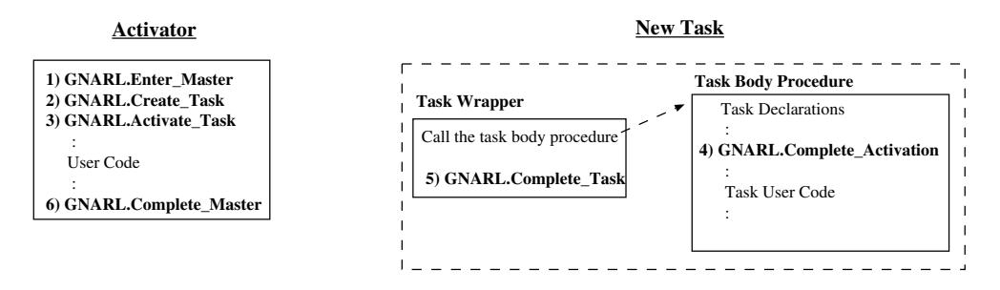

# Розділ 14. Постановка завдань

Семантика задач у Ada вимагає наявності підтримки на рівні виконання для виділення пам’яті, планування завдань та міжзадачної комунікації. Зазвичай ці функції виконує ядро операційної системи. Проте вимоги Ada щодо семантики настільки специфічні, що навряд чи якась існуюча операційна система надасть такі служби у формі, придатній для безпосереднього використання згенерованим кодом. Внаслідок цього під час виконання компілятор має додавати процедури, які забезпечують підтримку семантики задач у Ada на основі примітивів ОС; в іншому випадку необхідно створювати власне ядро для керування задачами для додатків, що запускаються на „голих“ платах.

Середовище виконання GNAT припускає наявність у цільовій системі функціональності, еквівалентної бібліотеці потоків POSIX (pthreads). Додаткова інформація про кожну задачу Ada під час виконання (стан задачі, батьківська задача, ініціатор запуску тощо [AAR95, Розділ 9]) зберігається у окремому записі для кожної задачі, який називається *Контрольним блоком задачі Ada (ATCB)*.

## 14.1 Блок керування задачами Ada

Контрольний блок задачі Ada (ATCB) є дискримінованим записом; його дискримінантом є кількість вхідних точок задачі. Центральною складовою ATCB є масив черг, розмір якого визначається цим дискримінантом. Для підтримки механізму дискримінантів задач у Ada95 та деяких атрибутів задач фронтенд генерує додатковий запис (про який детально йдеться у розділі 9.4). Під час створення задачі середовище виконання генерує новий ATCB та пов’язує його з відповідним записом високого рівня та блоком керування потоками (Threads Control Block, TCB) на рівні POSIX (див. рисунок 14.1). Крім того, середовище виконання GNAT додає новий ATCB до зв’язаного списку `All_Tasks_List`. ATCB завжди додаються у порядку LIFO (як у стеку). Відповідно,

Компілятор T_TaskV T_TaskV Згенерований код Дискримінанти Дискримінанти Рівень Ідентифікатор завдання Ідентифікатор завдання Родина елементів Родина елементів Пріоритет Пріоритет _ _Розмір_ _ _Розмір_ Інформація про завдання Інформація про завдання Назва завдання Назва завдання `GNARL` Рівень ATCB ATCB Аргумент завдання Аргумент завдання Стан Стан Батьківське завдання Батьківське завдання Активатор Активатор Головне завдання Головне завдання System.Tasking Список усіх завдань Список усіх завданнях Список усіх завдань Потік Потік -Змінна_умови Змінна умови Блокування Блокування `POSIX` TCB TCB Рівень Аргумент Аргумент

Перший елемент у цьому списку відповідає найновіше створеній задачі.

Рисунок 14.1: Інформація під час виконання, пов’язана з кожним завданням.

## 14.2 Стани завдань

GNAT визначає чотири основні стани протягом життєвого циклу задачі. Поточний стан вказується у полі `State` структури ATCB:

– `Неактивовано`. Об’єкт завдання було створено та додано до списку `All_Tasks_List`, але жоден потік керування не призначений для виконання його тіла.  
– `Готове до виконання`. Завдання знаходиться у процесі виконання (хоча може чекати на отримання м’ютекса).  
– `Призупинено`. Виконання завдання заблоковано. Це може статися, коли завдання змушене чекати на якусь зовнішню подію. Примерами таких
Події — це самостійно ініційовані затримки в часі, припинення виконання підпорядкованого завдання та завершення операцій, пов’язаних з міжзавдальною комунікацією. Завдання, яке не заблоковане, вважається готовим до виконання.
- `Terminated`: Завдання було завершено відповідно до положень пункту 9.3(5) стандарту ARM. Усі елементи залежності, які очікували на виконання альтернативних варіантів команди **`terminate`** у мові Ada, були пробуджені та самостійно завершили свою роботу.
Стан сну складається з наступних підстанів:

- `Activator_Sleep`: Очікування завершення активації створених завдань.  
- `Acceptor_Sleep`: Очікування на виконання операції прийняття або вибіркового очікування.  
- `Entry_Caller_Sleep`: Очікування на виконання вхідного виклику.  
- `Async_Select_Sleep`: Очікування для початку виконання тієї частини асинхронної операції вибору, яка може бути перервана.  
- `Delay_Sleep`: Очікування на виконання операції вибору, у якій доступним є лише варіант затримки.  
- `Master_Completion_Sleep`: Завершення роботи майстра складається з двох фаз. На першій фазі завдання, яке саме завершило обробку майстра, очікує, поки завдання, залежні від цього майстра, завершаться або перейдуть у фазу завершення.  
- *Master Phase 2 Sleep*: На другій фазі завдання знаходиться у стані очікування в модулі Complete Master, чекаючи, поки завдання з альтернатив завершення також завершать свою роботу.
## 14.3 Створення та завершення завдань

Згідно з семантикою Ada, усі задачі, створені під час обробки оголошень об’єктів у одній декларативній області (включаючи підкомпоненти оголошених об’єктів), активуються одночасно. Аналогічно, усі задачі, створені в результаті виконання одного оператора алокації, також активуються разом [AAR95, розділ 9.2(2)]. Крім того, якщо під час обробки декларативної частини виникає виняток, то будь-яка задача T, створена під час цієї обробки, завершується та ніколи не активується. Оскільки сама задача T не може обробити цей виняток, мова вимагає, щоб батьківська (створювальна) задача впоралася з цією ситуацією: у контексті активації генерується вже заздалегідь визначений виняток `Tasking_Error`.

Для реалізації цієї семантики середовище виконання GNAT використовує допоміжний список – `Activation_List`. Передній модуль розширює оголошення об’єкта, вводячи локальну змінну в поточній області видимості, яка зберігає цей список активації (див. розділи 9.1 та 9.6), а також розділяє виклик операційної системи для створення нового потоку на два окремі виклики до середовища виконання GNAT: (1) Create Task – який створює та ініціалізує новий об’єкт ACTB, а також додає його як у загальний список завдань, так і у список активації; (2) Activate Task – який перебирає елементи списку активації та активує нові потоки.

Щодо завершення виконання завдань, то поняття *майстра*[AAR95, розділ 9.3] є фундаментальним для семантики мови (див. також розділ 9.2). По суті, майстер визначає певну область дії; після завершення цієї області середовище виконання зобов’язане зачекати на завершення всіх залежних від неї завдань, перш ніж ініціювати закінчення роботи інших об’єктів, створених у межах цієї області. Для реалізації цього механізму фронтенд генерує виклики підпрограм середовища виконання Enter Master та Complete Master на початку та наприкінці області дії майстра (або, у випадку завдань, за допомогою підпрограм Create Task та Complete Task). Середовище виконання GNAT асоціює один ідентифікатор з кожним майстром; до кожного ж завдання прив’язано два ідентифікатори: майстра його батьківського елемента (`Master_Of_Task`) та рівень вкладеності майстра (`Master_Within`). Спосіб ідентифікації майстрів дозволяє впорядкувати їх; тож майстер, від якого залежить інший майстер, завжди має ідентифікатор, більший за ідентифікатор його власного майстра.

Зазвичай рівень мастер-завдання на один вищий за зовнішній рівень мастер-завдань. Це значення збільшується за допомогою функції Enter Master, яка викликається у випадку, якщо саме завдання має залежні завдання. Для завдання середовища це значення встановлюється на 1. Завдання середовища – це потік операційної системи, який ініціалізує робочий час виконання програми та запускає головну підпрограму Ada. Перед викликом головної процедури програми на мові Ada завдання середовища готує всі бібліотечні модулі, необхідні для її роботи. Цей процес призводить до створення та активації завдань на рівні бібліотеки ще до початку виконання головної процедури. Рівень мастер-завдання 2 призначений для серверних завдань системи виконання (так званих „незалежних завдань“), а рівень 3 – для завдань на рівні бібліотеки.

Параметр `Master_Of_Task` встановлюється у значення 1 для завдань середовища. Рівень 2 призначений для завдань сервера під час виконання (так званих `Independent_Tasks`), а рівень 3 – для завдань на рівні бібліотеки. Під час створення завдання воно успадковує внутрішній рівень вкладеності від свого батьківського завдання (початкове значення параметра `Master_Of_Task` ініціалізується поточним значенням параметра `Master_Within` у батьківському завданні). Це значення залишається незмінним протягом усього життєвого циклу нового завдання та використовується для забезпечення дотримання семантики Ada під час завершення виконання завдань.

```ada
New_Task.MasterOfTask := Activator.Master_Within
```

Значення параметра `Master_Within` встановлюється як значення `Master_Of_Task` плюс один. Коли завдання потрапляє у область з залежними від нього завданнями, його внутрішній рівень вкладеності збільшується на одиницю.

Завдання, створені алокатором, не обов’язково залежать від свого активатора; натомість вони залежать від майстра, який визначає тип доступу. У такому разі завершення роботи активатора може відбутися раніше за завершення новоствореного завдання [AAR95, розділ 9.2(5a)]. Отже, майстром завдання, створеного в результаті виконання алокатора, є область оголошень, яка містить визначення відповідного типу доступу. Для завдань, оголошених у пакетах рівня бібліотеки, майстром є основна програма; це означає, що основна програма не може завершитися, доки не завершаться всі завдання рівня бібліотеки [BW98, розділ 4.3.2]. На рисунку 14.2 узагальнено основні концепції, які використовуються системою виконання для обробки завершення роботи завдань у мові Ada.

| Батьківський завдання | Завдання, яке виконує майстра, від якого залежить T. |
|----------------------|------------------------------------------------------|
| Активатор            | Завдання, яке створило ATCB для T та активувало його. |
| Майстер завдання     | Область дії Батьківського завдання, від якої залежить T. |
| Рівень вкладеності   | Рівень вкладеності завдань, від яких залежить T.       |

Рисунок 14.2: Визначення понять «Батьківський елемент», «Активатор», «Керуючий об’єкт завдання» та «Внутрішній керуючий об’єкт».

`Приклад`

Щоб краще зрозуміти ці концепції, застосуємо їх до наступного прикладу:

```ada
procedure P is
   --  P : Parent = Environment_Task;
   --      Activator = Environment
   --      Master_Of_Task = 1; Master_Within = 2;

   task T1;
   --  T1 : Parent = P; Activator = P
   --       Master_Of_Task = 2; Master_Within = 3;
   task body T1 is

      task type TT;
      task body TT is
      begin
         null;
      end TT;

      type TTA is a c c e s s TT;

      T2 : TT;
      --  T2 : Parent = T1; Activator = T1
      --        Master_Of_Task = 3; Master_Within = 4;

      task T3;
      --  T3 : Parent = T1; Activator = T1
      --       Master_Of_Task = 3; Master_Within = 4;
      task body T3 is
         task T4;
         --  T4 : Parent = T3; Activator = T3
         --       Master_Of_Task = 4; Master_Within = 5;
         task body T4 is
         begin
            null;
         end T4;
         T5 : TT;
         --  T5 : Parent = T3; Activator = T3
         --       Master_Of_Task = 4; Master_Within = 5;
         T6 : TTA : = new TT;
         --  T6 : Parent = T1; Activator = T3
         --       Master_Of_Task = 2; Master_Within = 3;
      begin
         null;
      end T3;
    begin
       null;
    end T1;
begin
   null;
end P;
```

Батьківський елемент та активатор не збігаються для T6, адже завдання створюється за допомогою алокатора; у цьому випадку батьківським елементом нового завдання є завдання, у якому оголошується тип доступу, а активатором — завдання, яке виконує алокатор. У всіх інших вищезазначених випадках батьківський елемент та активатор збігаються.

Оператор переривання призначений для використання у випадках виникнення таких умов помилки, коли відновлення виконання завдання вважається неможливим. У мові визначено певні операції, під час виконання яких процедуру переривання слід відкласти [BW98, розділ 10.2.1]. Крім того, виконання деяких критичних етапів роботи середовища виконання також необхідно відкладати для збереження його стабільного стану. Для цього середовище виконання GNAT використовує пару підпрограм – Abort Defer та Abort Undefer; їх викликає код, сгенований компілятором переднього контуру, для оточення операцій, які не можна переривати: завершення виконання завдань (див. розділ 9.5), оператори зв’язку між завданнями (див. розділ 10) та захищені об’єкти (див. розділ 11). Реалізація цих примітивів детально розглядається у розділі 20.

## 14.4 Підпрограми під час виконання для створення та завершення завдань

У розділі 9.6 обговорювався порядок викликів функцій середовища виконання, які здійснює розширений код у момент створення та завершення завдань. На рисунку 14.3 зображено цю послідовність. Кожен прямокутник позначає підпрограму; ромб – нове завдання.



Рисунок 14.3: Підпрограми GNARL, які викликаються під час життєвого циклу завдання

### Завдання
Перекладіть текст, призначений для користувача, у наведених нижче даних у форматі Markdown на українську мову.

### Суворі правила
1. Збереження структури: Ви ПОВИННІ точно зберегти початкову структуру, ієрархію та відступи Markdown-даних.
2. Вибірковий переклад: Перекладайте ЛИШЕ видимий текст, призначений для користувача.
3. Суворе неперекладання: НІКОЛИ не перекладайте та не змінюйте теги коду, ключі, властивості, назви об’єктів чи змінні-заповнювачі. Залишайте їх у початковому англійському/кодовому вигляді.
### Вихідні дані
Вся послідовність є наступною:

1. `Enter_Master` викликається у межах області видимості Ada, де оголошується завдання або алокатор, що визначає об’єкти, які містять завдання.

2. `Create_Task` викликається для створення ATCB нових завдань та їх додавання до списку всіх завдань та до ланцюга активації (див. розділ 14.4.3).

3. `Activate_Tasks` викликається для створення нових потоків та їх прив’язки до нових ATCB у ланцюзі активації. Після створення всіх потоків активатор блокується, доки вони не завершать обробку своєї декларативної частини.

   Потік, пов’язаний із новим завданням, виконує процедуру *task-wrapper*. Ця процедура містить локально оголошені об’єкти, які слугують даними для виконання завдання під час роботи. Процедура task-wrapper викликає `Task_Body_Procedure` (процедуру, згенеровану компілятором та що містить користувацький код завдання); ця процедура обробляє оголошення у декларативній частині завдання, встановлюючи локальне середовище для подальшого виконання команд. Зауважимо, що якщо у цих оголошеннях також є об’єкти типу завдання, відбувається ланцюгова активація: це завдання стає активатором для залежних завдань і не може почати виконання свого користувацького коду, доки всі залежні завдання не завершать свою активацію.

4. `Complete_Activation` викликається тоді, коли новий потік завершує обробку всіх оголошень завдань, але ще до виконання першої команди у тілі завдання. Цей виклик сигналізує активатору про те, що йому більше не потрібно чекати на завершення активації цього завдання. Якщо це останнє завдання у списку активації, яке завершило свою активацію, активатор розблоковується.

   Після цього активатор та нові завдання виконуються паралельно; їх виконання контролюється планувальником POSIX. Будь-який з них може завершити своє виконання, тож наведені нижче кроки можуть виконуватися у довільному порядку.

5. `Complete_Task` викликається після завершення виконання завданням своїх команд. Це може статися внаслідок досягнення кінця послідовності операторів або через інші причини – наприклад, виняток чи команда abort (див. розділ 20). Хоча завершене завдання більше не може виконуватися, на цьому етапі ще небезпечно звільняти виділену для нього пам’ять, адже до нього все ще можуть звертатися інші завдання. Зокрема, інші завдання можуть намагатися здійснити вхідні виклики до завершеного завдання, його абортувати чи отримати інформацію про його стан за допомогою атрибутів *‘Terminated* та *’Callable*. Проте після завершення завдання необхідно виконати певні дії на рівні середовища виконання: завдання слід видалити з усіх черг, у яких воно може перебувати, та позначити як завершене. Також необхідно перевірити наявність незавершених вхідних викликів до цього завдання; у такому разі у відповідних викликаючих завданнях має генеруватися виняток `Tasking_Error` [BR85, Розділ 4].

6. `Complete_Master` викликається активатором після завершення виконання його команд. Після цього активатор чекає, доки всі його залежні завдання або завершать своє виконання (та викличуть `Complete_Task`), або будуть заблоковані у варіанті **`terminate`**. Залежні завдання, які все ще активні у блоку **`terminate`**, примусово завершуються.

   Загалом саме на цьому етапі стає абсолютно безпечним звільнення всієї пам’яті, пов’язаної із залежними завданнями – адже саме тут виконання виходить за межі області видимості оголошення завдання, і жодне залежне завдання більше не може бути активоване через вхідний виклик.
У наступних розділах ми надамо більш детальний опис роботи таких підпрограм під час виконання: Enter Master, Create Task, Activate Tasks, Complete Activation, Complete Task та Complete Master – вони реалізують найважливіші аспекти обробки завдань.

### 14.4.1 GNARL.Enter_Master

Функція Enter Master збільшує поточне значення параметра `Master_Within` у активаторі.

### 14.4.2 GNARL.Create_Task

Функція Create Task виконує наступні дії:

– Якщо для нового завдання не вказано пріоритет, то йому присвоюється базовий пріоритет активатора. За відсутності вказаного пріоритету рівень пріоритету завдання збігається з рівнем пріоритету активатора на момент виклику функції `Create_Task`.
– Перебираючи список батьківських елементів активатора, необхідно знайти батька для нового завдання за допомогою рівня майстра (рівень «батьківського майстра» має бути нижчим за рівень майстра нового завдання).
– Відкласти процес скасування завдання.
– Запросити динамічну пам’ять для нового об’єкта ATCB (`New_ATCB`).
– Заблокувати структуру `All_Tasks_List`, оскільки цей блок використовується під час скасування залежних та інших завдань; крім того, до цього моменту нове завдання може входити до групи завдань, які підлягають скасуванню.
   – Заблокувати об’єкт ATCB активатора.
      – Якщо активатор вже було скасовано, то розблокувати попередні блоки (`All_Tasks_List` та об’єкт ATCB активатора), скасувати відкладення процесу скасування та викликати внутрішнє виняткове становище `Abort_Signal`.
      – Ініціалізувати усі поля нового об’єкта ATCB: встановити значення `Callable` у True; значення `Wait_Count`, `Alive_Count` та `Awake_Count` – у 0 (див. функцію `System.Tasking.Initialize_ATCB`).
   – Розблокувати об’єкт ATCB активатора.
– Розблокувати структуру `All_Tasks_List`.
– Додати до нового об’єкта ATCB дані для обробки виняткових ситуацій (див. функцію `System.Soft_Links.Create_TSD`).
– Вставити новий об’єкт ATCB у ланцюг активації.
– Ініціалізувати структури, пов’язані з атрибутами завдання.
– Скасувати відкладення процесу скасування завдання.
Від цього моменту нове завдання стає доступним для виклику. Після повернення з виклику цього підпрограми в середовищі виконання, код, згенерований компілятором, встановлює значення `True` для змінної, яка свідчить про те, що завдання було виконано.

### 14.4.3 GNARL.Activate_Tasks

Щодо активації задач, у Довіднику з використання Ada зазначено, що всі задачі, створені під час обробки оголошень об’єктів в одній декларативній області (включаючи підкомпоненти цих об’єктів), активуються одночасно. Аналогічно, усі задачі, створені в результаті виконання одного алокатора, також активуються разом [AAR95, розділ 9.2(2)].

Для реалізації цієї семантики GNAT використовує допоміжний список (`Activation_List`). На першому етапі всі ATCB створюються та додаються до двох списків – `All_Tasks` та `Activation`. На другому етапі відбувається обхід Списку активації; під час цього процесу створюються нові потоки керування, які асоціюються з новими ATCB. Хоча ATCB додаються до обох списків у порядку LIFO, усі активовані задачі синхронізуються за допомогою блокування activators перед початком своєї активації, причому у порядку пріоритету. Після того, як усі задачі з ланцюга активації будуть активовані, цей ланцюг більше не зберігається.

Активація завдань виконує наступні дії:

1. Відкласти аборт.

2. Заблокувати `All_Tasks_List`, щоб уникнути ситуації, коли активовані задачі почнуть виконуватися раніше, ніж ми завершимо активацію всіх задач у ланцюжку `Activation_Chain`.

3. Перевірити, чи були всі тіла задач опрацьовані. У протилежному випадку викликати виняток `Program_Error`.

   Під час активації задачі активатор перевіряє, чи вже було опрацьовано її тіло. Якщо кілька задач активуються одночасно (див. ARM 9.2), внаслідок опрацювання декларативної частини чи ініціалізації об’єкта, створеного через алокатор, ця перевірка проводиться для всіх задач перед тим, як будь-яка з них буде активована.

   Причина: Згідно з AI-00149, цю перевірку здійснює саме активатор, а не сама задача. Якби це робила сама задача, це призвело б до виникнення помилки типу “Tasking Error” у активаторі, а інші задачі все одно були б активовані [AAR95, розділ 3.11(12)].

4. Перевернути ланцюжок активації так, щоб задачі активувалися у порядку їх оголошення. Це не потрібно, якщо підтримується планування за пріоритетом; у такому випадку активовані задачі синхронізуються на блокувальному механізмі активатора перед початком виконання, тож вони мають запускатися у порядку зростання пріоритетів.

5. Для всіх задач у ланцюжку активації виконати наступні дії:
   - (а) Заблокувати батьківську задачу.
   - (б) Заблокувати ATCB цієї задачі.
   - (в) Якщо базовий пріоритет нової задачі нижчий за пріоритет активатора, підвищити його до рівня пріоритету активатора – адже активована задача успадковує поточний пріоритет свого активатора [AAR95, розділ D.1(21)].
   - (г) Створити новий потік за допомогою виклику GNARL (див. `Create_Task`) та пов’язати його з обгорткою задачі. Якщо створення потоку не вдалося, розблокувати всі блокування та встановити у полі Activation Failed об’єкта ATCB викликаючої задачі значення `True`.
   - (д) Встановити стан нової задачі як `Runnable`.
   - (е) Ініціалізувати лічильники нової задачі (`Await_Count` та `Alive_Count` встановлюються у значення 1).
   - (ж) Збільшити лічильники батьківської задачі (`Await_Count` та `Alive_Count`).
   - (з) Якщо батьківська задача завершує ініціалізацію основної задачі, збільшити кількість задач, на завершення яких має чекати ця основна задача (`Wait_Count`).
   - (і) Розблокувати ATCB цієї задачі.
   - (й) Розблокувати батьківську задачу.

6. Заблокувати ATCB викликаючої задачі.

7. Встановити стан активатора як `Activator_Sleep`.

8. Закрити записи про задачі, у яких не вдалося створити потік, та підрахувати кількість задач, які ще не завершили активацію.

9. Перевіряти зміни пріоритетів та чекати, поки всі активовані задачі завершать процес ініціалізації. Поки викликаюча задача перебуває у заблокованому стані, POSIX звільняє її блокування.

   Після завершення всіх операцій активації, якщо активація будь-якої з задач зазнала невдачі (зазвичай через поширення винятку), у активаторі на місці його початкового виклику генерується помилка типу “Tasking Error”. У іншому випадку активатор продовжує виконання звичайним чином. Задачі, які були перервані перед завершенням ініціалізації, не впливають на рішення про виникнення помилки “Tasking Error” [AAR95, розділ 9.2(5)].

10. Встановити стан активатора як `Runnable`.

11. Розблокувати ATCB викликаючої задачі.

12. Видалити ланцюжок активації.

13. Скасувати відкладення аборту.

14. Якщо активація хоча б однієї задачі завершилася невдало, викликати виняток `Program_Error`. Помилка типу “Tasking Error” генерується лише один раз, навіть якщо кілька задач не змогли бути активовані [AAR95, розділ 9.2(5b)].
#### 14.4.4 GNARL.Tasks_Wrapper

*task-wrapper* є процедурою GNARL, яка містить кілька локальних об’єктів, що слугують локальними даними для кожного завдання.

### 14.4.5 GNARL.Complete_Activation

Функція Complete_Activation викликається кожним завданням після завершення обробки його декларативної частини. Вона виконує наступні дії:

1. Відкласти процедуру абортування.  
2. Заблокувати активатор ATCB.  
3. Заблокувати самого себе (ATCB).  
4. Видалити зайвий посилальний елемент на активатор (адже завдання можуть вказувати свій активатор).  
5. Якщо активатор перебуває у стані `Activator_Sleep`, зменшити значення параметра `Wait_Count` для цього активатора. Якщо це останнє завдання, яке завершує процес активації у ланцюзі активації, розбудити активатор, щоб він міг перевірити, чи всі завдання вже активовані.  
6. Встановити пріоритет на значення базового пріоритету.  
7. Скасувати відкладення процедури абортування.
### 14.4.6 GNARL.Complete_Task

Підпрограма Complete_Task виконує наступну єдину дію:

1. Скасувати заплановані виклики для додавання записів.
Від цього моменту завдання стає недоступним для виклику.

### 14.4.7 GNARL.Complete_Master

Підпрограма під час виконання під назвою Complete Master здійснює наступні дії:

1. Переберіть усі ATCB та порахуйте, скільки активних залежних завдань наразі має цей майстер (а також завершіть всі ще неактивовані завдання). Збережіть це значення у змінній `Wait_Count`.
2. Встановіть поточний стан активатора на `Master_Completion_Sleep`.
3. Чекайте, доки всі залежні завдання не будуть завершені або готові до завершення.
4. Встановіть поточний стан активатора на `Runnable`.
5. Примусово завершіть ті завдання, які мають альтернативи для завершення (шляхом їх переривання).
6. Порахуйте, скільки *активних* залежних завдань наразі має цей майстер. Збережіть це значення у змінній `Wait_Count`.
7. Встановіть поточний стан активатора на *Master Phase 2 Sleep State*.
8. Чекайте, доки всі завдання зі списку не завершаться самостійно.
9. Встановіть поточний стан активатора на `Runnable`.
10. Видаліть завершені завдання зі списку залежних та звільніть їхні ATCB.
11. Зменшіть значення змінної `Master_Within`.
## 14.5 Підсумок

У цьому розділі ми розглянули базові структури даних, які використовує середовище виконання GNAT для підтримки задач Ada, стани задач, що використовуються GNARL, частину коду, згенерованого компілятором для виклику функцій середовища виконання, а також підпрограми, які викликаються цим кодом. Підсумовуючи:

1. Кожна задача має відповідний блок керування задачею у Ada (ATCB).  
2. Змінна `All_Tasks_List` містить ATCB всіх задач у програмі.  
3. Для активації об’єктів задач, створених одночасно в межах однієї області видимості Ada, використовується допоміжний список.  
4. Конструкція, яка оголошує задачі, є для них «майстром» (Master). Сама задача також може бути майстром. Наявність таких майстрів визначає всі дії, пов’язані з завершенням роботи задач.  
5. Оголошення задачі компілятор перетворює на обмежений запис, який є частиною ATCB; тіло задачі у Ada перетворюється на процедуру із вставленими викликами до системи виконання (RTS) для керування її створенням, активацією, взаємодією та завершенням.  
6. Середовище виконання несе відповідальність за ініціалізацію системи виконання та запуск основної підпрограми. Відповідно, саме це середовище є активатором усіх задач рівня бібліотек.
