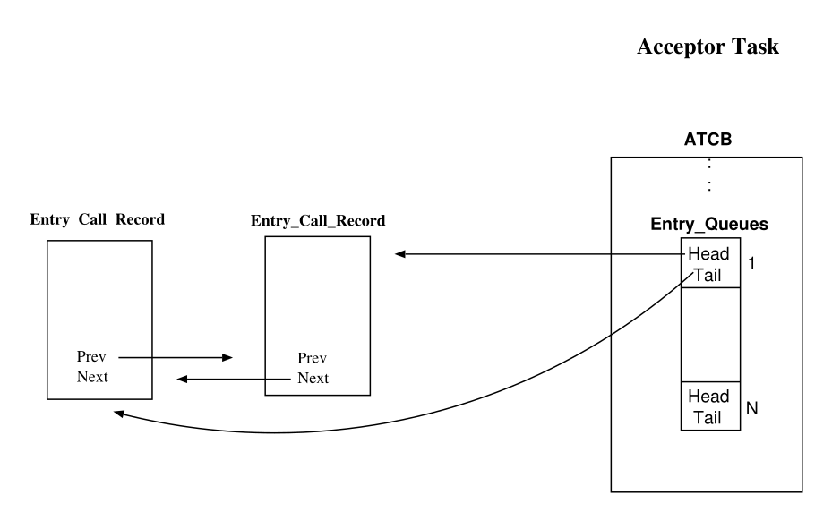

# Розділ 15. Зустріч

`Rendezvous` є базовим механізмом синхронізації та обміну даними між задачами в Ada. Модель Ada ґрунтується на клієнтсько-серверній моделі взаємодії. Одна з задач – сервер – оголошує набір сервісів, які вона готова надавати іншим задачам (клієнтам). Це здійснюється шляхом оголошення одного або кількох публічних *ентрі* у специфікації задачі. Запит на встановлення `Rendezvous` ініціює одна задача, здійснюючи виклик певного ентрі іншої задачі. Щоб зв’язок відбувся, задача-отримувач повинна прийняти цей виклик. Під час `Rendezvous` задача-ініціатор чекає, поки задача-отримувач виконає свої дії. Після завершення процедури обидві задачі можуть продовжити свою роботу. Якщо кілька задач очікують на виклик одного й того ж ентрі, Ada вимагає, щоб виклики оброблялися у порядку «перший прийшов – перший обслуговується». Середовище виконання повинно підтримувати структури даних для відстеження того, які задачі очікують на виклик ентрі, які саме ентрі вони викликають та в якому порядку надходять ці виклики.

Умовний виклик процедури відрізняється від безумовного тим, що викликаючий завдання не зобов’язаний чекати, якщо лише виклик може бути прийнятий негайно. Якщо завдання, до якого здійснюється виклик, готове його прийняти, виконання продовжується так само, як і при безумовному виклику. В іншому випадку викликаюче завдання відновлює своє виконання, не дочекавшись завершення процедури взаємодії. Синтаксис передбачає можливість продовження виконання з різних місць, залежно від того, чи відбулася взаємодія між завданнями чи ні.

Ефективна реалізація умовного виклику вимагає простої перевірки на те, чи готове завдання, до якого здійснюється виклик, прийняти його. Цю перевірку можна виконати за постійний час, якщо у системі виконання підтримується вектор готовності для кожного завдання – він вказує, для яких процедур завдання готове прийняти виклик (детальніше про цей вектор йдеться у розділі 10.4.2). Якщо перевірка не підтверджується, система виконання може негайно повернути керування викликаючому завданню; в іншому випадку дії будуть аналогічними до тих, що відбуваються під час безумовного виклику.

Зміст цього розділу структуровано наступним чином: у розділі 15.1 описується запис виклику вхідної процедури; у розділі 15.2 – реалізація черг вхідних викликів; у розділі 15.3 – стек, необхідний для підтримки вкладених операторів accept; у розділі 15.4 – засоби підтримки під час виконання програми для оператора selective accept. Нарешті, у розділі 15.5 описується послідовність дій, які виконують підпрограми GNARL для підтримки вхідних викликів та операторів accept.

## 15.1 Запис вхідного виклику

Середовище виконання GNAT пов’язує з кожним викликом запису структуру `Entry_Call_Record`. Вона призначена для групування всієї інформації, яка стосується цього виклику. До неї входять ідентифікатор викликаного запису, поточний стан виклику, посилання на попередні та наступні виклики у черзі тощо. Якщо запис має параметри, компілятор групує всі параметри в єдиний блок; середовище виконання зберігає адресу початку цього блоку у полі `Uninterpreted_Data` структури `Entry_Call_Record`. На рисунку 15.1 показано структури даних середовища виконання GNAT, які використовуються для обробки виклику запису E у наступній специфікації завдання:

```ada
task T is
   entry E (Number : in Integer; Text : in String);
end T;
```

Виклик методу може перебувати в одному з наступних станів:

- `Never_Abortable`. Цей виклик є неабортовним та ніколи не може стати абортовним. Використовується для викликів, які здійснюються в області відкладеного аборту [AAR95, Розділ 9.8(5–11,20)].
- `Not_Yet_Abortable`. Цей виклик наразі не є абортовним, але в майбутньому може стати таким.
- `Was_Abortable`. Цей виклик зараз не є абортовним, але раніше був таким. Різниця між `Was` та `Not_Yet` необхідна для визначення того, чи можна переходити до частини коду, де можливий аборт у асинхронній конструкції `select`. Це дозволено лише у разі, якщо режим є `Now` або `Was`.
- `Now_Abortable`. Цей виклик є абортовним.
- `Done`. Виклик було завершено без скасування; або ж на цьому рівні вкладеності ATC ще не здійснювалося жодного виклику (див. Розділ 20). У такому разі скасування виклику вже неможливе. Завершення виклику не обов’язково означає його „успішність“; якщо параметр `Exception_To_Raise` має ненульове значення, виклик може повертати виняток.
- Cancelled. Виклик був асинхронним та було його скасовано.


Рисунок 15.1: Структури даних, пов’язані з викликом входу.

## 15.2 Записи та черги

Кожен елемент має один черговий список, який зберігає всі очікуючі виклики для цього елемента [AAR95, Розділ 9.1(16)]. Якщо список не порожній, наступний виклик, який буде оброблено, знаходиться на його початку. Вартість перевірки наявності викликів у черзі для певного елемента залежить від обраної структури даних для цих черг. У системі виконання GNARL використовуються циклічні подвійно зв’язані списки, завдяки чому перевірка, додавання та видалення елементів виконуються за постійний час.

Поле `Entry_Queues` в ATCB є масивом, індексованим за ідентифікатором запису (інтерфейс призначає унікальний ідентифікатор кожній черзі записів; див. розділ 10.1). Кожен елемент цього масиву містить два поля: `Head` та `Tail` черги (див. рисунок 15.2).



Рисунок 15.2: Черги входящих запитів.

## 15.3 Стек прийнятих викликів

Оскільки в Ada дозволяється використовувати вкладені оператори accept, під час прийняття виклику запису GNAT-середовище витягує цей запис з відповідної черги викликів та розміщує його адресу у стек. Верхній елемент цього стека посилається полем `Call` об’єкта ATCB приймача виклику (див. рисунок 15.3). Поле `Acceptor_Prev_Call` з’єднує всі елементи стека між собою.

## 15.4 Вибіркове прийняття

Особливою проблемою реалізації, пов’язаною з вибірковим очікуванням, є те, що у певний момент завдання може бути готовим прийняти виклик для кількох записів одночасно. З точки зору середовища виконання Ada це насправді дві проблеми: адже подібна ситуація виникає як під час обробки викликів записів, так і під час вибіркового очікування.

1. Оскільки для виконання завдання може знадобитися кілька відкритих альтернатив прийняття рішення, обробка запиту на вхід вимагає перевірки того, чи відповідає цей запит одній з відкритих альтернатив.
2. Оскільки може існувати декілька відкритих альтернатив прийняття рішення, обробка вибіркового очікування вимагає порівняння набору необроблених запитів на вхід із набором відкритих альтернатив прийняття рішення.


Рисунок 15.3: Простий екран підтвердження.

Потреба у ефективному виконанні обох цих операцій суттєво впливає на вибір структур даних під час реалізації. Існує два очевидні способи виконати першу операцію – перевірку того, чи має викликаний елемент наразі відкритий альтернативний варіант прийняття:

1. Якщо набір відкритих варіантів прийняття є списком, для перевірки необхідно порівняти заданий елемент з кожним елементом цього списку. Цей підхід називається використанням *відкритого списку елементів*. Він може виявитися трудомістким, якщо кількість відкритих елементів є великою.

2. Альтернативним варіантом є використання векторного представлення для набору відкритих елементів – так званого *вектора відкритих варіантів прийняття*. Цей вектор містить по одному компоненту для кожного елемента завдання; кожен компонент, принаймні, вказує на те, чи є відповідний елемент відкритим.
Слід зазначити, що вектор прийняття або список відкритих записів мають створюватися під час виконання оператора вибіркового очікування, коли вже відомо, які альтернативи є відкритими. Час, необхідний для цього, залежить лише від кількості альтернатив у цьому операторі. Якщо для кожного запису існує окрема черга, необхідно перевіряти чергу, що відповідає кожному відкритому запису; для цього доводиться послідовно перебирати всі відкриті записи. Натомість, якщо відкриті записи представлені у вигляді списку, таку перевірку можна виконати швидше, не звертаючись до записів, які не є відкритими. Це може бути вагомою причиною для збереження як списку відкритих записів, так і вектора прийняття; однак така надмірність може призвести до збільшення накладних витрат, які перевищать вигоду від прискорення процесу перевірки наявності очікуючих викликів.

GNAT використовує вектор `Open_Accepts_Vector`. Кожен елемент цього вектора містить два поля: ідентифікатор входження та булівське значення, яке вказує, чи має оператор accept порожнє тіло (див. розділ 10.4.2). Кожен елемент вектора відповідає одній з альтернатив оператора select; причому порядок елементів збігається з порядком альтернатив: перший елемент вектора відповідає першій альтернативі, другий – другій тощо. У разі, коли умова для виконання оператора accept не виконується, система повертає значення 0.

## 15.5 Підпрограми зустрічі під час виконання

У розділі 10 описується розширення операторів `entry-call` та `accept`. У наступних розділах описано дії, які виконуються підпрограмами середовища виконання GNAT, що викликаються розширеним кодом.

### 15.5.1 GNARL.Call_Simple

Виконувана підпрограма `Call_Simple` лише делегує роботу іншій виконуваній підпрограмі під назвою `Call_Synchronous`.

### 15.5.2 GNARL.Call_Synchronous

Підпрограма під час виконання `Call_Synchronous` здійснює наступні дії:

1. Відкласти процедуру переривання виконання.
2. Створити та заповнити новий запис виклику, а також зберегти в ньому адресу блоку параметрів.
3. Викликати підпрограму GNARL `Task_Do_Or_Queue`.
4. Чекати на завершення процедури синхронізації (`Wait_For_Completion`).
5. Скасувати відкладення процедури переривання виконання.
6. Обробити будь-яке виникаюче під час виклику виняткове стан (`Check_Exception`).
### 15.5.3 GNARL.Task_Do_Or_Queue

Підпрограма `Task_Do_Or_Queue` виконує наступні дії:

1. Намагайтеся обробити виклик негайно. Якщо приймач вже обробляє якийсь виклик, а поточний виклик також можна прийняти, виконуються наступні дії:
  - Зафіксуйте, що приймач готовий до зустрічі з викликачем.
  - Якщо приймач перебуває у альтернативному стані **`terminate`**, скасуйте цей стан. Якщо у приймача немає залежних завдань, сповістіть його батьківський елемент, що приймач знову активний.
  - Якщо оператор **`accept`** має порожнє тіло (тобто використовується для синхронізації завдань), розбудіть приймача, розбудіть викликача та поверніться назад.
  - Якщо оператор **`accept`** має певне тіло, викличте процедуру під час виконання (`Setup_For_Rendezvous_With_Body`), щоб додати запис `Entry_Call_Record` до стеку очікуваних викликів приймача (див. Розділ 15.3) та підвищити його пріоритет (якщо пріоритет викликача вищий за пріоритет приймача). Після цього розбудіть приймача та поверніться назад.
### 15.5.4 GNARL.Task_Entry_Call

Якщо виклик можна негайно прийняти, `Task_Entry_Call` виконує ті самі дії, що й виклик у простому режимі, а також встановлює один із параметрів типу “вихідний” у значення True (успішно), щоб повідомити про це розширений код (див. розділ 10.2.2). В іншому випадку цей параметр встановлюється у значення False. Розширений код використовує цей параметр для вибору тієї частини користувацького коду, яку необхідно виконати після виклику. Зауважимо, що сам виклик ніколи не додається до черги; умовний виклик додається до черги лише тоді, коли приймач повторно його додає без переривання (за допомогою оператора requeue).

### 15.5.5 GNARL.Accept_Trivial

`GNARL.Accept_Trivial` виконує наступні дії:

1. Відкласти процедуру переривання.  
2. Якщо в черзі більше немає запитів на виклик, заблокувати завдання-приймач для очікування наступного запиту (`Wait_For_Call`).  
3. Витягнути запис про запит з початку черги (`Dequeue_Head`) та розбудити ініціатора виклику (`Wakeup_Entry_Caller`).  
4. Скасувати відкладення процедури переривання.
### 15.5.6 GNARL.Accept_Call

Процедура GNARL `Accept_Call` виконує наступні дії.

1. Відкласти процедуру переривання.
2. Якщо для запису немає чергових викликів, заблокувати завдання приймача, щоб почекати на наступний виклик (`Wait_For_Call`).
3. Вийняти запис про виклик з початку черги (`Dequeue_Head`) та додати його до стеку прийнятих викликів.
4. Оновити параметр `Param_Access` посиланням на об’єкт `Entry_Parameters_Record`, щоб згенерований компілятором код міг отримати доступ до параметрів запису.
5. Скасувати відкладення процедури переривання.
### 15.5.7 GNARL.Complete_Rendezvous

Якщо під час виконання тіла функції accept не виникає жодного винятку, розширений код викликає підпрограму `Complete_Rendezvous`. Ця підпрограма, у свою чергу, викликає підпрограму `Exceptional_Complete_Rendezvous`, повідомляючи їй, що жодного винятку не сталось.

### 15.5.8 GNARL.Exceptional_Complete_Rendezvous

Якщо під час виконання коду, пов’язаного з викликом певної процедури, виникло виняткову ситуацію, це виняток має бути передано як у функцію-викликача, так і у завдання-отримувач [AAR95, Розділ 9.5.2]. Для цього підпрограма `Exceptional_Complete_Rendezvous` виконує наступні дії:

1. Відкласти виконання процедури переривання.
2. Вийняти посилання на запис про виклик зі стеку прийнятих викликів.
3. Якщо виникло виняткову ситуація, отримати її ідентифікатор з поля `Exception_To_Raise` та зафіксувати факт її виникнення у полі `Compiler_Data`. Це виняток буде передано назад до ініціатора виклику після завершення процедури [AAR95, Розділ 9.5.3].
4. Розбудити ініціатора виклику (`Wakeup_Entry_Caller`).
5. Дозволити виконання процедури переривання.
### 15.5.9 GNARL.Selective_Wait

Підпрограма GNARL `Selective_Wait` виконує наступні дії:

1. Відкласти процедуру абортування.  
2. Спробувати обслужити вхідний виклик негайно. Підпрограма GNARL `Select_Task_Entry_Call` вибирає один вхідний виклик відповідно до діючої політики чергування.
– Якщо існує кандидат, а у приймача значення тіла є null, то завершуйте процедуру взаємодії, пробуджуйте викликача, скасовуйте відкладення абортної процедури та повертайте результат.  
– Якщо існує кандидат, а у приймача є пов’язаний з ним код, то додайте запис виклику до стеку прийнятих викликів (`Setup_For_Rendezvous_With_Body`), оновіть посилання на блок параметрів, скасовуйте відкладення абортної процедури та повертайте результат.  
– Якщо кандидатів немає, але відкрито є альтернативи, очікуйте на викликача. Згодом якийсь викликач додасть запис виклику до стеку прийнятих викликів; це пробудить даного приймача. Після цього приймач оновить посилання на параметри виклику, скасовує відкладення абортної процедури та повертає результат.  
– Якщо існує альтернатива завершення виконання, повідомте її предків про те, що цей завдання знаходиться на шляху завершення (`Make_Passive`), після чого очікуйте на звичайний виклик чи завершення роботи.  
– Якщо жодна альтернатива не відкрита та затримка (або умова завершення) не вказана, викиньте заздалегідь визначений виняток `Program_Error`.
### 15.5.10 GNARL.Task_Count

Функція `Task_Count` використовується для реалізації атрибуту «Count». Вона повертає кількість викликів, які очікують на обробку у вказаній черзі.

## 15.6 Підсумок

`Rendezvous` є базовим механізмом синхронізації та обміну даними між задачами в Ada. У цьому розділі описано основні аспекти реалізації цього механізму в GNAT. Підсумовуючи:

– Інформація про виконання, пов’язана з викликом входу, групується у об’єкт `Entry_Call_Record`.  
– Компілятор генерує один об’єкт `Entry_Parameters_Record`, який містить адресу справжніх параметрів. GNARL зберігає адресу цього об’єкта у відповідному полі запису виклику входу.  
– Черги входів реалізуються за допомогою двозв’язних списків записів викликів входу.  
– Вкладені операції прийняття обробляються за допомогою стека прийнятих викликів входу; це також є зв’язним списком записів викликів входу, які вже були прийняті.  
– Для оцінки умов відбору під час селективного прийняття використовується об’єкт `Accept_Vector`.
