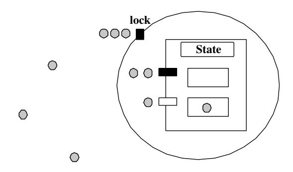

# Розділ 16. Захищені об’єкти

Великий обсяг роботи з синхронізації потоків, необхідний під час використання механізму “зустрічей” у Ada, був неприйнятним для реалізації систем із вимогами до швидкого часу відгуку. Саме тому у Ada 95 було впроваджено більш ефективний механізм синхронізації завдань, заснований на спільній пам’яті – захищені об’єкти. Процедури та функції-входи, пов’язані із захищеними об’єктами, мають виконуватися під блокуванням на читання/запис; проте оскільки функції-виходи не можуть змінювати стан захищеного об’єкта, вони можуть виконуватися під блокуванням лише на читання. Це дозволяє реалізації паралельно обробляти кілька викликів таких функцій.

Для виклику захищеного об’єкта завдання просто вказує назву об’єкта та потрібну підпрограму чи процедуру. Як і у випадку з викликами процедур завдань, викликаючий код може використовувати оператор `select` для здійснення *часового* чи *умовного* виклику. Зрозуміло, що на певний захищений елемент входу може бути записано кілька завдань. За замовчуванням черга таких завдань формується за принципом „перший прийшов – перший обслужений“; проте, якщо підтримується Додаток для систем реального часу, допускаються й інші способи упорядкування завдань. Під час виконання виклику захищеної процедури чи елемента входу перевіряється відповідний бар’єр; якщо бар’єр закритий (його значення дорівнює False), виклик додається до черги. Будь-який виняток, що виникає під час перевірки бар’єра, призводить до генерування помилки `Program_Error` у всіх завданнях, які наразі очікують у чергах викликів, пов’язаних із захищеним об’єктом, що містить цей бар’єр [BW98, Розділ 7.8].

Після завершення виконання захищеної процедури або операції виклику всі бар’єри знову оцінюються, і, за потреби, виконуються тіла операцій виклику. Після виконання тіла однієї захищеної процедури чи операції виклику знову перевіряються всі бар’єри PO, які мають в черзі завдання. Якщо якась з операцій виклику наразі відкрита, її виклик приймається та виконується відповідне тіло операції. Цей процес повторюється доти, поки не залишиться жодного відкритого бар’єра з завданнями у черзі. Якщо після виконання захищеної процедури чи операції виклику відкрито кілька бар’єрів, мова Ada не визначає, яка саме операція буде обслужена наступною.

У розділі 11 не лише розглядається розширення можливостей захищених об’єктів, бар’єрів та захищених підпрограм, а й описуються дві основні моделі реалізації захищених об’єктів – самообслуговування та проксі, а також запропоновані варіанти їх реалізації (див. розділ 11.1). Як там зазначено, GNAT використовує модель проксі з механізмом зворотних викликів. Однією з головних причин (з точки зору середовища виконання) є те, що застосування Pthreads для реалізації моделі самообслуговування створює суттєву проблему: завдання, яке намагається вийти з «яйцеподібного» контейнера, повинно передати право власності іншому завданню, що очікує на вхід через `Open`-ентрі. Проте із Pthreads не існує ефективного способу вирішити цю проблему; хоча можна змусити потрібний потік отримати м’ютекс, підвищивши його пріоритет порівняно з іншими претендентами, це може призвести до непотрібних перемикань контексту та погіршити коректну роботу механізмів пріоритетності Ada у поєднанні з Pthreads.

## 16.1 Замок

Згідно з семантикою Ada, виклик записаного у чергу елемента має пріоритет над іншими операціями з захищеним об’єктом. Це часто пояснюється за допомогою *моделі яєчної шкаралупи*. Блокування захищеного об’єкта є цією „яєчною шкаралупою“. На рисунку 16.1 наведено графічне зображення захищених об’єктів. Потоки представлені затемненими колами; два рівні захищеного об’єкта позначені великим колом (яке відповідає блокуванню об’єкта) та великим прямокутником (який відповідає стану об’єкта та його операціям); маленькі прямокутники позначають захищені операції: чорні прямокутники – закриті елементи, а білі – відкриті. У цьому прикладі один потік виконує захищену операцію (він знаходиться всередині об’єкта), два потоки очікують у черзі на виконання закритого елемента, ще один потік очікує у черзі на елемент, який зараз виконується з використанням взаємного виключення; крім того, є ще кілька потоків, які не знаходяться у черзі.

## 16.2 Підпрограми під час виконання

### 16.2.1 GNARL.Protected_Entry_Call

Простий виклик захищеного елемента на рівні фронтенду розширюється у виклик підпрограми GNARL `Protected_Entry_Call`. Обробка такого виклику відбувається за аналогією з викликами завдань (див. розділ 15.5.4).



Рисунок 16.1: Графічне зображення захищеного об’єкта.

Це сприяє реалізації оператора повторного чергування в мові Ada. Повна послідовність дій є такою:

1. Відкласти виконання процедури аборту.
2. Заблокувати доступ до об’єкта.
3. Створити новий об’єкт типу `Entry_Call_Record`.
4. Викликати процедуру GNARL `PO_Or_Queue` для ініціювання виклику або його додавання до відповідної черги очікування.
5. Викликати процедуру GNARL `PO_Service_Entries` для обробки відкритих записів.
6. Розблокувати доступ до об’єкта.
7. Продовжити виконання процедури аборту після відстрочки.
8. Перевірити, чи потрібно знову ініціювати виникнення виняткової ситуації.
У випадку умовних та тимованих викликів процедур, дії, які виконує середовище виконання GNAT, по суті є тією послідовністю, що описана вище. Проте, якщо бар’єр закритий, запис про виклик процедури не додається до черги, а середовище виконання встановлює значення індексу вибраної процедури на 0. Це значення використовується сгенерованим кодом для виконання *альтернативної частини* умовного виклику процедури.

### 16.2.2 GNARL.PO_Do_Or_Queue

Послідовність дій, які виконує `PO_Do_Or_Queue`, є наступною:

1. Викличте функцію бар’єра.  
2. Якщо бар’єр закритий, додайте запис `Entry_Call_Record` до черги та завершіть виконання.  
3. Якщо бар’єр відкритий, виконайте кроки з 2 по 9 процедури GNARL під назвою `Service_Entries`.
### 16.2.3 GNARL_Service_Entries

Під час виконання програми необхідно перевіряти умови доступу після виконання захищеної процедури чи операції; по суті умова доступу розглядається так, ніби вона залежить лише від стану захищеного об’єкта. У моделі самообслуговування потік може залишити „яйцеподібний“ контейнер лише тоді, коли умови доступу для всіх елементів, які мають чергу викликів, є `False`. Це гарантує, що всі виклики, які стали можливими внаслідок зміни стану об’єкта, будуть виконані до того, як розпочнуться будь-які інші операції. З цією метою фронтенд перетворює умови доступу та тіла процедур на функції, а потім генерує таблицю, ініціалізовану їхніми адресами. Середовище виконання отримує цю таблицю та використовує вказівники для виклику функцій, які перевіряють умови доступу, а також для виклику відповідних процедур, коли умова доступу виконується.

Базовий алгоритм процедури `Service_Entries` у GNARL виглядає так:

```ada
while <There_Is_Some_Open_Barrier_With_Queued_Entry_Calls> loop
   Update object reference to the Entry_Call_Record
   begin
      Call the Entry Body
   exception
      when others => Broadcast Program_Error
   end
   Remove the Reference to the Entry_Call_Record
   GNARL.Wake_Up_Entry_Caller
end loop;
```

Рядок 1 обробляється процедурою GNARL `Select_Protected_Entry_Call`, яка перебирає всі черги вхідних викликів та переоцінює умови для тих записів, які мають такі виклики у черзі. Як тільки якась з цих умов стає істинною (повертає значення `true`), GNARL обирає цей запис для обробки. У рядку 2 поле `Call_In_Progress` об’єкта (див. визначення типу `Protection_Entries`) встановлюється у значення обраного запису виклику, щоб зафіксувати, що саме цей виклик зараз обробляється. Рядки 3–7 відкривають нову область видимості для здійснення виклику до функції-тіла запису та для обробки можливих винятків у користувацькому коді. У цьому випадку заздалегідь визначений виняток `Program_Error` поширюється на всі завдання, які наразі знаходяться у чергах будь-яких записів захищеного об’єкта. У рядку 8 посилання на виклик видаляється (адже цей виклик вже було оброблено), а завдання-ініціатор виклику пробуджується (рядок 9). Після цього цикл знову виконується, і умови для вхідних викликів переоцінюються. Цей процес завершується, коли серед записів із чергами завдань не знаходиться жодної умови, яка б була істинною.

## 16.3 Підсумок

У цьому розділі ми коротко описали послідовність дій, які виконують підпрограми виконання для підтримки захищених підпрограм.
