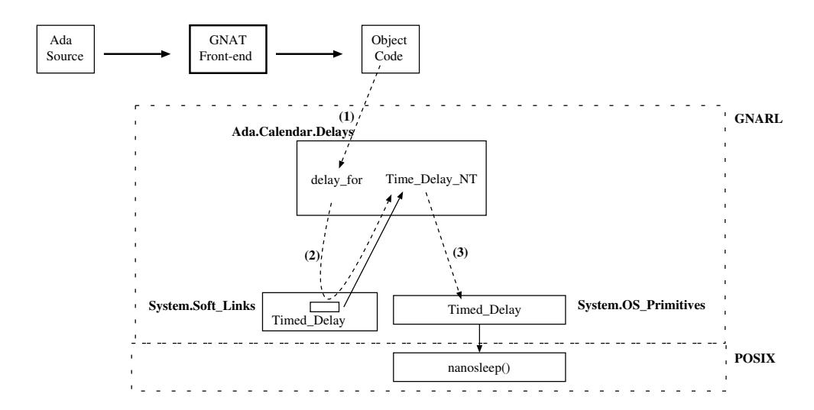

# Розділ 17. Час та годинники

Завдання можуть затримувати свій виконання на певний період часу або до досягнення певного моменту в часі. У обох випадках це дає змогу поставити завдання у чергу на виконання у майбутньому, замість того, щоб безперервно перевіряти час за допомогою функцій отримання поточного часу. Крім того, завдання можуть ініціювати таймерні виклики. Якщо такий виклик не буде прийнятий до закінчення встановленого проміжку часу, середовище виконання зобов’язане скасувати цей виклик та розбудити завдання, яке його ініціювало. Крім того, механізм таймерного вибіркового прийняття дозволяє серверним завданням завершити свою роботу за умови, що відповідний виклик не буде отриманий протягом певного часу.

Ada надає доступ до годинника за допомогою двох пакетів: `Calendar` та `Real_Time`. Пакет Calendar забезпечує абстракцію для відображення „фізичного“ часу, враховуючи високосні роки, високосні секунди та інші корекції; пакет Real_Time надає альтернативне представлення часу у вигляді монотонного (тобто неспадаючого) регулярного годинника. Хоча обидва представлення ґрунтуються на одному й тому ж апаратному годиннику, вони задовольняють різні потреби програм.

## 17.1 Оператори затримки та затримки до певного моменту

Підпрограми GNARL, які реалізують ці оператори Ada, розміщені у дочірніх пакетах відповідних стандартних пакетів Ada: `Ada.Calendar.Delays` та `Ada.Real_Time.Delays`. Front-end GNAT перетворює оператор затримки на виклик відповідної підпрограми GNARL.

GNARL надає два варіанти реалізації операторів затримки: один для випадку програми на Ada без завдань, а інший – для програми на Ada з завданнями. Для доступу до відповідної підпрограми (`Timed_Delay`) використовується посилання.

Рисунок 17.1: Підпрограми GNARL для оператора затримки.

У разі відсутності завдань це посилання веде на процедуру GNARL `Time_Delay_NT`, яка викликає процедуру GNULL `Timed_Delay` (див. рисунок 17.2).

Рисунок 17.2: Підпрограми GNARL для оператора затримки в програмі на мові Ada без завдань.

У разі програми, що містить завдання, це посилання веде на процедуру GNARL під назвою `Timed_Delay_T`, яка, у свою чергу, викликає іншу версію процедури GNULL — `Timed_Delay` (див. рисунок 17.3).

Рисунок 17.3: Підпрограми GNARL для оператора затримки в програмі мовою Ada із задачами.

## 17.2 Виклик з обмеженням за часом

Виклик запланованого завдання обробляється компілятором GNAT подібно до виклику у простому режимі (описаного у розділі 10.2.1). Компілятор генерує виклик підпрограми GNARL під назвою `Timed_Task_Entry_Call`. По суті ця процедура виконує ті самі дії, що й у випадку виклику у простому режимі (розділ 15.5.1). Однак, якщо виклик не може бути негайно прийнятий, він не просто блокує викликаючий процес; замість цього викликається інша підпрограма GNARL для ініціалізації таймера та блокування викликаючого процесу до закінчення встановленого часу очікування. На рисунку 17.4 показано підпрограми GNARL та GNULL, які беруть участь у цьому процесі. Якщо виклик приймається до закінчення терміну дії таймера, таймер деактивується; в іншому випадку виклик видаляється з черги.

Реалізація в GNAT механізму виклику захищеного елемента з тайм-аутом відповідає такій самій схемі, як описано вище. Однак єдина відмінність полягає у тому, що компілятор генерує виклик процедури `Timed_Protected_Entry_Call` з бібліотеки GNARL.

Рисунок 17.4: Підпрограми GNARL для виклику з заданим часом.

## 17.3 Часова селективна приймка

Виклик вхідного запиту з тайм-аутом обробляється компілятором GNAT аналогічно до механізму вибіркового очікування (описаного у розділі 15.4). Компілятор генерує виклик підпрограми GNARL під назвою `Timed_Selective_Wait`. По суті ця процедура виконує ті самі дії, що й у випадку звичайного вибіркового очікування (розділ 15.5.9). Однак, якщо немає жодного вхідного запиту, який можна було б негайно обробити, вона не просто блокує викликаючий процес; замість цього вона викликає іншу підпрограму GNARL для налаштування таймера та блокує процес до закінчення цього тайм-ауту. На рисунку 17.5 показано підпрограми GNARL та GNULL, які беруть участь у цьому процесі. Якщо якийсь вхідний запит надходить до закінчення таймерного інтервалу, таймер деактивується; в іншому випадку виконуються оператори після **`delay`**.

Рисунок 17.5: Підпрограми GNARL для вибіркового приймання за таймером.

## 17.4 Підпрограми під час виконання

### 17.4.1 GNARL. Таймерна затримка

Коли в програмі є завдання, процедура `Timed_Delay` з модуля GNARL виконує наступні дії.

1. Відкласти виконання процедури переривання.
2. Заблокувати ATCB поточного завдання.
3. Якщо вказаний інтервал затримки є відносним проміжком часу (тобто це оператор **`delay`**), то цей інтервал перетворюється на абсолютний проміжок часу шляхом додавання поточного значення годинника.
4. Якщо вказаний час є майбутнім часом, тоді:
   - Встановити стан поточного завдання як `Delay_Sleep`.
   - Викликати функцію POSIX *pthread cond timedwait* для призупинення виконання завдання до вказаного часу.
   - Встановити стан поточного завдання як `Runnable`.
5. Розблокувати ATCB поточного завдання.
6. Передати керування іншому завданню (це гарантує, що „оператор затримки завжди відповідає принаймні одній точці розподілу завдань“ [AAR95, Розділ D.2.2(18)]).
7. Скасувати відкладення виконання процедури переривання.
## 17.5 Підсумок

GNAT надає два варіанти реалізації для простих операторів **`delay`** та **`delay until`** у мові Ada: один — для програм на Ada без завдань, а інший — для програм із завданнями. Для того щоб у процесі виконання не доводилося кілька разів перевіряти, яку саме підпрограму викликати, використовується посилання на відповідний процедурний об’єкт.

Тайм-аутний вхідний виклик дозволяє завданню, яке його ініціює, здійснити виклик за умови, що це завдання буде пробуджене, а сам виклик скасований, якщо його не приймуть до закінчення встановленого часового проміжку. Як і у випадку з умовним вхідним викликом, передбачено можливість продовження виконання завдання в різних місцях залежно від того, відбулося зустрічне взаємодія чи ні. Окрім обробки, необхідної для звичайного вхідного виклику, тайм-аутний вхідний виклик вимагає планування події пробудження, якщо виклик не може бути прийнятий негайно. Якщо виклик приймається до закінчення цього проміжку часу, завдання-викликач має бути видалене з черги затримки. Якщо ж проміжок часу спливає раніше, завдання має бути видалене з черги вхідних викликів.

Реалізація в GNAT механізмів звернень до захищених або задачних входів із встановленням таймера, а також механізму вибіркового прийняття запитів відповідає тим самим крокам, що й у безтаймерних випадках; проте коли викликаючий елемент блокується, активується таймер.
