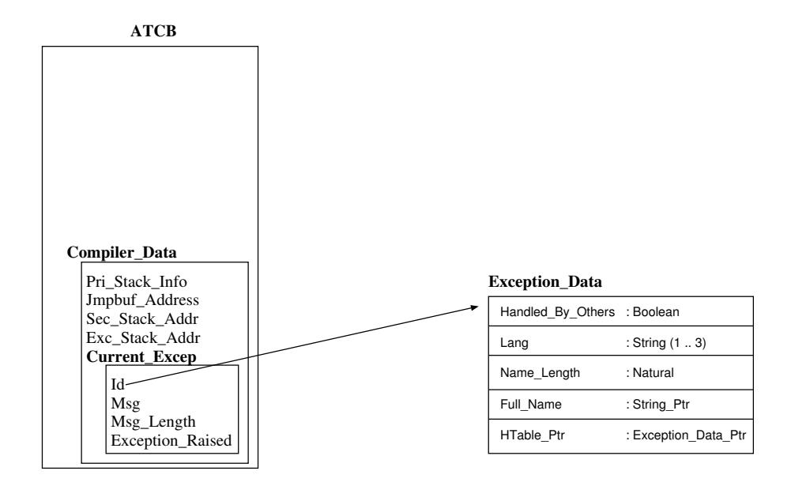

# Розділ 18. Винятки

Виняток являє собою певну аномальну ситуацію; виникнення такої ситуації під час виконання називається `Exception_Occurrence`. Коли під час виконання певної конструкції виникає виняткова ситуація, подальше виконання цієї конструкції припиняється, а виконується відповідний обробник винятків. Якщо ж у конструкції немає обробника винятків, то цей виняток поширюється далі. «Поширення» винятку означає його повторне виникнення у найбільш вкладеному за поточною динамікою контексті виконання [AAR95, Розділ 11-4]. Якщо виняток залишається необробленим у тілі задачі, він не поширюється далі (оскільки немає жодного вкладеного контексту виконання). Якщо ж виняток виникає під час ініціалізації задачі, активатор генерує помилку `Tasking_Error` [AAR95, Розділ 11-4]. Існує стандартна бібліотека, яка надає додаткові засоби для роботи з винятками – Ada.Exceptions.

## 18.1 Структури даних

### 18.1.1 Exception_Id

Кожен окремий виняток позначається унікальним значенням типу `Exception_Id`. Спеціальне значення `Null_Id` не відповідає жодному винятку; це початкове значення за замовчуванням для типу `Exception_Id`. Кожен випадок виникнення винятку представляється значенням типу `Exception_Occurrence`. Аналогічно, `Null_Occurrence` також не позначає жодного випадку виникнення винятку; це початкове значення за замовчуванням для типу `Exception_Occurrence`.

Середовище виконання GNAT реалізує ідентифікатор винятку у вигляді посилання на запис (`Exception_Data_Ptr`). На рисунку 18.1 показано поля цього запису. Поле `Not_Handled_By_Others` використовується для розрізнення винятків, визначених користувачем, від внутрішніх винятків середовища виконання (наприклад, переривання завдання), які не можуть бути оброблені обробниками винятків, визначеними користувачем. Поле `Lang` визначає мову, на якій оголошено виняток (за замовчуванням – „Ada“). Наступні два поля призначені для збереження повної назви винятку; ця назва складається з префікса (повного шляху до області, де оголошено виняток) та самої назви винятку. Останнє поле використовується для створення зв’язаних списків ідентифікаторів винятків (про що йдеться у розділі 18.1.2).

| `Exception_Data`    | |
|-----------------------|--------------------|
| Not_Handled_By_Others | Булеве значення    |
| Lang                  | Рядок (довжиною 1–3 символи) |
| Name_Length           | Натуральне число   |
| Full_Name             | Вказівник на рядок |
| HTable_Ptr            | Вказівник на дані винятку |

Рисунок 18.1: Запис ідентифікатора винятку

При виникненні винятку відповідний екземпляр винятку зберігається середовищем виконання GNAT у полі `Compiler_Data` об’єкта ATCB. Тип даних цього поля є записом; поле `Current_Excep` цього запису містить сам екземпляр винятку.

Поле `Exception_Raised` встановлюється у значення `True`, щоб позначити, що даний випадок виникнення винятку дійсно стався. Під час створення запису про виняток це поле спочатку має значення `False`; пізніше, під час обробки цим записом підпрограмою GNARL `Raise_Current_Exception`, воно змінюється на `True`. Це дозволяє системі виконання відрізняти повторне виникнення винятку від першого його появи.

### 18.1.2 Таблиця винятків

Через особливості механізму видимості винятків у Ada (виняток може бути невидимим, хоча й обробляється обробником **`others`**, повторно генерується та стає видимим для іншого контексту виклику) необхідно використовувати глобальну таблицю (`Exceptions_Table`). Для ефективної обробки винятків середовище виконання Ada використовує хеш-таблицю (див. рисунок 18.3).

Рисунок 18.2: Ідентифікатор виникнення.

Як видно з тексту, для доступу до ідентифікаторів винятків використовується таблиця. Для обробки колізій застосовується простий зв’язний список ідентифікаторів винятків. Поле `HTable_Ptr` слугує для зв’язування цих ідентифікаторів.

Під час виникнення винятку у задачі необхідно знайти відповідний ідентифікатор цього винятку. Для цього обчислюється хеш-функція, а отриманий зв’язний список переглядається на предмет пошуку потрібного ідентифікатора. Після це посилання на нього зберігається у ATCB задачі. Це посилання залишається у ATCB до моменту обробки винятку (хоча у деяких обробниках винятків воно може й не відображатися).

## 18.2 Підпрограми під час виконання

### 18.2.1 GNARL.Raise

У мові Ada існує два способи викликати виняток: (1) за допомогою оператора **`raise`** та (2) за допомогою процедури `Ada.Exceptions.Raise_Exception`, яка дає програмісту можливість прив’язати повідомлення до винятку. У обох випадках компілятор генерує виклик функції GNARL, яка виконує наступні дії:

1. Для заповнення запису про виняток у системі ATCB.

Рисунок 18.3: Хеш-таблиця.

– 2. Відкласти виконання операції переривання.
– 3. Якщо встановлено один обробник винятків, то перейти до нього.
– 4. В іншому випадку (якщо жоден обробник винятків не може бути викликаний) припинити виконання програми.
## 18.3 Підсумок

У цьому розділі були представлені базові концепції реалізації обробки винятків у GNAT. Ідентифікатор винятку є посиланням на запис, у якому зберігається повна назва винятку. Інформація про виникнення винятку зберігається в ATCB. Усі винятки зберігаються у хеш-таблиці.
