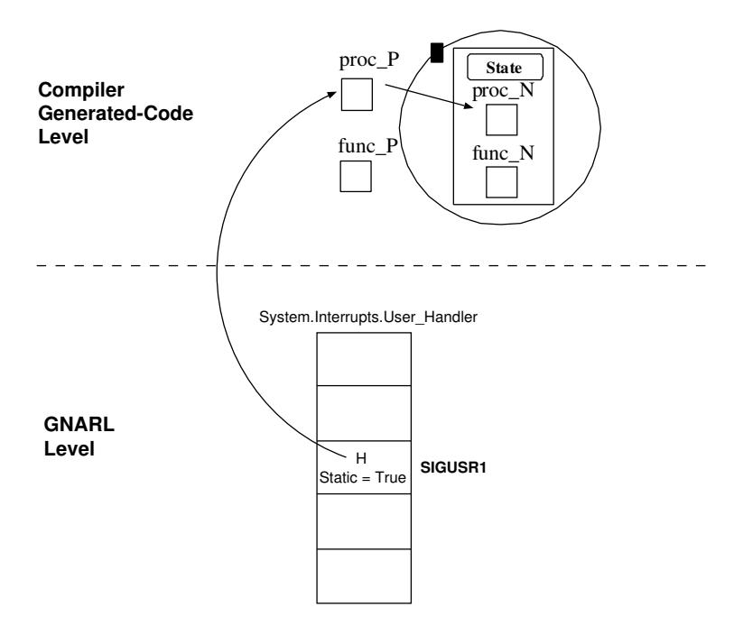
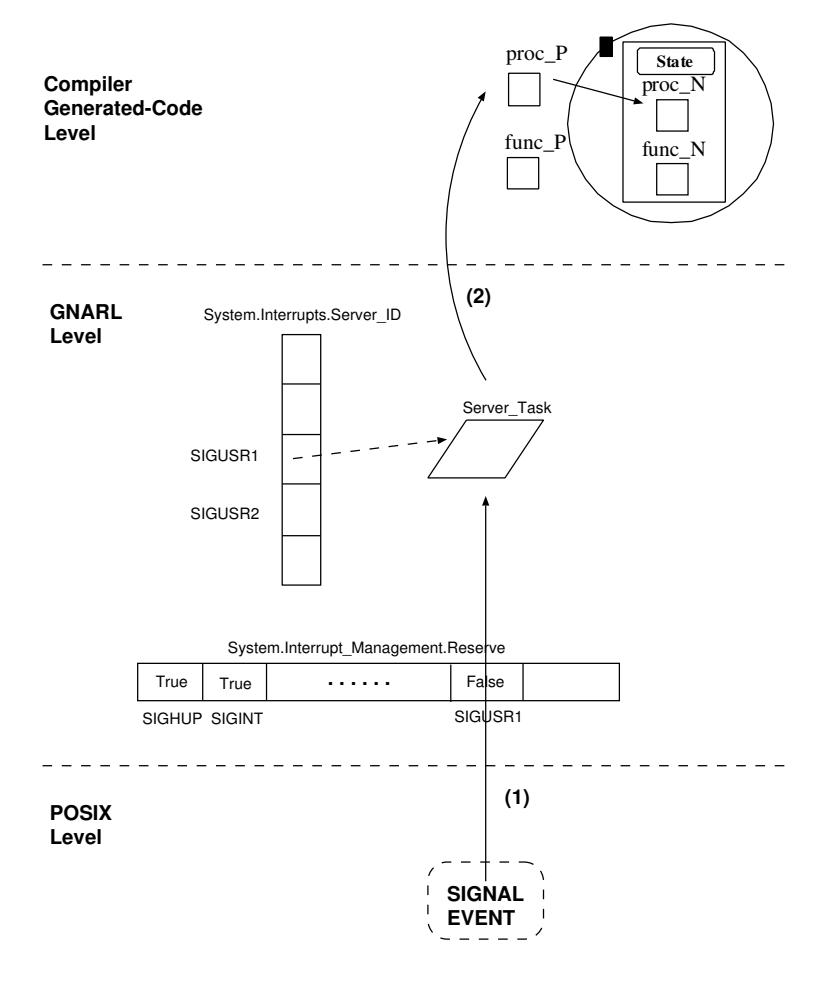
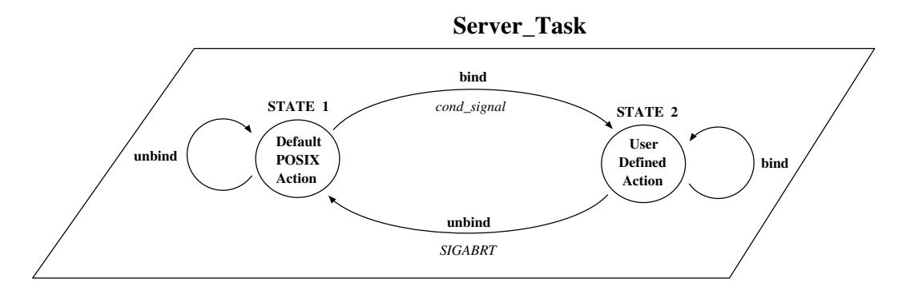
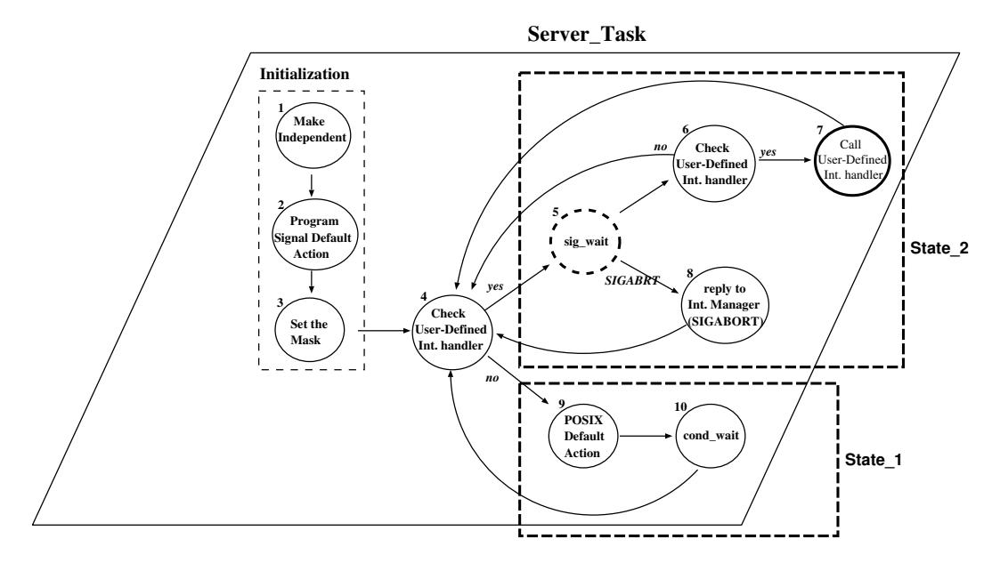
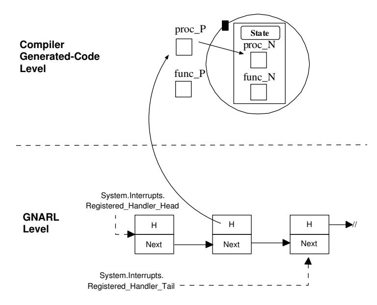

# Розділ 19. Переривання

Переривання — це категорія подій, які виявляються апаратним забезпеченням або системним програмним забезпеченням. Процес виникнення переривання складається з двох етапів: генерації та доставки. Генерація переривання — це подія в апаратному чи системному середовищі, яка робить переривання доступним для програми; доставка ж є дією, яка викликає певну частину програми (звану обробником переривань) у відповідь на виникнення переривання. У період між генерацією та доставкою переривання вважається «очікуючим» на обробку. Обробник викликається один раз для кожної доставки переривання. Поки триває обробка одного переривання, подальші переривання з того самого джерела блокуються; всі наступні спроби їх генерації також не відбуваються. Зазвичай залежно від пристрою визначається, чи залишається заблоковане переривання у стані очікування, чи втрачається.

Ada дозволяє пов’язувати преривання з захищеною процедурою або входом задачі, оголошеними на рівні бібліотеки. Проте пов’язування з входом задачі вважається застарілою функціональнію мови [AAR95, розділ J.7]. Саме тому в цьому розділі ми зосередимо увагу на користувацьких обробниках преривань, реалізованих у вигляді захищених процедур.

Деякі переривання є зарезервованими. Програміст не має права визначати обробник для зарезервованого переривання. Зазвичай зарезервоване переривання обробляється безпосередньо системою виконання Ada (наприклад, переривання від таймера, яке використовується для реалізації оператора затримки). Для кожного нерезервованого переривання система виконання автоматично призначає стандартний обробник.

Існують два способи встановлення та видалення обробників переривань: вкладений та невкладений. При вкладеному способі обробник переривання для певного захищеного об’єкта встановлюється автоматично під час створення цього об’єкта; коли ж об’єкт припиняє існування, попередній обробник повертається у дію автоматично. При невкладеному способі обробники переривань встановлюються явним чином за допомогою викликів процедур; при цьому замінені обробники не відновлюються, окрім як за явним запитом [Coh96, Розділ 19.6.1].

Фронтенд визначає обробник, який потрібно встановити у нещільному стилі, за допомогою прагми `Attach_Handler`, яка вказує відповідний ідентифікатор переривання. Динамічне виділення захищених об’єктів забезпечує більшу гнучкість: при виділенні захищеного об’єкта, пов’язаного з обробником переривання, цей обробник встановлюється; при звільненні об’єкта відновлюється попередній обробник. Аналогічно, обробник, який потрібно встановити у щільному стилі, ідентифікується за допомогою прагми `Interrupt_Handler`. Ця прагма накладає обмеження на об’єкт: його необхідно створювати динамічно [Coh96, Розділ 19.6.1]. Встановлення та видалення обробників переривань у щільному стилі здійснюється за допомогою додаткових можливостей пакета `Ada.Interrupts` [AAR95, Розділ C.3(2)].

З метою забезпечення простої, ефективної та багатоплатформної реалізації GNAT повторно використовує механізми обробки сигналів зі специфікацій POSIX та додає мінімальний набір функцій виконання, необхідних для досягнення семантики, передбаченої мовою Ada. Цей процес спрощується тим, що сигнали POSIX доставляються окремим потокам у багатопотоковому процесі з використанням майже тієї ж семантики, що й у однопотоковому процесі [GB92, розділ 5.1].

## 19.1 Сигнали POSIX

POSIX-сигнал є формою програмного переривання, яке може генеруватися кількома способами. Сигнал може генеруватися [DIBM96, розділ 2]:

– Внаслідок апаратного переривання: поділення на нуль, переповнення у плаваючій комі значення, порушення захисту пам’яті, звернення до неіснуючої області пам’яті чи спроба виконати некоректну інструкцію.  
– Через досягнення годинником визначеного часу або минулення заданого проміжку часу.  
– Внаслідок асинхронної операції. Асинхронні операції введення-виведення генерують сигнал після завершення чи у разі їхньої невдачі.  
– Через натискання користувачем певних клавіш на терміналі, який керує процесом. Певні комбінації клавіш дозволяють користувачеві призупинити, відновити чи завершити виконання процесу за допомогою сигналів.
За допомогою потоку POSIX. Потоки POSIX можуть надсилати сигнал іншому потоку POSIX у тому ж процесі для повідомлення про певну подію, викликаючи функцію *pthread_kill*.

Кожен POSIX-потік має маску сигналів: коли для потоку генерується сигнал, а цей потік маскує його, сигнал залишається у черзі очікування до моменту, поки потік не зніме маскування; інтерфейс для керування маскою сигналів потоку називається *pthread_sigmask*. Необхідно зберігати лише один екземпляр замаскованого сигналу у черзі; іншими словами, якщо сигнал генерується `N` разів під час його маскування, кількість екземплярів сигналу, які будуть доставлені потоку після зняття маскування, може бути будь-яким числом від 1 до N.

Кожен сигнал POSIX пов’язаний з певною *дією*. Ця дія може полягати у ігноруванні сигналу, завершенні процесу, продовженні його виконання або виклику користувацької функції-обробника (асинхронно та з перериванням звичайного виконання процесу). У специфікації POSIX.1 визначено типову дію для кожного сигналу. Для більшості сигналів програма може змінити цю типову дію, викликавши функцію *sigaction*. Використання асинхронних процедур-обробників для сигналів не рекомендується у контексті POSIX-потоків, адже операції синхронізації між потоками є небезпечними для виклику зсередини таких обробників; натомість у специфікації POSIX.1c рекомендується використовувати функцію *pthread_sigwait*, яка «приймає» один із заданого набору замаскованих сигналів.

### 19.1.1 Зарезервовані сигнали

Визначення терміна «зарезервований» дещо відрізняється між стандартами ARM та POSIX. Згідно зі специфікаціями ARM [AAR95, розділ C.3(1)]:

*Набір зарезервованих переривань визначається реалізацією. Зарезервоване переривання – це або переривання, для якого не підтримуються користувацькі обробники, або переривання, до якого вже прив’язаний обробник іншими засобами, визначеними реалізацією. Програмний модуль може бути підключений до нерезервованих переривань.*

POSIX.5b/.5c: додаткові види у [s-intman.adb]:

*Сигнали, які програма не може приймати, а також щодо яких вона не може змінювати дію сигналу чи параметри маскування, оскільки ці сигнали зарезервовані для використання реалізацією мови Ada. Зарезервовані сигнали, визначені цим стандартом, є наступними:*

- `Signal_Abort`
- `Signal_Alarm`
- `Signal_Floating_Point_Error`
- `Signal_Illegal_Instruction`
- `Signal_Segmentation_Violation`
- `Signal_Bus_Error`
*Якщо реалізація підтримує будь-які сигнали, окрім тих, що визначені цим стандартом, вона також може зарезервувати деякі з них.*

Сигнали, визначені стандартом POSIX.5b/5c та не позначені як зарезервовані, це: SIGHUP, SIGINT, SIGPIPE, SIGQUIT, SIGTERM, SIGUSR1, SIGUSR2, SIGCHLD, SIGCONT, SIGSTOP, SIGTSTP, SIGTTIN, SIGTTOU, SIGIO, SIGURG, а також усі сигнали реального часу.

Реалізація GNAT FSU для Linux підтримує 32 сигнали. У цьому випадку зарезервованими є такі сигнали:

| Номер | Назва      | Призначення | Опис                                 |
|-------|------------|-------------|-------------------------------------|
| 2     | * SIGINT   | GNAT        | Переривання (використовується для CTRL-C) |
| 4     | * SIGILL   | POSIX (HW)  | Некоректна інструкція               |
| 5     | * SIGTRAP  | GNAT        | Тригер для трасування              |
| 6     | * SIGABRT  | GNAT        | Примусове переривання задач         |
| 7     | * SIGBUS   | POSIX (HW)  | Помилка шини даних                  |
| 8     | * SIGFPE   | POSIX (HW)  | Виняток під час обчислень з плаваючою комою |
| 9     | SIGKILL    | POSIX       | Примусове переривання               |
| 11    | * SIGSEGV  | POSIX (HW)  | Порушення сегментації пам’яті       |
| 14    | SIGALRM    | POSIX       | Будильник                            |
| 19    | SIGSTOP    |             | Зупинка                              |
| 20    | * SIGTSTP  | GNAT        | Запит на зупинку від користувача     |
| 21    | * SIGTTIN  | GNAT        | Спроба читання з фонового термінала |
| 22    | * SIGTTOU  | GNAT        | Спроба запису на фоновий термінал   |
| 26    | SIGVTALRM  |             | Час вичерпано для віртуального таймера |
| 27    | * SIGPROF  | GNAT        | Час вичерпано для таймера профілювання |
| 31    | SIGUNUSED  |             | Невикористовуваний сигнал           |

Сигнали, позначені зірочкою (\*), не можуть бути заблоковані під час виконання програми за допомогою GNAT Run-Time. Сигнал SIGINT також не можна блокувати, адже він використовується для завершення виконання програми на мові Ada після натискання комбінації клавіш Ctrl+C у терміналі, який керує процесом. Зберігаючи SIGINT як резервований сигнал, програміст дозволяє користувачеві натискати Ctrl+C; водночас це унеможливлює обробку цього сигналу безпосередньо в самій програмі на мові Ada.

Пragma GNAT `Unreserve_All_Interrupts` [Cor04] надає програмісту можливість змінити цю поведінку. Сигнали SIGILL, SIGFPE та SIGSEV неможливо маскувати, оскільки вони використовуються процесором для сповіщення про помилки під час виконання програми. Сигнал SIGTRAP використовується GNAT для забезпечення можливості налагодження багатопотокових додатків. Сигнал SIGABRT також неможливо маскувати – він використовується GNAT для реалізації примусового завершення завдань (про що йдеться у розділі 20). Сигнали SIGTTIN, SIGTTOU та SIGTSTP не підлягають маскуванню, щоб фонові процеси та операції вводу-виведення функціонували так само, як у звичайних програмах на мові C. Нарешті, сигнал SIGPROF не можна маскувати, аби не спричиняти плутанини для програми профілювання.

## 19.2 Структури даних

Незалежно від обраного стилю асоціацій, GNARL завжди використовує наступні таблиці, індексовані за значенням `Interrupt_JD`, для обробки переривань.

Рисунок 19.1: Таблиця зарезервованих переривань.

– *Таблиця зарезервованих сигналів*: Таблиця констант типу „булевого“ значення[^ch19-fn1], яка використовується для реєстрації зарезервованих переривань.

– `User-defined_Interrupt_Handlers_Table`: Таблиця, призначена для реєстрації та скасування реєстрації посилань на `User-Defined_Interrupt-Procedures` (UDIP) протягом усього життєвого циклу програми. Кожен елемент цієї таблиці є записом, який містить два поля: посилання на відповідну процедуру UDIP та прапорець, що вказує тип асоціації (вкладена чи невкладена).

Рисунок 19.2: Таблиця користувацьких обробників переривань.

На рисунку 19.2 показана одна захищена процедура, прив’язана до сигналу SIGUSR1 у вкладеному стилі (статичному стилі). Компілятор GNAT асоціює з кожною захищеною підпрограмою дві інші підпрограми – P та N (про що йдеться у розділі 11.2.2). Як видно з ілюстрації, під час виконання програми сигнал пов’язується з підпрограмою P: посилання на підпрограму P зберігається у відповідному полі таблиці, а поле `Static` встановлюється у значення `True`, щоб позначити, що йдеться про асоціацію у вкладеному стилі.

[^ch19-fn1]: У вихідному коді GNARL ця змінна оголошується лише для того, щоб можна було ініціалізувати її у тілі пакета, що сприяє переносимості коду.

### 19.2.1 Менеджер переривань: базовий підхід

Середовище виконання GNAT використовує один завдання `Interrupts_Manager` для послідовного виконання підпрограм, які відповідають за керування сигналами: прив’язку, відв’язку, заміну тощо. На рисунку 19.3 показана спрощена версія автомата, який реалізує Менеджер переривань. Для простоти ми розглядали лише дві базові операції: `Binding` та `Unbinding` процедур користувача для обробки переривань (UDIP).

Спочатку автомат викликає підпрограму GNARL `Make_Independent`, щоб зробити завдання `Interrupt_Manager_Task` незалежним від своїх основних завдань. Незалежні завдання GNARL пов’язуються з основним завданням номер 0, а їхні ATCB не реєструються у списку `All_Tasks_List` (описаному у розділі 14.1); тому вони виконуються до кінця програми. Після встановлення маски сигналів автомат переходить у стан, у якому очікує на наступну операцію керування сигналами.

– У разі сигналу «Binding» GNARL зберігає посилання на UDIP у своїй таблиці та блокує POSIX-сигнал (це дозволяє GNARL перехопити сигнал за допомогою сервісу *sigwait* від POSIX).  
– У разі сигналу «Unbinding» посилання на UDIP видаляється з
Після цього встановлюється стандартна дія POSIX, а сигнал розблоковується.

Рисунок 19.3: Базова реалізація автомата за допомогою `Interrupts_Manager`.

### 19.2.2 Завдання сервера: базовий підхід

Середовище виконання Ada має надавати потік для виконання процедур обробки сигналів UDIP. Існує два варіанти реалізації: або виділити один серверний потік для всіх сигналів, або створити окремий серверний потік для кожного сигналу. Перший підхід здається привабливим, адже економить ресурси середовища виконання, проте він блокує обробку інших сигналів під час виклику захищеної процедури. Це може призвести до затримки чи втрати сигналів. Саме тому у GNARL для кожного сигналу передбачений окремий `Server_Task` [DIBM96].

Замість того, щоб створювати/завершувати завдання типу `Server_Tasks` під час приєднання чи від’єднання обробників переривань, визначених користувачем, GNARL залишає їх активними до самого завершення програми. Таким чином вони повторно використовуються усіма UDIP, пов’язаними з однаковими перериваннями протягом всього життя програми. У системі виконання існує таблиця `Server_ID_Table`, яка зберігає посилання на завдання типу `Server_Tasks` (див. рисунок 19.4).

На рисунку 19.5 показано спрощену версію автомата завдань сервера.

### 19.2.3 Інтеграція менеджера переривань та серверних завдань

Рисунок 19.4: Обробка сигналів серверними завданнями.

У попередніх розділах йшлося про базову функціональність `Interrupt_Manager_Task` та `Server_Tasks`. Проте реалізація GNARL є трохи складнішою з таких причин:

1. Нещільний стиль обробки переривань означає, що UDIP динамічно приєднуються та від’єднуються до сигналів під час елаборації та фіналізації захищених об’єктів. Отже:
   - Якщо жоден UDIP не зареєстровано, GNARL повинен виконати стандартну дію, визначену у POSIX; проте спрощена реалізація `Interrupt_Manager` не враховувала ці стандартні дії (див. рисунок 19.5).
   - Коли зареєстровано один UDIP, сигнал налаштовується на обробку саме цим UDIP. Подальші UDIP, зареєстровані для того ж сигналу, замінюють попередні.
   - Якщо всі UDIP від’єднано, GNARL знову повинен виконати стандартну дію, визначену у POSIX. Попередня реалізація не могла досягти цього ефекту, оскільки `Server_Task` знаходилась у стані очікування на сигнал (`sigwait`). Навіть якщо за допомогою команди `*sigaction*` встановити асинхронну обробку сигналу як стандартну, ця дія не буде виконана, доки сигнал залишається заблокованим; крім того, GNARL не може розблокувати сигнал, поки `Server_Task` чекає на нього, адже у специфікації POSIX.1c цей ефект визначений як невизначений. Тому GNARL мусить “пробудити” `Server_Task` та змусити її очікувати на якусь іншу операцію, для якої безпечно залишити сигнал розблокованим, щоб можна було виконати стандартну дію [DIBM96].

2. GNARL повинна захищати структури даних, якими користуються як `Interrupts_Manager_Task`, так і `Server_Tasks`. Для цього необхідно додати механізми блокування.

Рисунок 19.5: Базова реалізація автомата за допомогою серверних завдань.

Другу вимогу (блокування) легко реалізувати за допомогою POSIX-м’ютексів. Проте перша вимога є більш складною. Тож зосередимо нашу увагу на способі її реалізації у GNARL.

Щоб краще зрозуміти реалізацію GNARL, нам потрібно спростити `Server_Tasks_Automaton`, залишивши лише його основні стани:

- *Стан 1*: Об’єкт `Server_Task` забезпечує стандартну поведінку сигналу згідно зі специфікаціями POSIX.
- *Стан 2*: Для об’єкта `Server_Task` було запрограмовано виклик одного UDIP.
Для того, щоб повідомити автомату про необхідність переходу з *Стану 1* у *Стан 2*, GNARL використовує один POSIX-`Condition_Variable`; для того, щоб змусити автомат перейти з *Стану 2* (який знаходиться у стані очікування під час виконання операції POSIX *sigwait*) назад у *Стан 1*, POSIX

Використовується сигнал SIGABORT (цей сигнал призначений для припинення роботи POSIX-потоку, а отже, змушує `Server_Task` повернутися з операції *sigwait* у POSIX). На рисунку 19.7 зображено цей автомат.

Рисунок 19.6: Спрощений автомат задач сервера.

Якщо додати ці нові переходи до нашого базового `Task_Server_Automaton` (див. рисунок 19.5), ми отримаємо фактичний автомат, реалізований у GNARL (див. рисунок 19.7). Для зручності читання всі стани в автоматі пронумеровані. У пунктирних прямокутниках позначені стани, які відповідають спрощеним станам з попереднього прикладу (`State_I` та `State_2`).

Рисунок 19.7: Автоматизація завдань сервера.

Після ініціалізації (стани з номерами 1 по 3) автомат перевіряє, чи було зареєстровано хоча б один UDIP за допомогою `Interrupt_Manager` (стан 4). Спочатку жодного такого елемента не існує.

UDIP було зареєстровано; він виконує стандартну дію, передбачену специфікацією POSIX (стан 9), та очікує у стані `Condition_Variable` (*cond wait*, стан 10), доки `Interrupt_Manager` не зареєструє якийсь інший UDIP.

Після реєстрації будь-якого UDIP модуль `Interrupt_Manager` надсилає сигнал на `Condition_Variable`, після чого `Server_Task_Automaton` переходить у стан 4, перевіряє, чи було зареєстровано якийсь UDIP (тепер ця перевірка повертає значення `True`), і переходить у стан 5 для очікування наступного сигналу. Отримавши сигнал, автомат знову перевіряє, чи залишився UDIP зареєстрованим (стан 6), адже його могли видалити з реєстру модулем `Interrupt_Manager` під час очікування сигналу. Після цього викликається відповідний UDIP (стан 7), і автомат знову повертається у стан 4.

Поки `Server_Task` перебуває у стані 5, очікуючи на надходження сигналу, може статися так, що всі UDIP-елементи будуть видалені з `Interrupt_Manager`. У цьому випадку `Interrupt_Manager` надсилає сигнал SIGABRT до `Server_Task`, змушуючи його перейти у стан 9. Цей сигнал пробуджує `Server_Task_Automaton`, який переходить у стан 8 та надсилає назад `Interrupt_Manager` такий самий сигнал, щоб повідомити, що він не знаходиться у стані 5 (очікуванні на сигнал). Після цього автомат переходить у стан 4, а оскільки жоден UDIP-елемент не було знайдено, він переходить у стан 9.

## 19.3 Підпрограми під час виконання

### 19.3.1 GNARL.Install_Handlers

У варіанті з вкладенням експандер генерує виклик функції `Install_Handlers` під час ініціалізації захищеного об’єкта. Ця підпрограма зберігає попередні обробники у додатковому полі об’єкта (`Previous_Handlers`) та встановлює нові обробники.

### 19.3.2 GNARL.Attach_Handlers

У неневкладеному стилі не потрібно нічого робити, адже стандартні обробники будуть відновлені в рамках виконання цього завдання, яке проводиться безпосередньо перед глобальною фіналізацією.

Для перевірки на етапі виконання того, чи всі процедури обробки переривань неневкладеного стилю позначені пragma `Interrupt_Handler` (відповідно до вимог [AAR95, розділ C.3.2]), компілятор додає виклики підпрограми GNARL `Register_Interrupt_Handler` з метою реєстрації цих процедур у однозв’язному списку GNARL. Початок та кінець цього списку зберігаються у двох змінних GNARL: `Registered_Handler_Head` та `System.Interrupts.Registered_Handler_Tail` (див. рисунок 19.8). Кожен елемент списку містить адресу відповідної процедури неневкладеного стилю, яка обробляє переривання. Для простоти тут показано лише один спосіб доступу до такої процедури; проте насправді кожен елемент списку має можливість доступу до відповідної йому підпрограми `P`. Перед приєднанням обробника переривань неневкладеного стилю до певного сигналу GNARL перевіряє цей список, щоб переконатися, що відповідна процедура вже зареєстрована; інакше генерується виняток `Program_Error`.

Рисунок 19.8: Список обробників переривань у невкладеному стилі.

## 19.4 Підсумок

У цьому розділі ми розглянули основні аспекти, пов’язані з керуванням перериваннями. Хоча мова Ada дозволяє прив’язувати запис задачі до переривання, сьогодні цю функцію вважають застарілою у мові. Тож ми обговорили лише можливість прив’язування користувацьких захищених процедур до переривань. Основними особливостями реалізації GNAT є:

– GNARL пов’язує переривання Ada з сигналами POSIX.

– Для кожного сигналу існує об’єкт `Task_Wrapper`, відповідальний за виконання користувацьких захищених процедур.

– Захищена підпрограма `P` пов’язується GNARL з відповідним об’єктом `Task_Wrapper`.

– Ada надає два способи прив’язки захищеної процедури до переривання: вкладений стиль (за допомогою пragma `Attach_Handler`) та невкладений стиль (за допомогою пragma `Interrupt_Handler`).
  - **–** При використанні вкладеного стилю GNARL додає один поле до інформації, яка обробляється під час виконання програми, для збереження та відновлення попереднього обробника переривання.
  - **–** При використанні невкладеного стилю для реєстрації таких процедур застосовується динамічний список посилань. Цей список дозволяє GNARL перевіряти, чи лише невкладені процедури позначені відповідним пragma.
– Об’єкт `Interrupt_Manager_Task` використовується для послідовної обробки всіх операцій, пов’язаних із керуванням сигналами.
