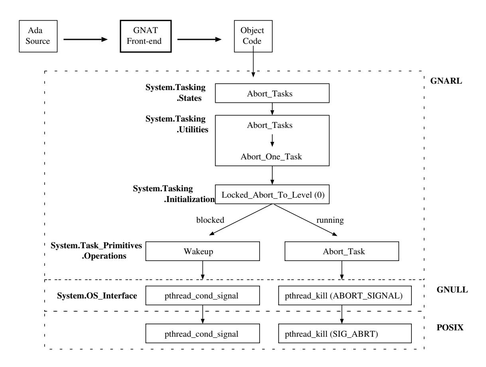
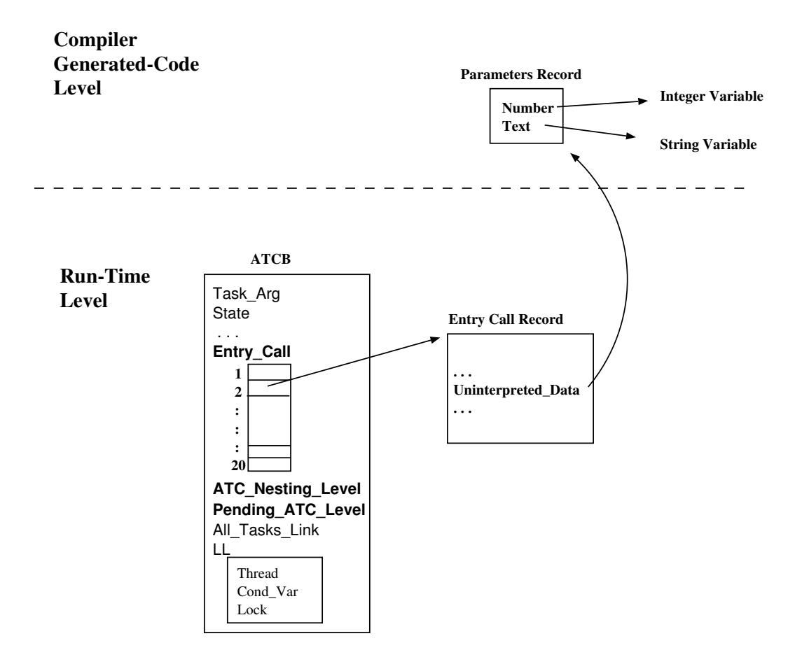

# Розділ 20. Аборти

Оператор `abort` призначений для використання у випадках таких умов помилки, коли відновлення роботи завішеної задачі вважається неможливим. Задачі, які були перервані, стають *ненормальними*, через що вони не можуть взаємодіяти з жодною іншою задачею. В ідеалі ненормальна задача припиняє виконання негайно: перервана задача стає *ненормальною*, а всі незавершені задачі, які залежать від неї, також стають ненормальними. Після того, як усі вказані задачі позначаться як ненормальні, виконання оператора `abort` вважається завершеним, і задача, яка його виконує, може продовжити свою роботу. Вона не чекає, поки вказані задачі фактично завершать виконання [BW98, розділ 10.2].

Після того, як завдання позначається як „абнормальне“, виконання його тіла переривається; це означає, що припиняється виконання всіх конструкцій у тілі завдання. Проте деякі дії необхідно захищати для забезпечення цілісності інших завдань та їхніх даних. До таких дій належать: очікування завершення виклику, очікування припинення виконання залежних завдань, а також виконання процедур ініціалізації чи фіналізації, чи операцій присвоєння значень об’єктам із контрольованими частинами. Крім того, під час виконання певних вбудованих підпрограм система також відкладає процес переривання для збереження цілісності своїх структур даних. У мові також визначено *точки завершення переривання*: 1) кінець активації завдання; 2) момент, коли виконання ініціює активацію іншого завдання; 3) початок чи кінець виклику, оператору очікування чи переривання; 4) початок виконання оператора вибору чи послідовності операторів обробника винятків.

Загалом для обробки сигналу про переривання необхідно „розмотати“ стек цільової задачі, а не негайно виходити з частини коду, де сталось переривання (або ж завершити виконання всієї задачі у разі повного її переривання). Можуть існувати локальні об’єкти під керуванням програми, для яких потрібно виконати процедуру завершення. Також можуть бути залежні задачі, які мають чекати на завершення обробки блоку коду, що перервався, аж доки вони самі не будуть перервані, завершені та зупинені. Процедура завершення має виконуватися у зворотному порядку (LIFO), а контексти стека об’єктів, які потребують завершення, мають зберігатися до моменту їхнього остаточного завершення [GB94, Розділ 3.4].

Реалізацію механізму відстрочки скасування можна розділити на два етапи [GB94, розділ 3.3]: 1) визначення того, чи відстрочено скасування для певної задачі у момент, коли воно планується до виконання; 2) забезпечення негайної обробки відстрочених скасувань після скасування обмежень на їх виконання. Зазвичай саме задача має визначати, чи застосовується до неї відстрочка скасування. У однопроцесорній системі задача, яка ініціює скасування, може визначити, чи є у цілі це обмеження. Однак у багатопроцесорній системі або в однопроцесорній системі, де середовище виконання Ada не контролює безпосередньо планування задач, це неможливо. Стан відстрочки скасування у цільової задачі може змінитися між моментом перевірки та моментом її переривання.

Існує два очевидні способи визначення того, чи є завдання «відкладеним для переривання». Один із цих способів іноді називають PCmapping. Компілятор та лінк-редактор створюють карту ділянок коду, де переривання завдання відкладається. Потім можна визначити, чи є завдання у такому стані, порівнявши поточне значення вказівника інструкцій та всі збережені адреси повернення з активних викликів підпрограм із цією картою. Щоб гарантувати обробку переривання після виходу з ділянки коду, де переривання відкладено, адресу повернення для найзовнішнього виклику підпрограми перевизначають на адресу процедури обробки переривання (стару адресу при цьому зберігають в іншому місці). Перевірка стану відкладення переривання може займати час, пропорційний глибині вкладеності викликів підпрограм; проте це відбувається лише у разі спроби переривання завдання. До того моменту додаткових витрат на обчислення, пов’язаних із відкладенням переривання, не виникає. Однак цей метод має обмеження: ділянки коду, де переривання відкладається, мають відповідати окремим викликним одиницям коду. Крім того, конвенція виклику підпрограм має задовольняти дві умови: (1) адреси повернення завжди знаходяться в передбачуваному та доступному місці; (2) ці дані залишаються коректними навіть за переривання послідовності викликів. На жаль, для деяких архітектур це не виконується [GB94, розділ 3.3].

У другому методі завдання збільшує або зменшує значення лічильника відкладення (наприклад, у спеціальному регістрі чи в структурі ATCB) щоразу, коли воно входить у регіон з відкладеним скасуванням чи виходить з нього. Після виходу з такого регіону, якщо значення лічильника стає рівним нулю, завдання має перевірити, чи є скасування, яке очікує обробки; у разі наявності – виконати його. Цей метод із використанням лічильника відкладення призводить до певних додаткових витрат під час входу/виходу з регіонів з відкладеним скасуванням, проте дає можливість швидкої перевірки [GB94, розділ 3.3]. Середовище виконання GNAT реалізує саме цей другий метод.

Реалізація ATC повинна вирішити наступні проблеми [GB94, розділ 3]:

– Переривання цільового завдання та ініціювання його скасування.  
– Відстрочення процедури скасування для певних ділянок коду.  
– Виконання процедур завершення для всіх локальних об’єктів у скасованій частині коду, кожного у його відповідному контексті.  
– Визначення правильного місця та контексту для продовження виконання після втручання ATC.  
– Обробка вкладених областей видимості, включаючи вкладені асинхронні оператори select.  
– Забезпечення безпеки послідовностей коду, згенерованих компілятором; зокрема, коректної роботи викликів підпрограм та повернення з них у випадку переривання через ATC.
ATC дуже схоже на механізм поширення винятків, тому бажано, щоб один і той самий механізм використовувався для обох цілей. Оскільки ATC, ймовірно, не буде використовуватися у нереальних часом програмах на Ada, ключовою метою будь-якої реалізації має бути мінімізація чи повна відсутність додаткових витрат на функціонування цієї мовної функції. Теоретично можна було б підвищити ефективність, уникнувши повного розкочування стеку: виконати процедури завершення з верхівки стеку чи з іншого стеку, а потім видалити всі елементи стеку до контексту, куди має бути передано керування. Проте це можливо лише за умови наявності способу відновити цей контекст без повного розкочування стеку. Якщо компілятор використовує конвенцію збереження значень регістрів, то значення активних регістрів можуть бути записані у непередбачувані місця стеку. У такому випадку, схоже, необхідно створювати окрему область для збереження стану регістрів для кожної потенційної точки переходу у рамках механізму ATC (аналогічно до реалізації буферів переходу для операцій setjmp() та longjmp() у мові C). Хоча асинхронні оператори select, можливо, не дуже поширені, обробники винятків зустрічаються часто (деякі з них генеруються компілятором автоматично), а об’єкти з механізмом керування також, ймовірно, будуть поширеними. Тож витрати на створення таких буферів переходу для кожної потенційної точки асинхронного переходу є неприйнятними [GB94, Розділ 3.4].

Потрібно передбачити спосіб визначення місцезнаходження процедур завершення виконання та точки, з якої виконання має продовжитися після ATC. Ця проблема дуже схожа на задачу знаходження обробника винятків, і для неї підходять ті самі рішення. Основними підходами є зберігання вказівника у кадрі стеку для кожної області видимості, використання відображення адрес команд (PC-mapping) та їх комбінації. Зазвичай кращим вважається підхід PC-mapping, оскільки він не створює додаткового навантаження під час виконання програми. Якщо цей метод використовується для згаданої мети, існують вагомі підстави спробувати застосувати його також для завдання відкладеного скасування операцій [GB94, Розділ 3.4].

## 20.1 Підпрограми під час виконання

Реалізація механізму переривання в GNAT складається з наступного:

– Один прапорець у ATCB (`Aborting`). Цей прапорець запобігає виникненню конфлікту між кількома модулями, які ініціюють аборт, та завданням, яке підлягає аборту. Це вкрай важливо, адже модуль аборту може бути перерваний під час виконання, а після відновлення виконання надіслати сигнал про аборт.
– Один внутрішній виняток (`Abort_Signal`). Цей виняток не є доступним для користувацького коду (див. розділ 18.1.1); його може обробити лише код середовища виконання. Його поширення призводить до завершення виконання всіх областей видимості, які зустрічаються на шляху.
– Один сигнал POSIX (SIGABRT), який не можна маскувати.

Рисунок 20.1: Підпрограми GNARL для оператора переривання.

На рисунку 20.1 показано послідовність підпрограм у процесі виконання, які беруть участь у скасуванні завдання; ці підпрограми описані в наступних розділах.

### 20.1.1 Виклик методу GNARL.Task

Підпрограма виконання GNAT `Task_Entry_Call` (див. розділ 15.5.4) забезпечує підтримку не лише звичайних викликів записів, а й викликів типу ATC. У останньому випадку, оскільки виклики ATC можуть бути вкладеними, система виконання повинна зберігати всі такі незавершені виклики. Для цього у GNAT для кожної задачі Ada створюється *стек викликів записів* (див. рисунок 20.2). Поле `Pending_ATC_Level` в структурі ATCB використовується для сигналізації про переривання виконання ATC. Щоб розрізняти оператор `Abort` та переривання виконання ATC, система виконання визначає такі правила:

– У разі виконання оператора **`abort`** значення параметра `Pending_ATC_Level` встановлюється на 0.  
– Під час скасування виконання процедури ATC значення `Pending_ATC_Level` встановлюється на рівень, на якому знаходився викликаючий елемент безпосередньо перед здійсненням виклику – тобто `ATC_Nesting_Level` мінус один.
#### 20.1.2 GNARL. Блокування переривання до певного рівня

Підпрограма `GNARL.Undefer_Abort` є універсальною точкою опитування для відкладеної обробки. Вона забезпечує підтримку зміни базового пріоритету, обробки виняткових ситуацій та асинхронної передачі керування (ATC). У разі зміни базового пріоритету після встановлення нового пріоритету підпрограма звільняє процесор, щоб планувальник міг обрати наступні завдання для виконання. В інших випадках вона перевіряє, чи є якісь невирішені виняткові ситуації; при цьому скасування операції ATC призводить до генерації внутрішнього винятку `Abort_Signal`.

#### 20.1.3 GNARL. Блокування скасування до певного рівня

Параметр `Locked_Abort_To_Level` встановлює прапорець `Pending_Action` для об’єкта ATCB. Залежно від поточного стану цільового завдання (заблоковане чи виконується) викликається функція `GNARL.Wakeup` або `GNARL.Abort_Task`.

Якщо завдання, яке потрібно скасувати, перебуває у стані *сплячки* (див. розділ 14.2), воно належить до категорії завдань із відкладеним скасуванням. Тож, коли в майбутньому це завдання буде пробуджене та продовжить свою роботу, воно виконає підпрограму Undefer Abortion. У цей момент перевірятиметься прапорець Pending Action ATCB; якщо його значення є істинним, встановлюватиметься прапорець ATCB `Aborting` та генеруватиметься внутрішній виняток `Abort_Signal`.

Рисунок 20.2: Стек викликів вхідних операцій.

Якщо завдання перебуває у стані *виконання*, то механізм скасування надсилає до нього сигнал `SIG_ABRT`; після цього відповідний *обробник скасування* асинхронно генерує у скасованому завданні внутрішнє виняткове станення `Abort_Signal`.

У обох випадках внутрішнє виняткове поле `Abort_Signal` здійснює розкочування стеку перерваної задачі.

### 20.2 Підсумок

Реалізація в GNARL оператора переривання мови Ada складається з одного прапорця в структурі ATCB – `Aborting`, одного винятку типу Abort Signal та одного сигналу POSIX (SIGABRT). Цей прапорець запобігає виникненню конкуренції між кількома елементами, які ініціюють переривання, та завершеною задачею. 20.2. ПІДСУМОК 217

Виняток може бути оброблений лише кодом системи під час виконання. Сигнал POSIX неможливо замаскувати.
